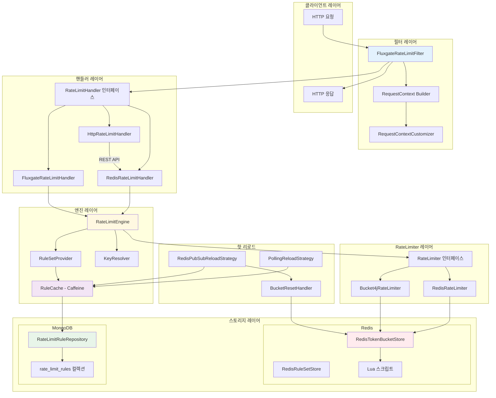

# FluxGate 아키텍처 Deep Dive

이 문서는 FluxGate의 상세 아키텍처를 **실제 소스코드**와 함께 설명합니다.

---

## 목차

1. [전체 흐름 개요](#1-전체-흐름-개요)
2. [Filter Layer: 요청 가로채기](#2-filter-layer-요청-가로채기)
3. [Handler Layer: Rate Limiting 조율](#3-handler-layer-rate-limiting-조율)
4. [Engine Layer: 규칙 매칭과 키 해석](#4-engine-layer-규칙-매칭과-키-해석)
5. [RateLimiter Layer: 토큰 버킷 실행](#5-ratelimiter-layer-토큰-버킷-실행)
6. [Storage Layer: Redis와 MongoDB](#6-storage-layer-redis와-mongodb)
7. [Reload Layer: 핫 리로드](#7-reload-layer-핫-리로드)

---

## 1. 전체 흐름 개요



---

## 2. Filter Layer: 요청 가로채기

### 2.1 FluxgateRateLimitFilter

HTTP 요청을 가로채고 Rate Limiting을 적용하는 진입점입니다.

```
📁 fluxgate-spring-boot3-starter/src/main/java/org/fluxgate/spring/filter/
└── FluxgateRateLimitFilter.java
```

```java
// FluxgateRateLimitFilter.java (핵심 부분)
public class FluxgateRateLimitFilter extends OncePerRequestFilter {

    private final RateLimitHandler handler;
    private final RequestContextCustomizer customizer;
    private final FluxgateProperties properties;

    @Override
    protected void doFilterInternal(
            HttpServletRequest request,
            HttpServletResponse response,
            FilterChain filterChain) throws ServletException, IOException {

        String path = request.getRequestURI();

        // 1️⃣ 제외 패턴 체크 (예: /health, /actuator/*)
        if (shouldExclude(path)) {
            filterChain.doFilter(request, response);
            return;
        }

        // 2️⃣ RequestContext 빌드 ← 이 부분이 CTX로 향하는 화살표
        RequestContext context = buildRequestContext(request);

        // 3️⃣ Handler 호출 ← 이 부분이 HI로 향하는 화살표
        RateLimitResponse result = handler.handle(context);

        // 4️⃣ 결과에 따른 응답 처리
        if (result.isAllowed()) {
            addRateLimitHeaders(response, result);
            filterChain.doFilter(request, response);  // 허용 → 다음 필터로
        } else {
            handleRejection(response, result);        // 거부 → 429 응답
        }
    }

    // 📌 RequestContext 빌드 메서드
    private RequestContext buildRequestContext(HttpServletRequest request) {
        // 기본 컨텍스트 빌더 생성
        RequestContext.Builder builder = RequestContext.builder()
                .path(request.getRequestURI())
                .method(request.getMethod())
                .clientIp(extractClientIp(request))
                .userId(extractUserId(request))
                .apiKey(extractApiKey(request))
                .ruleSetId(properties.getRatelimit().getDefaultRuleSetId());

        // 3️⃣ 커스터마이저 적용 ← CUST로 향하는 화살표
        if (customizer != null) {
            builder = customizer.customize(builder, request);
        }

        return builder.build();
    }
}
```

**흐름 설명:**

```
HTTP 요청
    ↓
FluxgateRateLimitFilter.doFilterInternal()
    ↓
buildRequestContext()  ──────────────────────┐
    │                                         │
    ├─→ RequestContext.builder()              │ REQ_CTX
    │       .path("/api/users")               │
    │       .method("GET")                    │
    │       .clientIp("192.168.1.1")          │
    │                                         │
    └─→ customizer.customize(builder, request) ← CUST
            │
            ├─→ 헤더에서 X-Tenant-Id 추출
            ├─→ Cloudflare IP 재정의
            └─→ 커스텀 속성 추가
```

---

### 2.2 RequestContext

요청에 대한 모든 메타데이터를 담는 불변 객체입니다.

```
📁 fluxgate-core/src/main/java/org/fluxgate/core/context/
└── RequestContext.java
```

```java
// RequestContext.java
public class RequestContext {

    private final String path;           // 요청 경로: /api/users/123
    private final String method;         // HTTP 메서드: GET, POST, ...
    private final String clientIp;       // 클라이언트 IP
    private final String userId;         // 사용자 ID (선택)
    private final String apiKey;         // API 키 (선택)
    private final String ruleSetId;      // 적용할 규칙 세트 ID
    private final Map<String, Object> attributes;  // 커스텀 속성

    // Builder 패턴
    public static Builder builder() {
        return new Builder();
    }

    public static class Builder {
        private String path;
        private String method;
        private String clientIp;
        private String userId;
        private String apiKey;
        private String ruleSetId;
        private Map<String, Object> attributes = new HashMap<>();

        public Builder path(String path) {
            this.path = path;
            return this;
        }

        public Builder clientIp(String clientIp) {
            this.clientIp = clientIp;
            return this;
        }

        public Builder attribute(String key, Object value) {
            this.attributes.put(key, value);
            return this;
        }

        public RequestContext build() {
            return new RequestContext(this);
        }
    }
}
```

---

### 2.3 RequestContextCustomizer

사용자가 구현하여 컨텍스트를 커스터마이징할 수 있는 인터페이스입니다.

```
📁 fluxgate-spring-boot3-starter/src/main/java/org/fluxgate/spring/filter/
└── RequestContextCustomizer.java
```

```java
// RequestContextCustomizer.java
@FunctionalInterface
public interface RequestContextCustomizer {

    /**
     * RequestContext 빌더를 커스터마이징합니다.
     *
     * @param builder 기본값이 채워진 빌더
     * @param request HTTP 요청
     * @return 커스터마이징된 빌더
     */
    RequestContext.Builder customize(
            RequestContext.Builder builder,
            HttpServletRequest request);

    // 기본 no-op 커스터마이저
    static RequestContextCustomizer identity() {
        return (builder, request) -> builder;
    }
}
```

---

#### 💡 잠깐! @FunctionalInterface가 뭔가요?

`RequestContextCustomizer` 코드를 보면 **구현부가 없습니다.** `customize()` 메서드의 본문이 없죠. 이게 정상입니다!

**인터페이스는 "계약서"입니다.** "이런 형태의 메서드를 구현해라"라고 약속만 정의한 것이지, 실제 동작은 **사용하는 쪽에서 구현**합니다.

`@FunctionalInterface`는 **추상 메서드가 딱 1개인 인터페이스**를 의미합니다. 이런 인터페이스는 **람다 표현식**으로 간결하게 구현할 수 있습니다.

---

#### 📝 세 가지 구현 방식 비교

같은 기능을 구현하는 세 가지 방법을 보여드립니다. **모두 동일하게 동작합니다.**

**방식 1: 람다 표현식 (가장 간결)**

```java
@Bean
public RequestContextCustomizer requestContextCustomizer() {
    return (builder, request) -> {
        String userId = request.getHeader("X-User-Id");
        if (userId != null) {
            builder.userId(userId);
        }
        return builder;
    };
}
```

- `(builder, request) -> { ... }` 부분이 `customize()` 메서드의 구현부입니다
- 파라미터 타입은 컴파일러가 추론합니다

**방식 2: 익명 클래스 (람다의 원래 모습)**

```java
@Bean
public RequestContextCustomizer requestContextCustomizer() {
    return new RequestContextCustomizer() {
        @Override
        public RequestContext.Builder customize(
                RequestContext.Builder builder,
                HttpServletRequest request) {
            
            String userId = request.getHeader("X-User-Id");
            if (userId != null) {
                builder.userId(userId);
            }
            return builder;
        }
    };
}
```

- 방식 1의 람다는 이 익명 클래스를 **축약한 문법**입니다
- Java 8 이전에는 이렇게 작성했습니다

**방식 3: 별도 클래스로 구현 (복잡한 로직에 적합)**

```java
// 별도 파일: TenantContextCustomizer.java
@Component
public class TenantContextCustomizer implements RequestContextCustomizer {

    private final JwtParser jwtParser;  // 의존성 주입 가능
    
    public TenantContextCustomizer(JwtParser jwtParser) {
        this.jwtParser = jwtParser;
    }

    @Override
    public RequestContext.Builder customize(
            RequestContext.Builder builder,
            HttpServletRequest request) {
        
        String userId = request.getHeader("X-User-Id");
        if (userId != null) {
            builder.userId(userId);
        }
        
        // JWT 파싱 같은 복잡한 로직
        String token = request.getHeader("Authorization");
        if (token != null) {
            Claims claims = jwtParser.parse(token);
            builder.attribute("role", claims.getRole());
        }
        
        return builder;
    }
}
```

- 복잡한 로직이나 의존성 주입이 필요할 때 사용
- 테스트하기 쉬움

---

#### 🔄 언제 어떤 방식을 쓰나요?

| 상황 | 추천 방식 |
|------|----------|
| 간단한 헤더 추출 (1~5줄) | 람다 표현식 |
| 여러 곳에서 재사용 | 별도 클래스 |
| 다른 Bean 주입 필요 (JwtParser 등) | 별도 클래스 |
| 단위 테스트 작성 필요 | 별도 클래스 |

---

#### 🎯 그래서 이게 어떻게 동작하나요?

전체 흐름을 다시 정리하면:

```
1. 당신이 작성한 코드 (람다든 클래스든)
   ┌────────────────────────────────────────┐
   │ return (builder, request) -> {        │
   │     builder.userId(request.getHeader  │
   │         ("X-User-Id"));               │
   │     return builder;                   │
   │ };                                    │
   └────────────────────────────────────────┘
                    │
                    ▼
2. Spring이 Bean으로 등록
                    │
                    ▼
3. FluxgateRateLimitFilter가 주입받음
   ┌────────────────────────────────────────┐
   │ public class FluxgateRateLimitFilter { │
   │     private final RequestContext      │
   │         Customizer customizer; // 여기!│
   │ }                                     │
   └────────────────────────────────────────┘
                    │
                    ▼
4. HTTP 요청이 들어올 때마다 호출됨
   ┌────────────────────────────────────────┐
   │ builder = customizer.customize(       │
   │     builder, request);  // 당신 코드 실행│
   └────────────────────────────────────────┘
```

---

#### 💬 Strategy 패턴과 뭐가 다른가요?

**거의 같습니다!** `@FunctionalInterface`는 Strategy 패턴을 간결하게 구현하는 방법입니다.

```
전통적인 Strategy 패턴:
- 인터페이스 정의
- 구현 클래스 여러 개 작성
- 클래스 파일이 늘어남

@FunctionalInterface + 람다:
- 인터페이스 정의
- 람다로 즉석에서 구현
- 코드가 간결해짐
```

본질은 같고, **표현 방식만 간결해진 것**입니다.

---

**사용자 구현 예시 (전체 코드):**

```java
// 사용자가 구현하는 커스터마이저
@Configuration
public class RateLimitConfig {

  /**
   * RequestContext 커스터마이저를 Bean으로 등록합니다.
   * 
   * 이 Bean은 FluxgateRateLimitFilter에 자동 주입되어
   * 모든 HTTP 요청마다 호출됩니다.
   */
  @Bean
  public RequestContextCustomizer requestContextCustomizer() {
    return (builder, request) -> {
      
      // 1. 테넌트 ID 추출
      String tenantId = request.getHeader("X-Tenant-Id");
      if (tenantId != null) {
        builder.attribute("tenantId", tenantId);
      }

      // 2. Cloudflare 뒤에 있는 경우 실제 IP 추출
      String cfIp = request.getHeader("CF-Connecting-IP");
      if (cfIp != null) {
        builder.clientIp(cfIp);
      }

      // 3. 사용자 ID 추출
      String userId = request.getHeader("X-User-Id");
      if (userId != null) {
        builder.userId(userId);
      }

      return builder;
    };
  }
}
```

---

## 3. Handler Layer: Rate Limiting 조율

### 3.1 RateLimitHandler 인터페이스

```
📁 fluxgate-core/src/main/java/org/fluxgate/core/handler/
└── RateLimitHandler.java
```

```java
// RateLimitHandler.java
public interface RateLimitHandler {

  /**
   * Rate Limiting을 수행합니다.
   *
   * @param context 요청 컨텍스트
   * @return Rate Limit 결과
   */
  RateLimitResponse handle(RequestContext context);
}
```

---

### 3.2 FluxgateRateLimitHandler (기본 구현)

```
📁 fluxgate-core/src/main/java/org/fluxgate/core/handler/
└── FluxgateRateLimitHandler.java
```

```java
// FluxgateRateLimitHandler.java
public class FluxgateRateLimitHandler implements RateLimitHandler {

  private final RateLimitEngine engine;
  private final RateLimitMetricsRecorder metricsRecorder;

  @Override
  public RateLimitResponse handle(RequestContext context) {
    long startTime = System.nanoTime();

    try {
      // 1️⃣ Engine 호출 ← ENG로 향하는 화살표
      RateLimitResult result = engine.check(
          context.getRuleSetId(),
          context
      );

      // 2️⃣ 메트릭 기록
      if (metricsRecorder != null) {
        metricsRecorder.record(context, result);
      }

      // 3️⃣ 결과를 Response로 변환
      return RateLimitResponse.builder()
          .allowed(result.isAllowed())
          .remainingTokens(result.getRemainingTokens())
          .retryAfterMillis(result.getNanosToWaitForRefill() / 1_000_000)
          .matchedRule(result.getMatchedRule())
          .build();

    } finally {
      long duration = System.nanoTime() - startTime;
      // 처리 시간 로깅
    }
  }
}
```

---

### 3.3 HttpRateLimitHandler (HTTP API 모드)

원격 Rate Limit 서비스를 호출하는 핸들러입니다.

```
📁 fluxgate-core/src/main/java/org/fluxgate/core/handler/
└── HttpRateLimitHandler.java
```

```java
// HttpRateLimitHandler.java
public class HttpRateLimitHandler implements RateLimitHandler {

  private final String rateLimitServiceUrl;  // 예: http://rate-limit-service:8082
  private final RestTemplate restTemplate;

  @Override
  public RateLimitResponse handle(RequestContext context) {
    // REST API 호출 ← HH에서 RH로 향하는 화살표
    RateLimitRequest request = RateLimitRequest.builder()
        .ruleSetId(context.getRuleSetId())
        .path(context.getPath())
        .method(context.getMethod())
        .clientIp(context.getClientIp())
        .userId(context.getUserId())
        .build();

    return restTemplate.postForObject(
        rateLimitServiceUrl + "/api/ratelimit/check",
        request,
        RateLimitResponse.class
    );
  }
}
```

**사용 시나리오:**

```
┌─────────────────┐         ┌─────────────────────────┐
│  API Gateway    │  HTTP   │  Rate Limit Service     │
│  (Port 8080)    │ ──────→ │  (Port 8082)            │
│                 │         │                         │
│  HttpRateLimit  │         │  RedisRateLimitHandler  │
│  Handler        │         │  + Redis                │
└─────────────────┘         └─────────────────────────┘
```

---

## 4. Engine Layer: 규칙 매칭과 키 해석

### 4.1 RateLimitEngine

```
📁 fluxgate-core/src/main/java/org/fluxgate/core/engine/
└── RateLimitEngine.java
```

```java
// RateLimitEngine.java
public class RateLimitEngine {

  private final RuleSetProvider ruleSetProvider;  // ← PROV
  private final RateLimiter rateLimiter;          // ← RL
  private final KeyResolver keyResolver;          // ← KEY

  public RateLimitResult check(String ruleSetId, RequestContext context) {
    return check(ruleSetId, context, 1);  // 기본 1토큰 소비
  }

  public RateLimitResult check(String ruleSetId, RequestContext context, long permits) {

    // 1️⃣ RuleSet 조회 ← PROV로 향하는 화살표
    RateLimitRuleSet ruleSet = ruleSetProvider.getRuleSet(ruleSetId);

    if (ruleSet == null || ruleSet.getRules().isEmpty()) {
      // 규칙이 없으면 허용
      return RateLimitResult.allowed(permits);
    }

    // 2️⃣ 요청에 매칭되는 규칙 찾기
    RateLimitRule matchedRule = findMatchingRule(ruleSet, context);

    if (matchedRule == null) {
      return RateLimitResult.allowed(permits);
    }

    // 3️⃣ Rate Limit 키 해석 ← KEY로 향하는 화살표
    RateLimitKey key = keyResolver.resolve(matchedRule, context);

    // 4️⃣ RateLimiter로 토큰 소비 시도 ← RL로 향하는 화살표
    return rateLimiter.tryConsume(context, ruleSet, permits);
  }

  // 경로와 메서드로 매칭되는 규칙 찾기
  private RateLimitRule findMatchingRule(RateLimitRuleSet ruleSet, RequestContext context) {
    return ruleSet.getRules().stream()
        .filter(rule -> rule.isEnabled())
        .filter(rule -> matchesPath(rule.getPath(), context.getPath()))
        .filter(rule -> matchesMethod(rule.getMethod(), context.getMethod()))
        .max(Comparator.comparingInt(RateLimitRule::getPriority))
        .orElse(null);
  }

  // 와일드카드 경로 매칭: /api/users/* matches /api/users/123
  private boolean matchesPath(String pattern, String path) {
    if (pattern.endsWith("/*")) {
      String prefix = pattern.substring(0, pattern.length() - 1);
      return path.startsWith(prefix);
    }
    return pattern.equals(path);
  }
}
```

---

### 4.2 RuleSetProvider와 RuleCache

```
📁 fluxgate-core/src/main/java/org/fluxgate/core/provider/
├── RuleSetProvider.java
└── CachingRuleSetProvider.java
```

```java
// RuleSetProvider.java (인터페이스)
public interface RuleSetProvider {
  RateLimitRuleSet getRuleSet(String ruleSetId);
}

// CachingRuleSetProvider.java (캐싱 구현)
public class CachingRuleSetProvider implements RuleSetProvider {

  private final RuleSetProvider delegate;     // 실제 Provider (MongoDB)
  private final RuleCache ruleCache;          // ← CACHE (Caffeine)

  @Override
  public RateLimitRuleSet getRuleSet(String ruleSetId) {
    // 1️⃣ 캐시에서 먼저 조회
    RateLimitRuleSet cached = ruleCache.get(ruleSetId);
    if (cached != null) {
      return cached;
    }

    // 2️⃣ 캐시 미스 → delegate(MongoDB)에서 조회
    RateLimitRuleSet ruleSet = delegate.getRuleSet(ruleSetId);

    // 3️⃣ 캐시에 저장
    if (ruleSet != null) {
      ruleCache.put(ruleSetId, ruleSet);
    }

    return ruleSet;
  }
}
```

```java
// RuleCache.java (인터페이스)
public interface RuleCache {
  RateLimitRuleSet get(String ruleSetId);
  void put(String ruleSetId, RateLimitRuleSet ruleSet);
  void invalidate(String ruleSetId);
  void invalidateAll();
}

// CaffeineRuleCache.java (Caffeine 구현)
public class CaffeineRuleCache implements RuleCache {

  private final Cache<String, RateLimitRuleSet> cache;

  public CaffeineRuleCache(Duration expireAfterWrite, long maxSize) {
    this.cache = Caffeine.newBuilder()
        .expireAfterWrite(expireAfterWrite)
        .maximumSize(maxSize)
        .build();
  }

  @Override
  public RateLimitRuleSet get(String ruleSetId) {
    return cache.getIfPresent(ruleSetId);
  }

  @Override
  public void put(String ruleSetId, RateLimitRuleSet ruleSet) {
    cache.put(ruleSetId, ruleSet);
  }
}
```

---

### 4.3 KeyResolver

LimitScope에 따라 Rate Limit 키를 생성합니다.

```
📁 fluxgate-core/src/main/java/org/fluxgate/core/key/
├── KeyResolver.java
└── LimitScopeKeyResolver.java
```

```java
// KeyResolver.java (인터페이스)
public interface KeyResolver {
  RateLimitKey resolve(RateLimitRule rule, RequestContext context);
}

// LimitScopeKeyResolver.java (기본 구현)
public class LimitScopeKeyResolver implements KeyResolver {

  @Override
  public RateLimitKey resolve(RateLimitRule rule, RequestContext context) {
    LimitScope scope = rule.getLimitScope();

    String keyValue = switch (scope) {
      case GLOBAL -> "global";

      case IP -> context.getClientIp();

      case USER_ID -> context.getUserId();

      case API_KEY -> context.getApiKey();

      case COMPOSITE -> buildCompositeKey(rule, context);
    };

    return RateLimitKey.of(
        rule.getRuleSetId(),
        rule.getId(),
        keyValue
    );
  }

  // 복합 키: IP:USER_ID 형태
  private String buildCompositeKey(RateLimitRule rule, RequestContext context) {
    List<String> fields = rule.getCompositeKeyFields();  // ["IP", "USER_ID"]

    return fields.stream()
        .map(field -> getFieldValue(field, context))
        .filter(Objects::nonNull)
        .collect(Collectors.joining(":"));
  }

  private String getFieldValue(String field, RequestContext context) {
    return switch (field.toUpperCase()) {
      case "IP" -> context.getClientIp();
      case "USER_ID" -> context.getUserId();
      case "API_KEY" -> context.getApiKey();
      default -> (String) context.getAttribute(field);
    };
  }
}
```

**키 생성 예시:**

| LimitScope | 생성되는 키 예시 |
|------------|-----------------|
| `GLOBAL` | `api-limits:rule-1:global` |
| `IP` | `api-limits:rule-1:192.168.1.1` |
| `USER_ID` | `api-limits:rule-1:user-123` |
| `COMPOSITE` (IP+USER) | `api-limits:rule-1:192.168.1.1:user-123` |

---

## 5. RateLimiter Layer: 토큰 버킷 실행

### 5.1 RateLimiter 인터페이스

```
📁 fluxgate-core/src/main/java/org/fluxgate/core/ratelimiter/
└── RateLimiter.java
```

```java
// RateLimiter.java
public interface RateLimiter {

  /**
   * 토큰 소비를 시도합니다.
   *
   * @param context 요청 컨텍스트
   * @param ruleSet 적용할 규칙 세트
   * @param permits 소비할 토큰 수
   * @return Rate Limit 결과
   */
  RateLimitResult tryConsume(RequestContext context, RateLimitRuleSet ruleSet, long permits);

  // 기본 1토큰 소비
  default RateLimitResult tryConsume(RequestContext context, RateLimitRuleSet ruleSet) {
    return tryConsume(context, ruleSet, 1);
  }
}
```

---

### 5.2 Bucket4jRateLimiter

Bucket4j를 사용하는 Rate Limiter 구현입니다.

```
📁 fluxgate-core/src/main/java/org/fluxgate/core/ratelimiter/impl/bucket4j/
└── Bucket4jRateLimiter.java
```

```java
// Bucket4jRateLimiter.java
public class Bucket4jRateLimiter implements RateLimiter {

  private final TokenBucketStore bucketStore;  // ← TBS
  private final KeyResolver keyResolver;

  @Override
  public RateLimitResult tryConsume(
      RequestContext context,
      RateLimitRuleSet ruleSet,
      long permits) {

    // 매칭된 규칙 찾기
    RateLimitRule rule = findMatchingRule(ruleSet, context);
    if (rule == null) {
      return RateLimitResult.allowed(permits);
    }

    // 키 생성
    RateLimitKey key = keyResolver.resolve(rule, context);

    // 📌 TokenBucketStore로 토큰 소비 ← TBS로 향하는 화살표
    BucketState state = bucketStore.consume(
        key.toKeyString(),
        rule.getBands(),
        permits
    );

    if (state.isAllowed()) {
      return RateLimitResult.builder()
          .allowed(true)
          .remainingTokens(state.getRemainingTokens())
          .matchedRule(rule)
          .build();
    } else {
      return RateLimitResult.builder()
          .allowed(false)
          .remainingTokens(state.getRemainingTokens())
          .nanosToWaitForRefill(state.getNanosToWaitForRefill())
          .matchedRule(rule)
          .build();
    }
  }
}
```

---

## 6. Storage Layer: Redis와 MongoDB

### 6.1 RedisTokenBucketStore

```
📁 fluxgate-redis-ratelimiter/src/main/java/org/fluxgate/redis/store/
└── RedisTokenBucketStore.java
```

```java
// RedisTokenBucketStore.java
public class RedisTokenBucketStore implements TokenBucketStore {

  private final JedisPool jedisPool;
  private final String luaScriptSha;  // Lua 스크립트 SHA

  @Override
  public BucketState consume(String key, List<RateLimitBand> bands, long permits) {
    try (Jedis jedis = jedisPool.getResource()) {

      // 📌 Lua 스크립트 실행 ← LUA로 향하는 화살표
      // 모든 Band를 원자적으로 처리
      List<String> keys = List.of(key);
      List<String> args = buildArgs(bands, permits);

      Object result = jedis.evalsha(luaScriptSha, keys, args);

      return parseResult(result);
    }
  }

  private List<String> buildArgs(List<RateLimitBand> bands, long permits) {
    List<String> args = new ArrayList<>();
    args.add(String.valueOf(bands.size()));       // Band 개수
    args.add(String.valueOf(permits));            // 소비할 토큰

    for (RateLimitBand band : bands) {
      args.add(String.valueOf(band.getCapacity()));
      args.add(String.valueOf(band.getRefillTokens()));
      args.add(String.valueOf(band.getRefillDuration().toNanos()));
    }

    return args;
  }
}
```

---

### 6.2 Lua 스크립트 (원자적 토큰 소비)

```
📁 fluxgate-redis-ratelimiter/src/main/resources/lua/
└── token_bucket_consume.lua
```

```lua
-- token_bucket_consume.lua
-- 다중 대역폭 토큰 버킷의 원자적 토큰 소비

local key = KEYS[1]
local bandCount = tonumber(ARGV[1])
local tokensToConsume = tonumber(ARGV[2])

-- Redis 서버 시간 사용 (Clock Drift 방지)
local timeResult = redis.call('TIME')
local nowNanos = tonumber(timeResult[1]) * 1000000000 + tonumber(timeResult[2]) * 1000

local allowed = true
local minRemainingTokens = math.huge
local maxWaitNanos = 0

-- 각 Band 처리
for i = 1, bandCount do
  local argOffset = 3 + (i - 1) * 3
  local capacity = tonumber(ARGV[argOffset])
  local refillTokens = tonumber(ARGV[argOffset + 1])
  local refillNanos = tonumber(ARGV[argOffset + 2])

  local bandKey = key .. ':band:' .. i

  -- 현재 상태 조회
  local tokens = tonumber(redis.call('HGET', bandKey, 'tokens') or capacity)
  local lastRefillNanos = tonumber(redis.call('HGET', bandKey, 'lastRefill') or nowNanos)

  -- 리필 계산
  local elapsedNanos = nowNanos - lastRefillNanos
  local tokensToAdd = math.floor(elapsedNanos / refillNanos) * refillTokens
  tokens = math.min(capacity, tokens + tokensToAdd)

  -- 소비 가능 여부 체크
  if tokens < tokensToConsume then
    allowed = false
    -- 대기 시간 계산
    local deficit = tokensToConsume - tokens
    local waitNanos = math.ceil(deficit / refillTokens) * refillNanos
    maxWaitNanos = math.max(maxWaitNanos, waitNanos)
  end

  minRemainingTokens = math.min(minRemainingTokens, tokens)
end

-- 모든 Band가 허용하면 토큰 소비
if allowed then
  for i = 1, bandCount do
    local bandKey = key .. ':band:' .. i
    local tokens = tonumber(redis.call('HGET', bandKey, 'tokens'))

    -- 토큰 차감 및 상태 업데이트
    redis.call('HSET', bandKey, 'tokens', tokens - tokensToConsume, 'lastRefill', nowNanos)
    redis.call('EXPIRE', bandKey, 86400)  -- 24시간 TTL
  end
  minRemainingTokens = minRemainingTokens - tokensToConsume
end

-- 결과 반환: [허용여부, 남은토큰, 대기시간(나노초)]
return {allowed and 1 or 0, minRemainingTokens, maxWaitNanos}
```

**Lua 스크립트가 중요한 이유:**

```
┌──────────────────────────────────────────────────────────────┐
│  Race Condition 없이 원자적 처리                              │
├──────────────────────────────────────────────────────────────┤
│                                                              │
│  Client A ──┐                                                │
│             │     ┌─────────────────────────────────┐        │
│  Client B ──┼────→│  Redis Lua Script (EVALSHA)    │        │
│             │     │  - 모든 Band 한번에 체크         │        │
│  Client C ──┘     │  - 원자적으로 토큰 소비          │        │
│                   │  - 서버 시간 사용                │        │
│                   └─────────────────────────────────┘        │
│                                                              │
│  장점:                                                        │
│  1. Race Condition 방지 (동시 요청 처리)                       │
│  2. 네트워크 왕복 최소화 (한 번의 호출)                         │
│  3. Clock Drift 방지 (Redis 서버 시간 사용)                    │
│                                                              │
└──────────────────────────────────────────────────────────────┘
```

---

### 6.3 MongoRateLimitRuleRepository

```
📁 fluxgate-mongo-adapter/src/main/java/org/fluxgate/adapter/mongo/repository/
└── MongoRateLimitRuleRepository.java
```

```java
// MongoRateLimitRuleRepository.java
public class MongoRateLimitRuleRepository implements RateLimitRuleRepository {

  private final MongoCollection<Document> collection;  // ← COLL

  @Override
  public List<RateLimitRule> findByRuleSetId(String ruleSetId) {
    // MongoDB 쿼리
    Bson filter = Filters.and(
        Filters.eq("ruleSetId", ruleSetId),
        Filters.eq("enabled", true)
    );

    Bson sort = Sorts.descending("priority");

    return collection.find(filter)
        .sort(sort)
        .map(this::documentToRule)
        .into(new ArrayList<>());
  }

  // Document → RateLimitRule 변환
  private RateLimitRule documentToRule(Document doc) {
    return RateLimitRule.builder()
        .id(doc.getString("_id"))
        .ruleSetId(doc.getString("ruleSetId"))
        .path(doc.getString("path"))
        .method(doc.getString("method"))
        .limitScope(LimitScope.valueOf(doc.getString("limitScope")))
        .bands(parseBands(doc.getList("bands", Document.class)))
        .priority(doc.getInteger("priority", 0))
        .enabled(doc.getBoolean("enabled", true))
        .attributes(parseAttributes(doc.get("attributes", Document.class)))
        .build();
  }
}
```

---

## 7. Reload Layer: 핫 리로드

### 7.1 PollingReloadStrategy

주기적으로 MongoDB를 폴링하여 규칙 변경을 감지합니다.

```
📁 fluxgate-spring-boot3-starter/src/main/java/org/fluxgate/spring/reload/strategy/
└── PollingReloadStrategy.java
```

```java
// PollingReloadStrategy.java
public class PollingReloadStrategy implements RuleReloadStrategy {

  private final RuleSetProvider ruleSetProvider;
  private final RuleCache ruleCache;              // ← CACHE
  private final Duration pollingInterval;
  private final ScheduledExecutorService scheduler;

  @Override
  public void start() {
    scheduler.scheduleAtFixedRate(
        this::checkForUpdates,
        pollingInterval.toMillis(),
        pollingInterval.toMillis(),
        TimeUnit.MILLISECONDS
    );
  }

  private void checkForUpdates() {
    // 캐시 무효화 → 다음 조회 시 MongoDB에서 새로 로드
    ruleCache.invalidateAll();
    log.debug("Rule cache invalidated by polling strategy");
  }
}
```

---

### 7.2 RedisPubSubReloadStrategy

Redis Pub/Sub을 통해 실시간으로 규칙 변경을 전파합니다.

```
📁 fluxgate-spring-boot3-starter/src/main/java/org/fluxgate/spring/reload/strategy/
└── RedisPubSubReloadStrategy.java
```

```java
// RedisPubSubReloadStrategy.java
public class RedisPubSubReloadStrategy implements RuleReloadStrategy {

  private final JedisPool jedisPool;
  private final RuleCache ruleCache;
  private final BucketResetHandler bucketResetHandler;  // ← RESET
  private final String channel = "fluxgate:rule-changes";

  @Override
  public void start() {
    // Redis 채널 구독
    new Thread(() -> {
      try (Jedis jedis = jedisPool.getResource()) {
        jedis.subscribe(new JedisPubSub() {
          @Override
          public void onMessage(String channel, String message) {
            handleRuleChange(message);
          }
        }, channel);
      }
    }).start();
  }

  private void handleRuleChange(String message) {
    RuleChangeEvent event = parseEvent(message);

    // 1️⃣ 캐시 무효화 ← CACHE로 향하는 화살표
    ruleCache.invalidate(event.getRuleSetId());

    // 2️⃣ 버킷 리셋 ← RESET로 향하는 화살표
    if (bucketResetHandler != null) {
      bucketResetHandler.resetBuckets(event.getRuleSetId());
    }

    log.info("Rule change detected for ruleSetId: {}", event.getRuleSetId());
  }
}
```

---

### 7.3 BucketResetHandler

규칙 변경 시 Redis의 토큰 버킷을 리셋합니다.

```
📁 fluxgate-spring-boot3-starter/src/main/java/org/fluxgate/spring/reload/handler/
└── RedisBucketResetHandler.java
```

```java
// RedisBucketResetHandler.java
public class RedisBucketResetHandler implements BucketResetHandler {

  private final RedisTokenBucketStore tokenBucketStore;  // ← TBS

  @Override
  public void resetBuckets(String ruleSetId) {
    // 해당 규칙 세트의 모든 버킷 삭제
    tokenBucketStore.deleteByPrefix(ruleSetId + ":");
    log.info("Reset buckets for ruleSetId: {}", ruleSetId);
  }

  @Override
  public void resetAllBuckets() {
    tokenBucketStore.deleteAll();
    log.info("Reset all buckets");
  }
}
```

**핫 리로드 흐름:**

```
┌─────────────────────────────────────────────────────────────────────┐
│  Admin이 MongoDB에서 규칙 수정                                        │
│                   ↓                                                  │
│  Redis Pub/Sub으로 변경 이벤트 발행                                    │
│                   ↓                                                  │
│  ┌─────────────────────────────────────────────────────────────┐    │
│  │  모든 애플리케이션 인스턴스가 이벤트 수신                         │    │
│  │                                                              │    │
│  │  1. RuleCache.invalidate(ruleSetId)                         │    │
│  │     → 캐시된 규칙 삭제                                        │    │
│  │                                                              │    │
│  │  2. BucketResetHandler.resetBuckets(ruleSetId)              │    │
│  │     → Redis의 토큰 버킷 상태 삭제                             │    │
│  │                                                              │    │
│  │  3. 다음 요청 시 MongoDB에서 새 규칙 로드                      │    │
│  │     → 새 규칙으로 Rate Limiting 적용                          │    │
│  └─────────────────────────────────────────────────────────────┘    │
└─────────────────────────────────────────────────────────────────────┘
```

---

## 정리: 전체 흐름 요약

```
HTTP 요청 ("/api/users/123")
     │
     ▼
┌────────────────────────────────────────────────────────────────┐
│ 1. FluxgateRateLimitFilter                                     │
│    - shouldExclude() 체크                                       │
│    - buildRequestContext() 호출                                 │
│      └─→ RequestContextCustomizer.customize()                  │
│    - handler.handle(context) 호출                               │
└────────────────────────────────────────────────────────────────┘
     │
     ▼
┌────────────────────────────────────────────────────────────────┐
│ 2. FluxgateRateLimitHandler                                    │
│    - engine.check(ruleSetId, context) 호출                      │
└────────────────────────────────────────────────────────────────┘
     │
     ▼
┌────────────────────────────────────────────────────────────────┐
│ 3. RateLimitEngine                                             │
│    - ruleSetProvider.getRuleSet() → CachingRuleSetProvider     │
│      └─→ ruleCache.get() (Caffeine)                            │
│      └─→ cache miss → MongoRuleSetProvider.getRuleSet()        │
│    - findMatchingRule() → path/method 매칭                      │
│    - keyResolver.resolve() → LimitScope에 따른 키 생성           │
│    - rateLimiter.tryConsume() 호출                              │
└────────────────────────────────────────────────────────────────┘
     │
     ▼
┌────────────────────────────────────────────────────────────────┐
│ 4. Bucket4jRateLimiter                                         │
│    - bucketStore.consume() 호출                                 │
└────────────────────────────────────────────────────────────────┘
     │
     ▼
┌────────────────────────────────────────────────────────────────┐
│ 5. RedisTokenBucketStore                                       │
│    - jedis.evalsha(luaScript) 호출                              │
│    - Lua 스크립트가 원자적으로:                                   │
│      └─→ 모든 Band 토큰 체크                                    │
│      └─→ 허용 시 토큰 소비                                      │
│      └─→ [allowed, remaining, waitNanos] 반환                  │
└────────────────────────────────────────────────────────────────┘
     │
     ▼
┌────────────────────────────────────────────────────────────────┐
│ 6. 결과 반환                                                    │
│    - allowed=true  → 200 OK + Rate Limit 헤더                  │
│    - allowed=false → 429 Too Many Requests                     │
└────────────────────────────────────────────────────────────────┘
```

---

## 관련 문서

- [ARCHITECTURE.ko.md](ARCHITECTURE.ko.md) - 아키텍처 개요
- [README.ko.md](README.ko.md) - 시작 가이드
- [fluxgate-samples](fluxgate-samples/) - 샘플 애플리케이션