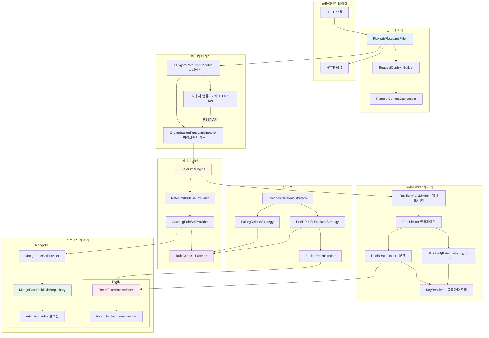

# FluxGate 아키텍처 Deep Dive

이 문서는 FluxGate의 상세 아키텍처를 **실제 소스코드**와 함께 설명합니다.

---

## 목차

1. [전체 흐름 개요](#1-전체-흐름-개요)
2. [Filter Layer: 요청 가로채기](#2-filter-layer-요청-가로채기)
3. [Handler Layer: Rate Limiting 조율](#3-handler-layer-rate-limiting-조율)
4. [Engine Layer: 룰셋 해석과 키 해석](#4-engine-layer-룰셋-해석과-키-해석)
5. [RateLimiter Layer: 토큰 버킷 실행](#5-ratelimiter-layer-토큰-버킷-실행)
6. [Storage Layer: Redis와 MongoDB](#6-storage-layer-redis와-mongodb)
7. [Reload Layer: 핫 리로드](#7-reload-layer-핫-리로드)

---

## 1. 전체 흐름 개요


```mermaid
flowchart TB
    subgraph Client["클라이언트 레이어"]
        REQ[HTTP 요청]
        RES[HTTP 응답]
    end

    subgraph Filter["필터 레이어"]
        FLT[FluxgateRateLimitFilter]
        REQ_CTX[RequestContext Builder]
        CUST[RequestContextCustomizer]
    end

    subgraph Handler["핸들러 레이어"]
        direction TB
        HI[FluxgateRateLimitHandler 인터페이스]
        EBH[EngineBackedRateLimitHandler - 라이브러리 기본]
        HH[사용자 핸들러 - 예: HTTP API]
    end

    subgraph Engine["엔진 레이어"]
        ENG[RateLimitEngine]
        PROV[RateLimitRuleSetProvider]
        CPROV[CachingRuleSetProvider]
        CACHE[RuleCache - Caffeine]
    end

    subgraph RateLimiter["RateLimiter 레이어"]
        RES_RL[ResilientRateLimiter - 재시도/서킷]
        RL[RateLimiter 인터페이스]
        B4J[Bucket4jRateLimiter - 인메모리]
        RRL[RedisRateLimiter - 분산]
        KEY[KeyResolver - 규칙마다 호출]
    end

    subgraph Storage["스토리지 레이어"]
        subgraph Redis["Redis"]
            TBS[RedisTokenBucketStore]
            LUA[token_bucket_consume.lua]
        end
        subgraph MongoDB["MongoDB"]
            MPROV[MongoRuleSetProvider]
            REPO[MongoRateLimitRuleRepository]
            COLL[rate_limit_rules 컬렉션]
        end
    end

    subgraph Reload["핫 리로드"]
        COMP[CompositeReloadStrategy]
        POLL[PollingReloadStrategy]
        PUBSUB[RedisPubSubReloadStrategy]
        RESET[BucketResetHandler]
    end

    REQ --> FLT
    FLT --> REQ_CTX
    REQ_CTX --> CUST
    FLT --> HI
    HI --> EBH & HH
    EBH --> ENG
    HH -->|REST API| EBH
    ENG --> PROV
    PROV --> CPROV
    CPROV --> CACHE
    CPROV --> MPROV
    MPROV --> REPO
    ENG --> RES_RL
    RES_RL --> RL
    RL --> B4J & RRL
    RRL --> KEY
    B4J --> KEY
    RRL --> TBS
    TBS --> LUA
    REPO --> COLL
    COMP --> POLL & PUBSUB
    POLL --> CACHE
    PUBSUB --> CACHE
    PUBSUB --> RESET
    RESET --> TBS
    FLT --> RES

    style FLT fill:#e3f2fd
    style ENG fill:#fff8e1
    style TBS fill:#ffebee
    style REPO fill:#e8f5e9
    style CACHE fill:#f3e5f5
```

---

## 2. Filter Layer: 요청 가로채기

### 2.1 FluxgateRateLimitFilter

HTTP 요청을 가로채고 Rate Limiting을 적용하는 진입점입니다.

```
📁 fluxgate-spring-boot3-starter/src/main/java/org/fluxgate/spring/filter/
└── FluxgateRateLimitFilter.java
```

```java
// FluxgateRateLimitFilter.java (핵심 부분)
public class FluxgateRateLimitFilter extends OncePerRequestFilter {

    private final FluxgateRateLimitHandler handler;
    private final RequestContextCustomizer customizer;
    private final FluxgateProperties properties;

    @Override
    protected void doFilterInternal(
            HttpServletRequest request,
            HttpServletResponse response,
            FilterChain filterChain) throws ServletException, IOException {

        String path = request.getRequestURI();

        // 1️⃣ 제외 패턴 체크 (예: /health, /actuator/*)
        if (shouldExclude(path)) {
            filterChain.doFilter(request, response);
            return;
        }

        // 2️⃣ RequestContext 빌드 ← 이 부분이 CTX로 향하는 화살표
        RequestContext context = buildRequestContext(request);

        // 3️⃣ Handler 호출 ← 이 부분이 HI로 향하는 화살표
        RateLimitResponse result = handler.tryConsume(context, ruleSetId);

        // 4️⃣ 결과에 따른 응답 처리
        if (result.isAllowed()) {
            addRateLimitHeaders(response, result);
            filterChain.doFilter(request, response);  // 허용 → 다음 필터로
        } else {
            handleRejection(response, result);        // 거부 → 429 응답
        }
    }

    // 📌 RequestContext 빌드 메서드
    private RequestContext buildRequestContext(HttpServletRequest request) {
        // 기본 컨텍스트 빌더 생성
        RequestContext.Builder builder = RequestContext.builder()
                .path(request.getRequestURI())
                .method(request.getMethod())
                .clientIp(extractClientIp(request))
                .userId(extractUserId(request))
                .apiKey(extractApiKey(request))
                .ruleSetId(properties.getRatelimit().getDefaultRuleSetId());

        // 3️⃣ 커스터마이저 적용 ← CUST로 향하는 화살표
        if (customizer != null) {
            builder = customizer.customize(builder, request);
        }

        return builder.build();
    }
}
```

**흐름 설명:**

```
HTTP 요청
    ↓
FluxgateRateLimitFilter.doFilterInternal()
    ↓
buildRequestContext()  ──────────────────────┐
    │                                         │
    ├─→ RequestContext.builder()              │ REQ_CTX
    │       .path("/api/users")               │
    │       .method("GET")                    │
    │       .clientIp("192.168.1.1")          │
    │                                         │
    └─→ customizer.customize(builder, request) ← CUST
            │
            ├─→ 헤더에서 X-Tenant-Id 추출
            ├─→ Cloudflare IP 재정의
            └─→ 커스텀 속성 추가
```

---

### 2.2 RequestContext

요청에 대한 모든 메타데이터를 담는 불변 객체입니다.

```
📁 fluxgate-core/src/main/java/org/fluxgate/core/context/
└── RequestContext.java
```

```java
// RequestContext.java
public class RequestContext {

    private final String path;           // 요청 경로: /api/users/123
    private final String method;         // HTTP 메서드: GET, POST, ...
    private final String clientIp;       // 클라이언트 IP
    private final String userId;         // 사용자 ID (선택)
    private final String apiKey;         // API 키 (선택)
    private final String ruleSetId;      // 적용할 규칙 세트 ID
    private final Map<String, Object> attributes;  // 커스텀 속성

    // Builder 패턴
    public static Builder builder() {
        return new Builder();
    }

    public static class Builder {
        private String path;
        private String method;
        private String clientIp;
        private String userId;
        private String apiKey;
        private String ruleSetId;
        private Map<String, Object> attributes = new HashMap<>();

        public Builder path(String path) {
            this.path = path;
            return this;
        }

        public Builder clientIp(String clientIp) {
            this.clientIp = clientIp;
            return this;
        }

        public Builder attribute(String key, Object value) {
            this.attributes.put(key, value);
            return this;
        }

        public RequestContext build() {
            return new RequestContext(this);
        }
    }
}
```

---

### 2.3 RequestContextCustomizer

사용자가 구현하여 컨텍스트를 커스터마이징할 수 있는 인터페이스입니다.

```
📁 fluxgate-spring-boot3-starter/src/main/java/org/fluxgate/spring/filter/
└── RequestContextCustomizer.java
```

```java
// RequestContextCustomizer.java
@FunctionalInterface
public interface RequestContextCustomizer {

    /**
     * RequestContext 빌더를 커스터마이징합니다.
     *
     * @param builder 기본값이 채워진 빌더
     * @param request HTTP 요청
     * @return 커스터마이징된 빌더
     */
    RequestContext.Builder customize(
            RequestContext.Builder builder,
            HttpServletRequest request);

    // 기본 no-op 커스터마이저
    static RequestContextCustomizer identity() {
        return (builder, request) -> builder;
    }
}
```

---

#### 💡 잠깐! @FunctionalInterface가 뭔가요?

`RequestContextCustomizer` 코드를 보면 **구현부가 없습니다.** `customize()` 메서드의 본문이 없죠. 이게 정상입니다!

**인터페이스는 "계약서"입니다.** "이런 형태의 메서드를 구현해라"라고 약속만 정의한 것이지, 실제 동작은 **사용하는 쪽에서 구현**합니다.

`@FunctionalInterface`는 **추상 메서드가 딱 1개인 인터페이스**를 의미합니다. 이런 인터페이스는 **람다 표현식**으로 간결하게 구현할 수 있습니다.

---

#### 📝 세 가지 구현 방식 비교

같은 기능을 구현하는 세 가지 방법을 보여드립니다. **모두 동일하게 동작합니다.**

**방식 1: 람다 표현식 (가장 간결)**

```java
@Bean
public RequestContextCustomizer requestContextCustomizer() {
    return (builder, request) -> {
        String userId = request.getHeader("X-User-Id");
        if (userId != null) {
            builder.userId(userId);
        }
        return builder;
    };
}
```

- `(builder, request) -> { ... }` 부분이 `customize()` 메서드의 구현부입니다
- 파라미터 타입은 컴파일러가 추론합니다

**방식 2: 익명 클래스 (람다의 원래 모습)**

```java
@Bean
public RequestContextCustomizer requestContextCustomizer() {
    return new RequestContextCustomizer() {
        @Override
        public RequestContext.Builder customize(
                RequestContext.Builder builder,
                HttpServletRequest request) {
            
            String userId = request.getHeader("X-User-Id");
            if (userId != null) {
                builder.userId(userId);
            }
            return builder;
        }
    };
}
```

- 방식 1의 람다는 이 익명 클래스를 **축약한 문법**입니다
- Java 8 이전에는 이렇게 작성했습니다

**방식 3: 별도 클래스로 구현 (복잡한 로직에 적합)**

```java
// 별도 파일: TenantContextCustomizer.java
@Component
public class TenantContextCustomizer implements RequestContextCustomizer {

    private final JwtParser jwtParser;  // 의존성 주입 가능
    
    public TenantContextCustomizer(JwtParser jwtParser) {
        this.jwtParser = jwtParser;
    }

    @Override
    public RequestContext.Builder customize(
            RequestContext.Builder builder,
            HttpServletRequest request) {
        
        String userId = request.getHeader("X-User-Id");
        if (userId != null) {
            builder.userId(userId);
        }
        
        // JWT 파싱 같은 복잡한 로직
        String token = request.getHeader("Authorization");
        if (token != null) {
            Claims claims = jwtParser.parse(token);
            builder.attribute("role", claims.getRole());
        }
        
        return builder;
    }
}
```

- 복잡한 로직이나 의존성 주입이 필요할 때 사용
- 테스트하기 쉬움

---

#### 🔄 언제 어떤 방식을 쓰나요?

| 상황 | 추천 방식 |
|------|----------|
| 간단한 헤더 추출 (1~5줄) | 람다 표현식 |
| 여러 곳에서 재사용 | 별도 클래스 |
| 다른 Bean 주입 필요 (JwtParser 등) | 별도 클래스 |
| 단위 테스트 작성 필요 | 별도 클래스 |

---

#### 🎯 그래서 이게 어떻게 동작하나요?

전체 흐름을 다시 정리하면:

```
1. 당신이 작성한 코드 (람다든 클래스든)
   ┌────────────────────────────────────────┐
   │ return (builder, request) -> {        │
   │     builder.userId(request.getHeader  │
   │         ("X-User-Id"));               │
   │     return builder;                   │
   │ };                                    │
   └────────────────────────────────────────┘
                    │
                    ▼
2. Spring이 Bean으로 등록
                    │
                    ▼
3. FluxgateRateLimitFilter가 주입받음
   ┌────────────────────────────────────────┐
   │ public class FluxgateRateLimitFilter { │
   │     private final RequestContext      │
   │         Customizer customizer; // 여기!│
   │ }                                     │
   └────────────────────────────────────────┘
                    │
                    ▼
4. HTTP 요청이 들어올 때마다 호출됨
   ┌────────────────────────────────────────┐
   │ builder = customizer.customize(       │
   │     builder, request);  // 당신 코드 실행│
   └────────────────────────────────────────┘
```

---

#### 💬 Strategy 패턴과 뭐가 다른가요?

**거의 같습니다!** `@FunctionalInterface`는 Strategy 패턴을 간결하게 구현하는 방법입니다.

```
전통적인 Strategy 패턴:
- 인터페이스 정의
- 구현 클래스 여러 개 작성
- 클래스 파일이 늘어남

@FunctionalInterface + 람다:
- 인터페이스 정의
- 람다로 즉석에서 구현
- 코드가 간결해짐
```

본질은 같고, **표현 방식만 간결해진 것**입니다.

---

**사용자 구현 예시 (전체 코드):**

```java
// 사용자가 구현하는 커스터마이저
@Configuration
public class RateLimitConfig {

  /**
   * RequestContext 커스터마이저를 Bean으로 등록합니다.
   * 
   * 이 Bean은 FluxgateRateLimitFilter에 자동 주입되어
   * 모든 HTTP 요청마다 호출됩니다.
   */
  @Bean
  public RequestContextCustomizer requestContextCustomizer() {
    return (builder, request) -> {
      
      // 1. 테넌트 ID 추출
      String tenantId = request.getHeader("X-Tenant-Id");
      if (tenantId != null) {
        builder.attribute("tenantId", tenantId);
      }

      // 2. Cloudflare 뒤에 있는 경우 실제 IP 추출
      String cfIp = request.getHeader("CF-Connecting-IP");
      if (cfIp != null) {
        builder.clientIp(cfIp);
      }

      // 3. 사용자 ID 추출
      String userId = request.getHeader("X-User-Id");
      if (userId != null) {
        builder.userId(userId);
      }

      return builder;
    };
  }
}
```

---

## 3. Handler Layer: Rate Limiting 조율

### 3.1 FluxgateRateLimitHandler 인터페이스

Rate Limiting의 진입점입니다. 필터와 애스펙트는 이 인터페이스 **하나만** 알고 있습니다.

```
📁 fluxgate-core/src/main/java/org/fluxgate/core/handler/
└── FluxgateRateLimitHandler.java
```

```java
// FluxgateRateLimitHandler.java
public interface FluxgateRateLimitHandler {

  /**
   * @param context 요청 컨텍스트 (IP, userId, endpoint 등)
   * @param ruleSetId 적용할 룰셋 ID
   */
  RateLimitResponse tryConsume(RequestContext context, String ruleSetId);

  /** 가중 요청(permits > 1). 기본 구현은 permits == 1일 때만 위임하고 나머지는 거부합니다. */
  default RateLimitResponse tryConsume(RequestContext context, String ruleSetId, long permits) {
    if (permits == 1) {
      return tryConsume(context, ruleSetId);
    }
    throw new UnsupportedOperationException(
        "Weighted permits are not supported by " + getClass().getName());
  }

  /** 핸들러가 전혀 없을 때 쓰이는 최후 폴백. 모두 허용합니다. */
  FluxgateRateLimitHandler ALLOW_ALL = (context, ruleSetId) -> RateLimitResponse.allowed(-1, 0);
}
```

두 가지를 짚어둡니다.

- `@FunctionalInterface`로 선언되어 있지 않지만 추상 메서드가 하나뿐이라 람다로도 구현 가능합니다.
  `ALLOW_ALL` 상수 자체가 그 예입니다.
- 가중 요청(`fluxgate.ratelimit.cost-header`)을 지원하려면 **3-인자 메서드를 재정의**해야 합니다.
  재정의하지 않은 핸들러에 `permits > 1`이 들어오면 `UnsupportedOperationException`이 발생합니다.

---

### 3.2 EngineBackedRateLimitHandler (라이브러리 기본 구현)

스타터가 자동 등록하는 기본 핸들러입니다. `RateLimiter` 빈과 `RateLimitRuleSetProvider` 빈이
있으면 등록되므로, `@EnableFluxgateFilter` + Redis + MongoDB 조합에서는 **사용자 코드가 0줄**입니다.

```
📁 fluxgate-spring-boot3-starter/src/main/java/org/fluxgate/spring/handler/
└── EngineBackedRateLimitHandler.java
```

```java
// EngineBackedRateLimitHandler.java
public class EngineBackedRateLimitHandler implements FluxgateRateLimitHandler {

  private static final Logger log = LoggerFactory.getLogger(EngineBackedRateLimitHandler.class);

  private final RateLimitEngine engine;
  private final Set<String> warnedRuleSetIds = ConcurrentHashMap.newKeySet();

  public EngineBackedRateLimitHandler(RateLimitEngine engine) {
    this.engine = Objects.requireNonNull(engine, "engine must not be null");
    log.info("EngineBackedRateLimitHandler initialized");
  }

  @Override
  public RateLimitResponse tryConsume(RequestContext context, String ruleSetId) {
    return tryConsume(context, ruleSetId, 1L);
  }

  @Override
  public RateLimitResponse tryConsume(RequestContext context, String ruleSetId, long permits) {
    try {
      // 1️⃣ Engine 호출 → 2️⃣ RateLimitResult를 RateLimitResponse로 변환
      return RateLimitResponse.from(engine.check(ruleSetId, context, permits));
    } catch (MissingRateLimitKeyException e) {
      logConfigurationProblem(
          ruleSetId, "no rate limit key could be resolved, rejecting the request", e);
      return RateLimitResponse.rejected(0L);
    } catch (InvalidRuleConfigException e) {
      logConfigurationProblem(ruleSetId, "the rule configuration is invalid", e);
      return RateLimitResponse.rejected(0L);
    }
  }

  /** 설정 오류는 처음 한 번만 WARN, 이후에는 DEBUG로 남깁니다(핫 패스 로그 폭주 방지). */
  private void logConfigurationProblem(String ruleSetId, String what, RuntimeException e) {
    if (warnedRuleSetIds.add(ruleSetId)) {
      log.warn("Rule set '{}': {}: {}", ruleSetId, what, e.getMessage());
    } else {
      log.debug("Rule set '{}': {}: {}", ruleSetId, what, e.getMessage());
    }
  }
}
```

설계 포인트:

- **메트릭을 기록하지 않습니다.** 메트릭은 `RateLimitRuleSet.getMetricsRecorder()`(코어)와
  `MicrometerMetricsRecorder`(스타터)가 담당합니다. 핸들러는 변환과 예외 처리만 합니다.
- **설정 오류를 거부로 바꿉니다.** `missing-key-behavior=REJECT`에서 스코프 값이 없을 때
  (`MissingRateLimitKeyException`), 그리고 규칙을 만들 수 없을 때(`InvalidRuleConfigException`)
  예외를 위로 전파하지 않고 대기 시간 0의 거부 응답을 반환합니다. 필터가 500을 내는 대신 429가
  나갑니다.

---

### 3.3 자체 핸들러: HTTP API 모드

중앙 Rate Limit 서비스를 HTTP로 호출하고 싶다면 `FluxgateRateLimitHandler`를 직접 구현합니다.
FluxGate는 HTTP 핸들러를 기본 제공하지 **않습니다**. 샘플이 하나 들어 있습니다.

```
📁 fluxgate-samples/fluxgate-sample-filter/src/main/java/org/fluxgate/sample/filter/handler/
└── HttpRateLimitHandler.java
```

```java
// HttpRateLimitHandler.java (샘플)
@Component
public class HttpRateLimitHandler implements FluxgateRateLimitHandler {

  private final RestClient restClient;
  private final String apiUrl;

  public HttpRateLimitHandler(@Value("${fluxgate.api.url:http://localhost:8080}") String apiUrl) {
    this.apiUrl = apiUrl;
    this.restClient = RestClient.builder().baseUrl(apiUrl).build();
  }

  @Override
  public RateLimitResponse tryConsume(RequestContext context, String ruleSetId) {
    try {
      RateLimitApiResponse response =
          restClient
              .post()
              .uri("/api/ratelimit/check")
              .contentType(MediaType.APPLICATION_JSON)
              .body(Map.of("ruleSetId", ruleSetId, "clientIp", /* ... */ ""))
              .retrieve()
              .body(RateLimitApiResponse.class);

      if (response == null) {
        return RateLimitResponse.allowed(-1, 0);
      }
      return response.allowed
          ? RateLimitResponse.allowed(response.remaining, 0)
          : RateLimitResponse.rejected(response.retryAfterMs);

    } catch (Exception e) {
      // 샘플은 fail-open입니다. 라이브러리 기본값(fail-closed)과 다르다는 점에 주의하세요.
      return RateLimitResponse.allowed(-1, 0);
    }
  }
}
```

```java
@SpringBootApplication
@EnableFluxgateFilter(handler = HttpRateLimitHandler.class)
public class ClientApplication { }
```

**사용 시나리오:**

```
┌─────────────────┐         ┌─────────────────────────┐
│  API Gateway    │  HTTP   │  Rate Limit Service     │
│  (Port 8083)    │ ──────→ │  (Port 8082)            │
│                 │         │                         │
│  HttpRateLimit  │         │  EngineBackedRateLimit  │
│  Handler (샘플)  │         │  Handler + Redis        │
└─────────────────┘         └─────────────────────────┘
```

`fluxgate.api.url`은 **이 샘플 핸들러가 읽는 프로퍼티**이며 `FluxgateProperties`에는 없습니다.

---

### 3.4 RateLimitResponse

핸들러가 반환하는 값 객체입니다. 필터와 애스펙트가 응답 헤더를 만드는 데 필요한 모든 것이 여기
담깁니다.

```
📁 fluxgate-core/src/main/java/org/fluxgate/core/handler/
└── RateLimitResponse.java
```

| 필드 | 의미 | `-1`의 뜻 |
|------|------|-----------|
| `allowed` | 허용 여부 | — |
| `remainingTokens` | 결정을 만든 대역의 남은 토큰 | 알 수 없음 → 헤더 생략 |
| `retryAfterMillis` | 재시도까지 남은 밀리초 | 알 수 없음 |
| `onLimitExceedPolicy` | 초과 시 정책 (`REJECT_REQUEST` / `WAIT_FOR_REFILL`) | — |
| `limit` | 결정을 만든 대역의 용량 | 알 수 없음 → 헤더 생략 |
| `resetTimeMillis` | 버킷이 다시 가득 차는 epoch 밀리초 | 알 수 없음 → 헤더 생략 |
| `windowSeconds` | `limit`이 속한 윈도 길이 (`RateLimit-Policy`용) | 알 수 없음 → 헤더 생략 |
| `bandLabel` | 결정을 만든 대역의 키 라벨 | — |

```java
// 코어 결과 → 핸들러 응답. 나노초 → 밀리초 변환은 항상 올림입니다.
public static RateLimitResponse from(RateLimitResult result) { ... }
```

올림이 중요한 이유: 0.5ms를 내림하면 `Retry-After: 0`이 되어 클라이언트가 바로 재시도하는
busy loop가 생깁니다. 헤더 계산은 `RateLimitHeaderWriter`가 한 번 더 `max(1, ceil(...))`로
막습니다.

---

## 4. Engine Layer: 룰셋 해석과 키 해석

> **주의.** FluxGate에는 경로/메서드/우선순위 기반 **규칙 매칭이 없습니다.** `RateLimitRule`에는
> `path`, `method`, `priority` 필드가 존재하지 않고 `RateLimitEngine`에도 매칭 로직이 없습니다.
> 엔진이 하는 일은 룰셋 ID로 룰셋을 찾아 `RateLimiter`에 넘기는 것뿐이며, 룰셋 안의 **모든 활성
> 규칙**이 평가됩니다. 요청 표면별로 제한을 나누려면 `include-patterns`가 서로 다른 필터를 여러 개
> 등록하거나 `default-rule-set-id`를 애플리케이션별로 지정하세요.

### 4.1 RateLimitEngine

```
📁 fluxgate-core/src/main/java/org/fluxgate/core/engine/
└── RateLimitEngine.java
```

```java
// RateLimitEngine.java
public final class RateLimitEngine {

  private static final String MISSING_RULE_SET_KEY_PREFIX = "missing-rule-set:";

  /** 룰셋을 찾지 못했을 때의 전략. 스타터가 missing-rule-behavior를 여기에 배선합니다. */
  public enum OnMissingRuleSetStrategy {
    THROW,  // IllegalArgumentException
    ALLOW,  // fail-open: 규칙 정보 없는 allow
    DENY    // fail-closed: nanosToWait = 0인 reject
  }

  private final RateLimitRuleSetProvider ruleSetProvider;  // ← PROV
  private final RateLimiter rateLimiter;                   // ← RL
  private final OnMissingRuleSetStrategy onMissingRuleSetStrategy;

  public RateLimitResult check(String ruleSetId, RequestContext context) {
    return check(ruleSetId, context, 1L);
  }

  public RateLimitResult check(String ruleSetId, RequestContext context, long permits) {
    Objects.requireNonNull(ruleSetId, "ruleSetId must not be null");
    Objects.requireNonNull(context, "context must not be null");

    // 1️⃣ 룰셋 조회 (ID로만. 매칭 로직 없음) ← PROV
    Optional<RateLimitRuleSet> optionalRuleSet = ruleSetProvider.findById(ruleSetId);
    if (!optionalRuleSet.isPresent()) {
      return onMissingRuleSet(ruleSetId);
    }

    // 2️⃣ 토큰 소비를 RateLimiter에 위임 ← RL
    //    키 해석은 RateLimiter가 ruleSet.getKeyResolver()로 규칙마다 수행합니다.
    RateLimitResult result = rateLimiter.tryConsume(context, optionalRuleSet.get(), permits);
    if (result == null) {
      // 계약 위반은 호출자에게 null을 흘리지 않고 여기서 터뜨립니다.
      throw new IllegalStateException(
          "RateLimiter " + rateLimiter.getClass().getName()
              + " returned null for ruleSetId: " + ruleSetId);
    }
    return result;
  }

  private RateLimitResult onMissingRuleSet(String ruleSetId) {
    switch (onMissingRuleSetStrategy) {
      case THROW:
        throw new IllegalArgumentException("Unknown ruleSetId: " + ruleSetId);
      case DENY:
        // fail-closed 분기: RateLimiter를 아예 호출하지 않습니다.
        return RateLimitResult.builder(RateLimitKey.of(MISSING_RULE_SET_KEY_PREFIX + ruleSetId))
            .allowed(false)
            .remainingTokens(0L)
            .nanosToWaitForRefill(0L)
            .build();
      case ALLOW:
      default:
        return RateLimitResult.allowedWithoutRule();
    }
  }
}
```

세부 사항:

- `check()`는 **절대 null을 반환하지 않습니다.** 룰셋 부재는 전략으로, `RateLimiter`의 계약 위반은
  `IllegalStateException`으로 처리합니다.
- `DENY` 경로가 만드는 합성 키 `missing-rule-set:<id>`는 메트릭과 로그에서 "왜 거부되었는지"를
  추적할 수 있게 하려는 것입니다. Redis 버킷이 만들어지지는 않습니다.
- 빌더는 `ruleSetProvider`와 `rateLimiter`를 필수로 요구하며, `onMissingRuleSetStrategy` 기본값은
  `THROW`입니다. 스타터는 `fluxgate.ratelimit.missing-rule-behavior`를 `ALLOW`/`DENY`로 배선합니다.

---

### 4.2 RateLimitRuleSetProvider와 RuleCache

```
📁 fluxgate-core/src/main/java/org/fluxgate/core/spi/
└── RateLimitRuleSetProvider.java

📁 fluxgate-core/src/main/java/org/fluxgate/core/reload/
├── RuleCache.java
└── CachingRuleSetProvider.java

📁 fluxgate-spring-boot3-starter/src/main/java/org/fluxgate/spring/reload/cache/
└── CaffeineRuleCache.java
```

```java
// RateLimitRuleSetProvider.java (SPI. 패키지는 org.fluxgate.core.spi 입니다)
public interface RateLimitRuleSetProvider {
  Optional<RateLimitRuleSet> findById(String ruleSetId);
}
```

구현체는 MongoDB(`org.fluxgate.adapter.mongo.rule.MongoRuleSetProvider`), 애플리케이션 코드의
람다, 또는 아래의 캐싱 데코레이터입니다.

```java
// CachingRuleSetProvider.java
public class CachingRuleSetProvider implements RateLimitRuleSetProvider, RuleReloadListener {

  private final RateLimitRuleSetProvider delegate;
  private final RuleCache cache;

  @Override
  public Optional<RateLimitRuleSet> findById(String ruleSetId) {
    Objects.requireNonNull(ruleSetId, "ruleSetId must not be null");

    // get/load/put을 캐시에 위임합니다. 그래야 캐시 구현이 원자적으로 로드할 수 있습니다.
    return cache.getOrLoad(
        ruleSetId,
        id -> {
          log.debug("Cache miss for ruleSetId: {}, loading from delegate", id);
          return delegate.findById(id);
        });
  }

  @Override
  public void onReload(RuleReloadEvent event) {
    if (event.isFullReload()) {
      cache.invalidateAll();
    } else {
      cache.invalidate(event.getRuleSetId());
    }
  }
}
```

```java
// RuleCache.java (인터페이스) — Optional 기반입니다. null을 돌려주지 않습니다.
public interface RuleCache {
  Optional<RateLimitRuleSet> get(String ruleSetId);

  /** 기본 구현은 get → load → put. 동시 미스가 각각 로더를 실행할 수 있습니다. */
  default Optional<RateLimitRuleSet> getOrLoad(
      String ruleSetId, Function<String, Optional<RateLimitRuleSet>> loader) { ... }

  void put(String ruleSetId, RateLimitRuleSet ruleSet);
  void invalidate(String ruleSetId);
  void invalidateAll();
  Set<String> getCachedRuleSetIds();
  int size();
  default Optional<CacheStats> getStats() { return Optional.empty(); }
}
```

```java
// CaffeineRuleCache.java — getOrLoad를 재정의해 스탬피드와 네거티브 캐시를 처리합니다.
public CaffeineRuleCache(Duration ttl, int maxSize) { ... }
public CaffeineRuleCache(Duration ttl, int maxSize, Duration negativeTtl) { ... }

@Override
public Optional<RateLimitRuleSet> getOrLoad(
    String ruleSetId, Function<String, Optional<RateLimitRuleSet>> loader) {

  RateLimitRuleSet cached = cache.getIfPresent(ruleSetId);
  if (cached != null) {
    return Optional.of(cached);
  }

  // 존재하지 않는 룰셋을 매 요청마다 MongoDB에 물어보지 않도록 미스도 캐시합니다.
  if (missCache != null && missCache.getIfPresent(ruleSetId) != null) {
    return Optional.empty();
  }

  // Caffeine은 매핑 함수 실행 동안 키 단위 락을 유지하므로, 같은 ID에 대한 동시 미스가
  // 하나의 로드로 합쳐집니다(캐시 스탬피드 방지). null을 반환하면 매핑이 기록되지 않습니다.
  RateLimitRuleSet loaded = cache.get(ruleSetId, key -> loader.apply(key).orElse(null));

  if (loaded == null) {
    if (missCache != null) {
      missCache.put(ruleSetId, Boolean.TRUE);
    }
    return Optional.empty();
  }
  return Optional.of(loaded);
}
```

관련 프로퍼티: `fluxgate.reload.cache.ttl`(기본 `5m`), `.max-size`(기본 `1000`),
`.negative-ttl`(기본 `5s`, `0`이면 네거티브 캐시 비활성).

---

### 4.3 KeyResolver

`LimitScope`에 따라 Rate Limit 키를 만듭니다. **인자 순서는 `(context, rule)`**이고, 반환 값은
버킷 키 전체가 아니라 **키 값 한 조각**입니다. 룰셋 ID·규칙 ID·대역 라벨은 `RateLimiter`가 붙입니다.

```
📁 fluxgate-core/src/main/java/org/fluxgate/core/key/
├── KeyResolver.java
├── LimitScopeKeyResolver.java
├── MissingKeyBehavior.java
├── KeyValueSanitizer.java
└── RateLimitKey.java
```

```java
// KeyResolver.java (인터페이스)
public interface KeyResolver {
  RateLimitKey resolve(RequestContext context, RateLimitRule rule);
}
```

```java
// LimitScopeKeyResolver.java (기본 구현)
public class LimitScopeKeyResolver implements KeyResolver {

  private static final String GLOBAL_KEY = "global";
  private static final String UNKNOWN_IP = "unknown";
  private static final String PREFIX_IP = "ip:";
  private static final String PREFIX_USER = "user:";
  private static final String PREFIX_API_KEY = "key:";
  private static final String PREFIX_CUSTOM = "custom:";

  private final MissingKeyBehavior missingKeyBehavior;

  public LimitScopeKeyResolver() {
    this(MissingKeyBehavior.FALLBACK_TO_IP);
  }

  public LimitScopeKeyResolver(MissingKeyBehavior missingKeyBehavior) { ... }

  @Override
  public RateLimitKey resolve(RequestContext context, RateLimitRule rule) {
    LimitScope scope = rule.getScope();
    if (scope == null) {
      scope = LimitScope.PER_IP; // default
    }

    String keyValue;
    switch (scope) {
      case GLOBAL:      keyValue = GLOBAL_KEY; break;
      case PER_IP:      keyValue = resolveClientIp(context, rule, scope); break;
      case PER_USER:    keyValue = resolveUserId(context, rule, scope); break;
      case PER_API_KEY: keyValue = resolveApiKey(context, rule, scope); break;
      case CUSTOM:      keyValue = resolveCustom(context, rule, scope); break;
      default:          keyValue = resolveClientIp(context, rule, scope); break;
    }

    // API 키·사용자 ID는 평문으로 로그에 남기지 않습니다(앞 4자 + ***).
    log.debug("Resolved key for rule {} with scope {}: {}", rule.getId(), scope, mask(keyValue));

    return new RateLimitKey(keyValue);
  }

  private String resolveUserId(RequestContext context, RateLimitRule rule, LimitScope scope) {
    String userId = context != null ? context.getUserId() : null;
    if (userId == null || userId.isEmpty()) {
      if (missingKeyBehavior == MissingKeyBehavior.REJECT) {
        throw new MissingRateLimitKeyException(rule.getId(), scope);
      }
      log.debug("userId is null/empty for PER_USER scope, falling back to clientIp");
      return resolveClientIp(context, rule, scope);  // 폴백 키는 실제 출처인 ip: 접두사를 갖습니다
    }
    return PREFIX_USER + KeyValueSanitizer.sanitize(userId);
  }
}
```

**스코프 접두사가 있는 이유**: 접두사가 없으면 `userId`가 `10.0.0.5`인 사용자와 실제 IP가
`10.0.0.5`인 익명 요청이 같은 버킷을 공유합니다. 폴백 키도 `user:` 대신 `ip:`를 쓰는 이유가 같습니다
— 키는 값의 **실제 출처**를 나타냅니다.

**새니타이즈** (`KeyValueSanitizer`):

| 규칙 | 동작 |
|------|------|
| 허용 문자 | `[A-Za-z0-9._:@-]` 외의 문자는 `_`로 치환 |
| 길이 | 256자를 넘으면 값 전체를 SHA-256 16진 해시로 대체 |
| 멱등성 | 이미 새니타이즈된 값을 다시 넣어도 결과가 같습니다 |
| 적용 지점 | `LimitScopeKeyResolver`와 `RateLimitKey` 생성자 양쪽 (커스텀 리졸버 방어) |

**해석된 키 값:**

| LimitScope | 키 값 예시 |
|------------|-----------|
| `GLOBAL` | `global` |
| `PER_IP` | `ip:192.168.1.100` |
| `PER_USER` | `user:user-123` |
| `PER_API_KEY` | `key:abc123` |
| `CUSTOM` | `custom:tenant-a:user-123` |
| `PER_IP` (IP 없음, 폴백) | `ip:unknown` |

**최종 Redis 버킷 키**는 `RedisRateLimiter`가 여기에 룰셋·규칙·대역을 붙여 만듭니다:

```
fluxgate:bucket:{api-limits:per-ip-rule:ip:192.168.1.100}:100-per-60s
                 └─ ruleSetId ─┘└ ruleId ┘└─ 키 값 ─┘    └ 대역 키 라벨 ┘
                └──────────── 해시 태그 (클러스터 슬롯 고정) ───────────┘
```

`MissingKeyBehavior`:

| 값 | 동작 |
|----|------|
| `FALLBACK_TO_IP` (기본) | 클라이언트 IP로 폴백. 익명 요청이 인증 티어의 쿼터를 물려받으므로 주의 |
| `REJECT` | `MissingRateLimitKeyException`을 던지고, Limiter가 이를 잡아 거부 결과로 변환 |

프로퍼티: `fluxgate.ratelimit.missing-key-behavior`.

---

## 5. RateLimiter Layer: 토큰 버킷 실행

### 5.1 RateLimiter 인터페이스

```
📁 fluxgate-core/src/main/java/org/fluxgate/core/ratelimiter/
└── RateLimiter.java
```

```java
// RateLimiter.java
public interface RateLimiter {

  /**
   * 토큰 소비를 시도합니다.
   *
   * @param context 요청 컨텍스트
   * @param ruleSet 적용할 규칙 세트
   * @param permits 소비할 토큰 수
   * @return Rate Limit 결과
   */
  RateLimitResult tryConsume(RequestContext context, RateLimitRuleSet ruleSet, long permits);

  // 기본 1토큰 소비
  default RateLimitResult tryConsume(RequestContext context, RateLimitRuleSet ruleSet) {
    return tryConsume(context, ruleSet, 1);
  }
}
```

---

### 5.2 Bucket4jRateLimiter

Bucket4j를 사용하는 인메모리 구현입니다. `fluxgate.ratelimit.mode=IN_MEMORY`와
`fluxgate.ratelimit.fallback.mode=IN_MEMORY`가 이것을 사용합니다.

```
📁 fluxgate-core/src/main/java/org/fluxgate/core/ratelimiter/impl/bucket4j/
└── Bucket4jRateLimiter.java
```

```java
// Bucket4jRateLimiter.java (요지)
public class Bucket4jRateLimiter implements RateLimiter {

  public static final long DEFAULT_MAXIMUM_SIZE = 100_000L;
  public static final Duration DEFAULT_EXPIRE_AFTER_ACCESS = Duration.ofHours(1);

  // 무제한 ConcurrentHashMap이 아니라 상한·유휴 만료가 있는 Caffeine 캐시입니다(OOM 방지).
  // 버킷 하나의 단위는 (ruleSetId, ruleId, 키 값, 대역 키 라벨) — Redis 레이아웃과 동일합니다.
  private final Cache<BucketKey, Bucket> buckets;

  @Override
  public RateLimitResult tryConsume(
      RequestContext context, RateLimitRuleSet ruleSet, long permits) {

    List<RateLimitRule> rules = ruleSet.getRules();
    // 규칙 매칭은 없습니다. 활성화된 모든 규칙이 평가됩니다.

    List<Candidate> candidates;
    try {
      // 규칙마다 ruleSet.getKeyResolver().resolve(context, rule)로 키를 얻고,
      // 대역마다 버킷을 확보합니다.
      candidates = collectCandidates(context, ruleSet, rules, permits);
    } catch (MissingRateLimitKeyException e) {
      // missing-key-behavior=REJECT에서 스코프 값이 없을 때. 합성 키로 거부 결과를 만듭니다.
      return record(context, ruleSet, missingKeyResult(e));
    }

    if (candidates.isEmpty()) {
      // 모든 규칙이 비활성: 강제할 것이 없습니다.
      return record(context, ruleSet, RateLimitResult.allowedWithoutRule());
    }

    // 2단계 소비:
    //   1단계 estimateAbilityToConsume - 모든 규칙의 모든 대역을 먼저 확인
    //   2단계 tryConsumeAndReturnRemaining - 전부 통과했을 때만 실제 차감,
    //         두 단계 사이에 다른 스레드가 버킷을 비웠다면 addTokens로 환불
    // 덕분에 거부된 요청이 허용했을 대역의 토큰을 소모하지 않습니다.
    ...
  }

  /** 인메모리 폴백/테스트용 리셋 API. */
  public void reset(String ruleSetId) { ... }

  public void resetAll() { ... }

  public long size() { ... }
}
```

Redis 구현과 **결과 의미가 동일**합니다.

| 항목 | 값 |
|------|-----|
| `limit` | 결정을 만든(binding) 대역의 용량 |
| `resetTimeMillis` | 허용: 해당 버킷이 다시 가득 차는 시각 / 거부: `now + nanosToWaitForRefill` |
| `remainingTokens` | 거부 시에도 **실제** 남은 토큰 (하드코딩된 0이 아닙니다) |
| `bandLabel` | `RateLimitBand.getKeyLabel()` |
| `policy` | `rule.getOnLimitExceedPolicy()` |

`permits`가 대역 용량을 넘으면 `InvalidRuleConfigException`을 던집니다.

> 이 Limiter는 **분산되지 않습니다.** 버킷이 이 인스턴스의 캐시에만 존재하므로, N개 인스턴스는
> 실효 제한이 N배가 됩니다. 단일 인스턴스, 개발 환경, 그리고 Redis 장애 중의 폴백이 용도입니다.

---

## 6. Storage Layer: Redis와 MongoDB

### 6.1 RedisTokenBucketStore

Lettuce(Jedis가 아닙니다) 기반이며, 한 규칙의 **모든 대역을 한 번의 Lua 호출**로 처리합니다.

```
📁 fluxgate-redis-ratelimiter/src/main/java/org/fluxgate/redis/store/
└── RedisTokenBucketStore.java
```

```java
// RedisTokenBucketStore.java (요지)
public class RedisTokenBucketStore {

  private static final String SCRIPT_NAME = "token_bucket_consume.lua";
  private static final int RESULT_SIZE = 7;
  private static final long NANOS_PER_MICRO = 1_000L;

  private final RedisConnectionProvider connectionProvider;
  private final LuaScriptRegistry scripts;  // 스토어별 스크립트 본문 + SHA (프로세스 전역 static 아님)

  /** 단일 대역 편의 메서드. 다중 대역 형태에 위임합니다. */
  public BucketState tryConsume(String bucketKey, RateLimitBand band, long permits) { ... }

  /** 한 규칙의 모든 대역. bucketKeys.size() == bands.size() 여야 합니다. */
  public BucketState tryConsume(List<String> bucketKeys, List<RateLimitBand> bands, long permits) {

    // Redis를 건드리기 전에 실패시킵니다. permits보다 용량이 작은 대역은 영원히 서비스할 수
    // 없으므로, 대기 시간을 돌려주면 클라이언트가 무한 재시도에 빠집니다.
    for (RateLimitBand band : bands) {
      if (permits > band.getCapacity()) {
        throw new InvalidRuleConfigException(
            "permits (" + permits + ") exceed the capacity of band '"
                + band.getKeyLabel() + "' (" + band.getCapacity() + ")");
      }
    }

    // KEYS[1..n] = bucketKeys
    // ARGV[1] = permits, 이후 대역마다 capacity / window_micros / reserved
    String[] keys = bucketKeys.toArray(new String[0]);
    String[] args = new String[1 + 3 * bands.size()];
    args[0] = String.valueOf(permits);
    for (int i = 0; i < bands.size(); i++) {
      RateLimitBand band = bands.get(i);
      args[1 + 3 * i] = String.valueOf(band.getCapacity());
      args[2 + 3 * i] = String.valueOf(toMicros(band));
      args[3 + 3 * i] = "0";
    }

    // EVALSHA → NOSCRIPT면 EVAL + 스크립트 재적재
    List<Long> result = executeScriptWithFallback(keys, args);

    // [allowed, rejecting_band_index, min_remaining, micros_to_wait,
    //  reset_time_millis, limit, binding_band_index]
    boolean allowed = result.get(0) == 1L;
    long remainingTokens = result.get(2);
    long nanosToWait = result.get(3) * NANOS_PER_MICRO;   // 마이크로초 → 나노초
    long resetTimeMillis = result.get(4);
    long limit = result.get(5);
    int bandIndex = (int) (result.get(6) - 1L);           // 1-based → 0-based
    ...
  }

  /** SCAN + UNLINK. KEYS를 쓰지 않으므로 단일 스레드 Redis를 블로킹하지 않습니다. */
  public long deleteBucketsByRuleSetId(String ruleSetId) { ... }  // 패턴은 bucketKeyPattern(id)

  public long deleteAllBuckets() { ... }                          // 패턴은 "fluxgate:bucket:*"
}
```

Lua 오류는 raw `RedisCommandExecutionException`이 아니라 `ScriptExecutionException`으로 감싸져
올라옵니다.

**버킷 키 포맷:**

```
fluxgate:bucket:{api-limits:per-ip-rule:ip:192.168.1.100}:100-per-60s
```

`{...}` 해시 태그가 한 규칙+키의 모든 대역을 같은 클러스터 슬롯에 고정합니다. 다중 키 Lua
스크립트가 Redis Cluster에서 원자적으로 동작하기 위한 전제 조건입니다.
`deleteAllBuckets()`가 `fluxgate:bucket:*`만 지우는 이유도 여기에 있습니다 — 이전 구현의
`fluxgate:*`는 `fluxgate:ruleset:*`에 저장된 규칙 정의까지 삭제했습니다.

---

### 6.2 Lua 스크립트 (원자적 토큰 소비)

```
📁 fluxgate-redis-ratelimiter/src/main/resources/lua/
└── token_bucket_consume.lua
```

**계약:**

```
KEYS[1..n]    한 규칙의 대역마다 하나의 버킷 키. 모두 같은 해시 태그 안에 있어야 합니다
ARGV[1]       permits
ARGV[2 + 3i]  대역 i+1의 capacity
ARGV[3 + 3i]  대역 i+1의 window_micros
ARGV[4 + 3i]  예약. "0"을 넘깁니다

반환: 7개 정수
  [1] allowed                 모든 대역이 허용하면 1
  [2] rejecting_band_index    거부한 첫 대역의 1-based 인덱스 (허용 시 0)
  [3] min_remaining           허용: 소비 후 binding 대역의 토큰 / 거부: 거부 대역의 토큰
  [4] micros_to_wait          거부 대역이 요청을 서비스할 수 있을 때까지 (허용 시 0)
  [5] reset_time_millis       binding 대역 버킷이 가득 차는 epoch 밀리초 (허용 시 소비 **후** 계산)
  [6] limit                   binding 대역의 capacity
  [7] binding_band_index      binding 대역의 1-based 인덱스

오류: 'permits exceed capacity', 'permits must be positive', 'capacity must be positive',
      'window must be positive', 'expected N arguments for M band(s)',
      'at least one bucket key is required'

해시 필드: 'tokens', 'last_refill_micros'  (둘 다 string.format('%.0f', v)로 기록)
TTL: max(1, ceil(window_seconds * 1.1))  — 상한 없음
```

```lua
-- token_bucket_consume.lua (요지)

-- 모든 노드가 같은 시계를 쓰도록 Redis TIME을 마이크로초로 사용합니다.
local time_info = redis.call('TIME')
local now_micros = tonumber(time_info[1]) * 1000000 + tonumber(time_info[2])

-- TTL: 윈도 + 10% 여유, 최소 1초, 상한 없음(7일 윈도는 7일 버킷을 유지).
local function ttl_seconds(window_micros)
    return math.max(1, math.ceil(window_micros / 1000000 * 1.1))
end

-- ── 1단계: 모든 대역을 리필하고 전부 서비스 가능한지 확인 ──────────────────
for i = 1, band_count do
    local bucket_data = redis.call('HMGET', KEYS[i], 'tokens', 'last_refill_micros')
    local current_tokens = tonumber(bucket_data[1])
    local last_refill_micros = tonumber(bucket_data[2])

    -- 버킷이 없거나 0.3.x 버킷('last_refill_micros'가 없음)이면 가득 찬 상태로 시작합니다.
    if current_tokens == nil or last_refill_micros == nil then
        current_tokens = capacity
        last_refill_micros = now_micros
    end

    -- max: 시계가 뒤로 간 경우 / min: 한 윈도로 클램프 (elapsed * capacity를 정확한 double 범위에 유지)
    local elapsed_micros = math.min(math.max(0, now_micros - last_refill_micros), window_micros)

    -- 온전한 토큰만 적립하고, 타임스탬프는 그 토큰들이 소요한 시간만큼만 전진시킵니다.
    -- 그래서 1토큰 미만의 잔여분이 다음 호출로 이월됩니다(이전 구현은 버려서 상시 과소 허용).
    local tokens_to_add = math.floor(elapsed_micros * capacity / window_micros)
    ...

    if refilled < permits then
        -- 거부: 어떤 대역도 기록하지 않습니다. 허용했을 대역은 토큰을 그대로 유지합니다.
        -- 존재하는 버킷의 TTL만 갱신합니다(EXPIRE는 없는 키에는 no-op).
        for j = 1, band_count do
            redis.call('EXPIRE', KEYS[j], ttl_seconds(windows[j]))
        end
        return {0, i, refilled, micros_to_wait, reset_time_millis, capacity, i}
    end
end

-- ── 2단계: 전부 가능하므로 모든 대역에서 차감 ─────────────────────────────
for i = 1, band_count do
    redis.call('HMSET', KEYS[i],
        'tokens', string.format('%.0f', remaining),
        'last_refill_micros', string.format('%.0f', refill_micros[i]))
    redis.call('EXPIRE', KEYS[i], ttl_seconds(windows[i]))
end

-- 리셋 시각은 소비 **후**에 계산합니다. 이 요청이 없었다면의 시각이 아니라
-- 실제로 다시 가득 차는 시각을 알려주기 위해서입니다.
return {1, 0, tokens[binding], 0, reset_time_millis, binding_capacity, binding}
```

**정밀도 주의.** Redis의 Lua 5.1에는 정수 타입이 없고 모든 수는 IEEE-754 double입니다(정확한 정수
범위 2^53 ≈ 9.0e15). epoch 마이크로초는 약 1.76e15로 안전하지만, **나노초는 약 1.76e18로 범위를
벗어나** 기본 `%.14g` 직렬화에서 `1.76e+18`로 저장되었습니다. 그래서 시간 단위가 마이크로초이고
해시에 쓰는 모든 값이 `string.format('%.0f', v)`를 통과합니다. "정수 연산만 사용"이라는 이전
주석은 사실이 아니었습니다.

**Lua 스크립트가 중요한 이유:**

```
┌──────────────────────────────────────────────────────────────┐
│  Race Condition 없이 원자적 처리                              │
├──────────────────────────────────────────────────────────────┤
│                                                              │
│  Client A ──┐                                                │
│             │     ┌─────────────────────────────────┐        │
│  Client B ──┼────→│  Redis Lua Script (EVALSHA)     │        │
│             │     │  - 한 규칙의 모든 대역을 2패스로 │        │
│  Client C ──┘     │  - 전부 또는 전무로 차감         │        │
│                   │  - Redis 서버 시간 사용          │        │
│                   └─────────────────────────────────┘        │
│                                                              │
│  장점:                                                        │
│  1. Race Condition 방지 (동시 요청 처리)                       │
│  2. 네트워크 왕복 최소화 (규칙당 한 번의 호출)                  │
│  3. Clock Drift 방지 (Redis 서버 시간 사용)                    │
│                                                              │
│  한계:                                                        │
│  규칙 하나 안에서는 원자적이지만 **규칙 간에는 원자적이지        │
│  않습니다.** 첫 거부 규칙에서 평가가 멈추므로 앞선 규칙이 이미   │
│  차감한 토큰은 남습니다. 엄격한 원자성이 필요하면 여러 대역을    │
│  가진 하나의 규칙을 쓰세요.                                    │
└──────────────────────────────────────────────────────────────┘
```

---

### 6.3 MongoRateLimitRuleRepository

```
📁 fluxgate-core/src/main/java/org/fluxgate/core/spi/
└── RateLimitRuleRepository.java     (SPI)

📁 fluxgate-mongo-adapter/src/main/java/org/fluxgate/adapter/mongo/repository/
└── MongoRateLimitRuleRepository.java
```

```java
// MongoRateLimitRuleRepository.java (요지)
public class MongoRateLimitRuleRepository implements RateLimitRuleRepository {

  private final MongoCollection<Document> collection;  // ← COLL

  public MongoRateLimitRuleRepository(MongoCollection<Document> collection) { ... }

  @Override
  public List<RateLimitRule> findByRuleSetId(String ruleSetId) {
    List<RateLimitRule> rules = new ArrayList<>();
    for (Document doc : collection.find(Filters.eq("ruleSetId", ruleSetId))) {
      rules.add(toRule(doc));
    }
    return rules;
  }

  @Override
  public Optional<RateLimitRule> findById(String id) { ... }   // Filters.eq("id", id)

  @Override
  public void save(RateLimitRule rule) { ... }                 // replaceOne + upsert

  @Override
  public boolean deleteById(String id) { ... }

  @Override
  public List<RateLimitRule> findAll() { ... }

  public int deleteByRuleSetId(String ruleSetId) { ... }
}
```

문서 필드는 `RateLimitRule`의 실제 필드와 1:1로 대응합니다. `path`, `method`, `priority` **필드는
없습니다** — 규칙은 스코프와 대역을 갖고 경로 패턴은 갖지 않기 때문입니다. 정렬도 하지 않습니다:
룰셋 안의 모든 활성 규칙이 평가되므로 우선순위 개념이 필요하지 않습니다.

규칙을 룰셋으로 조립하고 `KeyResolver`를 붙이는 것은
`org.fluxgate.adapter.mongo.rule.MongoRuleSetProvider`이며, 이것이 코어의
`RateLimitRuleSetProvider` 구현체입니다. 오류 의미도 여기에서 정해집니다:

| 상황 | 결과 |
|------|------|
| 소켓 오류 / 타임아웃 / not primary | `MongoConnectionException` |
| 그 외 `MongoException` | 재시도 가능한 `FluxgateOperationException` |
| 쿼리는 성공했고 결과가 0건 | `Optional.empty()` + 룰셋 ID별 WARN 1회 |

마지막 줄이 중요합니다. 이전 구현은 연결 실패도 "규칙 없음"으로 보이게 만들어,
`missing-rule-behavior`에 따라 전면 통과 또는 전면 거부가 조용히 일어났습니다.

`fluxgate.mongo.ddl-auto=create`는 컬렉션과 함께 `{ruleSetId: 1}` 인덱스, 유니크
`{ruleSetId: 1, id: 1}` 인덱스를 만듭니다(인덱스 생성 실패는 WARN, 치명적이지 않음).

---

## 7. Reload Layer: 핫 리로드

모든 전략은 `AbstractReloadStrategy`를 상속합니다. 이 클래스가 리스너 **순서**를 계약으로 정의합니다.

```java
// AbstractReloadStrategy.java
public abstract class AbstractReloadStrategy implements RuleReloadStrategy {

  /** 캐시 무효화. 가장 먼저 실행됩니다. */
  public static final int ORDER_CACHE_INVALIDATION = -100;

  /** 기본 순서. */
  public static final int DEFAULT_ORDER = 0;

  /** 버킷 리셋. 가장 나중에 실행됩니다. */
  public static final int ORDER_BUCKET_RESET = 100;

  public void addListener(RuleReloadListener listener) { ... }           // DEFAULT_ORDER
  public void addListener(RuleReloadListener listener, int order) { ... }

  /** 순서 그룹을 오름차순으로 실행하고, 한 그룹이 실패하면 ERROR를 남기고 이후 그룹을 건너뜁니다. */
  protected void notifyListeners(RuleReloadEvent event) { ... }
}
```

**순서가 계약인 이유**: 버킷 리셋이 캐시 무효화보다 먼저 일어나면, 다음 요청이 **낡은** 규칙을 캐시에서
읽어 방금 비운 버킷을 옛 용량으로 다시 채웁니다. 캐시 무효화가 실패했다면 버킷 리셋은 아예 하지
않는 것이 맞습니다.

---

### 7.1 PollingReloadStrategy

주기적으로 Provider를 조회해 룰셋의 내용 해시가 바뀌었는지 확인합니다.

```
📁 fluxgate-spring-boot3-starter/src/main/java/org/fluxgate/spring/reload/strategy/
└── PollingReloadStrategy.java
```

```java
// PollingReloadStrategy.java (요지)
public class PollingReloadStrategy extends AbstractReloadStrategy {

  private final RateLimitRuleSetProvider provider;
  private final RuleCache cache;                 // ← CACHE
  private final Duration pollInterval;
  private final Duration initialDelay;

  /** 룰셋 ID → 마지막으로 관측한 버전 해시. */
  private final Map<String, Integer> versionMap = new ConcurrentHashMap<>();

  private void checkForUpdates() {
    for (String ruleSetId : cache.getCachedRuleSetIds()) {
      provider.findById(ruleSetId).ifPresent(ruleSet -> {
        int version = computeVersion(ruleSet);
        Integer previous = versionMap.put(ruleSetId, version);
        if (previous != null && previous != version) {
          triggerReload(ruleSetId);   // → 리스너를 순서대로 호출
        }
      });
    }
  }

  /**
   * 내용 해시입니다. RateLimitRule / RateLimitBand가 값 기반 equals/hashCode를 갖게 되어
   * 이제 안정적입니다. RateLimitRuleSet.equals를 쓰면 안 됩니다 - keyResolver와
   * metricsRecorder(보통 매번 새로 만들어지는 람다)까지 비교하므로 매 주기 변경으로 보입니다.
   */
  private static int computeVersion(RateLimitRuleSet ruleSet) {
    return Objects.hash(ruleSet.getId(), ruleSet.getDescription(), ruleSet.getRules());
  }
}
```

> **이것이 C3/C-2의 정체였습니다.** `RateLimitRule`에 `equals`/`hashCode`가 없던 시절에는
> `Objects.hash`가 매 주기 다른 값을 내놓아, 폴링이 **매 주기 전체 버킷을 삭제**했습니다. 즉
> Rate Limiting이 사실상 비활성이었습니다.

프로퍼티: `fluxgate.reload.polling.interval`(기본 `30s`), `.initial-delay`(기본 `10s`).

---

### 7.2 RedisPubSubReloadStrategy

Lettuce(Jedis가 아닙니다) Pub/Sub으로 규칙 변경을 실시간 전파합니다.

```
📁 fluxgate-spring-boot3-starter/src/main/java/org/fluxgate/spring/reload/strategy/
└── RedisPubSubReloadStrategy.java
```

```java
// RedisPubSubReloadStrategy.java (요지)
public class RedisPubSubReloadStrategy extends AbstractReloadStrategy {

  /** 전체 리로드를 의도한 유일한 페이로드. */
  public static final String FULL_RELOAD_MESSAGE = "*";

  /** 메시지 스키마 버전. 없으면 1로 읽습니다(구 퍼블리셔 호환). */
  public static final int MESSAGE_SCHEMA_VERSION = 1;

  private final String channel;    // 기본값: FluxgateConstants.Channels.RULE_RELOAD = "fluxgate:rule-reload"

  // 클라이언트와 커넥션을 AtomicReference로 들고, 재구독 시 이전 커넥션을 닫고
  // 소유한 클라이언트는 doStop()에서 shutdown합니다(H-9 커넥션 누수).
  private final AtomicReference<Object> redisClientRef = new AtomicReference<>();
  private final AtomicReference<StatefulRedisPubSubConnection<String, String>> connectionRef = ...;

  /**
   * 비어 있거나, JSON이 아니거나, JSON 객체가 아니거나, version이 알 수 없는 메시지는
   * WARN을 남기고 **무시**합니다(Optional.empty). 예전에는 파싱 실패를 전체 리로드로
   * 매핑했기 때문에, 잘못된 메시지 한 건이 전체 키스페이스를 비웠습니다(H18).
   */
  private Optional<RuleReloadEvent> parseMessage(String message) { ... }
}
```

메시지 형태:

```json
{"version": 1, "ruleSetId": "api-limits"}
```

```
"*"        전체 리로드 (의도된 것)
그 외      WARN 후 무시
```

프로퍼티: `fluxgate.reload.pubsub.channel`, `.retry-on-failure`(기본 `true`),
`.retry-interval`(기본 `5s`), `.backstop-polling-interval`(기본 `60s`).

**CompositeReloadStrategy**: `AUTO`와 `PUBSUB`는 실제로 Pub/Sub 뒤에 폴링 백스톱을 함께 돌리는
`CompositeReloadStrategy`로 배선됩니다. 메시지가 유실되어도 늦어도 백스톱 주기 안에 자기 치유되며,
`backstop-polling-interval=0`으로 끌 수 있습니다.

> **보안 주의.** 리로드 채널은 컨트롤 플레인 채널입니다. `PUBLISH` 권한은 규칙 쓰기 권한과 같습니다.
> FluxGate는 퍼블리셔를 인증하지 않으므로 Redis AUTH/TLS/ACL로 보호해야 합니다.
> [SECURITY.md](../SECURITY.md)를 참고하세요.

---

### 7.3 BucketResetHandler

규칙이 바뀌면 남아 있는 토큰 버킷을 비웁니다. 그러지 않으면 새 규칙이 즉시 반영되지 않습니다.

```
📁 fluxgate-core/src/main/java/org/fluxgate/core/reload/
└── BucketResetHandler.java          (SPI)

📁 fluxgate-spring-boot3-starter/src/main/java/org/fluxgate/spring/reload/handler/
├── RedisBucketResetHandler.java
└── InMemoryBucketResetHandler.java
```

```java
// BucketResetHandler.java (SPI)
public interface BucketResetHandler {
  void resetBuckets(String ruleSetId);
  void resetAllBuckets();
}
```

```java
// RedisBucketResetHandler.java (요지)
public class RedisBucketResetHandler implements BucketResetHandler, RuleReloadListener {

  // Supplier인 이유: Redis 빈이 @Lazy이므로 리셋 시점에 해석합니다.
  // Redis를 쓸 수 없으면 WARN을 남기고 건너뜁니다.
  private final Supplier<RedisTokenBucketStore> tokenBucketStoreSupplier;

  @Override
  public void resetBuckets(String ruleSetId) {
    // SCAN + UNLINK, 패턴은 RedisRateLimiter.bucketKeyPattern(ruleSetId).
    // glob 메타문자(* ? [ ] \)는 이스케이프되므로 ruleSetId가 "*"여도 안전합니다.
    tokenBucketStoreSupplier.get().deleteBucketsByRuleSetId(ruleSetId);
  }

  @Override
  public void resetAllBuckets() {
    // 패턴은 "fluxgate:bucket:*"만. fluxgate:ruleset:* / fluxgate:rulesets는 건드리지 않습니다.
    tokenBucketStoreSupplier.get().deleteAllBuckets();
  }

  @Override
  public void onReload(RuleReloadEvent event) { ... }
}
```

`InMemoryBucketResetHandler`는 같은 일을 `Bucket4jRateLimiter.reset(ruleSetId)` /
`resetAll()`로 수행합니다.

**핫 리로드 흐름:**

```
┌─────────────────────────────────────────────────────────────────────┐
│  Admin이 MongoDB에서 규칙 수정                                        │
│                   ↓                                                  │
│  @NotifyRuleChange → (트랜잭션이면 afterCommit) → Redis Pub/Sub 발행   │
│                      실패 시 3회 재시도 후 ERROR + 메트릭 증가          │
│                   ↓                                                  │
│  ┌─────────────────────────────────────────────────────────────┐    │
│  │  모든 애플리케이션 인스턴스가 이벤트 수신                         │    │
│  │  (메시지가 유실되면 60s 폴링 백스톱이 대신 감지)                  │    │
│  │                                                              │    │
│  │  order -100  RuleCache.invalidate(ruleSetId)                 │    │
│  │              → 캐시된 규칙 삭제                                │    │
│  │                     ↓ (실패하면 여기서 중단)                    │    │
│  │  order  100  BucketResetHandler.resetBuckets(ruleSetId)      │    │
│  │              → 토큰 버킷 상태 삭제                             │    │
│  │                     ↓                                         │    │
│  │  다음 요청이 MongoDB에서 새 규칙을 로드해 적용                    │    │
│  └─────────────────────────────────────────────────────────────┘    │
└─────────────────────────────────────────────────────────────────────┘
```

---

## 정리: 전체 흐름 요약

```
HTTP 요청 ("/api/users/123")
     │
     ▼
┌────────────────────────────────────────────────────────────────┐
│ 1. FluxgateRateLimitFilter                                     │
│    - RequestPathResolver로 경로 정규화 후 include/exclude 판정    │
│    - RequestContextFactory.create(request)                     │
│      └─→ RequestContextCustomizer.customize()  (마지막에 적용)   │
│    - handler.tryConsume(context, ruleSetId[, permits])         │
│    - RateLimitHeaderWriter로 헤더 기록 (허용/거부 모두)           │
│    - filterChain.doFilter()는 try/catch **밖에서** 정확히 1회     │
└────────────────────────────────────────────────────────────────┘
     │
     ▼
┌────────────────────────────────────────────────────────────────┐
│ 2. EngineBackedRateLimitHandler  (라이브러리 기본 핸들러)          │
│    - engine.check(ruleSetId, context, permits)                 │
│    - RateLimitResponse.from(result)  (나노초→밀리초 올림)         │
└────────────────────────────────────────────────────────────────┘
     │
     ▼
┌────────────────────────────────────────────────────────────────┐
│ 3. RateLimitEngine                                             │
│    - ruleSetProvider.findById(ruleSetId)                       │
│      └─→ CachingRuleSetProvider → cache.getOrLoad()            │
│          └─→ CaffeineRuleCache (원자적 로드 + 네거티브 캐시)      │
│              └─→ miss → MongoRuleSetProvider.findById()         │
│    - 없으면 OnMissingRuleSetStrategy (ALLOW / DENY / THROW)      │
│    - rateLimiter.tryConsume(context, ruleSet, permits)          │
│      ※ 경로/메서드 규칙 매칭은 없습니다                            │
└────────────────────────────────────────────────────────────────┘
     │
     ▼
┌────────────────────────────────────────────────────────────────┐
│ 4. ResilientRateLimiter  (재시도 + 서킷 브레이커 데코레이터)        │
│    - 실패 시 fallback.mode=IN_MEMORY면 Bucket4j로 강등,           │
│      아니면 failure-behavior(ALLOW/DENY) 적용                    │
└────────────────────────────────────────────────────────────────┘
     │
     ▼
┌────────────────────────────────────────────────────────────────┐
│ 5. RedisRateLimiter  (또는 Bucket4jRateLimiter)                  │
│    - 활성 규칙마다 ruleSet.getKeyResolver().resolve(context, rule)│
│    - 규칙의 모든 대역 버킷 키를 한 번의 Lua 호출로 전달             │
│    - 첫 거부 규칙에서 즉시 중단 (fail fast)                       │
└────────────────────────────────────────────────────────────────┘
     │
     ▼
┌────────────────────────────────────────────────────────────────┐
│ 6. RedisTokenBucketStore + token_bucket_consume.lua             │
│    - EVALSHA (NOSCRIPT면 EVAL + 재적재)                          │
│    - 1패스: 모든 대역 리필 + 검사                                 │
│    - 2패스: 전부 통과했을 때만 전부 차감, 아니면 아무것도 쓰지 않음  │
│    - 반환 7개 정수: allowed, rejecting_band, min_remaining,       │
│      micros_to_wait, reset_time_millis, limit, binding_band      │
└────────────────────────────────────────────────────────────────┘
     │
     ▼
┌────────────────────────────────────────────────────────────────┐
│ 7. 결과 반환                                                    │
│    - allowed=true  → 200 OK + X-RateLimit-* / RateLimit-* 헤더   │
│    - allowed=false → 429 + Retry-After                          │
│                     + application/problem+json 본문 (RFC 9457)   │
│                     (RateLimitResponseWriter 빈으로 교체 가능)     │
└────────────────────────────────────────────────────────────────┘
```

---

## 관련 문서

- [문서 색인](README.ko.md) - 전체 문서 목록
- [아키텍처 개요](ko/architecture/README.ko.md) - 레이어별 개요
- [0.4 마이그레이션](ko/operations/migration-0.4.ko.md) - 0.3.x에서 올라올 때의 영향
- [메인 README](../README.ko.md) - 시작 가이드
- [샘플 애플리케이션](../fluxgate-samples/README.md) - 예제 구현
