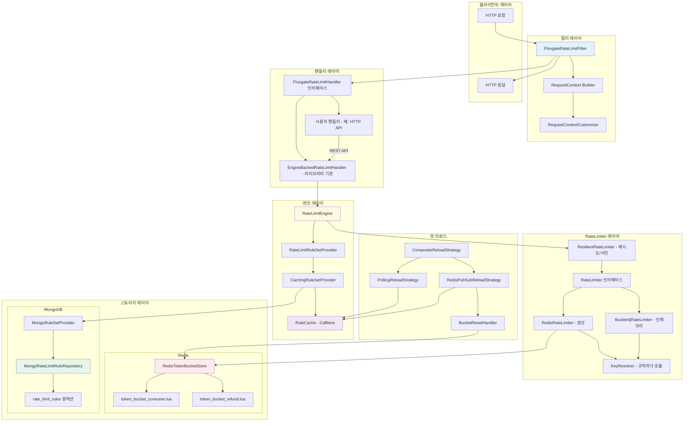

# FluxGate 아키텍처 Deep Dive

이 문서는 FluxGate의 상세 아키텍처를 **실제 소스코드**와 함께 설명합니다.

---

## 목차

1. [전체 흐름 개요](#1-전체-흐름-개요)
2. [Filter Layer: 요청 가로채기](#2-filter-layer-요청-가로채기)
3. [Handler Layer: Rate Limiting 조율](#3-handler-layer-rate-limiting-조율)
4. [Engine Layer: 룰셋 해석과 키 해석](#4-engine-layer-룰셋-해석과-키-해석)
5. [RateLimiter Layer: 토큰 버킷 실행](#5-ratelimiter-layer-토큰-버킷-실행)
6. [Storage Layer: Redis와 MongoDB](#6-storage-layer-redis와-mongodb)
7. [Reload Layer: 핫 리로드](#7-reload-layer-핫-리로드)

---

## 1. 전체 흐름 개요


```mermaid
flowchart TB
    subgraph Client["클라이언트 레이어"]
        REQ[HTTP 요청]
        RES[HTTP 응답]
    end

    subgraph Filter["필터 레이어"]
        FLT[FluxgateRateLimitFilter]
        REQ_CTX[RequestContext Builder]
        CUST[RequestContextCustomizer]
    end

    subgraph Handler["핸들러 레이어"]
        direction TB
        HI[FluxgateRateLimitHandler 인터페이스]
        EBH[EngineBackedRateLimitHandler - 라이브러리 기본]
        HH[사용자 핸들러 - 예: HTTP API]
    end

    subgraph Engine["엔진 레이어"]
        ENG[RateLimitEngine]
        PROV[RateLimitRuleSetProvider]
        CPROV[CachingRuleSetProvider]
        CACHE[RuleCache - Caffeine]
    end

    subgraph RateLimiter["RateLimiter 레이어"]
        RES_RL[ResilientRateLimiter - 재시도/서킷]
        RL[RateLimiter 인터페이스]
        B4J[Bucket4jRateLimiter - 인메모리]
        RRL[RedisRateLimiter - 분산]
        KEY[KeyResolver - 규칙마다 호출]
    end

    subgraph Storage["스토리지 레이어"]
        subgraph Redis["Redis"]
            TBS[RedisTokenBucketStore]
            LUA[token_bucket_consume.lua]
            REFUND[token_bucket_refund.lua]
        end
        subgraph MongoDB["MongoDB"]
            MPROV[MongoRuleSetProvider]
            REPO[MongoRateLimitRuleRepository]
            COLL[rate_limit_rules 컬렉션]
        end
    end

    subgraph Reload["핫 리로드"]
        COMP[CompositeReloadStrategy]
        POLL[PollingReloadStrategy]
        PUBSUB[RedisPubSubReloadStrategy]
        RESET[BucketResetHandler]
    end

    REQ --> FLT
    FLT --> REQ_CTX
    REQ_CTX --> CUST
    FLT --> HI
    HI --> EBH & HH
    EBH --> ENG
    HH -->|REST API| EBH
    ENG --> PROV
    PROV --> CPROV
    CPROV --> CACHE
    CPROV --> MPROV
    MPROV --> REPO
    ENG --> RES_RL
    RES_RL --> RL
    RL --> B4J & RRL
    RRL --> KEY
    B4J --> KEY
    RRL --> TBS
    TBS --> LUA & REFUND
    REPO --> COLL
    COMP --> POLL & PUBSUB
    POLL --> CACHE
    PUBSUB --> CACHE
    PUBSUB --> RESET
    RESET --> TBS
    FLT --> RES

    style FLT fill:#e3f2fd
    style ENG fill:#fff8e1
    style TBS fill:#ffebee
    style REPO fill:#e8f5e9
    style CACHE fill:#f3e5f5
```

---

## 2. Filter Layer: 요청 가로채기

### 2.1 FluxgateRateLimitFilter

HTTP 요청을 가로채고 Rate Limiting을 적용하는 진입점입니다.

```
📁 fluxgate-spring-boot3-starter/src/main/java/org/fluxgate/spring/filter/
└── FluxgateRateLimitFilter.java
```

```java
// FluxgateRateLimitFilter.java - 실제 코드 (doFilterInternal, 필드는 요약)
public class FluxgateRateLimitFilter extends OncePerRequestFilter {

  // 주요 협력자 (생성자 주입)
  private final FluxgateRateLimitHandler handler;     // → HI
  private final RequestContextFactory contextFactory; // → CTX (커스터마이저 적용 포함)
  private final RateLimitHeaderWriter headerWriter;
  private final RateLimitResponseWriter responseWriter;
  // ...


  @Override
  protected void doFilterInternal(
      HttpServletRequest request, HttpServletResponse response, FilterChain filterChain)
      throws ServletException, IOException {

    // M28/H-4: preserve MDC entries put in place by filters that ran before this one.
    Map<String, String> previousMdc = MDC.getCopyOfContextMap();
    long startTimeMs = System.currentTimeMillis();

    try {
      String path = RequestPathResolver.resolve(request);
      populateRequestMdc(request, path);

      if (shouldExclude(path)) {
        log.debug("Path excluded from rate limiting: {}", path);
        filterChain.doFilter(request, response);
        return;
      }

      if (!shouldInclude(path)) {
        log.debug("Path not included in rate limiting: {}", path);
        filterChain.doFilter(request, response);
        return;
      }

      if (!StringUtils.hasText(ruleSetId)) {
        if (denyWhenRuleMissing) {
          logMissingRuleSetId("rejecting request");
          rejectUnavailable(
              request, response, RateLimiterUnavailableException.UNKNOWN_RETRY_AFTER, startTimeMs);
        } else {
          logMissingRuleSetId("skipping rate limiting");
          filterChain.doFilter(request, response);
        }
        return;
      }

      RequestContext context = contextFactory.create(request, path);
      putIdentityMdc(context.getUserId(), context.getApiKey());
      Decision decision = decide(context, resolvePermits(request));

      // C2/C-1: the chain runs exactly once, outside the rate limiter's try/catch, so an exception
      // thrown by the application propagates instead of triggering a replay.
      if (decision.unavailable) {
        rejectUnavailable(request, response, decision.retryAfterMillis, startTimeMs);
        recordDuration(path, request.getMethod(), startTimeMs);
      } else if (decision.costExceeded != null) {
        rejectCostExceeded(request, response, decision.costExceeded, startTimeMs);
        recordDuration(path, request.getMethod(), startTimeMs);
      } else if (decision.allowed) {
        headerWriter.write(response, decision.result);
        filterChain.doFilter(request, response);
        MDC.put(MdcKeys.STATUS_CODE, String.valueOf(response.getStatus()));
        MDC.put(MdcKeys.DURATION_MS, String.valueOf(System.currentTimeMillis() - startTimeMs));
        log.debug("Request completed");
        recordDuration(path, request.getMethod(), startTimeMs);
      } else {
        reject(request, response, decision.result, startTimeMs);
        recordDuration(path, request.getMethod(), startTimeMs);
      }
    } finally {
      restoreMdc(previousMdc);
    }
  }
}
```

**흐름 설명:**

```
HTTP 요청
    ↓
FluxgateRateLimitFilter.doFilterInternal()
    ↓  (제외/포함 경로, ruleSetId 미설정 처리)
contextFactory.create(request, path)  ───────┐
    │                                         │
    ├─→ RequestContext.builder()              │ REQ_CTX
    │       .clientIp(...)  ← ClientIpExtractor (trusted-proxies)
    │       .userId(...) / .apiKey(...)  ← IdentitySource (principal / header)
    │       .endpoint("/api/users")           │
    │       .method("GET")                    │
    │                                         │
    └─→ contextCustomizer.customize(builder, request) ← CUST
            │
            ├─→ 헤더에서 X-Tenant-Id 추출
            ├─→ Cloudflare IP 재정의
            └─→ 커스텀 속성 추가
    ↓
decide(context, permits) → handler.tryConsume(...)
    ↓
allowed → 헤더 + 체인 / rejected·costExceeded → 429 / unavailable → 503
```

---

### 2.2 RequestContext

요청에 대한 모든 메타데이터를 담는 불변 객체입니다.

```
📁 fluxgate-core/src/main/java/org/fluxgate/core/context/
└── RequestContext.java
```

```java
// RequestContext.java - 구조 요약 (접근자는 한 줄로 줄이고 Javadoc은 생략)
public final class RequestContext {

    private final String clientIp;    // 클라이언트 IP
    private final String userId;      // 사용자 ID (선택)
    private final String apiKey;      // API 키 (선택)
    private final String endpoint;    // 요청 경로: /api/users/123
    private final String method;      // HTTP 메서드: GET, POST, ...

    /** HTTP 요청 헤더 (예: User-Agent, Referer, X-Request-Id) */
    private final Map<String, String> headers;

    /** 사용자 정의 속성 */
    private final Map<String, Object> attributes;

    private RequestContext(Builder builder) {
        this.clientIp = builder.clientIp;
        this.userId = builder.userId;
        this.apiKey = builder.apiKey;
        this.endpoint = builder.endpoint;
        this.method = builder.method;
        Map<String, String> headerCopy = newHeaderMap();
        headerCopy.putAll(builder.headers);
        this.headers = Collections.unmodifiableMap(headerCopy);
        this.attributes = Collections.unmodifiableMap(new HashMap<>(builder.attributes));
    }

    /** Header names are case-insensitive; {@code CASE_INSENSITIVE_ORDER} is locale-independent. */
    private static Map<String, String> newHeaderMap() {
        return new TreeMap<>(String.CASE_INSENSITIVE_ORDER);
    }

    public static Builder builder() {
        return new Builder();
    }

    public static final class Builder {
        private String clientIp;
        private String userId;
        private String apiKey;
        private String endpoint;
        private String method;
        private final Map<String, String> headers = newHeaderMap();
        private final Map<String, Object> attributes = new HashMap<>();

        public Builder clientIp(String clientIp) { this.clientIp = clientIp; return this; }
        public Builder userId(String userId) { this.userId = userId; return this; }
        public Builder apiKey(String apiKey) { this.apiKey = apiKey; return this; }
        public Builder endpoint(String endpoint) { this.endpoint = endpoint; return this; }
        public Builder method(String method) { this.method = method; return this; }

        public Builder header(String name, String value) { ... }
        public Builder headers(Map<String, String> headers) { ... }

        // Adds a custom attribute.
        public Builder attribute(String key, Object value) {
            this.attributes.put(key, value);
            return this;
        }

        // Adds multiple custom attributes at once.
        public Builder attributes(Map<String, Object> attributes) {
            if (attributes != null) {
                this.attributes.putAll(attributes);
            }
            return this;
        }

        // =========================================================================
        // Getters - for use in RequestContextCustomizer
        // =========================================================================

        public String getClientIp() { return clientIp; }
        public String getUserId() { return userId; }
        public String getApiKey() { return apiKey; }
        public String getEndpoint() { return endpoint; }
        public String getMethod() { return method; }
        public Map<String, String> getHeaders() { return headers; }
        public String getHeader(String name) { ... }
        public Object getAttribute(String key) { ... }

        public RequestContext build() {
            return new RequestContext(this);
        }
    }
}
```

---

### 2.3 RequestContextCustomizer

사용자가 구현하여 컨텍스트를 커스터마이징할 수 있는 인터페이스입니다.

```
📁 fluxgate-spring-boot3-starter/src/main/java/org/fluxgate/spring/filter/
└── RequestContextCustomizer.java
```

```java
// RequestContextCustomizer.java
@FunctionalInterface
public interface RequestContextCustomizer {

    /**
     * RequestContext 빌더를 커스터마이징합니다.
     *
     * @param builder 기본값이 채워진 빌더
     * @param request HTTP 요청
     * @return 커스터마이징된 빌더
     */
    RequestContext.Builder customize(
            RequestContext.Builder builder,
            HttpServletRequest request);

    // 기본 no-op 커스터마이저
    static RequestContextCustomizer identity() {
        return (builder, request) -> builder;
    }
}
```

---

#### 💡 잠깐! @FunctionalInterface가 뭔가요?

`RequestContextCustomizer` 코드를 보면 **구현부가 없습니다.** `customize()` 메서드의 본문이 없죠. 이게 정상입니다!

**인터페이스는 "계약서"입니다.** "이런 형태의 메서드를 구현해라"라고 약속만 정의한 것이지, 실제 동작은 **사용하는 쪽에서 구현**합니다.

`@FunctionalInterface`는 **추상 메서드가 딱 1개인 인터페이스**를 의미합니다. 이런 인터페이스는 **람다 표현식**으로 간결하게 구현할 수 있습니다.

---

#### 📝 세 가지 구현 방식 비교

같은 기능을 구현하는 세 가지 방법을 보여드립니다. **모두 동일하게 동작합니다.**

**방식 1: 람다 표현식 (가장 간결)**

```java
@Bean
public RequestContextCustomizer requestContextCustomizer() {
    return (builder, request) -> {
        String userId = request.getHeader("X-User-Id");
        if (userId != null) {
            builder.userId(userId);
        }
        return builder;
    };
}
```

- `(builder, request) -> { ... }` 부분이 `customize()` 메서드의 구현부입니다
- 파라미터 타입은 컴파일러가 추론합니다

**방식 2: 익명 클래스 (람다의 원래 모습)**

```java
@Bean
public RequestContextCustomizer requestContextCustomizer() {
    return new RequestContextCustomizer() {
        @Override
        public RequestContext.Builder customize(
                RequestContext.Builder builder,
                HttpServletRequest request) {
            
            String userId = request.getHeader("X-User-Id");
            if (userId != null) {
                builder.userId(userId);
            }
            return builder;
        }
    };
}
```

- 방식 1의 람다는 이 익명 클래스를 **축약한 문법**입니다
- Java 8 이전에는 이렇게 작성했습니다

**방식 3: 별도 클래스로 구현 (복잡한 로직에 적합)**

```java
// 별도 파일: TenantContextCustomizer.java
@Component
public class TenantContextCustomizer implements RequestContextCustomizer {

    private final JwtParser jwtParser;  // 의존성 주입 가능
    
    public TenantContextCustomizer(JwtParser jwtParser) {
        this.jwtParser = jwtParser;
    }

    @Override
    public RequestContext.Builder customize(
            RequestContext.Builder builder,
            HttpServletRequest request) {
        
        String userId = request.getHeader("X-User-Id");
        if (userId != null) {
            builder.userId(userId);
        }
        
        // JWT 파싱 같은 복잡한 로직
        String token = request.getHeader("Authorization");
        if (token != null) {
            Claims claims = jwtParser.parse(token);
            builder.attribute("role", claims.getRole());
        }
        
        return builder;
    }
}
```

- 복잡한 로직이나 의존성 주입이 필요할 때 사용
- 테스트하기 쉬움

---

#### 🔄 언제 어떤 방식을 쓰나요?

| 상황 | 추천 방식 |
|------|----------|
| 간단한 헤더 추출 (1~5줄) | 람다 표현식 |
| 여러 곳에서 재사용 | 별도 클래스 |
| 다른 Bean 주입 필요 (JwtParser 등) | 별도 클래스 |
| 단위 테스트 작성 필요 | 별도 클래스 |

---

#### 🎯 그래서 이게 어떻게 동작하나요?

전체 흐름을 다시 정리하면:

```
1. 당신이 작성한 코드 (람다든 클래스든)
   ┌────────────────────────────────────────┐
   │ return (builder, request) -> {        │
   │     builder.userId(request.getHeader  │
   │         ("X-User-Id"));               │
   │     return builder;                   │
   │ };                                    │
   └────────────────────────────────────────┘
                    │
                    ▼
2. Spring이 Bean으로 등록
                    │
                    ▼
3. FluxgateRateLimitFilter가 주입받음
   ┌────────────────────────────────────────┐
   │ public class FluxgateRateLimitFilter { │
   │     private final RequestContext      │
   │         Customizer customizer; // 여기!│
   │ }                                     │
   └────────────────────────────────────────┘
                    │
                    ▼
4. HTTP 요청이 들어올 때마다 호출됨
   ┌────────────────────────────────────────┐
   │ builder = customizer.customize(       │
   │     builder, request);  // 당신 코드 실행│
   └────────────────────────────────────────┘
```

---

#### 💬 Strategy 패턴과 뭐가 다른가요?

**거의 같습니다!** `@FunctionalInterface`는 Strategy 패턴을 간결하게 구현하는 방법입니다.

```
전통적인 Strategy 패턴:
- 인터페이스 정의
- 구현 클래스 여러 개 작성
- 클래스 파일이 늘어남

@FunctionalInterface + 람다:
- 인터페이스 정의
- 람다로 즉석에서 구현
- 코드가 간결해짐
```

본질은 같고, **표현 방식만 간결해진 것**입니다.

---

**사용자 구현 예시 (전체 코드):**

```java
// 사용자가 구현하는 커스터마이저
@Configuration
public class RateLimitConfig {

  /**
   * RequestContext 커스터마이저를 Bean으로 등록합니다.
   * 
   * 이 Bean은 FluxgateRateLimitFilter에 자동 주입되어
   * 모든 HTTP 요청마다 호출됩니다.
   */
  @Bean
  public RequestContextCustomizer requestContextCustomizer() {
    return (builder, request) -> {
      
      // 1. 테넌트 ID 추출
      String tenantId = request.getHeader("X-Tenant-Id");
      if (tenantId != null) {
        builder.attribute("tenantId", tenantId);
      }

      // 2. Cloudflare 뒤에 있는 경우 실제 IP 추출
      String cfIp = request.getHeader("CF-Connecting-IP");
      if (cfIp != null) {
        builder.clientIp(cfIp);
      }

      // 3. 사용자 ID 추출
      String userId = request.getHeader("X-User-Id");
      if (userId != null) {
        builder.userId(userId);
      }

      return builder;
    };
  }
}
```

---

## 3. Handler Layer: Rate Limiting 조율

### 3.1 FluxgateRateLimitHandler 인터페이스

Rate Limiting의 진입점입니다. 필터와 애스펙트는 이 인터페이스 **하나만** 알고 있습니다.

```
📁 fluxgate-core/src/main/java/org/fluxgate/core/handler/
└── FluxgateRateLimitHandler.java
```

```java
// FluxgateRateLimitHandler.java
public interface FluxgateRateLimitHandler {

  /**
   * @param context 요청 컨텍스트 (IP, userId, endpoint 등)
   * @param ruleSetId 적용할 룰셋 ID
   */
  RateLimitResponse tryConsume(RequestContext context, String ruleSetId);

  /** 가중 요청(permits > 1). 기본 구현은 permits == 1일 때만 위임하고 나머지는 거부합니다. */
  default RateLimitResponse tryConsume(RequestContext context, String ruleSetId, long permits) {
    if (permits == 1) {
      return tryConsume(context, ruleSetId);
    }
    throw new UnsupportedOperationException(
        "Weighted permits are not supported by " + getClass().getName());
  }

  /** 핸들러가 전혀 없을 때 쓰이는 최후 폴백. 모두 허용합니다. */
  FluxgateRateLimitHandler ALLOW_ALL = (context, ruleSetId) -> RateLimitResponse.allowed(-1, 0);
}
```

두 가지를 짚어둡니다.

- `@FunctionalInterface`로 선언되어 있지 않지만 추상 메서드가 하나뿐이라 람다로도 구현 가능합니다.
  `ALLOW_ALL` 상수 자체가 그 예입니다.
- 가중 요청(`fluxgate.ratelimit.cost-header`)을 지원하려면 **3-인자 메서드를 재정의**해야 합니다.
  재정의하지 않은 핸들러에 `permits > 1`이 들어오면 `UnsupportedOperationException`이 발생합니다.

---

### 3.2 EngineBackedRateLimitHandler (라이브러리 기본 구현)

스타터가 자동 등록하는 기본 핸들러입니다. `RateLimiter` 빈과 `RateLimitRuleSetProvider` 빈이
있으면 등록되므로, `@EnableFluxgateFilter` + Redis + MongoDB 조합에서는 **사용자 코드가 0줄**입니다.

```
📁 fluxgate-spring-boot3-starter/src/main/java/org/fluxgate/spring/handler/
└── EngineBackedRateLimitHandler.java
```

```java
// EngineBackedRateLimitHandler.java
public class EngineBackedRateLimitHandler implements FluxgateRateLimitHandler {

  private static final Logger log = LoggerFactory.getLogger(EngineBackedRateLimitHandler.class);

  /** Key prefix {@code RateLimitEngine} uses for an unknown rule set under DENY. */
  private static final String MISSING_RULE_SET_PREFIX = "missing-rule-set:";

  private final RateLimitEngine engine;
  private final Set<String> warnedRuleSetIds = ConcurrentHashMap.newKeySet();

  /**
   * Creates a handler delegating to the given engine.
   *
   * @param engine the engine that resolves rule sets and consumes permits
   */
  public EngineBackedRateLimitHandler(RateLimitEngine engine) {
    this.engine = Objects.requireNonNull(engine, "engine must not be null");
    log.info("EngineBackedRateLimitHandler initialized");
  }

  @Override
  public RateLimitResponse tryConsume(RequestContext context, String ruleSetId) {
    return tryConsume(context, ruleSetId, 1L);
  }

  @Override
  public RateLimitResponse tryConsume(RequestContext context, String ruleSetId, long permits) {
    RateLimitResult result;
    try {
      result = engine.check(ruleSetId, context, permits);
    } catch (MissingRateLimitKeyException e) {
      logConfigurationProblem(
          ruleSetId, "no rate limit key could be resolved, rejecting the request", e);
      return RateLimitResponse.rejected(0L);
    } catch (InvalidRuleConfigException e) {
      // A request cost no band can hold is the client's error (HTTP 429), not a broken rule set.
      PermitsExceedCapacityException tooCostly = PermitsExceedCapacityException.from(e, permits);
      if (tooCostly != null) {
        log.debug("Rule set '{}': {}", ruleSetId, tooCostly.getMessage());
        throw tooCostly;
      }
      logConfigurationProblem(ruleSetId, "the rule configuration is invalid", e);
      throw new RateLimiterUnavailableException(
          "Rule set '" + ruleSetId + "' has an invalid configuration",
          RateLimiterUnavailableException.UNKNOWN_RETRY_AFTER,
          e);
    }
    if (!result.isAllowed() && isMissingRuleSet(result)) {
      logConfigurationProblem(
          ruleSetId, "no such rule set (missing-rule-behavior=DENY), rejecting the request", null);
      throw new RateLimiterUnavailableException("Rule set '" + ruleSetId + "' is not configured");
    }
    return RateLimitResponse.from(result);
  }

  /** The engine reports an unknown rule set under DENY with this synthetic key. */
  private static boolean isMissingRuleSet(RateLimitResult result) {
    RateLimitKey key = result.getKey();
    return key != null && key.value() != null && key.value().startsWith(MISSING_RULE_SET_PREFIX);
  }

  /** Logs a configuration problem at WARN the first time it is seen, then at DEBUG. */
  private void logConfigurationProblem(String ruleSetId, String what, RuntimeException e) {
    String detail = e != null ? e.getMessage() : "";
    if (warnedRuleSetIds.add(ruleSetId)) {
      log.warn("Rule set '{}': {}: {}", ruleSetId, what, detail);
    } else {
      log.debug("Rule set '{}': {}: {}", ruleSetId, what, detail);
    }
  }
}
```

설계 포인트:

- **메트릭을 기록하지 않습니다.** 메트릭은 `RateLimitRuleSet.getMetricsRecorder()`(코어)와
  `MicrometerMetricsRecorder`(스타터)가 담당합니다. 핸들러는 변환과 예외 처리만 합니다.
- **오류의 주인에 따라 응답을 나눕니다.** `missing-key-behavior=REJECT`에서 스코프 값이 없으면
  (`MissingRateLimitKeyException`) 대기 시간 0의 거부(429)를 반환합니다. 요청 비용이 어떤 대역의
  용량보다 크면 `PermitsExceedCapacityException`(클라이언트 오류, 429)을 던집니다. 그 밖에 규칙을 만들 수
  없거나(`InvalidRuleConfigException`) `missing-rule-behavior=DENY`에서 룰셋이 없으면 한도 초과가 아니라
  설정 문제이므로 `RateLimiterUnavailableException`을 던지고, 필터와 애스펙트가 503으로 답합니다.

---

### 3.3 자체 핸들러: HTTP API 모드

중앙 Rate Limit 서비스를 HTTP로 호출하고 싶다면 `FluxgateRateLimitHandler`를 직접 구현합니다.
FluxGate는 HTTP 핸들러를 기본 제공하지 **않습니다**. 샘플이 하나 들어 있습니다.

```
📁 fluxgate-samples/fluxgate-sample-filter/src/main/java/org/fluxgate/sample/filter/handler/
└── HttpRateLimitHandler.java
```

```java
// HttpRateLimitHandler.java (샘플 요약 - 로그 생략, if/else를 삼항식으로 줄임)
@Component
public class HttpRateLimitHandler implements FluxgateRateLimitHandler {

  private final RestClient restClient;
  private final String apiUrl;

  public HttpRateLimitHandler(@Value("${fluxgate.api.url:http://localhost:8080}") String apiUrl) {
    this.apiUrl = apiUrl;
    this.restClient = RestClient.builder().baseUrl(apiUrl).build();
  }

  @Override
  public RateLimitResponse tryConsume(RequestContext context, String ruleSetId) {
    try {
      RateLimitApiResponse response =
          restClient
              .post()
              .uri("/api/ratelimit/check")
              .contentType(MediaType.APPLICATION_JSON)
              .body(Map.of("ruleSetId", ruleSetId, "clientIp", /* ... */ ""))
              .retrieve()
              .body(RateLimitApiResponse.class);

      if (response == null) {
        return RateLimitResponse.allowed(-1, 0);
      }
      return response.allowed
          ? RateLimitResponse.allowed(response.remaining, 0)
          : RateLimitResponse.rejected(response.retryAfterMs);

    } catch (Exception e) {
      // 샘플은 fail-open입니다. 라이브러리 기본값(fail-closed)과 다르다는 점에 주의하세요.
      return RateLimitResponse.allowed(-1, 0);
    }
  }
}
```

```java
@SpringBootApplication
@EnableFluxgateFilter(handler = HttpRateLimitHandler.class)
public class ClientApplication { }
```

**사용 시나리오:**

```
┌─────────────────┐         ┌─────────────────────────┐
│  API Gateway    │  HTTP   │  Rate Limit Service     │
│  (Port 8083)    │ ──────→ │  (Port 8082)            │
│                 │         │                         │
│  HttpRateLimit  │         │  EngineBackedRateLimit  │
│  Handler (샘플)  │         │  Handler + Redis        │
└─────────────────┘         └─────────────────────────┘
```

`fluxgate.api.url`은 **이 샘플 핸들러가 읽는 프로퍼티**이며 `FluxgateProperties`에는 없습니다.

---

### 3.4 RateLimitResponse

핸들러가 반환하는 값 객체입니다. 필터와 애스펙트가 응답 헤더를 만드는 데 필요한 모든 것이 여기
담깁니다.

```
📁 fluxgate-core/src/main/java/org/fluxgate/core/handler/
└── RateLimitResponse.java
```

| 필드 | 의미 | `-1`의 뜻 |
|------|------|-----------|
| `allowed` | 허용 여부 | — |
| `remainingTokens` | 결정을 만든 대역의 남은 토큰 | 알 수 없음 → 헤더 생략 |
| `retryAfterMillis` | 재시도까지 남은 밀리초 | 알 수 없음 |
| `onLimitExceedPolicy` | 초과 시 정책 (`REJECT_REQUEST` / `WAIT_FOR_REFILL`) | — |
| `limit` | 결정을 만든 대역의 용량 | 알 수 없음 → 헤더 생략 |
| `resetTimeMillis` | 결정을 만든 대역의 리셋 epoch 밀리초 (TOKEN_BUCKET은 다시 가득 찰 때, SLIDING_WINDOW는 세어진 요청이 모두 윈도를 떠날 때, FIXED_WINDOW는 윈도 끝) | 알 수 없음 → 헤더 생략 |
| `windowSeconds` | `limit`이 속한 윈도 길이 (`RateLimit-Policy`용) | 알 수 없음 → 헤더 생략 |
| `bandLabel` | 결정을 만든 대역의 키 라벨 | — |

```java
// 코어 결과 → 핸들러 응답. 나노초 → 밀리초 변환은 항상 올림입니다.
public static RateLimitResponse from(RateLimitResult result) { ... }
```

올림이 중요한 이유: 0.5ms를 내림하면 `Retry-After: 0`이 되어 클라이언트가 바로 재시도하는
busy loop가 생깁니다. 헤더 계산은 `RateLimitHeaderWriter`가 한 번 더 `max(1, ceil(...))`로
막습니다.

---

## 4. Engine Layer: 룰셋 해석과 키 해석

> **참고.** 0.4부터 규칙마다 `RuleMatcher`(`methods`, `pathPatterns`, `excludePathPatterns`,
> `headerEquals`, `headerPresent`)와 `priority`가 있습니다. 엔진은 룰셋 ID로 룰셋을 찾은 뒤
> `RateLimitRuleSet#getMatchingRules`로 매처가 요청을 받아들이는 **활성 규칙만** 골라 우선순위
> 내림차순(같으면 id 오름차순)으로 `RateLimiter`에 넘깁니다. 매처가 비어 있는 규칙은 모든 요청에
> 일치하므로, 매처를 쓰지 않는 0.3.x 룰셋은 예전처럼 모든 활성 규칙이 평가됩니다. 아래 코드는 룰셋 조회
> 흐름의 요지이며, 매칭은 `getMatchingRules`가 담당합니다.

### 4.1 RateLimitEngine

```
📁 fluxgate-core/src/main/java/org/fluxgate/core/engine/
└── RateLimitEngine.java
```

```java
// RateLimitEngine.java (요지 - 접근 제어 분기는 축약)
public final class RateLimitEngine {

  private static final String MISSING_RULE_SET_KEY_PREFIX = "missing-rule-set:";

  /** 룰셋을 찾지 못했을 때의 전략. 스타터가 missing-rule-behavior를 여기에 배선합니다. */
  public enum OnMissingRuleSetStrategy {
    THROW,  // IllegalArgumentException
    ALLOW,  // fail-open: 규칙 정보 없는 allow
    DENY    // fail-closed: nanosToWait = 0인 reject
  }

  private final RateLimitRuleSetProvider ruleSetProvider;  // ← PROV
  private final RateLimiter rateLimiter;                   // ← RL
  private final OnMissingRuleSetStrategy onMissingRuleSetStrategy;
  private final PathPatternMatcher pathMatcher;            // 기본값 SimpleAntPathMatcher.INSTANCE

  public RateLimitResult check(String ruleSetId, RequestContext context) {
    return check(ruleSetId, context, 1L);
  }

  public RateLimitResult check(String ruleSetId, RequestContext context, long permits) {
    Objects.requireNonNull(ruleSetId, "ruleSetId must not be null");
    Objects.requireNonNull(context, "context must not be null");

    // 1️⃣ 룰셋 조회 (ID로) ← PROV
    Optional<RateLimitRuleSet> optionalRuleSet = ruleSetProvider.findById(ruleSetId);
    if (!optionalRuleSet.isPresent()) {
      return onMissingRuleSet(ruleSetId);
    }
    RateLimitRuleSet ruleSet = optionalRuleSet.get();

    RateLimitRuleSet ruleSet = optionalRuleSet.get();

    // 2️⃣ 접근 제어: DENY면 denied: 합성 키로 거부, ALLOW_BYPASS면 토큰 소비 없이 허용
    AccessControl accessControl = ruleSet.getAccessControl();
    if (!accessControl.isEmpty()) {
      // ... 키 목록이 있을 때만 키를 해석해 evaluate(clientIp, primaryKey, resolvedKeys)
    }

    // 3️⃣ 토큰 소비를 RateLimiter에 위임 ← RL
    //    키 해석은 RateLimiter가 ruleSet.getKeyResolver()로 규칙마다 수행하고,
    //    적용 규칙은 엔진의 pathMatcher로 고릅니다(getMatchingRules).
    RateLimitResult result = rateLimiter.tryConsume(context, ruleSet, permits, pathMatcher);
    if (result == null) {
      // 계약 위반은 호출자에게 null을 흘리지 않고 여기서 터뜨립니다.
      throw new IllegalStateException(
          "RateLimiter " + rateLimiter.getClass().getName()
              + " returned null for ruleSetId: " + ruleSetId);
    }
    return result;
  }

  private RateLimitResult onMissingRuleSet(String ruleSetId) {
    switch (onMissingRuleSetStrategy) {
      case THROW:
        throw new IllegalArgumentException("Unknown ruleSetId: " + ruleSetId);
      case DENY:
        // fail-closed 분기: RateLimiter를 아예 호출하지 않습니다.
        return RateLimitResult.builder(RateLimitKey.of(MISSING_RULE_SET_KEY_PREFIX, ruleSetId))
            .allowed(false)
            .remainingTokens(0L)
            .nanosToWaitForRefill(0L)
            .build();
      case ALLOW:
      default:
        return RateLimitResult.allowedWithoutRule();
    }
  }
}
```

세부 사항:

- `check()`는 **절대 null을 반환하지 않습니다.** 룰셋 부재는 전략으로, `RateLimiter`의 계약 위반은
  `IllegalStateException`으로 처리합니다.
- `DENY` 경로가 만드는 합성 키 `missing-rule-set:<id>`는 메트릭과 로그에서 "왜 거부되었는지"를
  추적할 수 있게 하려는 것입니다. Redis 버킷이 만들어지지는 않습니다.
- 빌더는 `ruleSetProvider`와 `rateLimiter`를 필수로 요구하며, `onMissingRuleSetStrategy` 기본값은
  `THROW`입니다. 스타터는 `fluxgate.ratelimit.missing-rule-behavior`를 `ALLOW`/`DENY`로 배선합니다.

---

### 4.2 RateLimitRuleSetProvider와 RuleCache

```
📁 fluxgate-core/src/main/java/org/fluxgate/core/spi/
└── RateLimitRuleSetProvider.java

📁 fluxgate-core/src/main/java/org/fluxgate/core/reload/
├── RuleCache.java
└── CachingRuleSetProvider.java

📁 fluxgate-spring-boot3-starter/src/main/java/org/fluxgate/spring/reload/cache/
└── CaffeineRuleCache.java
```

```java
// RateLimitRuleSetProvider.java (SPI. 패키지는 org.fluxgate.core.spi 입니다)
public interface RateLimitRuleSetProvider {
  Optional<RateLimitRuleSet> findById(String ruleSetId);
}
```

구현체는 MongoDB(`org.fluxgate.adapter.mongo.rule.MongoRuleSetProvider`), 애플리케이션 코드의
람다, 또는 아래의 캐싱 데코레이터입니다.

```java
// CachingRuleSetProvider.java
public class CachingRuleSetProvider implements RateLimitRuleSetProvider, RuleReloadListener {

  private final RateLimitRuleSetProvider delegate;
  private final RuleCache cache;

  @Override
  public Optional<RateLimitRuleSet> findById(String ruleSetId) {
    Objects.requireNonNull(ruleSetId, "ruleSetId must not be null");

    // get/load/put을 캐시에 위임합니다. 그래야 캐시 구현이 원자적으로 로드할 수 있습니다.
    return cache.getOrLoad(
        ruleSetId,
        id -> {
          log.debug("Cache miss for ruleSetId: {}, loading from delegate", id);
          return delegate.findById(id);
        });
  }

  @Override
  public void onReload(RuleReloadEvent event) {
    if (event.isFullReload()) {
      cache.invalidateAll();
    } else {
      cache.invalidate(event.getRuleSetId());
    }
  }
}
```

```java
// RuleCache.java (인터페이스) — Optional 기반입니다. null을 돌려주지 않습니다.
public interface RuleCache {
  Optional<RateLimitRuleSet> get(String ruleSetId);

  /** 기본 구현은 get → load → put. 동시 미스가 각각 로더를 실행할 수 있습니다. */
  default Optional<RateLimitRuleSet> getOrLoad(
      String ruleSetId, Function<String, Optional<RateLimitRuleSet>> loader) { ... }

  void put(String ruleSetId, RateLimitRuleSet ruleSet);
  void invalidate(String ruleSetId);
  void invalidateAll();
  Set<String> getCachedRuleSetIds();
  int size();
  default Optional<CacheStats> getStats() { return Optional.empty(); }
}
```

```java
// CaffeineRuleCache.java — getOrLoad를 재정의해 스탬피드와 네거티브 캐시를 처리합니다.
public CaffeineRuleCache(Duration ttl, int maxSize) { ... }
public CaffeineRuleCache(Duration ttl, int maxSize, Duration negativeTtl) { ... }

@Override
public Optional<RateLimitRuleSet> getOrLoad(
    String ruleSetId, Function<String, Optional<RateLimitRuleSet>> loader) {

  RateLimitRuleSet cached = cache.getIfPresent(ruleSetId);
  if (cached != null) {
    return Optional.of(cached);
  }

  // 존재하지 않는 룰셋을 매 요청마다 MongoDB에 물어보지 않도록 미스도 캐시합니다.
  if (missCache != null && missCache.getIfPresent(ruleSetId) != null) {
    return Optional.empty();
  }

  // Caffeine은 매핑 함수 실행 동안 키 단위 락을 유지하므로, 같은 ID에 대한 동시 미스가
  // 하나의 로드로 합쳐집니다(캐시 스탬피드 방지). null을 반환하면 매핑이 기록되지 않습니다.
  RateLimitRuleSet loaded = cache.get(ruleSetId, key -> loader.apply(key).orElse(null));

  if (loaded == null) {
    if (missCache != null) {
      missCache.put(ruleSetId, Boolean.TRUE);
    }
    return Optional.empty();
  }
  return Optional.of(loaded);
}
```

관련 프로퍼티: `fluxgate.reload.cache.ttl`(기본 `5m`), `.max-size`(기본 `1000`),
`.negative-ttl`(기본 `5s`, `0`이면 네거티브 캐시 비활성).

---

### 4.3 KeyResolver

`LimitScope`에 따라 Rate Limit 키를 만듭니다. **인자 순서는 `(context, rule)`**이고, 반환 값은
버킷 키 전체가 아니라 **키 값 한 조각**입니다. 룰셋 ID·규칙 ID·대역 라벨은 `RateLimiter`가 붙입니다.

```
📁 fluxgate-core/src/main/java/org/fluxgate/core/key/
├── KeyResolver.java
├── LimitScopeKeyResolver.java
├── MissingKeyBehavior.java
├── KeyValueSanitizer.java
└── RateLimitKey.java
```

```java
// KeyResolver.java (인터페이스)
public interface KeyResolver {
  RateLimitKey resolve(RequestContext context, RateLimitRule rule);
}
```

```java
// LimitScopeKeyResolver.java (기본 구현)
public class LimitScopeKeyResolver implements KeyResolver {

  private static final String GLOBAL_KEY = "global";
  private static final String UNKNOWN_IP = "unknown";
  private static final String PREFIX_IP = "ip:";
  private static final String PREFIX_USER = "user:";
  private static final String PREFIX_API_KEY = "key:";
  private static final String PREFIX_CUSTOM = "custom:";

  private final MissingKeyBehavior missingKeyBehavior;

  public LimitScopeKeyResolver() {
    this(MissingKeyBehavior.FALLBACK_TO_IP);
  }

  public LimitScopeKeyResolver(MissingKeyBehavior missingKeyBehavior) { ... }

  @Override
  public RateLimitKey resolve(RequestContext context, RateLimitRule rule) {
    LimitScope scope = rule.getScope();
    if (scope == null) {
      scope = LimitScope.PER_IP; // default
    }

    String keyValue;
    switch (scope) {
      case GLOBAL:      keyValue = GLOBAL_KEY; break;
      case PER_IP:      keyValue = resolveClientIp(context, rule, scope); break;
      case PER_USER:    keyValue = resolveUserId(context, rule, scope); break;
      case PER_API_KEY: keyValue = resolveApiKey(context, rule, scope); break;
      case CUSTOM:      keyValue = resolveCustom(context, rule, scope); break;
      default:          keyValue = resolveClientIp(context, rule, scope); break;
    }

    // API 키·사용자 ID는 평문으로 로그에 남기지 않습니다(앞 4자 + ***).
    log.debug("Resolved key for rule {} with scope {}: {}", rule.getId(), scope, mask(keyValue));

    // 값 부분은 이미 새니타이즈됐으므로 다시 인코딩하지 않고 그대로 키로 만듭니다.
    return RateLimitKey.ofSanitized(keyValue);
  }

  private String resolveUserId(RequestContext context, RateLimitRule rule, LimitScope scope) {
    String userId = context != null ? context.getUserId() : null;
    if (userId == null || userId.isEmpty()) {
      if (missingKeyBehavior == MissingKeyBehavior.REJECT) {
        throw new MissingRateLimitKeyException(rule.getId(), scope);
      }
      log.debug("userId is null/empty for PER_USER scope, falling back to clientIp");
      return resolveClientIp(context, rule, scope);  // 폴백 키는 실제 출처인 ip: 접두사를 갖습니다
    }
    return PREFIX_USER + KeyValueSanitizer.sanitize(userId);
  }
}
```

**스코프 접두사가 있는 이유**: 접두사가 없으면 `userId`가 `10.0.0.5`인 사용자와 실제 IP가
`10.0.0.5`인 익명 요청이 같은 버킷을 공유합니다. 폴백 키도 `user:` 대신 `ip:`를 쓰는 이유가 같습니다
— 키는 값의 **실제 출처**를 나타냅니다.

**새니타이즈** (`KeyValueSanitizer`) — 스코프 접두사 뒤의 **값 부분**에만 적용되는 단사 인코딩:

| 원본 값 | 결과 |
|---------|------|
| `[A-Za-z0-9._:@-]`로만 된 256자 이하, `h:`로 시작하지 않음 | 그대로 (`user:alice`) |
| 그 밖의 237자 이하 값 | `h:<제한된 값>:<16 hex>` — 허용되지 않는 문자는 `_`, 끝에 원본 SHA-256 앞 16자리(64비트로 자른 다이제스트). `a+1` → `user:h:a_1:<16 hex>` |
| 더 긴 값 | `h:<64 hex>` (원본 SHA-256 전체). 접두사는 해시 바깥에 남습니다: `user:h:<64 hex>` |

| 성질 | 내용 |
|------|------|
| 단사성 | 서로 다른 원본 값은 같은 키가 되지 않습니다. `a+1`과 `a_1`이 버킷을 공유하지 않습니다 |
| 멱등성 없음 | `h:`로 시작하는 값은 다시 인코딩됩니다. 원본 값을 정확히 한 번만 새니타이즈합니다 |
| 적용 지점 | `LimitScopeKeyResolver`(값만 새니타이즈 후 `RateLimitKey.ofSanitized`), `RateLimitKey.of(prefix, rawValue)`(접두사 유지), `RateLimitKey.of(full)`(문자열 전체) |
| 허용/차단 항목 | 같은 방식으로 정규화하되, 이미 인코딩된 형태(`user:h:...`)는 그대로 둡니다 |

**해석된 키 값:**

| LimitScope | 키 값 예시 |
|------------|-----------|
| `GLOBAL` | `global` |
| `PER_IP` | `ip:192.168.1.100` |
| `PER_USER` | `user:user-123` |
| `PER_API_KEY` | `key:abc123` |
| `CUSTOM` | `custom:tenant-a:user-123` |
| `PER_IP` (IP 없음, 폴백) | `ip:unknown` |

**최종 Redis 버킷 키**는 `RedisRateLimiter`가 여기에 룰셋·규칙·대역을 붙여 만듭니다:

```
fluxgate:bucket:{api-limits:per-ip-rule:ip:192.168.1.100}:100-per-60s
                 └─ ruleSetId ─┘└ ruleId ┘└─ 키 값 ─┘    └ 대역 키 라벨 ┘
                └──────────── 해시 태그 (클러스터 슬롯 고정) ───────────┘
```

`MissingKeyBehavior`:

| 값 | 동작 |
|----|------|
| `FALLBACK_TO_IP` (기본) | 클라이언트 IP로 폴백. 익명 요청이 인증 티어의 쿼터를 물려받으므로 주의 |
| `REJECT` | `MissingRateLimitKeyException`을 던지고, Limiter가 이를 잡아 거부 결과로 변환 |

프로퍼티: `fluxgate.ratelimit.missing-key-behavior`.

---

## 5. RateLimiter Layer: 토큰 버킷 실행

### 5.1 RateLimiter 인터페이스

```
📁 fluxgate-core/src/main/java/org/fluxgate/core/ratelimiter/
└── RateLimiter.java
```

```java
// RateLimiter.java
public interface RateLimiter {

  // 기본 1토큰 소비
  default RateLimitResult tryConsume(RequestContext context, RateLimitRuleSet ruleSet) {
    return tryConsume(context, ruleSet, 1L);
  }

  /**
   * 토큰 소비를 시도합니다.
   *
   * @param context 요청 컨텍스트
   * @param ruleSet 적용할 규칙 세트
   * @param permits 소비할 토큰 수
   * @return Rate Limit 결과
   */
  RateLimitResult tryConsume(RequestContext context, RateLimitRuleSet ruleSet, long permits);

  // 0.4.0: 엔진의 PathPatternMatcher로 적용 규칙(getMatchingRules)을 거르는 오버로드.
  // 기본 구현은 매처를 무시하고 3인자 형태로 위임합니다. RedisRateLimiter·Bucket4jRateLimiter와
  // 스타터의 데코레이터는 이 메서드를 재정의해 매처를 그대로 씁니다.
  default RateLimitResult tryConsume(
      RequestContext context,
      RateLimitRuleSet ruleSet,
      long permits,
      PathPatternMatcher pathMatcher) {
    return tryConsume(context, ruleSet, permits);
  }
}
```

---

### 5.2 Bucket4jRateLimiter

Bucket4j를 사용하는 인메모리 구현입니다. `fluxgate.ratelimit.mode=IN_MEMORY`와
`fluxgate.ratelimit.fallback.mode=IN_MEMORY`가 이것을 사용합니다.

```
📁 fluxgate-core/src/main/java/org/fluxgate/core/ratelimiter/impl/bucket4j/
└── Bucket4jRateLimiter.java
```

```java
// Bucket4jRateLimiter.java (요지)
public class Bucket4jRateLimiter implements RateLimiter {

  public static final long DEFAULT_MAXIMUM_SIZE = 100_000L;
  // 최소 유휴 만료. 가장 긴 대역 윈도우가 더 길면 그 윈도우만큼 유휴여야 축출됩니다.
  public static final Duration DEFAULT_EXPIRE_AFTER_ACCESS = Duration.ofHours(1);

  // 무제한 ConcurrentHashMap이 아니라 상한·버킷별 유휴 만료가 있는 Caffeine 캐시입니다(OOM 방지).
  // 버킷 하나의 단위는 (ruleSetId, ruleId, 대역 정의, 키 값) — 규칙의 모든 대역이 한 버킷의
  // Bucket4j bandwidth로 들어가므로 한 규칙의 대역들은 원자적으로 평가됩니다.
  private final Cache<BucketKey, BucketEntry> buckets;

  @Override
  public RateLimitResult tryConsume(
      RequestContext context, RateLimitRuleSet ruleSet, long permits, PathPatternMatcher matcher) {

    // 경로·메서드·헤더가 매칭된 활성 규칙만 평가합니다.
    List<RateLimitRule> rules = ruleSet.getMatchingRules(context, matcher);

    // 1) 규칙마다 permits ≤ 대역 용량을 검증하고 키를 해석합니다. 아직 토큰은 건드리지 않습니다.
    //    MissingRateLimitKeyException(REJECT)은 missing-key:<ruleId> 거부 결과가 됩니다.
    // 2) 관련 버킷을 생성 일련번호 순서로 모두 잠급니다(교착 없음).
    // 3) 잠근 뒤 캐시를 다시 확인해, 그 사이 축출·reset된 버킷이면 조회부터 다시 합니다.
    // 4) consumeAll: 모든 버킷에 estimateAbilityToConsume으로 먼저 묻고, 전부 가능할 때만
    //    tryConsumeAndReturnRemaining으로 차감합니다. 잠금 아래이므로 사이에 끼어들 수 없고,
    //    그래도 차감이 실패하면 이미 차감한 규칙에 addTokens로 환불합니다.
    // 5) 메트릭 레코더는 잠금을 모두 푼 뒤에 호출합니다.
    ...
  }

  /** 인메모리 폴백/테스트용 리셋 API. */
  public void reset(String ruleSetId) { ... }

  public void resetAll() { ... }

  public long size() { ... }
}
```

Redis 구현과 **결과 의미가 동일**합니다.

| 항목 | 값 |
|------|-----|
| `limit` | 결정을 만든(binding) 대역의 용량 |
| `resetTimeMillis` | 허용·거부 모두 binding 대역의 리셋 시각 (TOKEN_BUCKET은 다시 가득 찰 때, SLIDING_WINDOW는 세어진 요청이 모두 윈도를 떠날 때, FIXED_WINDOW는 윈도 끝) |
| `remainingTokens` | 거부 시에도 **실제** 남은 토큰 (하드코딩된 0이 아닙니다) |
| `bandLabel` | `RateLimitBand.getKeyLabel()` |
| `policy` | `rule.getOnLimitExceedPolicy()` |

`permits`가 대역 용량을 넘으면 `InvalidRuleConfigException`을 던집니다.

> 이 Limiter는 **분산되지 않습니다.** 버킷이 이 인스턴스의 캐시에만 존재하므로, N개 인스턴스는
> 실효 제한이 N배가 됩니다. 단일 인스턴스, 개발 환경, 그리고 Redis 장애 중의 폴백이 용도입니다.

---

## 6. Storage Layer: Redis와 MongoDB

### 6.1 RedisTokenBucketStore

Lettuce(Jedis가 아닙니다) 기반이며, 한 번의 Lua 호출로 **넘겨받은 모든 대역**을 처리합니다. 넘겨받는
대역은 한 규칙의 대역이거나, `RedisRateLimiter`가 한 슬롯에 모인 여러 규칙의 대역을 이어 붙인 것입니다.

```
📁 fluxgate-redis-ratelimiter/src/main/java/org/fluxgate/redis/store/
└── RedisTokenBucketStore.java
```

```java
// RedisTokenBucketStore.java (요지)
public class RedisTokenBucketStore {

  private static final String SCRIPT_NAME = "token_bucket_consume.lua";
  private static final int RESULT_SIZE = 8;
  private static final long NANOS_PER_MICRO = 1_000L;
  public static final Duration DEFAULT_MAX_BUCKET_TTL = Duration.ofDays(7);

  private final RedisConnectionProvider connectionProvider;
  private final LuaScriptRegistry scripts;  // 스토어별 스크립트 본문 + SHA (프로세스 전역 static 아님)

  /** 단일 대역 편의 메서드. 다중 대역 형태에 위임합니다. */
  public BucketState tryConsume(String bucketKey, RateLimitBand band, long permits) { ... }

  /** 대역마다 키 하나. 모두 서비스할 수 있을 때만 전부 차감합니다. */
  public BucketState tryConsume(List<String> bucketKeys, List<RateLimitBand> bands, long permits) {
    return evaluate(bucketKeys, bands, permits, false);
  }

  /** 같은 결정을 하되 아무것도 차감하지 않습니다(check-only). 차감하지 않은 규칙의 대기 시간용. */
  public BucketState check(List<String> bucketKeys, List<RateLimitBand> bands, long permits) {
    return evaluate(bucketKeys, bands, permits, true);
  }

  /** 앞서 차감한 규칙에 permits를 돌려줍니다(token_bucket_refund.lua). 대역별로 돌려준 양을 반환. */
  public List<Long> refund(
      List<String> bucketKeys, List<RateLimitBand> bands, long permits, long consumedAtMicros) { ... }

  /** 키들이 한 번의 스크립트 호출에 들어갈 수 있는지 (단독 Redis: 항상, 클러스터: 한 슬롯). */
  public boolean canEvaluateAtomically(Collection<String> bucketKeys) { ... }

  private BucketState evaluate(
      List<String> bucketKeys, List<RateLimitBand> bands, long permits, boolean checkOnly) {
    // Redis를 건드리기 전에 실패시킵니다: permits보다 용량이 작은 대역(영원히 서비스할 수 없음),
    // 1 ms 미만 윈도·서브 버킷, capacity × window_micros > 2^53인 TOKEN_BUCKET 대역
    //   → InvalidRuleConfigException
    ...
    // KEYS[1..n] = bucketKeys
    // ARGV[1] = permits, ARGV[2] = max_bucket_ttl_seconds, 이후 대역마다 5개:
    //   capacity, window_micros, algorithm_code, buckets_or_zero, window_end_micros_or_zero
    // check-only면 마지막에 "1"
    String[] keys = bucketKeys.toArray(new String[0]);
    String[] args = scriptArgs(permits, maxBucketTtlSeconds, bands);
    ...
    // EVALSHA → NOSCRIPT면 EVAL + 스크립트 재적재
    List<Long> result = executeScriptWithFallback(...);

    // [allowed, rejecting_band_index, min_remaining, micros_to_wait,
    //  reset_time_millis, limit, binding_band_index, redis_time_micros]
    boolean allowed = result.get(0) == 1L;
    long remainingTokens = result.get(2);
    long nanosToWait = result.get(3) * NANOS_PER_MICRO;   // 마이크로초 → 나노초
    long resetTimeMillis = result.get(4);
    long limit = result.get(5);
    int bandIndex = (int) (result.get(6) - 1L);           // 1-based → 0-based
    long redisTimeMicros = result.get(7);                 // 환불 스크립트에 넘길 결정 시각
    ...
  }

  /** SCAN + UNLINK. KEYS를 쓰지 않으므로 단일 스레드 Redis를 블로킹하지 않습니다. */
  public long deleteBucketsByRuleSetId(String ruleSetId) { ... }  // 패턴은 bucketKeyPattern(id)

  public long deleteAllBuckets() { ... }                          // 패턴은 "fluxgate:bucket:*"
}
```

Lua 오류는 raw `RedisCommandExecutionException`이 아니라 `ScriptExecutionException`으로 감싸져
올라옵니다.

**버킷 키 포맷:**

```
fluxgate:bucket:{api-limits:per-ip-rule:ip:192.168.1.100}:100-per-60s
```

`{...}` 해시 태그가 한 규칙+키의 모든 대역을 같은 클러스터 슬롯에 고정합니다. 다중 키 Lua
스크립트가 Redis Cluster에서 원자적으로 동작하기 위한 전제 조건입니다.
`deleteAllBuckets()`가 `fluxgate:bucket:*`만 지우는 이유도 여기에 있습니다 — 이전 구현의
`fluxgate:*`는 `fluxgate:ruleset:*`에 저장된 규칙 정의까지 삭제했습니다.

---

### 6.2 Lua 스크립트 (원자적 토큰 소비)

```
📁 fluxgate-redis-ratelimiter/src/main/resources/lua/
├── token_bucket_consume.lua   소비(또는 check-only)
└── token_bucket_refund.lua    규칙 간 보상용 환불. 모든 대역을 먼저 검증한 뒤에만 기록
```

**계약:**

```
KEYS[1..n]    대역마다 하나의 버킷 키. 모두 같은 클러스터 슬롯에 있어야 합니다(한 규칙은 해시 태그로 보장)
ARGV[1]             permits
ARGV[2]             max_bucket_ttl_seconds (TOKEN_BUCKET / SLIDING_WINDOW TTL 상한)
대역 i마다 base = 2 + 5 * (i - 1):
ARGV[base + 1]      capacity
ARGV[base + 2]      window_micros (1 ms 미만 거부)
ARGV[base + 3]      알고리즘 코드: 1 TOKEN_BUCKET, 2 SLIDING_WINDOW, 3 FIXED_WINDOW
ARGV[base + 4]      SLIDING_WINDOW 서브 버킷 수, 그 외 0
ARGV[base + 5]      달력 FIXED_WINDOW 윈도 끝(epoch 마이크로초), 그 외 0
ARGV[3 + 5 * n]     (선택) "1" = check-only, 아무것도 쓰지 않음

반환: 8개 정수
  [1] allowed                 모든 대역이 허용하면 1
  [2] rejecting_band_index    거부한 대역 중 대기 시간이 가장 긴 대역의 1-based 인덱스 (허용 시 0)
  [3] min_remaining           허용: 소비 후 binding 대역의 잔량 / 거부: 거부 대역의 잔량
  [4] micros_to_wait          거부한 모든 대역 중 가장 긴 대기 시간 (허용 시 0)
  [5] reset_time_millis       binding 대역이 리셋되는 epoch 밀리초 (허용 시 소비 **후** 계산).
                              TOKEN_BUCKET: 가득 찰 시각 / SLIDING_WINDOW: 지금 세어진 요청이 모두
                              윈도를 떠나는 시각(ms 올림) / FIXED_WINDOW: 윈도 끝
  [6] limit                   binding 대역의 capacity
  [7] binding_band_index      binding 대역의 1-based 인덱스
  [8] now_micros              결정 시점의 Redis TIME. 환불 스크립트가 사용

오류: 'at least one bucket key is required', 'expected N arguments for M band(s)',
      'permits must be positive', 'max bucket ttl must be >= 1 second',
      'capacity must be positive', 'window must be positive', 'window must be at least 1 ms',
      'sliding window sub-bucket must be at least 1 ms', 'permits exceed capacity',
      'buckets must be >= 2 for SLIDING_WINDOW', 'unknown algorithm code: N'

해시 필드: TOKEN_BUCKET  'tokens', 'last_refill_micros'
          SLIDING_WINDOW '<서브 버킷 인덱스>@<서브 버킷 길이 micros>' → count
          FIXED_WINDOW   'count', 'window_end_micros'  (키 끝에 ':fw')
          (모두 string.format('%.0f', v)로 기록)
TTL: TOKEN_BUCKET·SLIDING_WINDOW  min(max_bucket_ttl, max(1, ceil(window_seconds * 1.1)))
     FIXED_WINDOW                 PEXPIREAT 윈도 끝 (상한 적용 안 함)
```

`max_bucket_ttl`은 `fluxgate.redis.max-bucket-ttl`(기본 7일, `RedisTokenBucketStore.DEFAULT_MAX_BUCKET_TTL`)
입니다. 위조 가능한 신원 키가 Redis를 몇 주씩 점유하지 못하게 하는 상한이며, 윈도가 상한보다 길면
버킷이 일찍 만료되어 윈도가 실효적으로 짧아지므로 `RedisRateLimiter`가 규칙마다 한 번 경고합니다.

```lua
-- token_bucket_consume.lua (요지, TOKEN_BUCKET 분기 중심)

-- 모든 노드가 같은 시계를 쓰도록 Redis TIME을 마이크로초로 사용합니다.
local time_info  = redis.call('TIME')
local now_micros = tonumber(time_info[1]) * 1000000 + tonumber(time_info[2])

-- TTL in whole seconds, capped at max_ttl_seconds (for TOKEN_BUCKET and SLIDING_WINDOW).
local function ttl_for_window(win_micros)
    return math.min(max_ttl_seconds, math.max(1, math.ceil(win_micros / 1000000 * 1.1)))
end

-- 거부한 대역 중 대기가 가장 긴 것의 반환 배열을 기억합니다.
local rejection = nil
local function reject(i, remaining, wait, reset_millis)
    if rejection == nil or wait > rejection[4] then
        rejection = {0, i, remaining, wait, reset_millis, capacities[i], i, now_micros}
    end
end

-- ── Pass 1: 모든 대역을 읽고 확인만 합니다 (쓰지 않음) ─────────────────────
for i = 1, band_count do
    if alg == ALG_TOKEN_BUCKET then
        local data        = redis.call('HMGET', KEYS[i], 'tokens', 'last_refill_micros')
        local cur_tokens  = tonumber(data[1])
        local last_refill = tonumber(data[2])
        -- 버킷이 없거나 0.3.x 버킷('last_refill_micros'가 없음)이면 가득 찬 상태로 시작합니다.
        if cur_tokens == nil or last_refill == nil then
            cur_tokens  = capacity
            last_refill = now_micros
        end
        -- max: 시계가 뒤로 간 경우 / min: 한 윈도로 클램프
        local elapsed = math.min(math.max(0, now_micros - last_refill), win_micros)
        -- 온전한 토큰만 적립하고 타임스탬프는 그 토큰들이 소요한 시간만큼만 전진 → 잔여분 이월
        local to_add = math.floor(elapsed * capacity / win_micros)
        ...
        if refilled < permits then
            reject(i, refilled, wait, reset_millis)   -- 즉시 반환하지 않고 다음 대역 확인
        end
    elseif alg == ALG_SLIDING_WINDOW then ...         -- HGETALL, 현재 기하의 서브 버킷만 합산
    elseif alg == ALG_FIXED_WINDOW then ...           -- HMGET count, window_end_micros
    end
end

if rejection ~= nil then
    refresh_ttls()        -- TOKEN_BUCKET·SLIDING_WINDOW 키만 EXPIRE (없는 키에는 no-op)
    return rejection      -- 대기가 가장 긴 거부
end
if check_only then
    return {1, 0, binding_remaining, 0, 0, capacities[binding], binding, now_micros}
end

-- ── Pass 2: 전부 가능하므로 모든 대역에 기록 ─────────────────────────────
for i = 1, band_count do
    if alg == ALG_TOKEN_BUCKET then
        redis.call('HMSET', KEYS[i],
            'tokens',             string.format('%.0f', remaining),
            'last_refill_micros', string.format('%.0f', tb_refills[i]))
        redis.call('EXPIRE', KEYS[i], ttl_for_window(win_micros))
    elseif ... end      -- SLIDING_WINDOW: HDEL + HINCRBY + EXPIRE / FIXED_WINDOW: HSET + PEXPIREAT
end

-- 리셋 시각은 소비 **후**에 계산합니다. 이 요청이 없었다면의 시각이 아니라
-- 실제로 다시 가득 차는 시각을 알려주기 위해서입니다.
return {1, 0, binding_remaining, 0, reset_millis, binding_capacity, binding, now_micros}
```

**정밀도 주의.** Redis의 Lua 5.1에는 정수 타입이 없고 모든 수는 IEEE-754 double입니다(정확한 정수
범위 2^53 ≈ 9.0e15). epoch 마이크로초는 약 1.76e15로 안전하지만, **나노초는 약 1.76e18로 범위를
벗어나** 기본 `%.14g` 직렬화에서 `1.76e+18`로 저장되었습니다. 그래서 시간 단위가 마이크로초이고
해시에 쓰는 모든 값이 `string.format('%.0f', v)`를 통과합니다. "정수 연산만 사용"이라는 이전
주석은 사실이 아니었습니다.

**Lua 스크립트가 중요한 이유:**

```
┌──────────────────────────────────────────────────────────────┐
│  Race Condition 없이 원자적 처리                              │
├──────────────────────────────────────────────────────────────┤
│                                                              │
│  Client A ──┐                                                │
│             │     ┌─────────────────────────────────┐        │
│  Client B ──┼────→│  Redis Lua Script (EVALSHA)     │        │
│             │     │  - 넘겨받은 모든 대역을 2패스로  │        │
│  Client C ──┘     │  - 전부 또는 전무로 차감         │        │
│                   │  - Redis 서버 시간 사용          │        │
│                   └─────────────────────────────────┘        │
│                                                              │
│  장점:                                                        │
│  1. Race Condition 방지 (동시 요청 처리)                       │
│  2. 네트워크 왕복 최소화 (요청당 한 번의 호출, 슬롯이 갈리면 규칙당)│
│  3. Clock Drift 방지 (Redis 서버 시간 사용)                    │
│                                                              │
│  한계:                                                        │
│  규칙 간에는 키가 한 슬롯에 모이면(단독 Redis 포함) 한 번의     │
│  호출로 원자적이고, 슬롯이 갈리면 앞선 규칙을 환불(보상)합니다.  │
│  보상은 원자적이지 않아, 차감과 환불 사이에는 동시 요청이 한 개  │
│  적게 보고 환불이 실패하면 토큰이 소비된 채 남습니다.           │
└──────────────────────────────────────────────────────────────┘
```

---

### 6.3 MongoRateLimitRuleRepository

```
📁 fluxgate-core/src/main/java/org/fluxgate/core/spi/
└── RateLimitRuleRepository.java     (SPI)

📁 fluxgate-mongo-adapter/src/main/java/org/fluxgate/adapter/mongo/repository/
└── MongoRateLimitRuleRepository.java
```

```java
// MongoRateLimitRuleRepository.java (요지)
public class MongoRateLimitRuleRepository
    implements RateLimitRuleRepository, RuleSetAccessControlSource {

  public static final String UNIQUE_RULE_INDEX = "ruleSetId_1_id_1_unique";
  public static final String ID_INDEX = "id_1";
  public static final String ACCESS_CONTROL_MARKER = "aclUpdatedAt";

  private final MongoCollection<Document> collection;  // ← COLL

  public MongoRateLimitRuleRepository(MongoCollection<Document> collection) { ... }

  public void ensureIndexes() { ... }  // 실패 시 IllegalStateException

  @Override
  public List<RateLimitRule> findByRuleSetId(String ruleSetId) {
    List<RateLimitRule> result = new ArrayList<>();
    for (Document doc : collection.find(Filters.eq("ruleSetId", ruleSetId))) {
      RateLimitRule rule = toDomainOrSkip(doc);  // 변환 실패 문서는 WARN 후 건너뜀
      if (rule != null) {
        result.add(rule);
      }
    }
    return result;
  }

  public long getSkippedDocumentCount() { ... }  // 건너뛴 손상 문서 수

  public Optional<RateLimitRule> findById(String ruleSetId, String id) { ... }  // (ruleSetId, id)

  @Override
  public void save(RateLimitRule rule) { ... }  // updateOne $set/$unset, 없으면 upsert + $setOnInsert

  public boolean moveRule(String id, String fromRuleSetId, String toRuleSetId) { ... }

  public boolean deleteById(String ruleSetId, String id) { ... }

  @Override
  public List<RateLimitRule> findAll() { ... }

  @Override
  public int deleteByRuleSetId(String ruleSetId) { ... }

  @Override
  public AccessControl findAccessControlByRuleSetId(String ruleSetId) { ... }  // 사본 병합

  public void saveAccessControl(String ruleSetId, List<String> allowedIps, List<String> deniedIps,
      Set<String> allowedKeys, Set<String> deniedKeys) { ... }

  // id만 받는 findById(String) / deleteById(String)는 @Deprecated:
  // 여러 규칙 세트에 같은 id가 있으면 IllegalStateException
}
```

규칙은 `(ruleSetId, id)` 쌍으로 식별됩니다. 같은 규칙 id가 여러 규칙 세트에 있을 수 있으며, 규칙을
다른 규칙 세트로 옮기는 것은 명시적인 `moveRule`입니다. `save()`는 먼저 `updateOne`으로 규칙 필드를
`$set`하고 비운 선택 필드를 `$unset`합니다. 일치하는 문서가 없을 때만 upsert하며, 이때 규칙 세트의 병합된
접근 제어를 `$setOnInsert`로 복사합니다. 처음 저장이 동시에 일어나 유니크 인덱스에서 `E11000`이 나면 같은
upsert를 한 번 더 시도합니다(상대 문서를 갱신하고, 그 사이 삭제됐다면 자기 문서를 넣음).

문서 필드는 `RateLimitRule`의 필드에 대응하며, 0.4 매처 필드(`priority`, `methods`, `pathPatterns`,
`excludePathPatterns`, `headerEquals`, `headerPresent`)도 포함합니다. 접근 제어 목록(`allowedIps`,
`deniedIps`, `allowedKeys`, `deniedKeys`)은 같은 문서에 저장되지만 도메인 `RateLimitRule`에는 들어가지
않습니다. 규칙 세트 단위 값이며 `findAccessControlByRuleSetId`로 읽습니다.

접근 제어 쓰기(`saveAccessControl`, 새 규칙 삽입, `moveRule`)는 마커 필드 `aclUpdatedAt`도 기록합니다.
마커는 존재 여부만 의미가 있습니다. `saveAccessControl`과 `moveRule`은 서버 시각(`$currentDate`)을, 새 규칙
삽입은 클라이언트 시각을 씁니다(`$setOnInsert`에서는 `$currentDate`를 쓸 수 없음). 읽을 때는 마커나
비어 있지 않은 목록을 가진 문서를 모두 사본으로 보고 병합합니다. 거부 목록은 합집합, 허용 목록은
교집합이고 목록이 없는 사본은 빈 목록으로 칩니다. 마커도 목록도 없는 문서(0.3.x나 수동으로 쓴 문서)는
무시합니다. 사본이 어긋나면(중간에 끊긴 `saveAccessControl`, 또는 새 규칙 삽입과 경합) 병합은 닫힌 쪽으로
실패하고 WARN을 남기며, 다음 `saveAccessControl`이 모든 사본을 다시 씁니다. 자세한 내용은
[storage-layer.ko.md](ko/architecture/deep-dive/storage-layer.ko.md#mongodb-규칙-저장소의-접근-제어-복사)를 보세요.

규칙을 룰셋으로 조립하고 `KeyResolver`를 붙이는 것은
`org.fluxgate.adapter.mongo.rule.MongoRuleSetProvider`이며, 이것이 코어의
`RateLimitRuleSetProvider` 구현체입니다. 오류 의미도 여기에서 정해집니다:

| 상황 | 결과 |
|------|------|
| 소켓 오류 / 타임아웃 / not primary | `MongoConnectionException` |
| 그 외 `MongoException` | 재시도 가능한 `FluxgateOperationException` |
| 쿼리는 성공했고 결과가 0건 | `Optional.empty()` + 룰셋 ID별 WARN 1회 |

마지막 줄이 중요합니다. 이전 구현은 연결 실패도 "규칙 없음"으로 보이게 만들어,
`missing-rule-behavior`에 따라 전면 통과 또는 전면 거부가 조용히 일어났습니다.

`fluxgate.mongo.ddl-auto=create`는 컬렉션을 만들고 `MongoRateLimitRuleRepository#ensureIndexes()`를
호출합니다. 이 메서드는 `{ruleSetId: 1, id: 1}` 유니크 인덱스(`ruleSetId_1_id_1_unique`)와
`{id: 1}` 인덱스(`id_1`)를 만듭니다. 인덱스 생성 실패는 치명적입니다. `(ruleSetId, id)` 중복이나 충돌하는
인덱스가 있으면 `IllegalStateException`으로 시작이 실패하며, 중복 쌍은 메시지에 나열됩니다.
`ddl-auto=validate`는 유니크 인덱스가 없으면(또는 partial·sparse·`simple`이 아닌 collation이라 모든 규칙의
유일성을 보장하지 못하면) 시작을 실패시킵니다.

---

## 7. Reload Layer: 핫 리로드

모든 전략은 `AbstractReloadStrategy`를 상속합니다. 이 클래스가 리스너 **순서**를 계약으로 정의합니다.

```java
// AbstractReloadStrategy.java
public abstract class AbstractReloadStrategy implements RuleReloadStrategy {

  /** 캐시 무효화. 가장 먼저 실행됩니다. */
  public static final int ORDER_CACHE_INVALIDATION = -100;

  /** 기본 순서. */
  public static final int DEFAULT_ORDER = 0;

  /** 버킷 리셋. 가장 나중에 실행됩니다. */
  public static final int ORDER_BUCKET_RESET = 100;

  public void addListener(RuleReloadListener listener) { ... }           // DEFAULT_ORDER
  public void addListener(RuleReloadListener listener, int order) { ... }

  /** 순서 그룹을 오름차순으로 실행하고, 한 그룹이 실패하면 ERROR를 남기고 이후 그룹을 건너뜁니다. */
  protected void notifyListeners(RuleReloadEvent event) { ... }
}
```

**순서가 계약인 이유**: 버킷 리셋이 캐시 무효화보다 먼저 일어나면, 다음 요청이 **낡은** 규칙을 캐시에서
읽어 방금 비운 버킷을 옛 용량으로 다시 채웁니다. 캐시 무효화가 실패했다면 버킷 리셋은 아예 하지
않는 것이 맞습니다.

---

### 7.1 PollingReloadStrategy

주기적으로 Provider를 조회해 룰셋의 내용 해시가 바뀌었는지 확인합니다.

```
📁 fluxgate-spring-boot3-starter/src/main/java/org/fluxgate/spring/reload/strategy/
└── PollingReloadStrategy.java
```

```java
// PollingReloadStrategy.java (요지)
public class PollingReloadStrategy extends AbstractReloadStrategy {

  private final RateLimitRuleSetProvider provider;
  private final RuleCache cache;                 // ← CACHE
  private final Duration pollInterval;
  private final Duration initialDelay;

  /** 룰셋 ID → 마지막으로 관측한 버전 해시. */
  private final Map<String, Integer> versionMap = new ConcurrentHashMap<>();

  // pollForChanges(): 캐시에 있는 룰셋 ID마다 checkForChange()를 호출합니다.
  private void checkForChange(String ruleSetId) {
    try {
      Optional<RateLimitRuleSet> currentOpt = provider.findById(ruleSetId);
      if (currentOpt.isEmpty()) {
        // Rule set was deleted
        Integer previousVersion = versionMap.remove(ruleSetId);
        if (previousVersion != null) {
          log.info("Rule set deleted: {}", ruleSetId);
          notifyListeners(RuleReloadEvent.forRuleSet(ruleSetId, ReloadSource.POLLING));
        }
        return;
      }

      RateLimitRuleSet current = currentOpt.get();
      int currentVersion = computeVersion(current);
      Integer previousVersion = versionMap.get(ruleSetId);

      if (previousVersion == null) {
        // First time seeing this rule set
        versionMap.put(ruleSetId, currentVersion);
      } else if (!previousVersion.equals(currentVersion)) {
        // Rule set changed → 리스너를 순서대로 호출
        versionMap.put(ruleSetId, currentVersion);
        notifyListeners(RuleReloadEvent.forRuleSet(ruleSetId, ReloadSource.POLLING));
      }
    } catch (Exception e) {
      log.warn("Error checking rule set for changes: {}", ruleSetId, e);
    }
  }

  /**
   * 내용 해시입니다. RateLimitRule / RateLimitBand가 값 기반 equals/hashCode를 갖게 되어
   * 이제 안정적입니다. RateLimitRuleSet.equals를 쓰면 안 됩니다 - keyResolver와
   * metricsRecorder(보통 매번 새로 만들어지는 람다)까지 비교하므로 매 주기 변경으로 보입니다.
   */
  private int computeVersion(RateLimitRuleSet ruleSet) {
    return Objects.hash(ruleSet.getId(), ruleSet.getDescription(), ruleSet.getRules());
  }
}
```

> **이것이 C3/C-2의 정체였습니다.** `RateLimitRule`에 `equals`/`hashCode`가 없던 시절에는
> `Objects.hash`가 매 주기 다른 값을 내놓아, 폴링이 **매 주기 전체 버킷을 삭제**했습니다. 즉
> Rate Limiting이 사실상 비활성이었습니다.

프로퍼티: `fluxgate.reload.polling.interval`(기본 `30s`), `.initial-delay`(기본 `10s`).

---

### 7.2 RedisPubSubReloadStrategy

Lettuce(Jedis가 아닙니다) Pub/Sub으로 규칙 변경을 실시간 전파합니다.

```
📁 fluxgate-spring-boot3-starter/src/main/java/org/fluxgate/spring/reload/strategy/
└── RedisPubSubReloadStrategy.java
```

```java
// RedisPubSubReloadStrategy.java (요지)
public class RedisPubSubReloadStrategy extends AbstractReloadStrategy {

  /** 전체 리로드를 의도한 유일한 페이로드. */
  public static final String FULL_RELOAD_MESSAGE = "*";

  /** 최신 메시지 스키마 버전(nonce와 채널을 서명에 묶음). */
  public static final int MESSAGE_SCHEMA_VERSION = 2;

  /** version이 없거나 1인 메시지(nonce·채널 바인딩 없음). accept-legacy-signed로 허용 여부 결정. */
  public static final int LEGACY_MESSAGE_SCHEMA_VERSION = 1;

  /** 서명 메시지의 재전송 허용 창. */
  public static final Duration DEFAULT_MAX_MESSAGE_AGE = Duration.ofSeconds(60);

  private final String channel;    // 기본값: FluxgateConstants.Channels.RULE_RELOAD = "fluxgate:rule-reload"

  // 클라이언트와 커넥션을 AtomicReference로 들고, 재구독 시 이전 커넥션을 닫고
  // 소유한 클라이언트는 doStop()에서 shutdown합니다(H-9 커넥션 누수).
  private final AtomicReference<Object> redisClientRef = new AtomicReference<>();
  private final AtomicReference<StatefulRedisPubSubConnection<String, String>> connectionRef = ...;

  /** 비밀(secret)이 설정되면 서명 메시지만 받습니다. 버전 1과 2의 서명을 각각 검증합니다. */
  private final String secret;

  /** 재전송 캐시: 버전 2는 nonce, 버전 1은 서명 → 창이 끝나는 시각. */
  private final ConcurrentHashMap<String, Long> seenMessages = new ConcurrentHashMap<>();

  /**
   * 비어 있거나, JSON이 아니거나, JSON 객체가 아니거나, version이 1·2가 아닌 메시지는
   * WARN을 남기고 **무시**합니다(Optional.empty). 예전에는 파싱 실패를 전체 리로드로
   * 매핑했기 때문에, 잘못된 메시지 한 건이 전체 키스페이스를 비웠습니다(H18).
   * secret이 있으면 평문 "*"·"ruleSetId" 형태와 서명 없는 JSON도 무시합니다.
   */
  Optional<RuleReloadEvent> parseMessage(String message) { ... }
}
```

메시지 형태:

```json
{"version": 2, "ruleSetId": "api-limits", "fullReload": false,
 "timestamp": 1760000000000, "source": "control-plane", "nonce": "...", "signature": "..."}
```

```
JSON (서명)      secret이 있으면 이 형태만 받음. 버전 2는 HmacSigner.canonicalRuleChangeV2로
                 채널과 nonce까지 서명에 묶고, 버전 1은 accept-legacy-signed=true일 때만 받음
"*"              전체 리로드 (secret이 없을 때만)
"ruleSetId"      그 룰셋만 리로드 (secret이 없을 때만)
그 외            WARN 후 무시
```

서명 메시지는 `timestamp`가 `max-message-age`(기본 60초) 안이어야 하고, 같은 창 안에서 다시 오면
(버전 2는 같은 nonce, 버전 1은 같은 서명) 재전송으로 보고 무시합니다.

프로퍼티: `fluxgate.reload.pubsub.channel`, `.retry-on-failure`(기본 `true`),
`.retry-interval`(기본 `5s`), `.backstop-polling-interval`(기본 `60s`), `.secret`,
`.max-message-age`(기본 `60s`), `.accept-legacy-signed`(기본 `true`), `.allow-unsigned`(기본 `false`).
`secret`이 없으면 `AUTO`는 폴링으로 대체하고 명시적 `PUBSUB`는 기동에 실패합니다. `allow-unsigned=true`일
때만 서명 없는 채널을 엽니다.

**CompositeReloadStrategy**: `AUTO`와 `PUBSUB`는 실제로 Pub/Sub 뒤에 폴링 백스톱을 함께 돌리는
`CompositeReloadStrategy`로 배선됩니다. 메시지가 유실되어도 늦어도 백스톱 주기 안에 자기 치유되며,
`backstop-polling-interval=0`으로 끌 수 있습니다.

> **보안 주의.** 리로드 채널은 컨트롤 플레인 채널입니다. `secret`을 설정하면 FluxGate가 HMAC-SHA256
> 서명으로 퍼블리셔를 인증하지만, 서명 없는 채널(`allow-unsigned=true`)에서는 `PUBLISH` 권한이 곧
> 규칙 쓰기 권한입니다. 어느 쪽이든 Redis AUTH/TLS/ACL로 채널을 보호하세요.
> [SECURITY.md](../SECURITY.md)를 참고하세요.

---

### 7.3 BucketResetHandler

규칙이 바뀌면 남아 있는 토큰 버킷을 비웁니다. 그러지 않으면 새 규칙이 즉시 반영되지 않습니다.

```
📁 fluxgate-core/src/main/java/org/fluxgate/core/reload/
└── BucketResetHandler.java          (SPI)

📁 fluxgate-spring-boot3-starter/src/main/java/org/fluxgate/spring/reload/handler/
├── RedisBucketResetHandler.java
└── InMemoryBucketResetHandler.java
```

```java
// BucketResetHandler.java (SPI)
public interface BucketResetHandler {
  void resetBuckets(String ruleSetId);
  void resetAllBuckets();
}
```

```java
// RedisBucketResetHandler.java (요지)
public class RedisBucketResetHandler implements BucketResetHandler, RuleReloadListener {

  // Supplier인 이유: Redis 빈이 @Lazy이므로 리셋 시점에 해석합니다.
  // Redis를 쓸 수 없으면 WARN을 남기고 건너뜁니다.
  private final Supplier<RedisTokenBucketStore> tokenBucketStoreSupplier;

  @Override
  public void resetBuckets(String ruleSetId) {
    Objects.requireNonNull(ruleSetId, "ruleSetId must not be null");
    RedisTokenBucketStore store = resolveStore("ruleSetId " + ruleSetId);  // 실패 시 WARN, null
    if (store == null) {
      return;
    }
    // SCAN + UNLINK, 패턴은 RedisRateLimiter.bucketKeyPattern(ruleSetId).
    // glob 메타문자(* ? [ ] \)는 이스케이프되므로 ruleSetId가 "*"여도 안전합니다.
    long deleted = store.deleteBucketsByRuleSetId(ruleSetId);
  }

  @Override
  public void resetAllBuckets() {
    RedisTokenBucketStore store = resolveStore("all rule sets");
    if (store == null) {
      return;
    }
    // 패턴은 "fluxgate:bucket:*"만. fluxgate:ruleset:* / fluxgate:rulesets는 건드리지 않습니다.
    long deleted = store.deleteAllBuckets();
  }

  @Override
  public void onReload(RuleReloadEvent event) { ... }
}
```

`InMemoryBucketResetHandler`는 같은 일을 `Bucket4jRateLimiter.reset(ruleSetId)` /
`resetAll()`로 수행합니다.

**핫 리로드 흐름:**

```
┌─────────────────────────────────────────────────────────────────────┐
│  Admin이 MongoDB에서 규칙 수정                                        │
│                   ↓                                                  │
│  @NotifyRuleChange → (트랜잭션이면 afterCommit) → Redis Pub/Sub 발행   │
│                      실패 시 3회 재시도 후 ERROR + 메트릭 증가          │
│                   ↓                                                  │
│  ┌─────────────────────────────────────────────────────────────┐    │
│  │  모든 애플리케이션 인스턴스가 이벤트 수신                         │    │
│  │  (메시지가 유실되면 60s 폴링 백스톱이 대신 감지)                  │    │
│  │                                                              │    │
│  │  order -100  RuleCache.invalidate(ruleSetId)                 │    │
│  │              → 캐시된 규칙 삭제                                │    │
│  │                     ↓ (실패하면 여기서 중단)                    │    │
│  │  order  100  BucketResetHandler.resetBuckets(ruleSetId)      │    │
│  │              → 토큰 버킷 상태 삭제                             │    │
│  │                     ↓                                         │    │
│  │  다음 요청이 MongoDB에서 새 규칙을 로드해 적용                    │    │
│  └─────────────────────────────────────────────────────────────┘    │
└─────────────────────────────────────────────────────────────────────┘
```

---

## 정리: 전체 흐름 요약

```
HTTP 요청 ("/api/users/123")
     │
     ▼
┌────────────────────────────────────────────────────────────────┐
│ 1. FluxgateRateLimitFilter                                     │
│    - RequestPathResolver로 경로 정규화 후 include/exclude 판정    │
│    - RequestContextFactory.create(request)                     │
│      └─→ RequestContextCustomizer.customize()  (마지막에 적용)   │
│    - handler.tryConsume(context, ruleSetId[, permits])         │
│    - RateLimitHeaderWriter로 헤더 기록 (허용/거부 모두)           │
│    - filterChain.doFilter()는 try/catch **밖에서** 정확히 1회     │
└────────────────────────────────────────────────────────────────┘
     │
     ▼
┌────────────────────────────────────────────────────────────────┐
│ 2. EngineBackedRateLimitHandler  (라이브러리 기본 핸들러)          │
│    - engine.check(ruleSetId, context, permits)                 │
│    - RateLimitResponse.from(result)  (나노초→밀리초 올림)         │
└────────────────────────────────────────────────────────────────┘
     │
     ▼
┌────────────────────────────────────────────────────────────────┐
│ 3. RateLimitEngine                                             │
│    - ruleSetProvider.findById(ruleSetId)                       │
│      └─→ CachingRuleSetProvider → cache.getOrLoad()            │
│          └─→ CaffeineRuleCache (원자적 로드 + 네거티브 캐시)      │
│              └─→ miss → MongoRuleSetProvider.findById()         │
│    - 없으면 OnMissingRuleSetStrategy (ALLOW / DENY / THROW)      │
│    - rateLimiter.tryConsume(context, ruleSet, permits)          │
│      ※ 경로/메서드 규칙 매칭은 없습니다                            │
└────────────────────────────────────────────────────────────────┘
     │
     ▼
┌────────────────────────────────────────────────────────────────┐
│ 4. ResilientRateLimiter  (재시도 + 서킷 브레이커 데코레이터)        │
│    - 실패 시 fallback.mode=IN_MEMORY면 Bucket4j로 강등,           │
│      아니면 failure-behavior(ALLOW/DENY) 적용                    │
└────────────────────────────────────────────────────────────────┘
     │
     ▼
┌────────────────────────────────────────────────────────────────┐
│ 5. RedisRateLimiter  (또는 Bucket4jRateLimiter)                  │
│    - 매칭 규칙(getMatchingRules)마다 키 해석, 차감 전에 전부      │
│    - 키가 한 슬롯에 모이면(단독 Redis는 항상) 모든 규칙을 한 번의   │
│      Lua 호출로, 아니면 규칙마다 호출 + 거부 시 앞선 규칙 환불       │
│    - 거부 시 대기가 가장 긴 대역·규칙을 보고                       │
└────────────────────────────────────────────────────────────────┘
     │
     ▼
┌────────────────────────────────────────────────────────────────┐
│ 6. RedisTokenBucketStore + token_bucket_consume.lua             │
│    - EVALSHA (NOSCRIPT면 EVAL + 재적재)                          │
│    - 1패스: 모든 대역 읽기 + 검사 (거부해도 끝까지, 쓰지 않음)     │
│    - 2패스: 전부 통과했을 때만 전부 차감, 아니면 TTL만 갱신         │
│    - 반환 8개 정수: allowed, rejecting_band, min_remaining,       │
│      micros_to_wait, reset_time_millis, limit, binding_band,     │
│      now_micros                                                  │
└────────────────────────────────────────────────────────────────┘
     │
     ▼
┌────────────────────────────────────────────────────────────────┐
│ 7. 결과 반환                                                    │
│    - allowed=true  → 200 OK + X-RateLimit-* / RateLimit-* 헤더   │
│    - allowed=false → 429 + Retry-After                          │
│                     + application/problem+json 본문 (RFC 9457)   │
│                     (RateLimitResponseWriter 빈으로 교체 가능)     │
└────────────────────────────────────────────────────────────────┘
```

---

## 관련 문서

- [문서 색인](README.ko.md) - 전체 문서 목록
- [아키텍처 개요](ko/architecture/README.ko.md) - 레이어별 개요
- [0.4 마이그레이션](ko/operations/migration-0.4.ko.md) - 0.3.x에서 올라올 때의 영향
- [메인 README](../README.ko.md) - 시작 가이드
- [샘플 애플리케이션](../fluxgate-samples/README.md) - 예제 구현
