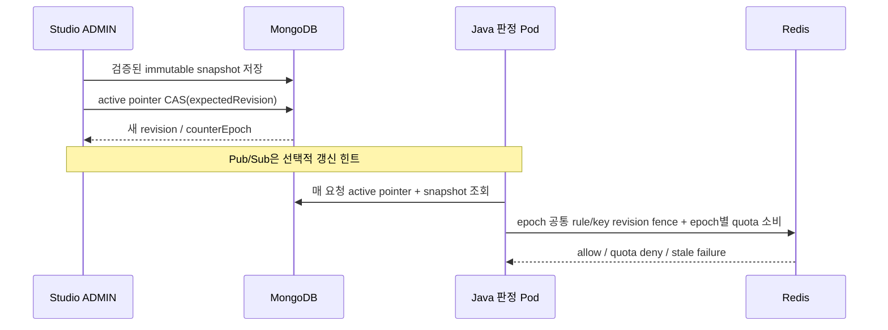

# FluxGate × Envoy Gateway: 운영 통합 설계안

2026-10-10 LTS 통합은 `feature/lts-envoy-integration`과 Studio의 `feature/lts-policy-lifecycle`에서 진행한다. 기존 Envoy 구현과 LTS의 코어·어댑터 계약을 함께 사용하며 Maven 좌표는 `0.4.0-SNAPSHOT`이다. 이전 Envoy 브랜치 검증과 이번 통합본 검증은 구분한다. [브라우저 다이어그램](fluxgate-envoy-target.html)은 정상 요청 경로와 판정·저장소 경로를 분리해 보여준다.

## 목표와 범위

Java·Go·Rust 서비스가 FluxGate SDK를 설치하지 않아도 **Gateway를 통과하는 HTTP 요청**에 기존 FluxGate 규칙을 적용한다. FluxGate의 규칙 모델·ACL·키 해석·다중 규칙·Redis limiter·Mongo provider·지표·reload는 Java 판정 서비스에서 재사용한다. 서비스 간 내부 호출과 직접 Pod/Service 접근은 Gateway를 지나지 않으므로 별도의 네트워크 정책 또는 호출 측 적용이 필요하다.

```
사용자 ──> Envoy Gateway ──(extAuth Check)──> Java FluxGate
                 │                  ├──> MongoDB: 규칙 조회·판정 이벤트
                 │                  └──> Redis: 제한 카운터·변경 알림
                 └──(허용된 요청만)──> 실제 서비스 Pod
```

Envoy는 MongoDB·Redis의 클라이언트가 아니다. Java 판정 서비스는 요청을 프록시하지 않는다. `200/OK` 판정 뒤 Envoy가 원래 요청을 서비스 Pod로 전달한다. 거부·판정 장애 시 원 서비스는 호출하지 않는다. 제한 카운터는 **판정 허용 시점**에 소비되므로 원 서비스가 나중에 5xx를 반환하거나 연결이 끊겨도 자동 환급되지 않는다. LTS에서는 같은 Redis slot의 다중 규칙을 단일 Lua로 판정·소비하며 거부 시 앞 규칙도 소비하지 않는다. 서로 다른 slot은 엔진의 보상·환급 계약을 따르므로 분산 트랜잭션으로 설명하지 않는다. 환급 실패나 프로세스 종료로 이미 소비한 permit이 남을 수 있으며 동시 호출은 일시적으로 더 엄격한 제한을 볼 수 있다.

## 이전 Envoy 브랜치의 검증 기록

이 표와 아래 96점은 LTS 통합 전 브랜치의 기록이며 새 통합본의 통과나 점수 근거로 사용하지 않는다.

| 항목 | 2026-10-10 이전 브랜치 근거 | 남은 일 |
| --- | --- | --- |
| Envoy → Java → 실제 Pod | Calico kind에서 200·200·429, 내부 mTLS 인증·인증서 누락 거부 | 운영 ingress TLS·실제 업무 서비스 연결 |
| Mongo 규칙 → 기존 엔진 → Redis | 발행 정책 2개, Redis Cluster 포함 전체 2,213개 테스트 통과 | 운영 저장소 HA·영속화 |
| ACL·거부·저장소 장애 | 두 Pod ACL 403, Mongo/Redis 정지 시 GET·OPTIONS 503, authz 부재 시 500으로 차단 | 운영 HA·장애 전환 |
| 요청 문맥 | 검증된 API key identity, raw 사용자·permit 헤더 무시를 실제 경로에서 확인 | 인증 공급원 확장·자격증명 회전 |
| rule-set 선택 | 서버 설정의 ordered route·host·method 바인딩과 permits | 보호할 모든 HTTPRoute의 배포 검사 |
| 규칙 변경 | lifecycle 59개 기록, 실제 Studio JWT 17개 응답 검사: 두 Pod에 알림 없이 반영·사용량 유지 | 부하별 fresh read latency·혼합 구버전 이행 |
| Pod 우회 접근 | Calico Service·Pod IP 및 실제 authz egress 31개 항목 통과 | 운영 RBAC·host-network·관리자 접근 경계 |
| 제한 헤더 | 429의 Retry-After만 전달 | 허용 응답 헤더 전파 방식 결정·검증 |

기존 HTML 설계 문서의 ‘단일 YAML 규칙’과 ‘중복 규칙 503’ 설명은 이전 파일럿 시점의 기록이다. 현재 Mongo·복수 규칙 실측을 설명하는 문서는 이 문서와 `deploy/envoy-gateway-local/README.md`다.

[최종 리뷰와 재현 증거](../reviews/2026-10-10-enterprise-envoy-review.ko.md)에 내부 평가 96/100의 기준과 검사 결과를 기록했다. 이 점수는 구현된 로컬 통합 범위의 평가다.

## 권장 통합 방식

**현 단계에서는 Envoy Gateway `SecurityPolicy.extAuth.http`를 유지한다.** 기존 kind 경로가 검증되어 있고 어댑터를 작게 유지할 수 있다. 단, HTTP extAuth의 성공 응답 헤더가 클라이언트에게 자동 전파되지 않는 문제를 운영 요구로 확정하면 **gRPC `Check` 서비스로 전환**한다. Envoy의 gRPC `OkHttpResponse.response_headers_to_add`는 허용 응답 헤더를 표현할 수 있다. 불안정하고 광범위한 xDS 변경 권한을 요구하는 `EnvoyPatchPolicy`를 기본 경로로 채택하지 않는다. HTTP→gRPC 전환 시에도 판정·규칙 엔진은 동일하고 전송 어댑터만 교체한다.

`BackendTrafficPolicy`의 자체 rate limit은 FluxGate 규칙과 Redis 키 의미를 그대로 실행하지 않으므로 이 목표의 대체 구현이 아니다. 자체 Gateway 기능을 선호하는 설치자는 FluxGate 판정 서비스를 선택하지 않아도 된다.

## 판정 계약

1. Envoy는 보호할 `HTTPRoute`에 `SecurityPolicy`를 부착한다. 모든 의도된 route의 정책 적용 상태를 배포 검사로 확인한다. 더 구체적인 route 정책이 부모 정책을 덮을 수 있으므로 Gateway 수준 정책만 보고 커버리지를 추정하지 않는다.
2. 판정 요청은 원 method·path·host 및 **명시된 헤더만** 전달한다. 본문은 사용하지 않는다. URL rewrite·인코딩·쿼리 파라미터의 의미는 Envoy에서 authz와 upstream이 보는 값이 같은지 계약 테스트로 고정한다. 매칭에 필요한 헤더를 `headersToExtAuth`에 열거한다.
3. 서버가 route→rule-set 바인딩과 permits(기본 1)를 정한다. HTTP 방식에서는 정책별 auth path prefix의 binding ID를 사용할 수 있다. 그 ID는 서버 설정의 allowlist에서만 해석하며 원래 path를 복원한다. 클라이언트 헤더의 rule-set ID·permits는 무시한다. 바인딩 부재·중복·미존재 rule set은 503/배포 실패로 처리한다. 여러 규칙 매칭은 `RateLimitEngine.check` 한 번으로 기존 의미를 따른다.
4. 컨텍스트는 기존 `RequestContextFactory`를 사용한다. 기본값에서 `PER_USER`·`PER_API_KEY`에 필요한 신원이 없으면 `MISSING_KEY`로 거부한다. 사용자 ID·API key·tenant를 클라이언트가 보낸 헤더만으로 신뢰하지 않는다. 선택지는 (a) Gateway의 검증된 JWT/인증 결과, (b) authz 내부 검증, (c) 신뢰된 프록시가 기존 헤더를 제거하고 재설정하는 방식이다. 공급원 선택 전에는 해당 scope의 출시를 막는다. Credential 원문은 Mongo 이벤트·로그에 저장하지 않는다.
5. 실제 client IP는 Envoy와 앞단 로드밸런서의 신뢰 프록시 체인을 설정하고 테스트해 결정한다. Java가 보는 socket peer는 Envoy Pod일 수 있다. 임의 `X-Forwarded-For`를 그대로 키로 쓰면 IP별 제한을 우회할 수 있다.
6. 정상 `200/OK`는 Envoy만 소비하고 백엔드는 원 요청을 받는다. ACL 거부와 신원 누락은 403, quota 초과는 429 + `Retry-After`, 규칙 조회·Redis·판정 서비스 실패는 5xx로 닫는다. 정확한 오류 코드는 Envoy의 경로별 동작을 실측해 확정한다. 기존 `RateLimitHeaderWriter`의 성공 헤더까지 필수라면 gRPC 전환을 완료해야 한다.
7. 현재 Gateway 발행 계약은 `WAIT_FOR_REFILL`을 거부한다. 어댑터도 소비 전에 확인하고 readiness를 내린다. 추후 지원하려면 대기 동시성 상한과 timeout·중복 소비 계약을 별도 설계한다. 판정 서비스의 소비 재시도는 기본 비활성화한다. 응답 유실 시 이미 소비했는지 알 수 없으므로 동일 요청의 exactly-once 소비는 보장하지 않는다.

## 저장소·변경 반영

Studio의 기존 편집 API는 `rate_limit_rules` 초안을 편집한다. 새 발행 API는 **완전한 rules 배열과 별도 accessControl**을 한 요청으로 받고, ADMIN 권한·expectedRevision·UUID operationId를 검증한다. 편집 중인 여러 문서를 조회해 하나의 세대로 조합하지 않는다. 원본 BSON을 병합하고 전체 문서 CAS로 수정하므로 Studio가 표현하지 못하는 algorithm·calendar quota·matcher·priority 등의 필드를 보존한다.

발행은 `<rulesCollection>_revisions`에 checksum이 있는 불변 snapshot을 먼저 majority write한 다음 `<rulesCollection>_policies`의 active pointer를 expectedRevision CAS로 교체한다. 실패한 CAS의 snapshot은 비활성 orphan이며 적용되거나 성공 이력으로 취급하지 않는다. actor는 인증된 관리자에서 얻는다. rollback도 새 revision이며 과거 snapshot을 직접 active로 되돌리지 않는다. `operationId` 재전송은 같은 payload일 때만 이전 결과를 반환한다. ACL의 허용 필드는 allowedIps·deniedIps·allowedKeys·deniedKeys뿐이며 rules 내부 ACL과 병용하지 않는다.



판정 서비스는 `PublishedMongoRuleSetProvider`로 **매 요청** active pointer를 읽는다. 일반 TTL cache도 fresh-read SPI를 우회하지 않는다. Mongo 오류·snapshot 손상·미발행 정책은 503으로 닫고 mutable draft나 이전 cache로 fallback하지 않는다. 따라서 Pub/Sub 유실에 correctness를 의존하지 않는다. 일반 SDK reload는 첫 poll·ACL 변경·삭제·재연결을 감지하지만 자동 bucket reset을 수행하지 않는다.

`revision`은 설정 변경 번호, `counterEpoch`은 카운터 수명의 별도 ID다. 이름·matcher·ACL·capacity 변경은 epoch를 유지한다. TOKEN_BUCKET은 저장된 이전 capacity/window로 먼저 refill하고 signed usage debt를 새 capacity로 이행하므로 감소→증가→rollback이 무료 quota를 만들지 않는다. FIXED_WINDOW와 SLIDING_WINDOW도 raw count를 보존한다. 알고리즘·key scope·window·timezone·calendar period·sliding bucket 구조 변경과 삭제했던 rule ID 재사용은 명시적 reset 및 사유가 필요하다. published rule ID와 band label은 Redis 키 변환이 충돌하지 않는 안전한 문자 집합을 사용한다.

Redis Lua는 epoch가 달라도 같은 rule/key의 monotonic revision fence를 모든 쓰기 전에 검사한다. 모든 밴드의 타입·숫자 상태·sliding 정수 범위·migration을 먼저 검증하므로 후속 오류가 앞 밴드의 정책 정보나 소비를 부분 변경하지 않는다. stale-policy 실패는 요청 전체를 재시도하지 않는다. 이미 실행 중인 이전 요청은 완료될 수 있으며 전역 동시 전환을 보장하지 않는다. fence 보존은 설정된 최대 bucket TTL의 범위다. 소비 잔량을 보존하는 용량 축소의 회복 시간이 최대 TTL을 초과하면 `POLICY_RESET_REQUIRED`로 거절하며 명시적 reset이 필요하다. 이 검사는 Redis 실행 시 이루어지므로 publication 성공만으로 모든 기존 카운터에 즉시 적용 가능하다고 보장하지 않는다. 해당 경우 안전한 재게시나 reset 전까지 요청이 fail-closed할 수 있다. **구버전 Lua나 직접 Redis 호출자는 새 fence 계약을 따르지 않으므로 최초 발행 전에 업그레이드하거나 소비를 중지해야 한다.** 새 발행 경로와 예전 SDK를 무검증 혼용하지 않는다.

Mongo 구버전 전역 unique ID 인덱스는 [명시적 유지보수 이행](lts-mongo-identity-migration.ko.md)이 필요하다. CREATE·VALIDATE 시작 검사 모두 이를 자동 삭제하지 않으며, 모든 구버전 writer와 동시 DDL을 중지한 뒤 복합 unique 제약을 먼저 검증한다. 이 구간은 무중단 업그레이드 보장이 아니다.

키 인코딩은 LTS의 충돌 방지 계약을 유지한다. 이전 0.3.7 인코더가 치환했던 특수문자 identity, 예약된 `h:` 표기 및 일부 긴 identity는 LTS에서 다른 키를 만든다. 해당 카운터의 자동 데이터 이행은 제공하지 않는다. 실제 업그레이드 전 사용 중인 identity를 확인하고 카운터 이행 또는 명시적 reset을 계획해야 한다. 로컬 배포 검증의 정상 문자 API key identity에서 잔량과 소진 상태를 보존한 결과를 모든 기존 identity의 이행 보장으로 확대하지 않는다.

초기 파일럿은 무인증·임시 저장소를 사용했다. `deploy/resilience-local`은 인증된 Mongo replica set과 Redis Cluster, PVC, mTLS 및 자격증명 회전을 사용하는 별도 로컬 검증 환경이다. 단일 Docker Desktop 호스트의 결과이며, 운영에서는 물리 호스트/AZ 분리·off-host backup·저장소 TLS/최소 권한·지원 런타임을 추가 검증해야 한다.

## Kubernetes 배치와 신뢰 경계

- Envoy Proxy → 판정 서비스는 전용 CA의 mTLS와 허용 client certificate subject를 검증한다. EG `EnvoyProxy.backendTLS.clientCertificateRef`와 `BackendTLSPolicy`를 사용한다. NetworkPolicy는 이 포트와 실제 서비스 Pod의 우회 접근을 제한한다. kind 기본 CNI만으로는 집행을 주장하지 않으며 별도 Calico 클러스터에서 검증한다.
- 판정 서비스 → MongoDB·Redis의 최소 연결만 허용한다. 운영 자격증명, TLS/mTLS, Secret 회전, namespace 분리를 배포 계약에 포함한다.
- 실제 서비스 Pod는 Envoy 경로 외의 접근을 막지 않으면 Gateway 제한을 우회할 수 있다. 내부 호출을 포함할지 제품 범위로 정의하고 정책을 따로 적용한다.
- 판정 서비스는 여러 복제본을 운영한다. readiness는 필수 정책의 존재·유효성을 확인하고 quota를 소비하지 않는다. 별도 plaintext 8081 listener는 `/healthz`·`/readyz`만 노출하며 authz는 없다. Redis 장애는 판정에서 fail closed하고 readiness 자체가 Redis 가용성 검사를 대신하지 않는다. Mongo/Redis timeout은 extAuth timeout보다 짧게 두고 `failOpen=false`로 배포한다.

## 구현 순서와 완료 기준

| 단계 | 구현 | 완료 증거 |
| --- | --- | --- |
| 1. 계약 고정 | route 바인딩·응답 상태·신원 공급원 정의 | 잘못된 binding/헤더 위조/미존재 규칙 거부 테스트 |
| 2. 문맥 연결 | `RequestContextFactory` 재사용, IP·header allowlist, 신뢰된 identity | IP·user·API key·header matcher가 Gateway 경유로 독립 작동 |
| 3. 변경 반영 | 불변 snapshot + active pointer CAS, 매 요청 fresh read; 알림은 hint | Studio 알림을 끈 상태에서 두 authz Pod의 즉시 ACL 전환·동일 epoch 확인 |
| 4. 응답·정책 | HTTP extAuth, Retry-After, WAIT 발행·시작·판정 단계 거부 | 403/429/저장소 503/endpoint 부재 500·capacity/rollback 사용량 보존 |
| 5. 로컬 배포 | 독립 Calico kind, 두 authz Pod, NetworkPolicy, mTLS | Service·Pod IP 우회 차단과 저장소·판정 서비스 장애 주입 통과 |
| 6. 운영 배포 | 영속 저장소·HA·자격증명 회전·SLO·부하 목표 | 운영 환경별 별도 검증 필요 |

최소 회귀 시나리오는 `GET/POST/OPTIONS`, URL rewrite, 0·1·복수 매칭 규칙, ACL deny/bypass, 403/429/5xx, Redis/Mongo 중단, rule reload, 프록시 헤더 위조, 사용자별 독립 버킷, backend 5xx 뒤 카운터 소비다. 실제 운영 트래픽에 붙이기 전 core·Mongo·Redis 관련 이전 리뷰의 최신 상태도 재검증한다.

## 코드량 추정

아래는 초기 HTTP 어댑터 범위의 추정이었다. 이후 안전한 immutable publication, revision fence, counter epoch, Studio CAS 보존, Calico·JWT·장애 회귀가 범위에 추가됐으므로 최종 변경량의 상한으로 사용하면 안 된다. 상세 변경 파일은 두 전용 브랜치와 최종 리뷰에서 확인한다. 생성된 protobuf 코드는 포함하지 않는다.

| 범위 | 대략적인 변경량 | 주된 비용 |
| --- | ---: | --- |
| HTTP extAuth의 문맥·route 바인딩·안전한 거부 | 제품 코드 300–600줄 + 테스트 400–700줄 | 신뢰 경계와 매칭 회귀 |
| Studio reload·cache·다중 Pod 검증 | 제품 코드/설정 150–350줄 + 테스트 250–500줄 | 기존 자동설정 결합과 데이터 정합성 |
| 성공 헤더·완전한 extAuth 계약을 위한 gRPC 전환 | 추가 제품 코드 350–700줄 + 테스트 350–700줄 | proto 매핑, Envoy Gateway 설정, 호환성 |
| 배포·보안·운영 예제와 문서 | YAML/문서 300–700줄 | 환경별 정책과 장애 실험 |

따라서 **HTTP 기반의 안전한 첫 운영 후보는 약 1,400–2,800줄 변경**, 성공 헤더까지 포함한 gRPC 기반 전체 범위는 **약 2,100–4,200줄 변경**으로 본다. 절반 이상은 테스트·배포·문서이며, 기존 제한 알고리즘을 새로 작성하는 규모는 아니다. 개발 시간은 환경·신원 제공 방식에 크게 좌우되므로 줄 수를 일정으로 환산하지 않는다. 헤더·인증 경계를 확정하지 않은 채 ‘모든 FluxGate 기능 지원’이라고 선언하지 않는다.

## 공식 계약 참고

- Envoy Gateway v1.9 [External Authorization](https://gateway.envoyproxy.io/v1.9/tasks/security/ext-auth/)와 [Extension API](https://gateway.envoyproxy.io/v1.9/api/extension_types/): SecurityPolicy와 HTTP path prefix.
- Envoy [ext_authz filter](https://www.envoyproxy.io/docs/envoy/latest/api-v3/extensions/filters/http/ext_authz/v3/ext_authz.proto.html): HTTP 성공 응답 헤더 전달 기본값과 실패 처리.
- Envoy [Authorization service proto](https://www.envoyproxy.io/docs/envoy/latest/api-v3/service/auth/v3/external_auth.proto): gRPC `CheckResponse`, `OkHttpResponse.response_headers_to_add`.
- Envoy Gateway [EnvoyPatchPolicy](https://gateway.envoyproxy.io/v1.9/tasks/extensibility/envoy-patch-policy/): 불안정성과 광범위한 프록시 구성 변경 위험.
