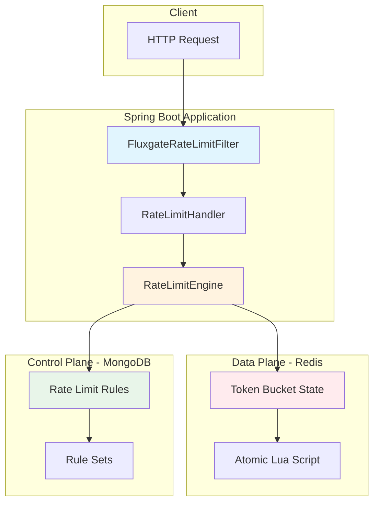
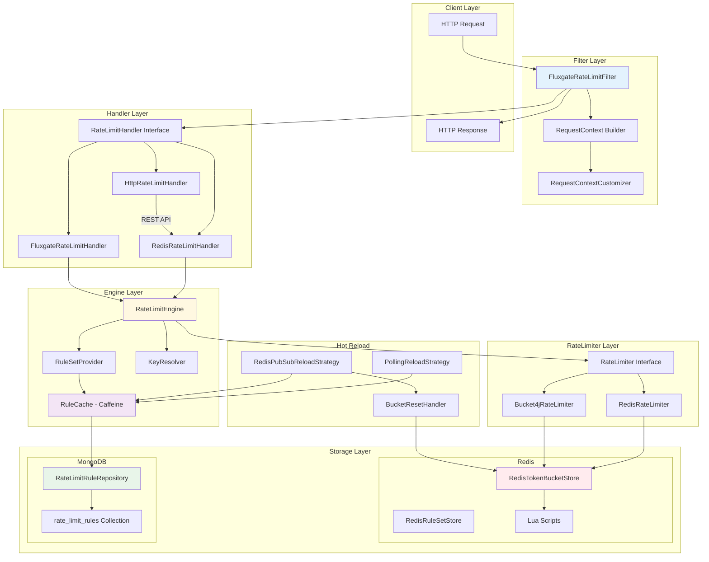
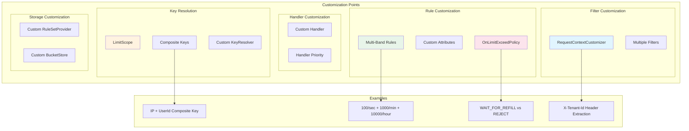
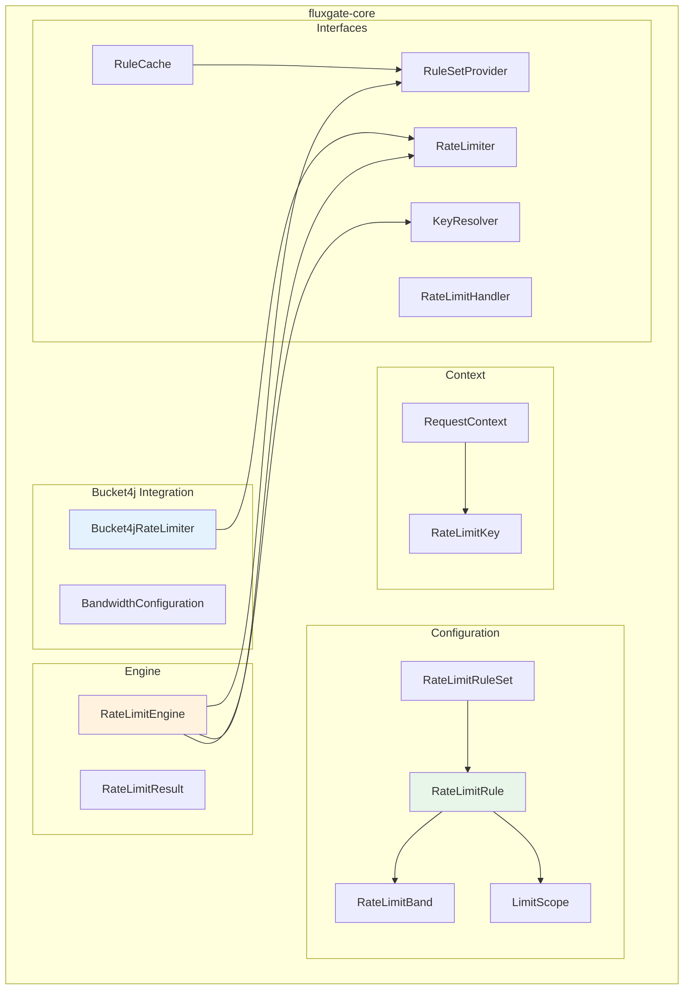
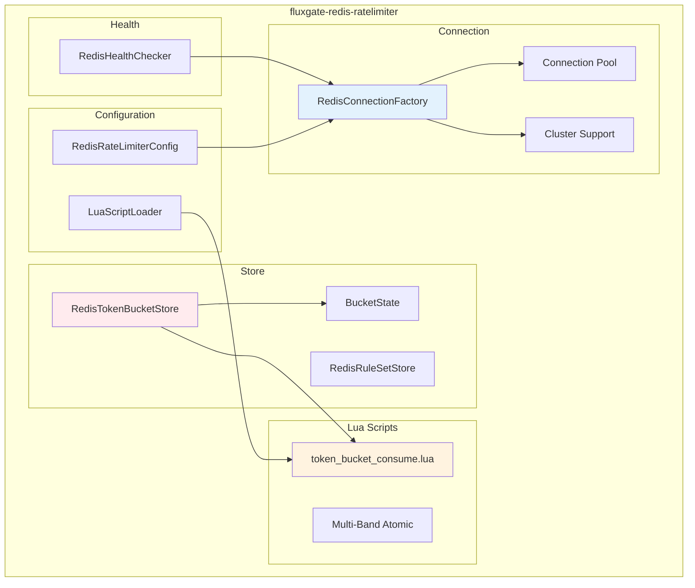
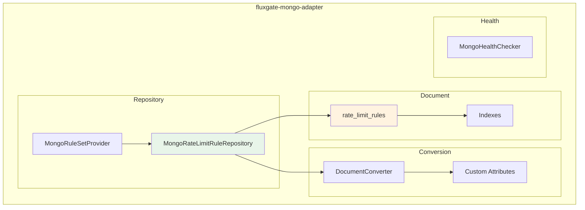
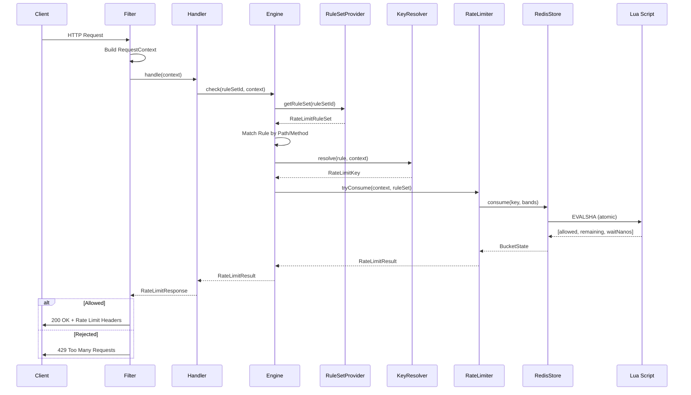
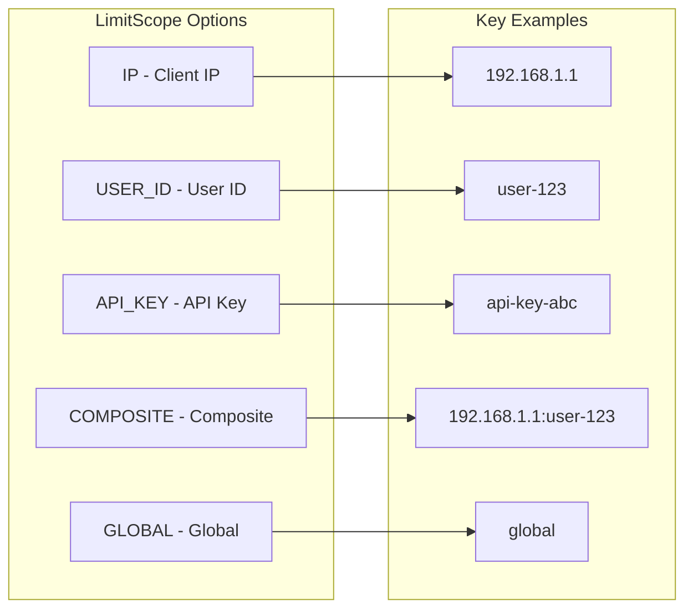
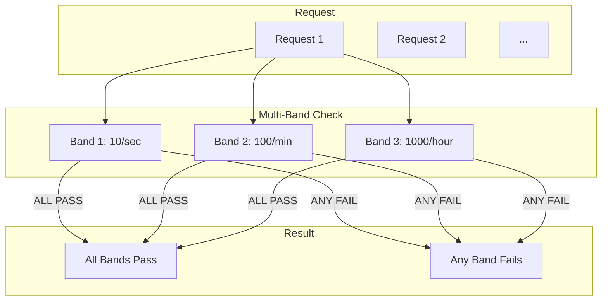
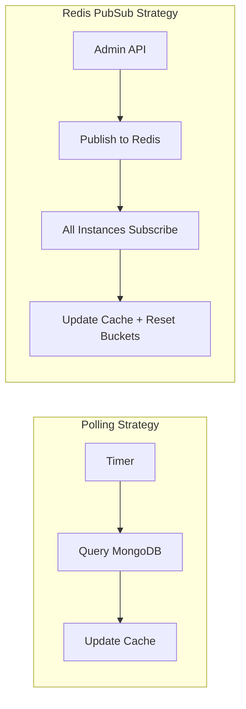

# FluxGate Architecture

This document provides a comprehensive overview of FluxGate's architecture, including module structure, data flow, and customization points.

English | [한국어](ARCHITECTURE.ko.md)

---

## Table of Contents

1. [Overview Architecture](#1-overview-architecture)
2. [Detailed Architecture](#2-detailed-architecture)
3. [Customization Architecture](#3-customization-architecture)
4. [Module Architecture](#4-module-architecture)
   - [fluxgate-core](#41-fluxgate-core)
   - [fluxgate-redis-ratelimiter](#42-fluxgate-redis-ratelimiter)
   - [fluxgate-mongo-adapter](#43-fluxgate-mongo-adapter)
   - [fluxgate-spring-boot-starter](#44-fluxgate-spring-boot-starter)
5. [Data Flow](#5-data-flow)
6. [Key Concepts](#6-key-concepts)

---

## 1. Overview Architecture



### Core Flow

1. **HTTP Request** → Filter intercepts the request
2. **Handler** creates request context
3. **Engine** queries rules + consumes tokens
4. **Decision** → Allow or Reject response

---

## 2. Detailed Architecture



### Layer Descriptions

| Layer | Responsibility |
|-------|----------------|
| **Filter Layer** | Intercepts HTTP requests, builds context |
| **Handler Layer** | Orchestrates rate limiting logic |
| **Engine Layer** | Rule matching, key resolution |
| **RateLimiter Layer** | Token bucket algorithm execution |
| **Storage Layer** | Persistent storage for rules and state |
| **Reload Layer** | Hot reload of rules without restart |

---

## 3. Customization Architecture



### Customization Points

| Point | Interface | Purpose |
|-------|-----------|---------|
| **RequestContextCustomizer** | `RequestContextCustomizer` | IP extraction, user ID, custom attributes |
| **KeyResolver** | `KeyResolver` | Rate limit key generation logic |
| **RateLimitHandler** | `RateLimitHandler` | Full rate limiting flow control |
| **RuleSetProvider** | `RuleSetProvider` | Rule source (DB, File, etc.) |
| **BucketResetHandler** | `BucketResetHandler` | Bucket reset on rule changes |

### Example: Custom RequestContextCustomizer

```java
@Component
public class TenantContextCustomizer implements RequestContextCustomizer {

    @Override
    public RequestContext.Builder customize(
            RequestContext.Builder builder,
            HttpServletRequest request) {

        // Extract tenant from header
        String tenantId = request.getHeader("X-Tenant-Id");
        builder.attribute("tenantId", tenantId);

        // Override client IP (e.g., from Cloudflare)
        String cfIp = request.getHeader("CF-Connecting-IP");
        if (cfIp != null) {
            builder.clientIp(cfIp);
        }

        return builder;
    }
}
```

---

## 4. Module Architecture

### 4.1 fluxgate-core

The core module containing the rate limiting engine and interfaces.



#### Key Classes

| Class | Description |
|-------|-------------|
| `RateLimitRule` | Single rate limit rule (path, method, bands, scope) |
| `RateLimitBand` | Bandwidth configuration (capacity, refillTokens, refillDuration) |
| `LimitScope` | Key scope (IP, USER_ID, API_KEY, COMPOSITE) |
| `RateLimitEngine` | Rule matching + rate limiting execution |
| `RequestContext` | Request metadata (IP, userId, path, method, attributes) |

#### LimitScope Enum

```java
public enum LimitScope {
    GLOBAL,      // Single global limit
    IP,          // Per client IP
    USER_ID,     // Per user identifier
    API_KEY,     // Per API key
    COMPOSITE    // Combination of multiple scopes
}
```

---

### 4.2 fluxgate-redis-ratelimiter

Redis-backed distributed rate limiter with atomic Lua scripts.



#### Key Features

| Feature | Description |
|---------|-------------|
| **Lua Script** | Atomic token consumption (prevents race conditions) |
| **Multi-Band** | Multiple bandwidths in single Lua call |
| **Server Time** | Uses Redis server time (prevents clock drift) |
| **Cluster** | Automatic Redis Cluster detection and support |

#### Lua Script Flow

```lua
-- token_bucket_consume.lua (simplified)
local key = KEYS[1]
local capacity = tonumber(ARGV[1])
local refillTokens = tonumber(ARGV[2])
local refillNanos = tonumber(ARGV[3])
local tokensToConsume = tonumber(ARGV[4])
local nowNanos = redis.call('TIME')[1] * 1000000000

-- Get current state
local tokens = tonumber(redis.call('HGET', key, 'tokens') or capacity)
local lastRefill = tonumber(redis.call('HGET', key, 'lastRefill') or nowNanos)

-- Calculate refill
local elapsed = nowNanos - lastRefill
local refillAmount = math.floor(elapsed / refillNanos) * refillTokens
tokens = math.min(capacity, tokens + refillAmount)

-- Try consume
if tokens >= tokensToConsume then
    tokens = tokens - tokensToConsume
    redis.call('HSET', key, 'tokens', tokens, 'lastRefill', nowNanos)
    return {1, tokens, 0}  -- allowed, remaining, waitNanos
else
    local waitNanos = math.ceil((tokensToConsume - tokens) / refillTokens) * refillNanos
    return {0, tokens, waitNanos}  -- rejected, remaining, waitNanos
end
```

---

### 4.3 fluxgate-mongo-adapter

MongoDB adapter for dynamic rule management.



#### MongoDB Document Structure

```json
{
  "_id": "rule-1",
  "ruleSetId": "api-limits",
  "path": "/api/users/*",
  "method": "GET",
  "limitScope": "IP",
  "compositeKeyFields": null,
  "bands": [
    {
      "label": "per-second",
      "capacity": 100,
      "refillTokens": 100,
      "refillSeconds": 1
    },
    {
      "label": "per-minute",
      "capacity": 1000,
      "refillTokens": 1000,
      "refillSeconds": 60
    }
  ],
  "priority": 10,
  "enabled": true,
  "onLimitExceed": "REJECT",
  "attributes": {
    "tenant": "enterprise",
    "tier": "premium"
  },
  "createdAt": "2024-01-01T00:00:00Z",
  "updatedAt": "2024-01-01T00:00:00Z"
}
```

#### Indexes

```javascript
// Recommended indexes for performance
db.rate_limit_rules.createIndex({ "ruleSetId": 1, "enabled": 1 })
db.rate_limit_rules.createIndex({ "ruleSetId": 1, "priority": -1 })
```

---

### 4.4 fluxgate-spring-boot-starter

Spring Boot auto-configuration for seamless integration.

```mermaid
flowchart TB
    subgraph Starter["fluxgate-spring-boot-starter"]
        subgraph AutoConfig["Auto Configuration"]
            FAC[FluxgateFilterAutoConfiguration]
            MAC[FluxgateMongoAutoConfiguration]
            RAC[FluxgateRedisAutoConfiguration]
            REAC[FluxgateReloadAutoConfiguration]
            MEAC[FluxgateMetricsAutoConfiguration]
            AAC[FluxgateActuatorAutoConfiguration]
        end

        subgraph Properties["Properties"]
            PROP[FluxgateProperties]
            RPROP[Redis Properties]
            MPROP[Mongo Properties]
        end

        subgraph Filter["Filter"]
            FLT[FluxgateRateLimitFilter]
            REG[FilterRegistration]
            CUST[RequestContextCustomizer]
        end

        subgraph Annotation["Annotation"]
            ENABLE[@EnableFluxgateFilter]
            SEL[FilterConfigurationSelector]
        end

        subgraph Metrics["Metrics"]
            MIC[MicrometerMetricsRecorder]
            PROM[Prometheus Integration]
        end

        subgraph Actuator["Actuator"]
            HEALTH[FluxgateHealthIndicator]
            INFO[FluxgateInfoContributor]
        end
    end

    ENABLE --> SEL
    SEL --> FAC
    FAC --> FLT
    FAC --> REG
    PROP --> FAC & MAC & RAC
    MEAC --> MIC
    AAC --> HEALTH

    style ENABLE fill:#e1f5fe
    style FAC fill:#fff3e0
    style FLT fill:#e8f5e9
```

#### Spring Boot 2.x vs 3.x

| Feature | Boot 2.x Starter | Boot 3.x Starter |
|---------|------------------|------------------|
| Java Version | 11+ | 17+ |
| Servlet API | `javax.servlet` | `jakarta.servlet` |
| Auto-Config | `spring.factories` | `AutoConfiguration.imports` |
| Caffeine | 2.x | 3.x |
| Micrometer | 1.9.x | 1.13.x |

#### Configuration Properties

```yaml
fluxgate:
  # Redis Configuration
  redis:
    enabled: true
    uri: redis://localhost:6379
    # cluster-nodes: node1:7000,node2:7001,node3:7002
    pool:
      max-total: 50
      max-idle: 10
      min-idle: 5

  # MongoDB Configuration
  mongo:
    enabled: true
    uri: mongodb://localhost:27017/fluxgate
    database: fluxgate
    collection: rate_limit_rules

  # Rate Limiting Configuration
  ratelimit:
    filter-enabled: true
    default-rule-set-id: api-limits
    filter-order: 1
    include-patterns:
      - /api/*
    exclude-patterns:
      - /health
      - /actuator/*
    missing-rule-behavior: ALLOW  # or REJECT

  # Hot Reload Configuration
  reload:
    enabled: true
    strategy: POLLING  # or REDIS_PUBSUB
    polling-interval: 30s
    reset-buckets-on-reload: true

  # Wait for Refill Configuration
  wait-for-refill:
    enabled: false
    max-wait-time: 5s
```

---

## 5. Data Flow

### Sequence Diagram



### Response Headers

When a request is processed, FluxGate adds the following headers:

```http
X-RateLimit-Limit: 100
X-RateLimit-Remaining: 95
X-RateLimit-Reset: 1640000000
Retry-After: 60  # Only when rejected
```

---

## 6. Key Concepts

### 6.1 LimitScope (Rate Limit Key Scope)



### 6.2 Multi-Band Rate Limiting



**Example Multi-Band Configuration:**

```java
RateLimitRule rule = RateLimitRule.builder()
    .id("api-rule")
    .ruleSetId("api-limits")
    .path("/api/*")
    .addBand(RateLimitBand.of(10, 10, Duration.ofSeconds(1)))   // 10/sec
    .addBand(RateLimitBand.of(100, 100, Duration.ofMinutes(1))) // 100/min
    .addBand(RateLimitBand.of(1000, 1000, Duration.ofHours(1))) // 1000/hour
    .limitScope(LimitScope.IP)
    .build();
```

### 6.3 OnLimitExceedPolicy

| Policy | Behavior |
|--------|----------|
| `REJECT` | Immediately return 429 Too Many Requests |
| `WAIT_FOR_REFILL` | Wait for tokens to refill, then proceed |

```yaml
fluxgate:
  ratelimit:
    default-policy: REJECT
  wait-for-refill:
    enabled: true
    max-wait-time: 5s
```

### 6.4 Hot Reload Strategies

| Strategy | Description | Use Case |
|----------|-------------|----------|
| `POLLING` | Periodically query MongoDB for changes | Simple setup, eventual consistency |
| `REDIS_PUBSUB` | Subscribe to Redis channel for real-time updates | Real-time updates, multi-instance sync |



---

## Related Documentation

- [README.md](../README.md) - Getting started guide
- [CONTRIBUTING.md](../CONTRIBUTING.md) - Contribution guidelines
- [fluxgate-samples](fluxgate-samples/) - Sample applications

---

## License

MIT License - see [LICENSE](../LICENSE) for details.
