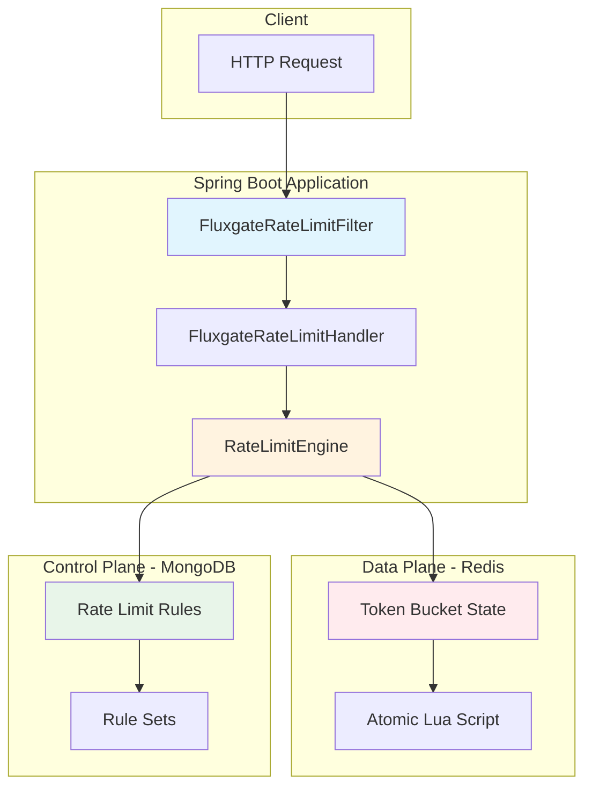
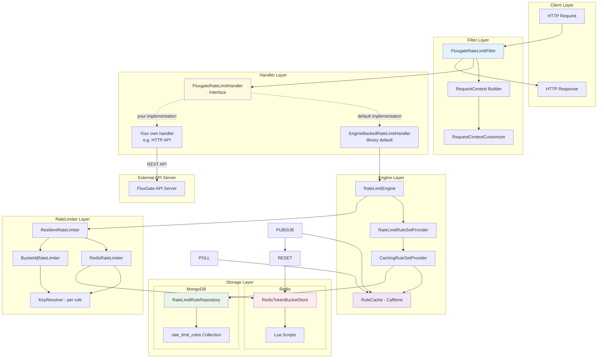
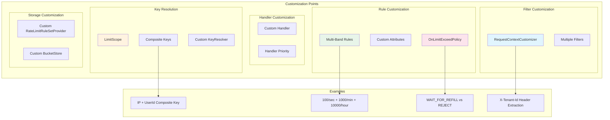
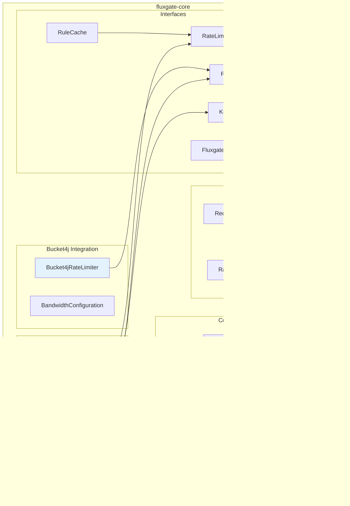
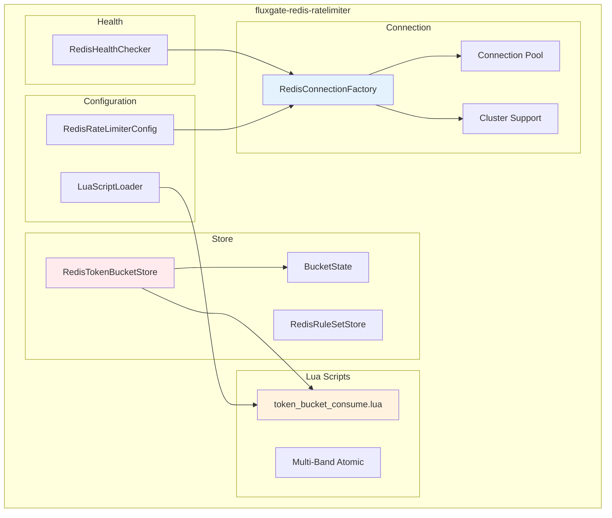
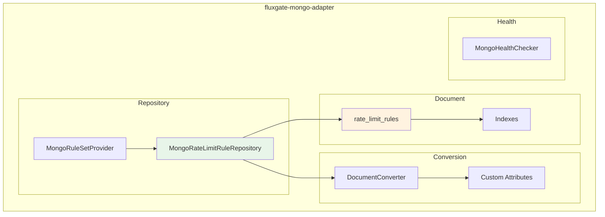
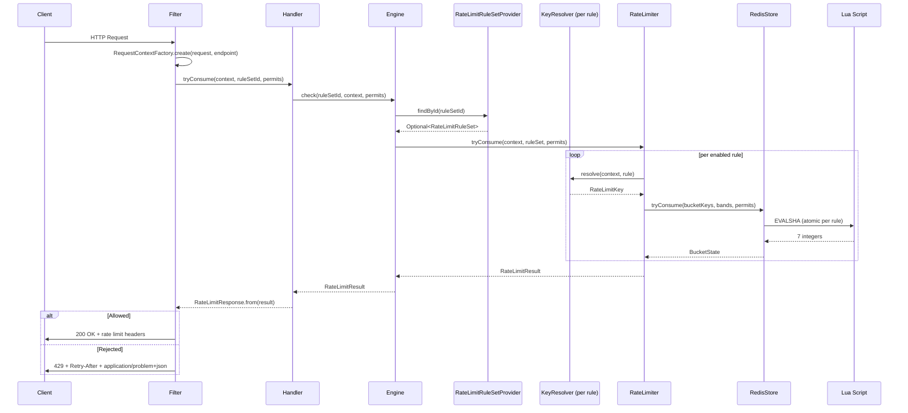
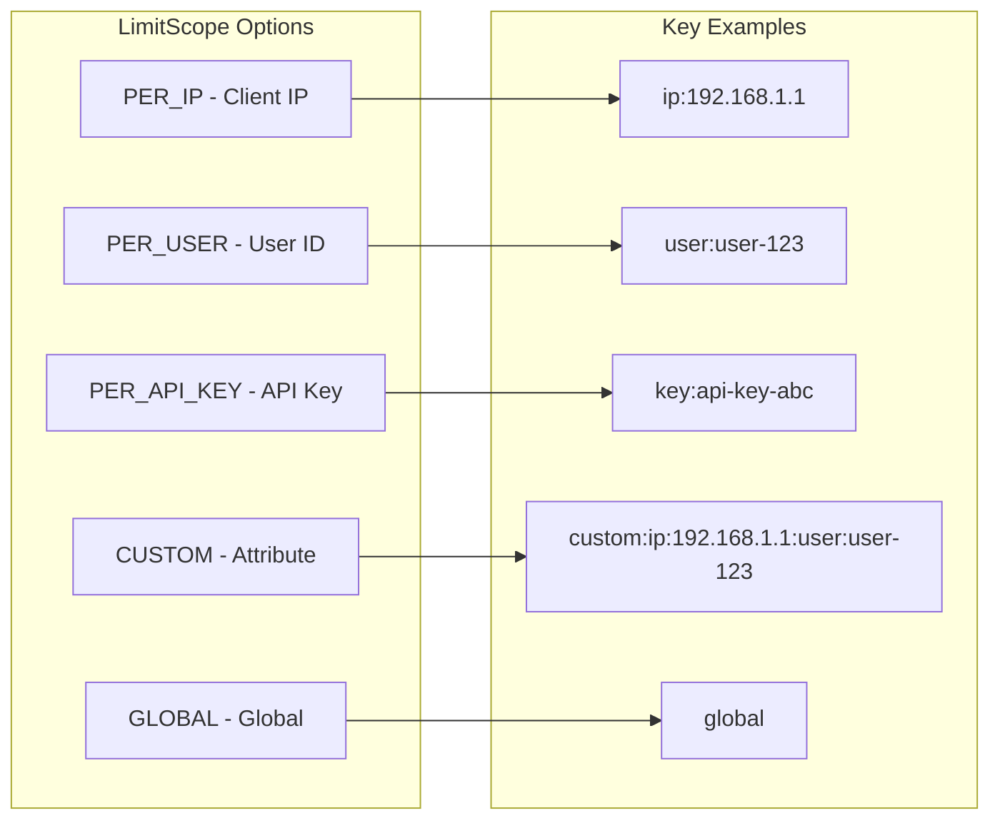
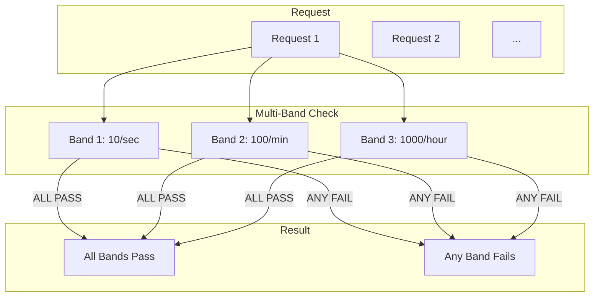
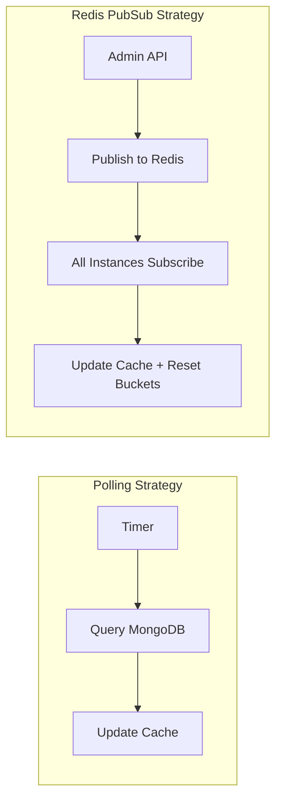

# FluxGate Architecture

This document provides a comprehensive overview of FluxGate's architecture, including module structure, data flow, and customization points.

English | [한국어](../../ko/architecture/README.ko.md)

---

## Table of Contents

1. [Overview Architecture](#1-overview-architecture)
2. [Detailed Architecture](#2-detailed-architecture)
3. [Customization Architecture](#3-customization-architecture)
4. [Module Architecture](#4-module-architecture)
   - [fluxgate-core](#41-fluxgate-core)
   - [fluxgate-redis-ratelimiter](#42-fluxgate-redis-ratelimiter)
   - [fluxgate-mongo-adapter](#43-fluxgate-mongo-adapter)
   - [fluxgate-spring-boot3-starter](#44-fluxgate-spring-boot3-starter)
5. [Data Flow](#5-data-flow)
6. [Key Concepts](#6-key-concepts)

---

## 1. Overview Architecture


```mermaid
flowchart TB
    subgraph Client["Client"]
        HTTP[HTTP Request]
    end

    subgraph SpringBoot["Spring Boot Application"]
        Filter[FluxgateRateLimitFilter]
        Handler[FluxgateRateLimitHandler]
        Engine[RateLimitEngine]
    end

    subgraph DataPlane["Data Plane - Redis"]
        TokenBucket[Token Bucket State]
        LuaScript[Atomic Lua Script]
    end

    subgraph ControlPlane["Control Plane - MongoDB"]
        Rules[Rate Limit Rules]
        RuleSets[Rule Sets]
    end

    HTTP --> Filter
    Filter --> Handler
    Handler --> Engine
    Engine --> TokenBucket
    Engine --> Rules
    TokenBucket --> LuaScript
    Rules --> RuleSets

    style Filter fill:#e1f5fe
    style Engine fill:#fff3e0
    style TokenBucket fill:#ffebee
    style Rules fill:#e8f5e9
```

### Core Flow

1. **HTTP Request** → Filter intercepts the request
2. **Handler** creates request context
3. **Engine** queries rules + consumes tokens
4. **Decision** → Allow or Reject response

---

## 2. Detailed Architecture


```mermaid
flowchart TB
    subgraph Client["Client Layer"]
        REQ[HTTP Request]
        RES[HTTP Response]
    end

    subgraph Filter["Filter Layer"]
        FLT[FluxgateRateLimitFilter]
        REQ_CTX[RequestContext Builder]
        CUST[RequestContextCustomizer]
    end

    subgraph Handler["Handler Layer"]
        direction TB
        HI[FluxgateRateLimitHandler<br/>Interface]
        EBH[EngineBackedRateLimitHandler<br/>library default]
        HH[Your own handler<br/>e.g. HTTP API]
    end

    subgraph Engine["Engine Layer"]
        ENG[RateLimitEngine]
        PROV[RateLimitRuleSetProvider]
        CPROV[CachingRuleSetProvider]
        CACHE[RuleCache - Caffeine]
    end

    subgraph RateLimiter["RateLimiter Layer"]
        RES_RL[ResilientRateLimiter]
        RRL[RedisRateLimiter]
        B4J[Bucket4jRateLimiter]
        KEY[KeyResolver - per rule]
    end

    subgraph Storage["Storage Layer"]
        subgraph Redis["Redis"]
            TBS[RedisTokenBucketStore]
            LUA[Lua Scripts]
        end
        subgraph MongoDB["MongoDB"]
            REPO[RateLimitRuleRepository]
            COLL[rate_limit_rules Collection]
        end
    end

    subgraph External["External API Server"]
        API[FluxGate API Server]
    end

    REQ --> FLT
    FLT --> REQ_CTX
    REQ_CTX --> CUST
    FLT --> HI
    HI -.->|default implementation| EBH
    HI -.->|your implementation| HH
    EBH --> ENG
    HH -->|REST API| API
    ENG --> PROV
    PROV --> CPROV
    CPROV --> CACHE
    CPROV --> REPO
    ENG --> RES_RL
    RES_RL --> RRL & B4J
    RRL --> KEY
    B4J --> KEY
    RRL --> TBS
    TBS --> LUA
    REPO --> COLL
    POLL --> CACHE
    PUBSUB --> CACHE
    PUBSUB --> RESET
    RESET --> TBS
    FLT --> RES

    style FLT fill:#e3f2fd
    style HI fill:#fff8e1
    style TBS fill:#ffebee
    style REPO fill:#e8f5e9
    style CACHE fill:#f3e5f5
```

### Layer Descriptions

| Layer | Responsibility |
|-------|----------------|
| **Filter Layer** | Intercepts HTTP requests, builds context |
| **Handler Layer** | Orchestrates rate limiting logic (interface + implementations) |
| **Engine Layer** | Rule set resolution and caching |
| **RateLimiter Layer** | Token bucket algorithm execution |
| **Storage Layer** | Persistent storage for rules and state |
| **Reload Layer** | Hot reload of rules without restart |

### Handler Implementations

| Implementation | Use Case | Talks To |
|----------------|----------|----------|
| `EngineBackedRateLimitHandler` | Direct Redis access (library default) | RuleSetProvider + RedisRateLimiter |
| `HttpRateLimitHandler` | External API calls | FluxGate API Server (REST) |

```
EngineBackedRateLimitHandler flow:
─────────────────────────────────
Filter → Handler → RuleSetProvider (MongoDB)
                 → RedisRateLimiter → RedisTokenBucketStore → Lua → Redis

HttpRateLimitHandler flow:
─────────────────────────────────
Filter → Handler → HTTP POST → FluxGate API Server (external)
```

---

## 3. Customization Architecture


```mermaid
flowchart TB
    subgraph Customization["Customization Points"]
        subgraph FilterCustom["Filter Customization"]
            RC[RequestContextCustomizer]
            MF[Multiple Filters]
        end

        subgraph HandlerCustom["Handler Customization"]
            CH[Custom Handler]
            HP[Handler Priority]
        end

        subgraph KeyCustom["Key Resolution"]
            LS[LimitScope]
            CK[Composite Keys]
            CKR[Custom KeyResolver]
        end

        subgraph RuleCustom["Rule Customization"]
            MB[Multi-Band Rules]
            ATTR[Custom Attributes]
            POL[OnLimitExceedPolicy]
        end

        subgraph StorageCustom["Storage Customization"]
            CS[Custom RateLimitRuleSetProvider]
            CBS[Custom BucketStore]
        end
    end

    subgraph Examples["Examples"]
        E1["IP + UserId Composite Key"]
        E2["100/sec + 1000/min + 10000/hour"]
        E3["WAIT_FOR_REFILL vs REJECT"]
        E4["X-Tenant-Id Header Extraction"]
    end

    RC --> E4
    CK --> E1
    MB --> E2
    POL --> E3

    style RC fill:#e1f5fe
    style LS fill:#fff3e0
    style MB fill:#e8f5e9
    style POL fill:#fce4ec
```

### Customization Points

| Point | Interface | Purpose |
|-------|-----------|---------|
| **RequestContextCustomizer** | `RequestContextCustomizer` | IP extraction, user ID, custom attributes |
| **KeyResolver** | `KeyResolver` | Rate limit key generation logic |
| **FluxgateRateLimitHandler** | `FluxgateRateLimitHandler` | Full rate limiting flow control |
| **RateLimitRuleSetProvider** | `RateLimitRuleSetProvider` | Rule source (DB, File, etc.) |
| **RateLimitResponseWriter** | `RateLimitResponseWriter` | The 429 response body |
| **BucketResetHandler** | `BucketResetHandler` | Bucket reset on rule changes |

### Example: Custom RequestContextCustomizer

```java
@Component
public class TenantContextCustomizer implements RequestContextCustomizer {

    @Override
    public RequestContext.Builder customize(
            RequestContext.Builder builder,
            HttpServletRequest request) {

        // Extract tenant from header
        String tenantId = request.getHeader("X-Tenant-Id");
        builder.attribute("tenantId", tenantId);

        // Override client IP (e.g., from Cloudflare)
        String cfIp = request.getHeader("CF-Connecting-IP");
        if (cfIp != null) {
            builder.clientIp(cfIp);
        }

        return builder;
    }
}
```

---

## 4. Module Architecture

### 4.1 fluxgate-core

The core module containing the rate limiting engine and interfaces.


```mermaid
flowchart TB
    subgraph Core["fluxgate-core"]
        subgraph Config["Configuration"]
            RULE[RateLimitRule]
            BAND[RateLimitBand]
            RSET[RateLimitRuleSet]
            SCOPE[LimitScope]
        end

        subgraph Context["Context"]
            RCTX[RequestContext]
            RKEY[RateLimitKey]
        end

        subgraph EngineCore["Engine"]
            ENG[RateLimitEngine]
            RES[RateLimitResult]
        end

        subgraph Interfaces["Interfaces"]
            IRL[RateLimiter]
            IPROV[RateLimitRuleSetProvider]
            IKEY[KeyResolver]
            IHAND[FluxgateRateLimitHandler]
            ICACHE[RuleCache]
        end

        subgraph Bucket4j["Bucket4j Integration"]
            B4J[Bucket4jRateLimiter]
            BCONF[BandwidthConfiguration]
        end
    end

    RULE --> BAND
    RULE --> SCOPE
    RSET --> RULE
    RCTX --> RKEY
    ENG --> IPROV
    ENG --> IRL
    ENG --> IKEY
    B4J --> IRL
    ICACHE --> IPROV

    style RULE fill:#e8f5e9
    style ENG fill:#fff3e0
    style B4J fill:#e3f2fd
```

#### Key Classes

| Class | Description |
|-------|-------------|
| `RateLimitRule` | Single rate limit rule (id, scope, keyStrategyId, bands, policy, attributes). No path, method or priority |
| `RateLimitBand` | One tier: `(window, capacity)`, with an optional label |
| `LimitScope` | Key scope (`GLOBAL`, `PER_IP`, `PER_USER`, `PER_API_KEY`, `CUSTOM`) |
| `RateLimitEngine` | Rule set resolution + delegation to a `RateLimiter` (no rule matching logic) |
| `RequestContext` | Request metadata (clientIp, userId, apiKey, endpoint, method, headers, attributes) |

#### LimitScope Enum

```java
public enum LimitScope {
    GLOBAL,       // Single bucket for every request
    PER_API_KEY,  // Per API key
    PER_USER,     // Per user identifier
    PER_IP,       // Per client IP
    CUSTOM        // Per value of a RequestContext attribute named by rule.keyStrategyId
}
```

A composite key is a `CUSTOM` rule whose attribute you build yourself in a
`RequestContextCustomizer` — there is no `COMPOSITE` scope and no `compositeKeyFields`.

---

### 4.2 fluxgate-redis-ratelimiter

Redis-backed distributed rate limiter with atomic Lua scripts.


```mermaid
flowchart TB
    subgraph Redis["fluxgate-redis-ratelimiter"]
        subgraph Connection["Connection"]
            CF[RedisConnectionFactory]
            POOL[Connection Pool]
            CLUSTER[Cluster Support]
        end

        subgraph Store["Store"]
            TBS[RedisTokenBucketStore]
            RSS[RedisRuleSetStore]
            STATE[BucketState]
        end

        subgraph Script["Lua Scripts"]
            CONSUME[token_bucket_consume.lua]
            MULTI[Multi-Band Atomic]
        end

        subgraph Config["Configuration"]
            CONF[RedisRateLimiterConfig]
            LOADER[LuaScriptLoader]
        end

        subgraph Health["Health"]
            HC[RedisHealthChecker]
        end
    end

    CF --> POOL
    CF --> CLUSTER
    TBS --> CONSUME
    TBS --> STATE
    CONF --> CF
    LOADER --> CONSUME
    HC --> CF

    style TBS fill:#ffebee
    style CONSUME fill:#fff3e0
    style CF fill:#e3f2fd
```

#### Key Features

| Feature | Description |
|---------|-------------|
| **Lua Script** | Atomic token consumption (prevents race conditions) |
| **Multi-Band** | Every band of one rule in a single Lua call, all-or-nothing |
| **Server Time** | Uses Redis server time in microseconds (prevents clock drift) |
| **Cluster** | Automatic Redis Cluster detection; the `{...}` hash tag pins a rule's bands to one slot |
| **Scoped deletion** | `SCAN` + `UNLINK` over `fluxgate:bucket:*` only, never `KEYS` |

#### Lua Script Flow

```lua
-- token_bucket_consume.lua (simplified; see the module README for the full contract)
-- KEYS[1..n]   one bucket key per band of ONE rule, all in the same hash tag
-- ARGV[1]      permits
-- ARGV[2+3i]   capacity,  ARGV[3+3i] window_micros,  ARGV[4+3i] reserved ("0")

local time_info = redis.call('TIME')
local now_micros = tonumber(time_info[1]) * 1000000 + tonumber(time_info[2])

-- Pass 1: refill and check EVERY band before writing anything
for i = 1, band_count do
    local bucket_data = redis.call('HMGET', KEYS[i], 'tokens', 'last_refill_micros')
    local current_tokens = tonumber(bucket_data[1])
    local last_refill_micros = tonumber(bucket_data[2])
    if current_tokens == nil or last_refill_micros == nil then
        current_tokens = capacity          -- missing, or a 0.3.x bucket: start full
        last_refill_micros = now_micros
    end

    local elapsed_micros = math.min(math.max(0, now_micros - last_refill_micros), window_micros)
    local tokens_to_add = math.floor(elapsed_micros * capacity / window_micros)
    local refilled = math.min(capacity, current_tokens + tokens_to_add)

    if refilled < permits then
        -- Rejected: write no state. Only refresh TTLs (EXPIRE is a no-op on a missing key),
        -- so a band that would have allowed the request keeps its tokens.
        for j = 1, band_count do
            redis.call('EXPIRE', KEYS[j], ttl_seconds(windows[j]))
        end
        return {0, i, refilled, micros_to_wait, reset_time_millis, capacity, i}
    end
end

-- Pass 2: every band can serve the request, so consume from all of them
for i = 1, band_count do
    redis.call('HMSET', KEYS[i],
        'tokens', string.format('%.0f', remaining),
        'last_refill_micros', string.format('%.0f', refill_micros[i]))
    redis.call('EXPIRE', KEYS[i], ttl_seconds(windows[i]))   -- max(1, ceil(window * 1.1)), no cap
end

-- reset_time is computed AFTER consumption, so the caller learns when the bucket is
-- really full again rather than when it would have been without this request.
return {1, 0, tokens[binding], 0, reset_time_millis, binding_capacity, binding}
```

Time is in **microseconds**, not nanoseconds: Redis runs Lua 5.1, where every number is a double with
an exact integer range of 2^53, and nanoseconds since the epoch (≈ 1.76e18) fall outside it. Every
value written to a hash goes through `string.format('%.0f', v)`.

---

### 4.3 fluxgate-mongo-adapter

MongoDB adapter for dynamic rule management.


```mermaid
flowchart TB
    subgraph Mongo["fluxgate-mongo-adapter"]
        subgraph Repository["Repository"]
            REPO[MongoRateLimitRuleRepository]
            PROV[MongoRuleSetProvider]
        end

        subgraph Document["Document"]
            DOC[rate_limit_rules]
            IDX[Indexes]
        end

        subgraph Conversion["Conversion"]
            CONV[DocumentConverter]
            ATTR[Custom Attributes]
        end

        subgraph Health["Health"]
            HC[MongoHealthChecker]
        end
    end

    REPO --> DOC
    REPO --> CONV
    PROV --> REPO
    DOC --> IDX
    CONV --> ATTR

    style REPO fill:#e8f5e9
    style DOC fill:#fff3e0
```

#### MongoDB Document Structure

```json
{
  "id": "rule-1",
  "ruleSetId": "api-limits",
  "name": "API Rate Limit",
  "scope": "PER_IP",
  "keyStrategyId": null,
  "onLimitExceedPolicy": "REJECT_REQUEST",
  "bands": [
    { "label": "per-second", "capacity": 100, "windowSeconds": 1 },
    { "label": "per-minute", "capacity": 1000, "windowSeconds": 60 }
  ],
  "enabled": true,
  "attributes": {
    "tenant": "enterprise",
    "tier": "premium"
  }
}
```

There is no `path`, `method`, `priority` or `compositeKeyFields` field: a rule has a scope and bands,
and every enabled rule of a rule set is evaluated.

#### Indexes

```javascript
// Created automatically by fluxgate.mongo.ddl-auto=create
db.rate_limit_rules.createIndex({ "ruleSetId": 1 })
db.rate_limit_rules.createIndex({ "ruleSetId": 1, "id": 1 }, { unique: true })
```

---

### 4.4 fluxgate-spring-boot3-starter

Spring Boot auto-configuration for seamless integration.

```mermaid
flowchart TB
    subgraph Starter["fluxgate-spring-boot3-starter"]
        subgraph AutoConfig["Auto Configuration"]
            FAC[FluxgateFilterAutoConfiguration]
            MAC[FluxgateMongoAutoConfiguration]
            RAC[FluxgateRedisAutoConfiguration]
            REAC[FluxgateReloadAutoConfiguration]
            MEAC[FluxgateMetricsAutoConfiguration]
            AAC[FluxgateActuatorAutoConfiguration]
        end

        subgraph Properties["Properties"]
            PROP[FluxgateProperties]
            RPROP[Redis Properties]
            MPROP[Mongo Properties]
        end

        subgraph Filter["Filter"]
            FLT[FluxgateRateLimitFilter]
            REG[FilterRegistration]
            CUST[RequestContextCustomizer]
        end

        subgraph Annotation["Annotation"]
            ENABLE[@EnableFluxgateFilter]
            SEL[FilterConfigurationSelector]
        end

        subgraph Metrics["Metrics"]
            MIC[MicrometerMetricsRecorder]
            PROM[Prometheus Integration]
        end

        subgraph Actuator["Actuator"]
            HEALTH[FluxgateHealthIndicator]
            INFO[FluxgateInfoContributor]
        end
    end

    ENABLE --> SEL
    SEL --> FAC
    FAC --> FLT
    FAC --> REG
    PROP --> FAC & MAC & RAC
    MEAC --> MIC
    AAC --> HEALTH

    style ENABLE fill:#e1f5fe
    style FAC fill:#fff3e0
    style FLT fill:#e8f5e9
```

#### Spring Boot 2.x vs 3.x

| Feature | Boot 2.x Starter | Boot 3.x Starter |
|---------|------------------|------------------|
| Java Version | 11+ | 17+ |
| Servlet API | `javax.servlet` | `jakarta.servlet` |
| Auto-Config | `spring.factories` | `AutoConfiguration.imports` |
| Caffeine | 2.x | 3.x |
| Micrometer | 1.9.x | 1.13.x |

#### Configuration Properties

```yaml
fluxgate:
  # Redis Configuration
  redis:
    enabled: true
    uri: redis://localhost:6379
    # cluster: redis://node1:6379,redis://node2:6379,redis://node3:6379

  # MongoDB Configuration
  mongo:
    enabled: true
    uri: mongodb://localhost:27017/fluxgate
    database: fluxgate
    rule-collection: rate_limit_rules

  # Rate Limiting Configuration
  ratelimit:
    enabled: true                # master switch; filter-enabled is deprecated and inert
    mode: AUTO                   # AUTO | REDIS | IN_MEMORY
    default-rule-set-id: api-limits
    filter-order: 1
    include-patterns:
      - /api/**                  # /* matches ONE segment only
    exclude-patterns:
      - /health
      - /actuator/**
    missing-rule-behavior: DENY  # or ALLOW
    failure-behavior: DENY       # or ALLOW
    missing-key-behavior: FALLBACK_TO_IP  # or REJECT
    trust-client-ip-header: false
    trusted-proxies: []          # required when trust-client-ip-header is true
    wait-for-refill:
      enabled: false
      max-wait-time-ms: 5000
      max-concurrent-waits: 50

  # Hot Reload Configuration (fluxgate.reload, not fluxgate.ratelimit.reload)
  reload:
    enabled: true
    strategy: AUTO               # AUTO | POLLING | PUBSUB | NONE
    cache:
      ttl: 5m
      negative-ttl: 5s
    polling:
      interval: 30s
      initial-delay: 10s
    pubsub:
      channel: fluxgate:rule-reload
      backstop-polling-interval: 60s
```

---

## 5. Data Flow

### Sequence Diagram


```mermaid
sequenceDiagram
    participant C as Client
    participant F as Filter
    participant H as Handler
    participant E as Engine
    participant P as RateLimitRuleSetProvider
    participant K as KeyResolver (per rule)
    participant R as RateLimiter
    participant S as RedisStore
    participant L as Lua Script

    C->>F: HTTP Request
    F->>F: RequestContextFactory.create(request, endpoint)
    F->>H: tryConsume(context, ruleSetId, permits)
    H->>E: check(ruleSetId, context, permits)
    E->>P: findById(ruleSetId)
    P-->>E: Optional<RateLimitRuleSet>
    E->>R: tryConsume(context, ruleSet, permits)
    loop per enabled rule
        R->>K: resolve(context, rule)
        K-->>R: RateLimitKey
        R->>S: tryConsume(bucketKeys, bands, permits)
        S->>L: EVALSHA (atomic per rule)
        L-->>S: 7 integers
        S-->>R: BucketState
    end
    R-->>E: RateLimitResult
    E-->>H: RateLimitResult
    H-->>F: RateLimitResponse.from(result)

    alt Allowed
        F->>C: 200 OK + rate limit headers
    else Rejected
        F->>C: 429 + Retry-After + application/problem+json
    end
```

### Response Headers

When a request is processed, FluxGate adds the following headers:

```http
X-RateLimit-Limit: 100          # legacy family
X-RateLimit-Remaining: 95
X-RateLimit-Reset: 1640000000   # epoch SECONDS
RateLimit-Limit: 100            # IETF family
RateLimit-Remaining: 95
RateLimit-Reset: 27             # DELTA seconds
RateLimit-Policy: 100;w=60
Retry-After: 27                 # rejections only; rounded up, never 0
```

Both families are on by default and switch independently
(`fluxgate.ratelimit.response.include-legacy-headers` /
`response.include-standard-headers`). A value the limiter reports as unknown (`-1`) is omitted rather
than written as a misleading number. A rejection also carries an RFC 9457 problem document.

---

## 6. Key Concepts

### 6.1 LimitScope (Rate Limit Key Scope)


```mermaid
flowchart LR
    subgraph Scopes["LimitScope Options"]
        IP[PER_IP - Client IP]
        USER[PER_USER - User ID]
        API[PER_API_KEY - API Key]
        COMP[CUSTOM - Attribute]
        GLOBAL[GLOBAL - Global]
    end

    subgraph Examples["Key Examples"]
        E1["ip:192.168.1.1"]
        E2["user:user-123"]
        E3["key:api-key-abc"]
        E4["custom:ip:192.168.1.1:user:user-123"]
        E5["global"]
    end

    IP --> E1
    USER --> E2
    API --> E3
    COMP --> E4
    GLOBAL --> E5
```

### 6.2 Multi-Band Rate Limiting


```mermaid
flowchart TB
    subgraph Request["Request"]
        R1[Request 1]
        R2[Request 2]
        R3[...]
    end

    subgraph Bands["Multi-Band Check"]
        B1[Band 1: 10/sec]
        B2[Band 2: 100/min]
        B3[Band 3: 1000/hour]
    end

    subgraph Result["Result"]
        ALLOW[All Bands Pass]
        REJECT[Any Band Fails]
    end

    R1 --> B1 & B2 & B3
    B1 & B2 & B3 -->|ALL PASS| ALLOW
    B1 & B2 & B3 -->|ANY FAIL| REJECT
```

**Example Multi-Band Configuration:**

```java
RateLimitRule rule = RateLimitRule.builder("api-rule")
    .ruleSetId("api-limits")
    .scope(LimitScope.PER_IP)
    .addBand(RateLimitBand.builder(Duration.ofSeconds(1), 10)
        .label("10-per-second")
        .build())
    .addBand(RateLimitBand.builder(Duration.ofMinutes(1), 100)
        .label("100-per-minute")
        .build())
    .addBand(RateLimitBand.builder(Duration.ofHours(1), 1000)
        .label("1000-per-hour")
        .build())
    .build();
```

### 6.3 OnLimitExceedPolicy

| Policy | Behavior |
|--------|----------|
| `REJECT_REQUEST` | Immediately return 429 Too Many Requests |
| `WAIT_FOR_REFILL` | Wait for tokens to refill, then proceed |

The policy is set per rule:

```java
RateLimitRule rule = RateLimitRule.builder("api-rule")
    .scope(LimitScope.PER_IP)
    .onLimitExceedPolicy(OnLimitExceedPolicy.WAIT_FOR_REFILL)  // or REJECT_REQUEST
    .addBand(RateLimitBand.builder(Duration.ofMinutes(1), 100).build())
    .build();
```

```yaml
fluxgate:
  ratelimit:
    wait-for-refill:
      enabled: false          # enable the WAIT_FOR_REFILL policy
      max-wait-time-ms: 5000
      max-concurrent-waits: 50
```

### 6.4 Hot Reload Strategies

| Strategy | Description | Use Case |
|----------|-------------|----------|
| `POLLING` | Periodically query MongoDB for changes | Simple setup, eventual consistency |
| `PUBSUB` | Subscribe to Redis channel for real-time updates | Real-time updates, multi-instance sync |


```mermaid
flowchart LR
    subgraph Polling["Polling Strategy"]
        P1[Timer] --> P2[Query MongoDB]
        P2 --> P3[Update Cache]
    end

    subgraph PubSub["Redis PubSub Strategy"]
        S1[Admin API] --> S2[Publish to Redis]
        S2 --> S3[All Instances Subscribe]
        S3 --> S4[Update Cache + Reset Buckets]
    end
```

---

## Layer Deep Dives

| Document | Description |
|----------|-------------|
| [Filter Layer](filter-layer.md) | FluxgateRateLimitFilter, RequestContext |
| [Handler Layer](handler-layer.md) | FluxgateRateLimitHandler interface and implementations |
| [Engine Layer](engine-layer.md) | RateLimitEngine, CachingRuleSetProvider, KeyResolver |
| [RateLimiter Layer](ratelimiter-layer.md) | RateLimiter interface, token bucket algorithm |
| [Storage Layer](storage-layer.md) | RedisTokenBucketStore, Lua scripts, NOSCRIPT handling |
| [Redis RateLimiter Module](redis-ratelimiter.md) | The whole fluxgate-redis-ratelimiter module |
| [Hot Reload](hot-reload.md) | Polling/PubSub strategies, BucketResetHandler |
| [Algorithm Analysis](algorithm-analysis.md) | Detailed analysis of the token bucket algorithm |

---

## Related Documentation

- [Main README](../../../README.md) - Getting started guide
- [Documentation Index](../../README.md) - All documentation
- [Migrating to 0.4](../operations/migration-0.4.md) - Upgrade impact from 0.3.x
- [CONTRIBUTING.md](../../../CONTRIBUTING.md) - Contribution guidelines
- [fluxgate-samples](../../../fluxgate-samples/README.md) - Sample applications

---

## License

MIT License - see [LICENSE](../../../LICENSE) for details.
