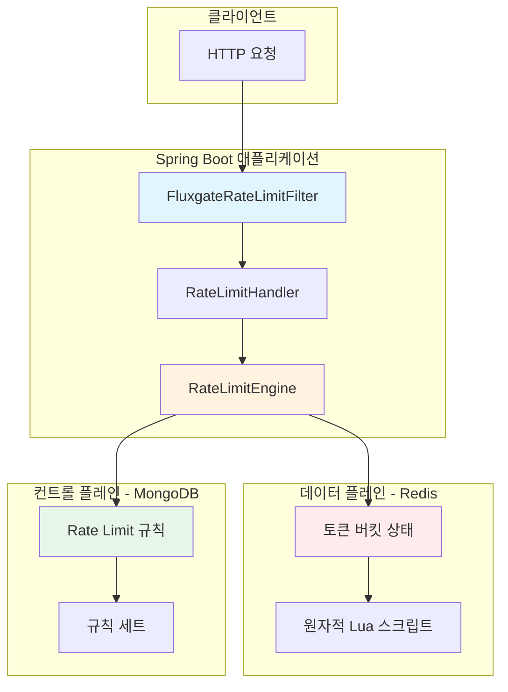
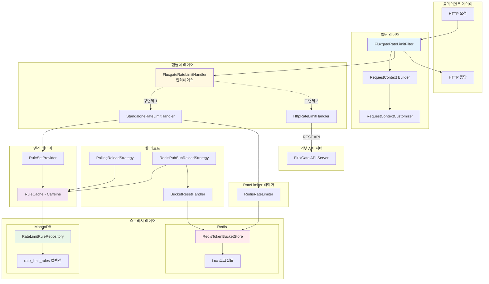
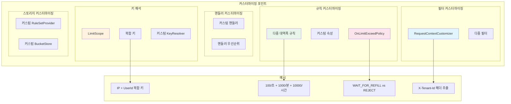
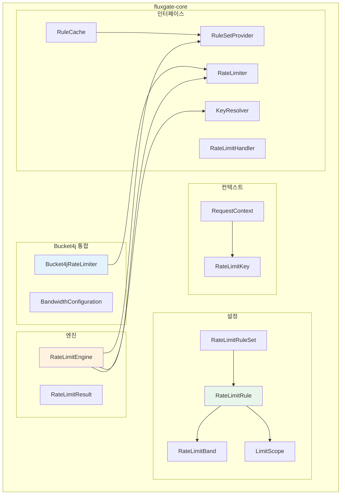
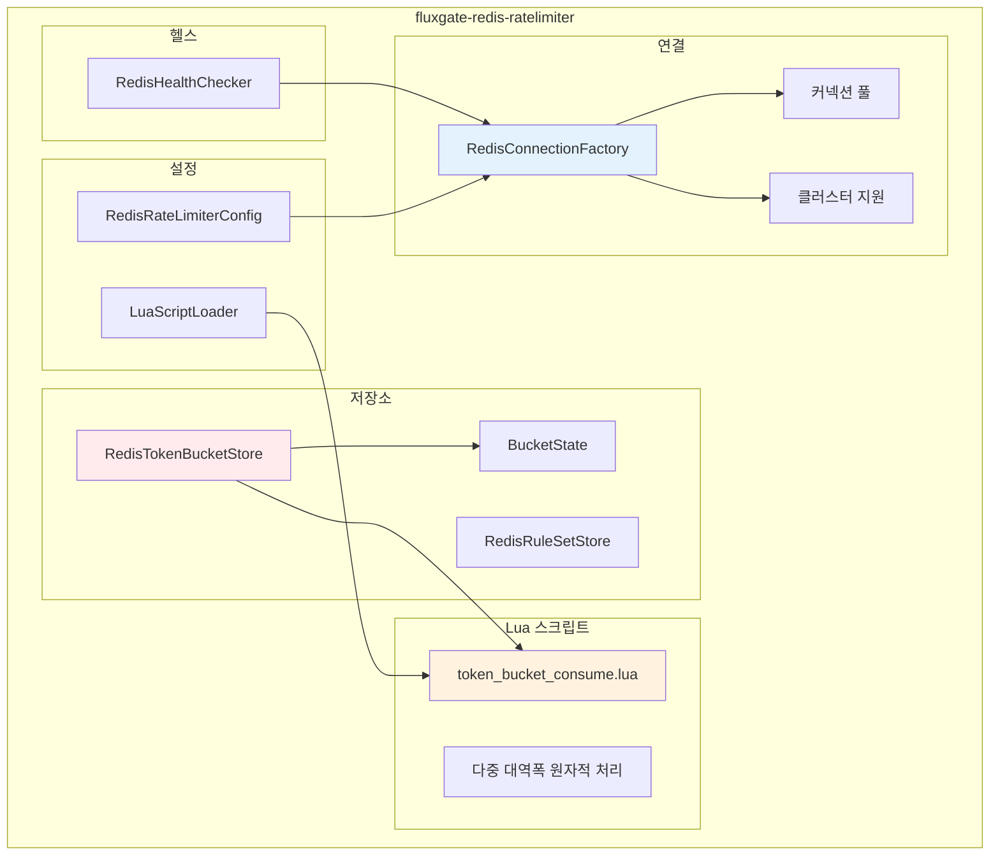
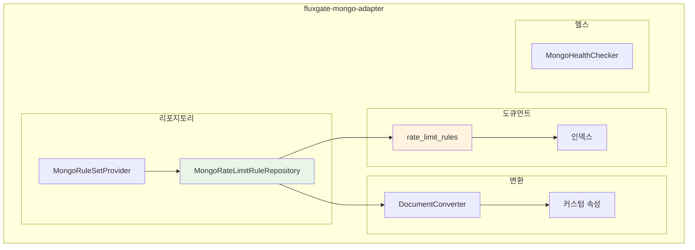
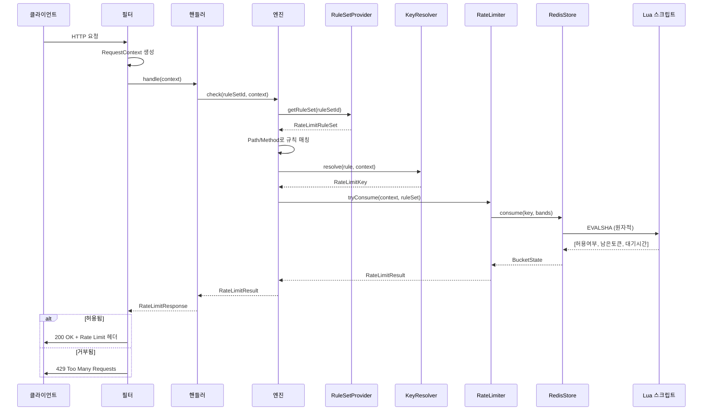
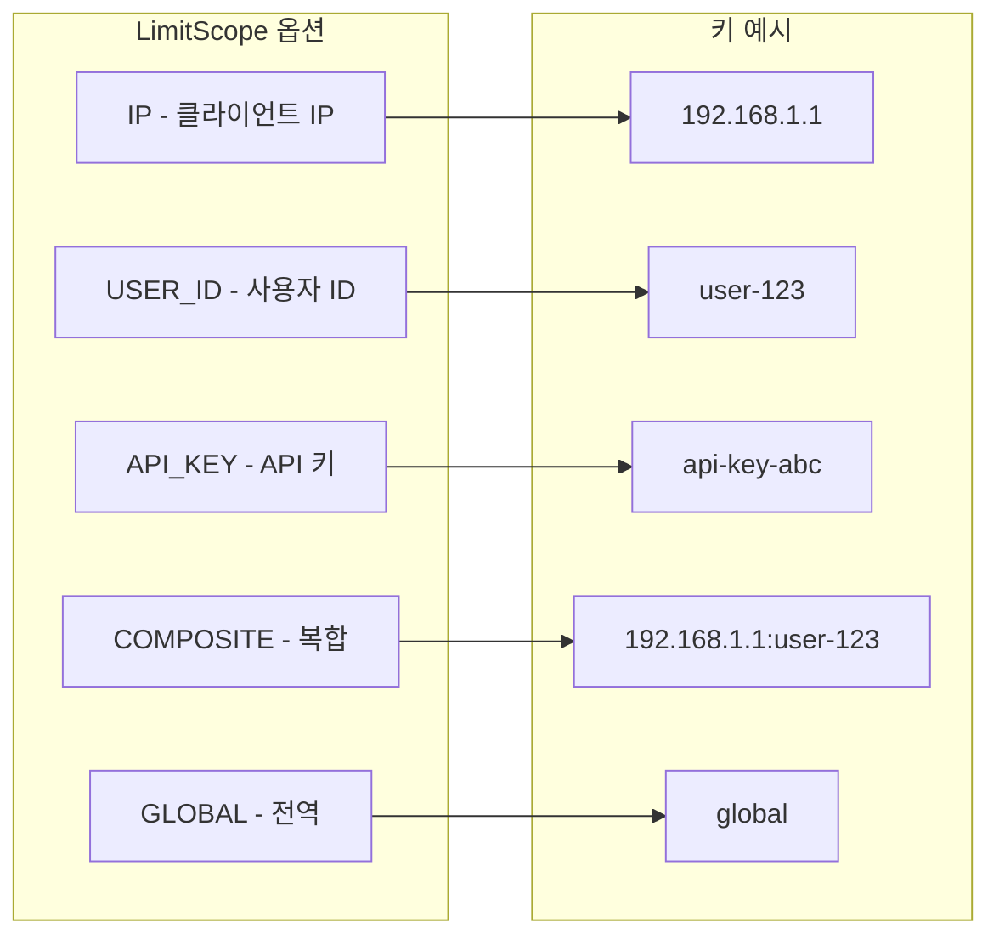
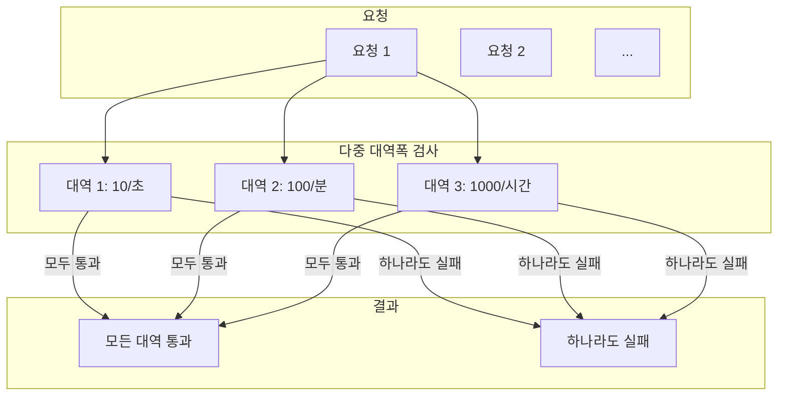
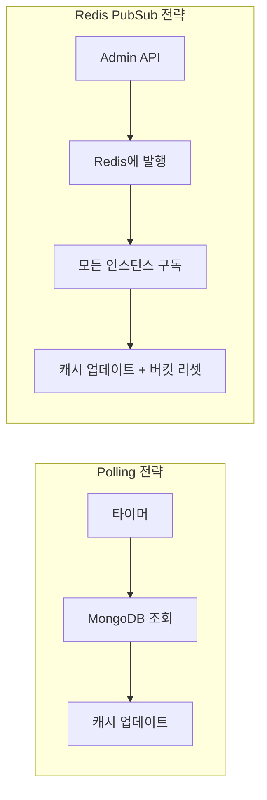

# FluxGate 아키텍처

이 문서는 FluxGate의 아키텍처, 모듈 구조, 데이터 흐름, 커스터마이징 포인트에 대한 상세한 개요를 제공합니다.

[English](ARCHITECTURE.md) | 한국어

---

## 목차

1. [요약 아키텍처](#1-요약-아키텍처)
2. [상세 아키텍처](#2-상세-아키텍처)
3. [커스터마이징 아키텍처](#3-커스터마이징-아키텍처)
4. [모듈별 아키텍처](#4-모듈별-아키텍처)
   - [fluxgate-core](#41-fluxgate-core)
   - [fluxgate-redis-ratelimiter](#42-fluxgate-redis-ratelimiter)
   - [fluxgate-mongo-adapter](#43-fluxgate-mongo-adapter)
   - [fluxgate-spring-boot-starter](#44-fluxgate-spring-boot-starter)
5. [데이터 흐름](#5-데이터-흐름)
6. [핵심 개념](#6-핵심-개념)

---

## 1. 요약 아키텍처



### 핵심 흐름

1. **HTTP 요청** → Filter가 요청을 가로챔
2. **Handler**가 요청 컨텍스트 생성
3. **Engine**이 규칙 조회 + 토큰 소비
4. **결정** → 허용 또는 거부 응답

---

## 2. 상세 아키텍처



### 레이어 설명

| 레이어 | 책임 |
|--------|------|
| **필터 레이어** | HTTP 요청 가로채기, 컨텍스트 생성 |
| **핸들러 레이어** | Rate Limiting 로직 조율 (인터페이스 + 구현체) |
| **엔진 레이어** | 규칙 조회, 캐싱 |
| **RateLimiter 레이어** | 토큰 버킷 알고리즘 실행 |
| **스토리지 레이어** | 규칙과 상태의 영구 저장 |
| **리로드 레이어** | 재시작 없이 규칙 핫 리로드 |

### 핸들러 구현체 비교

| 구현체 | 용도 | 연결 대상 |
|--------|------|----------|
| `StandaloneRateLimitHandler` | Redis 직접 접근 | RuleSetProvider + RedisRateLimiter |
| `HttpRateLimitHandler` | 외부 API 호출 | FluxGate API Server (REST) |

```
StandaloneRateLimitHandler 흐름:
─────────────────────────────────
Filter → Handler → RuleSetProvider (MongoDB)
                 → RedisRateLimiter → RedisTokenBucketStore → Lua → Redis

HttpRateLimitHandler 흐름:
─────────────────────────────────
Filter → Handler → HTTP POST → FluxGate API Server (외부)
```

---

## 3. 커스터마이징 아키텍처



### 커스터마이징 포인트

| 포인트 | 인터페이스 | 용도 |
|--------|-----------|------|
| **RequestContextCustomizer** | `RequestContextCustomizer` | IP 추출, 사용자 ID, 커스텀 속성 |
| **KeyResolver** | `KeyResolver` | Rate Limit 키 생성 로직 |
| **RateLimitHandler** | `RateLimitHandler` | Rate Limiting 전체 흐름 제어 |
| **RuleSetProvider** | `RuleSetProvider` | 규칙 소스 (DB, 파일 등) |
| **BucketResetHandler** | `BucketResetHandler` | 규칙 변경 시 버킷 리셋 |

### 예시: 커스텀 RequestContextCustomizer

```java
@Component
public class TenantContextCustomizer implements RequestContextCustomizer {

    @Override
    public RequestContext.Builder customize(
            RequestContext.Builder builder,
            HttpServletRequest request) {

        // 헤더에서 테넌트 추출
        String tenantId = request.getHeader("X-Tenant-Id");
        builder.attribute("tenantId", tenantId);

        // 클라이언트 IP 재정의 (예: Cloudflare)
        String cfIp = request.getHeader("CF-Connecting-IP");
        if (cfIp != null) {
            builder.clientIp(cfIp);
        }

        return builder;
    }
}
```

---

## 4. 모듈별 아키텍처

### 4.1 fluxgate-core

Rate Limiting 엔진과 인터페이스를 포함하는 핵심 모듈입니다.



#### 핵심 클래스

| 클래스 | 설명 |
|--------|------|
| `RateLimitRule` | 단일 Rate Limit 규칙 (path, method, bands, scope) |
| `RateLimitBand` | 대역폭 설정 (capacity, refillTokens, refillDuration) |
| `LimitScope` | 키 범위 (IP, USER_ID, API_KEY, COMPOSITE) |
| `RateLimitEngine` | 규칙 매칭 + Rate Limiting 실행 |
| `RequestContext` | 요청 메타데이터 (IP, userId, path, method, attributes) |

#### LimitScope Enum

```java
public enum LimitScope {
    GLOBAL,      // 단일 전역 제한
    IP,          // 클라이언트 IP별
    USER_ID,     // 사용자 식별자별
    API_KEY,     // API 키별
    COMPOSITE    // 여러 범위 조합
}
```

---

### 4.2 fluxgate-redis-ratelimiter

원자적 Lua 스크립트를 사용하는 Redis 기반 분산 Rate Limiter입니다.



#### 핵심 기능

| 기능 | 설명 |
|------|------|
| **Lua 스크립트** | 원자적 토큰 소비 (Race Condition 방지) |
| **다중 대역폭** | 여러 대역폭을 단일 Lua 호출로 처리 |
| **서버 시간** | Redis 서버 시간 사용 (Clock Drift 방지) |
| **클러스터** | Redis Cluster 자동 감지 및 지원 |

#### Lua 스크립트 흐름

```lua
-- token_bucket_consume.lua (간략화)
local key = KEYS[1]
local capacity = tonumber(ARGV[1])
local refillTokens = tonumber(ARGV[2])
local refillNanos = tonumber(ARGV[3])
local tokensToConsume = tonumber(ARGV[4])
local nowNanos = redis.call('TIME')[1] * 1000000000

-- 현재 상태 조회
local tokens = tonumber(redis.call('HGET', key, 'tokens') or capacity)
local lastRefill = tonumber(redis.call('HGET', key, 'lastRefill') or nowNanos)

-- 리필 계산
local elapsed = nowNanos - lastRefill
local refillAmount = math.floor(elapsed / refillNanos) * refillTokens
tokens = math.min(capacity, tokens + refillAmount)

-- 토큰 소비 시도
if tokens >= tokensToConsume then
    tokens = tokens - tokensToConsume
    redis.call('HSET', key, 'tokens', tokens, 'lastRefill', nowNanos)
    return {1, tokens, 0}  -- 허용, 남은 토큰, 대기 시간
else
    local waitNanos = math.ceil((tokensToConsume - tokens) / refillTokens) * refillNanos
    return {0, tokens, waitNanos}  -- 거부, 남은 토큰, 대기 시간
end
```

---

### 4.3 fluxgate-mongo-adapter

동적 규칙 관리를 위한 MongoDB 어댑터입니다.



#### MongoDB 도큐먼트 구조

```json
{
  "_id": "rule-1",
  "ruleSetId": "api-limits",
  "path": "/api/users/*",
  "method": "GET",
  "limitScope": "IP",
  "compositeKeyFields": null,
  "bands": [
    {
      "label": "per-second",
      "capacity": 100,
      "refillTokens": 100,
      "refillSeconds": 1
    },
    {
      "label": "per-minute",
      "capacity": 1000,
      "refillTokens": 1000,
      "refillSeconds": 60
    }
  ],
  "priority": 10,
  "enabled": true,
  "onLimitExceed": "REJECT",
  "attributes": {
    "tenant": "enterprise",
    "tier": "premium"
  },
  "createdAt": "2024-01-01T00:00:00Z",
  "updatedAt": "2024-01-01T00:00:00Z"
}
```

#### 인덱스

```javascript
// 성능을 위한 권장 인덱스
db.rate_limit_rules.createIndex({ "ruleSetId": 1, "enabled": 1 })
db.rate_limit_rules.createIndex({ "ruleSetId": 1, "priority": -1 })
```

---

### 4.4 fluxgate-spring-boot-starter

원활한 통합을 위한 Spring Boot 자동 설정입니다.

```mermaid
flowchart TB
    subgraph Starter["fluxgate-spring-boot-starter"]
        subgraph AutoConfig["자동 설정"]
            FAC[FluxgateFilterAutoConfiguration]
            MAC[FluxgateMongoAutoConfiguration]
            RAC[FluxgateRedisAutoConfiguration]
            REAC[FluxgateReloadAutoConfiguration]
            MEAC[FluxgateMetricsAutoConfiguration]
            AAC[FluxgateActuatorAutoConfiguration]
        end

        subgraph Properties["프로퍼티"]
            PROP[FluxgateProperties]
            RPROP[Redis 프로퍼티]
            MPROP[Mongo 프로퍼티]
        end

        subgraph Filter["필터"]
            FLT[FluxgateRateLimitFilter]
            REG[FilterRegistration]
            CUST[RequestContextCustomizer]
        end

        subgraph Annotation["어노테이션"]
            ENABLE[@EnableFluxgateFilter]
            SEL[FilterConfigurationSelector]
        end

        subgraph Metrics["메트릭"]
            MIC[MicrometerMetricsRecorder]
            PROM[Prometheus 통합]
        end

        subgraph Actuator["Actuator"]
            HEALTH[FluxgateHealthIndicator]
            INFO[FluxgateInfoContributor]
        end
    end

    ENABLE --> SEL
    SEL --> FAC
    FAC --> FLT
    FAC --> REG
    PROP --> FAC & MAC & RAC
    MEAC --> MIC
    AAC --> HEALTH

    style ENABLE fill:#e1f5fe
    style FAC fill:#fff3e0
    style FLT fill:#e8f5e9
```

#### Spring Boot 2.x vs 3.x

| 기능 | Boot 2.x 스타터 | Boot 3.x 스타터 |
|------|-----------------|-----------------|
| Java 버전 | 11+ | 17+ |
| Servlet API | `javax.servlet` | `jakarta.servlet` |
| 자동 설정 | `spring.factories` | `AutoConfiguration.imports` |
| Caffeine | 2.x | 3.x |
| Micrometer | 1.9.x | 1.13.x |

#### 설정 프로퍼티

```yaml
fluxgate:
  # Redis 설정
  redis:
    enabled: true
    uri: redis://localhost:6379
    # cluster-nodes: node1:7000,node2:7001,node3:7002
    pool:
      max-total: 50
      max-idle: 10
      min-idle: 5

  # MongoDB 설정
  mongo:
    enabled: true
    uri: mongodb://localhost:27017/fluxgate
    database: fluxgate
    collection: rate_limit_rules

  # Rate Limiting 설정
  ratelimit:
    filter-enabled: true
    default-rule-set-id: api-limits
    filter-order: 1
    include-patterns:
      - /api/*
    exclude-patterns:
      - /health
      - /actuator/*
    missing-rule-behavior: ALLOW  # 또는 REJECT

  # 핫 리로드 설정
  reload:
    enabled: true
    strategy: POLLING  # 또는 REDIS_PUBSUB
    polling-interval: 30s
    reset-buckets-on-reload: true

  # Wait for Refill 설정
  wait-for-refill:
    enabled: false
    max-wait-time: 5s
```

---

## 5. 데이터 흐름

### 시퀀스 다이어그램



### 응답 헤더

요청이 처리되면 FluxGate는 다음 헤더를 추가합니다:

```http
X-RateLimit-Limit: 100
X-RateLimit-Remaining: 95
X-RateLimit-Reset: 1640000000
Retry-After: 60  # 거부된 경우에만
```

---

## 6. 핵심 개념

### 6.1 LimitScope (Rate Limit 키 범위)



### 6.2 다중 대역폭 Rate Limiting



**다중 대역폭 설정 예시:**

```java
RateLimitRule rule = RateLimitRule.builder()
    .id("api-rule")
    .ruleSetId("api-limits")
    .path("/api/*")
    .addBand(RateLimitBand.of(10, 10, Duration.ofSeconds(1)))   // 10/초
    .addBand(RateLimitBand.of(100, 100, Duration.ofMinutes(1))) // 100/분
    .addBand(RateLimitBand.of(1000, 1000, Duration.ofHours(1))) // 1000/시간
    .limitScope(LimitScope.IP)
    .build();
```

### 6.3 OnLimitExceedPolicy

| 정책 | 동작 |
|------|------|
| `REJECT` | 즉시 429 Too Many Requests 반환 |
| `WAIT_FOR_REFILL` | 토큰이 리필될 때까지 대기 후 진행 |

```yaml
fluxgate:
  ratelimit:
    default-policy: REJECT
  wait-for-refill:
    enabled: true
    max-wait-time: 5s
```

### 6.4 핫 리로드 전략

| 전략 | 설명 | 사용 사례 |
|------|------|----------|
| `POLLING` | 주기적으로 MongoDB 변경 조회 | 간단한 설정, 최종 일관성 |
| `REDIS_PUBSUB` | Redis 채널 구독으로 실시간 업데이트 | 실시간 업데이트, 다중 인스턴스 동기화 |



---

## Deep Dive 문서

레이어별 상세 문서:

| 문서 | 설명 |
|------|------|
| [Filter Layer](deep-dive/filter-layer.ko.md) | FluxgateRateLimitFilter, RequestContext |
| [Handler Layer](deep-dive/handler-layer.ko.md) | FluxgateRateLimitHandler 인터페이스 및 구현체 |
| [Engine Layer](deep-dive/engine-layer.ko.md) | RateLimitEngine, CachingRuleSetProvider, KeyResolver |
| [RateLimiter Layer](deep-dive/ratelimiter-layer.ko.md) | RateLimiter 인터페이스, Token Bucket 알고리즘 |
| [Storage Layer](deep-dive/storage-layer.ko.md) | RedisTokenBucketStore, Lua 스크립트, NOSCRIPT 처리 |
| [Redis RateLimiter Module](deep-dive/redis-ratelimiter.ko.md) | fluxgate-redis-ratelimiter 모듈 전체 |
| [Hot Reload](deep-dive/hot-reload.ko.md) | Polling/PubSub 전략, BucketResetHandler |
| [Algorithm Analysis](algorithm-analysis.ko.md) | Token Bucket 알고리즘 상세 분석 |

---

## 관련 문서

- [README.md](../README.md) - 시작 가이드
- [README.ko.md](../README.ko.md) - 시작 가이드 (한국어)
- [CONTRIBUTING.md](../CONTRIBUTING.md) - 기여 가이드라인
- [fluxgate-samples](fluxgate-samples/) - 샘플 애플리케이션

---

## 라이선스

MIT 라이선스 - 자세한 내용은 [LICENSE](../LICENSE)를 참조하세요.
