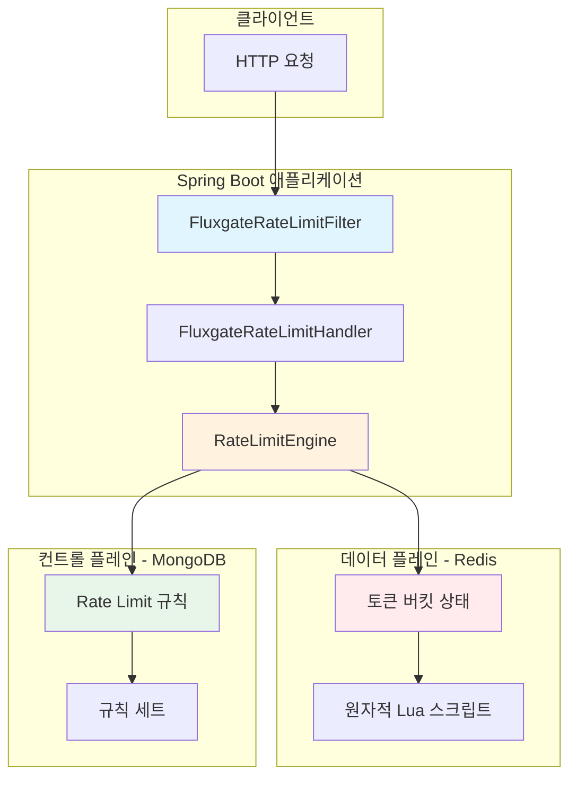
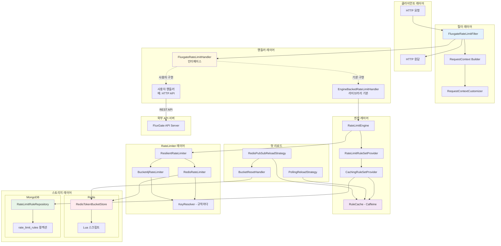
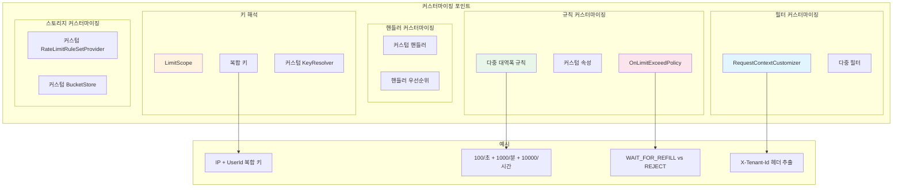
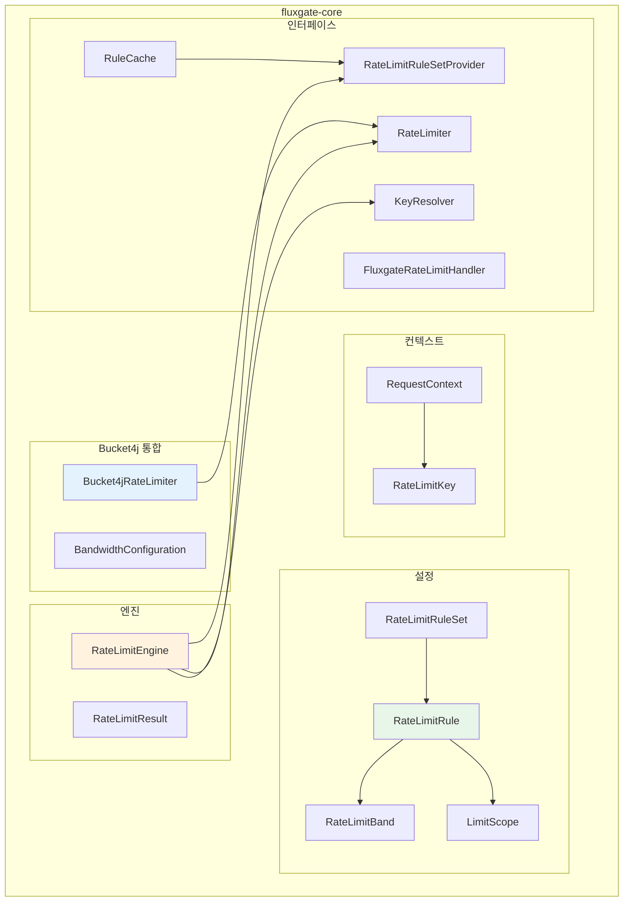
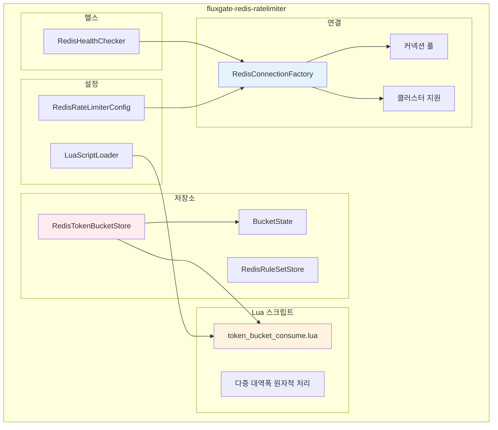
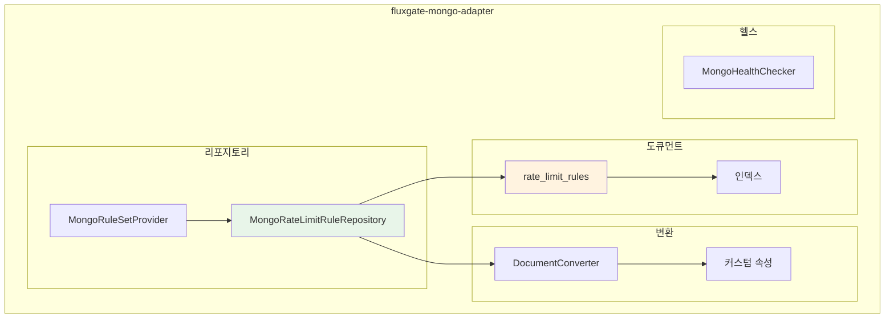
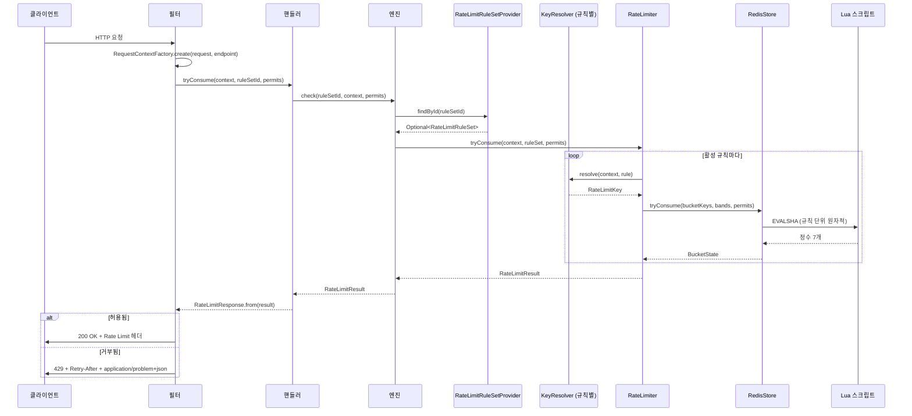
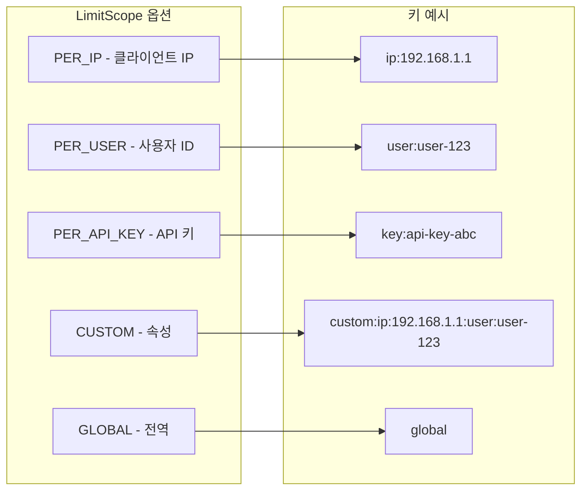
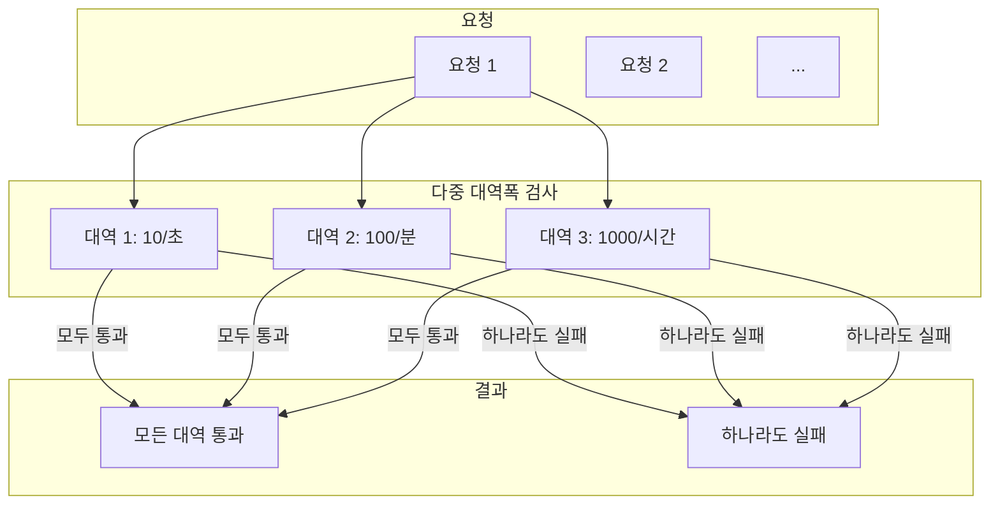
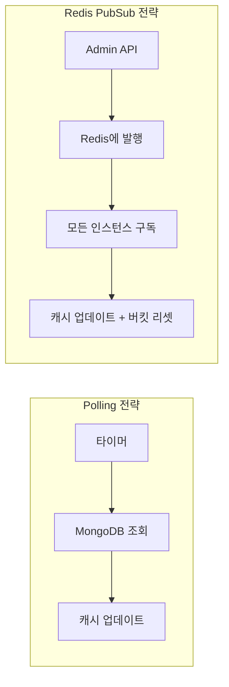

# FluxGate 아키텍처

이 문서는 FluxGate의 아키텍처, 모듈 구조, 데이터 흐름, 커스터마이징 포인트에 대한 상세한 개요를 제공합니다.

[English](../../en/architecture/README.md) | 한국어

---

## 목차

1. [요약 아키텍처](#1-요약-아키텍처)
2. [상세 아키텍처](#2-상세-아키텍처)
3. [커스터마이징 아키텍처](#3-커스터마이징-아키텍처)
4. [모듈별 아키텍처](#4-모듈별-아키텍처)
   - [fluxgate-core](#41-fluxgate-core)
   - [fluxgate-redis-ratelimiter](#42-fluxgate-redis-ratelimiter)
   - [fluxgate-mongo-adapter](#43-fluxgate-mongo-adapter)
   - [fluxgate-spring-boot3-starter](#44-fluxgate-spring-boot3-starter)
5. [데이터 흐름](#5-데이터-흐름)
6. [핵심 개념](#6-핵심-개념)

---

## 1. 요약 아키텍처


```mermaid
flowchart TB
    subgraph Client["클라이언트"]
        HTTP[HTTP 요청]
    end

    subgraph SpringBoot["Spring Boot 애플리케이션"]
        Filter[FluxgateRateLimitFilter]
        Handler[FluxgateRateLimitHandler]
        Engine[RateLimitEngine]
    end

    subgraph DataPlane["데이터 플레인 - Redis"]
        TokenBucket[토큰 버킷 상태]
        LuaScript[원자적 Lua 스크립트]
    end

    subgraph ControlPlane["컨트롤 플레인 - MongoDB"]
        Rules[Rate Limit 규칙]
        RuleSets[규칙 세트]
    end

    HTTP --> Filter
    Filter --> Handler
    Handler --> Engine
    Engine --> TokenBucket
    Engine --> Rules
    TokenBucket --> LuaScript
    Rules --> RuleSets

    style Filter fill:#e1f5fe
    style Engine fill:#fff3e0
    style TokenBucket fill:#ffebee
    style Rules fill:#e8f5e9
```

### 핵심 흐름

1. **HTTP 요청** → Filter가 요청을 가로챔
2. **Handler**가 요청 컨텍스트 생성
3. **Engine**이 규칙 조회 + 토큰 소비
4. **결정** → 허용 또는 거부 응답

---

## 2. 상세 아키텍처


```mermaid
flowchart TB
    subgraph Client["클라이언트 레이어"]
        REQ[HTTP 요청]
        RES[HTTP 응답]
    end

    subgraph Filter["필터 레이어"]
        FLT[FluxgateRateLimitFilter]
        REQ_CTX[RequestContext Builder]
        CUST[RequestContextCustomizer]
    end

    subgraph Handler["핸들러 레이어"]
        direction TB
        HI[FluxgateRateLimitHandler<br/>인터페이스]
        EBH[EngineBackedRateLimitHandler<br/>라이브러리 기본]
        HH[사용자 핸들러<br/>예: HTTP API]
    end

    subgraph Engine["엔진 레이어"]
        ENG[RateLimitEngine]
        PROV[RateLimitRuleSetProvider]
        CPROV[CachingRuleSetProvider]
        CACHE[RuleCache - Caffeine]
    end

    subgraph RateLimiter["RateLimiter 레이어"]
        RES_RL[ResilientRateLimiter]
        RRL[RedisRateLimiter]
        B4J[Bucket4jRateLimiter]
        KEY[KeyResolver - 규칙마다]
    end

    subgraph Storage["스토리지 레이어"]
        subgraph Redis["Redis"]
            TBS[RedisTokenBucketStore]
            LUA[Lua 스크립트]
        end
        subgraph MongoDB["MongoDB"]
            REPO[RateLimitRuleRepository]
            COLL[rate_limit_rules 컬렉션]
        end
    end

    subgraph Reload["핫 리로드"]
        POLL[PollingReloadStrategy]
        PUBSUB[RedisPubSubReloadStrategy]
        RESET[BucketResetHandler]
    end

    subgraph External["외부 API 서버"]
        API[FluxGate API Server]
    end

    REQ --> FLT
    FLT --> REQ_CTX
    REQ_CTX --> CUST
    FLT --> HI
    HI -.->|기본 구현| EBH
    HI -.->|사용자 구현| HH
    EBH --> ENG
    HH -->|REST API| API
    ENG --> PROV
    PROV --> CPROV
    CPROV --> CACHE
    CPROV --> REPO
    ENG --> RES_RL
    RES_RL --> RRL & B4J
    RRL --> KEY
    B4J --> KEY
    RRL --> TBS
    TBS --> LUA
    REPO --> COLL
    POLL --> CACHE
    PUBSUB --> CACHE
    PUBSUB --> RESET
    RESET --> TBS
    FLT --> RES

    style FLT fill:#e3f2fd
    style HI fill:#fff8e1
    style TBS fill:#ffebee
    style REPO fill:#e8f5e9
    style CACHE fill:#f3e5f5
```

### 레이어 설명

| 레이어 | 책임 |
|--------|------|
| **필터 레이어** | HTTP 요청 가로채기, 컨텍스트 생성 |
| **핸들러 레이어** | Rate Limiting 로직 조율 (인터페이스 + 구현체) |
| **엔진 레이어** | 규칙 조회, 캐싱 |
| **RateLimiter 레이어** | 토큰 버킷 알고리즘 실행 |
| **스토리지 레이어** | 규칙과 상태의 영구 저장 |
| **리로드 레이어** | 재시작 없이 규칙 핫 리로드 |

### 핸들러 구현체 비교

| 구현체 | 용도 | 연결 대상 |
|--------|------|----------|
| `EngineBackedRateLimitHandler` | Redis 직접 접근 (라이브러리 기본) | RuleSetProvider + RedisRateLimiter |
| `HttpRateLimitHandler` | 외부 API 호출 | FluxGate API Server (REST) |

```
EngineBackedRateLimitHandler 흐름:
─────────────────────────────────
Filter → Handler → RuleSetProvider (MongoDB)
                 → RedisRateLimiter → RedisTokenBucketStore → Lua → Redis

HttpRateLimitHandler 흐름:
─────────────────────────────────
Filter → Handler → HTTP POST → FluxGate API Server (외부)
```

---

## 3. 커스터마이징 아키텍처


```mermaid
flowchart TB
    subgraph Customization["커스터마이징 포인트"]
        subgraph FilterCustom["필터 커스터마이징"]
            RC[RequestContextCustomizer]
            MF[다중 필터]
        end

        subgraph HandlerCustom["핸들러 커스터마이징"]
            CH[커스텀 핸들러]
            HP[핸들러 우선순위]
        end

        subgraph KeyCustom["키 해석"]
            LS[LimitScope]
            CK[복합 키]
            CKR[커스텀 KeyResolver]
        end

        subgraph RuleCustom["규칙 커스터마이징"]
            MB[다중 대역폭 규칙]
            ATTR[커스텀 속성]
            POL[OnLimitExceedPolicy]
        end

        subgraph StorageCustom["스토리지 커스터마이징"]
            CS[커스텀 RateLimitRuleSetProvider]
            CBS[커스텀 BucketStore]
        end
    end

    subgraph Examples["예시"]
        E1["IP + UserId 복합 키"]
        E2["100/초 + 1000/분 + 10000/시간"]
        E3["WAIT_FOR_REFILL vs REJECT"]
        E4["X-Tenant-Id 헤더 추출"]
    end

    RC --> E4
    CK --> E1
    MB --> E2
    POL --> E3

    style RC fill:#e1f5fe
    style LS fill:#fff3e0
    style MB fill:#e8f5e9
    style POL fill:#fce4ec
```

### 커스터마이징 포인트

| 포인트 | 인터페이스 | 용도 |
|--------|-----------|------|
| **RequestContextCustomizer** | `RequestContextCustomizer` | IP 추출, 사용자 ID, 커스텀 속성 |
| **KeyResolver** | `KeyResolver` | Rate Limit 키 생성 로직 |
| **FluxgateRateLimitHandler** | `FluxgateRateLimitHandler` | Rate Limiting 전체 흐름 제어 |
| **RateLimitRuleSetProvider** | `RateLimitRuleSetProvider` | 규칙 소스 (DB, 파일 등) |
| **RateLimitResponseWriter** | `RateLimitResponseWriter` | 429 응답 본문 |
| **BucketResetHandler** | `BucketResetHandler` | 규칙 변경 시 버킷 리셋 |

### 예시: 커스텀 RequestContextCustomizer

```java
@Component
public class TenantContextCustomizer implements RequestContextCustomizer {

    @Override
    public RequestContext.Builder customize(
            RequestContext.Builder builder,
            HttpServletRequest request) {

        // 헤더에서 테넌트 추출
        String tenantId = request.getHeader("X-Tenant-Id");
        builder.attribute("tenantId", tenantId);

        // 클라이언트 IP 재정의 (예: Cloudflare)
        String cfIp = request.getHeader("CF-Connecting-IP");
        if (cfIp != null) {
            builder.clientIp(cfIp);
        }

        return builder;
    }
}
```

---

## 4. 모듈별 아키텍처

### 4.1 fluxgate-core

Rate Limiting 엔진과 인터페이스를 포함하는 핵심 모듈입니다.


```mermaid
flowchart TB
    subgraph Core["fluxgate-core"]
        subgraph Config["설정"]
            RULE[RateLimitRule]
            BAND[RateLimitBand]
            RSET[RateLimitRuleSet]
            SCOPE[LimitScope]
        end

        subgraph Context["컨텍스트"]
            RCTX[RequestContext]
            RKEY[RateLimitKey]
        end

        subgraph EngineCore["엔진"]
            ENG[RateLimitEngine]
            RES[RateLimitResult]
        end

        subgraph Interfaces["인터페이스"]
            IRL[RateLimiter]
            IPROV[RateLimitRuleSetProvider]
            IKEY[KeyResolver]
            IHAND[FluxgateRateLimitHandler]
            ICACHE[RuleCache]
        end

        subgraph Bucket4j["Bucket4j 통합"]
            B4J[Bucket4jRateLimiter]
            BCONF[BandwidthConfiguration]
        end
    end

    RULE --> BAND
    RULE --> SCOPE
    RSET --> RULE
    RCTX --> RKEY
    ENG --> IPROV
    ENG --> IRL
    ENG --> IKEY
    B4J --> IRL
    ICACHE --> IPROV

    style RULE fill:#e8f5e9
    style ENG fill:#fff3e0
    style B4J fill:#e3f2fd
```

#### 핵심 클래스

| 클래스 | 설명 |
|--------|------|
| `RateLimitRule` | 단일 Rate Limit 규칙 (id, scope, keyStrategyId, bands, policy, attributes). path·method·priority는 **없습니다** |
| `RateLimitBand` | 한 계층: `(window, capacity)` + 선택적 label |
| `LimitScope` | 키 범위 (`GLOBAL`, `PER_IP`, `PER_USER`, `PER_API_KEY`, `CUSTOM`) |
| `RateLimitEngine` | 룰셋 해석 + `RateLimiter` 위임 (규칙 매칭 로직 없음) |
| `RequestContext` | 요청 메타데이터 (clientIp, userId, apiKey, endpoint, method, headers, attributes) |

#### LimitScope Enum

```java
public enum LimitScope {
    GLOBAL,       // 모든 요청이 하나의 버킷
    PER_API_KEY,  // API 키별
    PER_USER,     // 사용자 식별자별
    PER_IP,       // 클라이언트 IP별
    CUSTOM        // rule.keyStrategyId가 지정한 RequestContext 속성 값별
}
```

복합 키는 `RequestContextCustomizer`에서 직접 만든 속성을 읽는 `CUSTOM` 규칙입니다.
`COMPOSITE` 스코프나 `compositeKeyFields` 필드는 존재하지 않습니다.

---

### 4.2 fluxgate-redis-ratelimiter

원자적 Lua 스크립트를 사용하는 Redis 기반 분산 Rate Limiter입니다.


```mermaid
flowchart TB
    subgraph Redis["fluxgate-redis-ratelimiter"]
        subgraph Connection["연결"]
            CF[RedisConnectionFactory]
            POOL[커넥션 풀]
            CLUSTER[클러스터 지원]
        end

        subgraph Store["저장소"]
            TBS[RedisTokenBucketStore]
            RSS[RedisRuleSetStore]
            STATE[BucketState]
        end

        subgraph Script["Lua 스크립트"]
            CONSUME[token_bucket_consume.lua]
            MULTI[다중 대역폭 원자적 처리]
        end

        subgraph Config["설정"]
            CONF[RedisRateLimiterConfig]
            LOADER[LuaScriptLoader]
        end

        subgraph Health["헬스"]
            HC[RedisHealthChecker]
        end
    end

    CF --> POOL
    CF --> CLUSTER
    TBS --> CONSUME
    TBS --> STATE
    CONF --> CF
    LOADER --> CONSUME
    HC --> CF

    style TBS fill:#ffebee
    style CONSUME fill:#fff3e0
    style CF fill:#e3f2fd
```

#### 핵심 기능

| 기능 | 설명 |
|------|------|
| **Lua 스크립트** | 원자적 토큰 소비 (Race Condition 방지) |
| **다중 대역폭** | 한 규칙의 모든 대역을 단일 Lua 호출로, 전부-또는-전무 처리 |
| **서버 시간** | Redis 서버 시간을 마이크로초로 사용 (Clock Drift 방지) |
| **클러스터** | Redis Cluster 자동 감지. `{...}` 해시 태그로 한 규칙의 대역들을 한 슬롯에 고정 |
| **범위 제한 삭제** | `fluxgate:bucket:*`만 대상으로 `SCAN` + `UNLINK`. `KEYS`를 쓰지 않습니다 |

#### Lua 스크립트 흐름

```lua
-- token_bucket_consume.lua (간략화. 전체 계약은 모듈 README 참고)
-- KEYS[1..n]   한 규칙의 대역마다 하나의 버킷 키. 모두 같은 해시 태그 안에 있어야 합니다
-- ARGV[1]      permits
-- ARGV[2+3i]   capacity,  ARGV[3+3i] window_micros,  ARGV[4+3i] 예약 ("0")

local time_info = redis.call('TIME')
local now_micros = tonumber(time_info[1]) * 1000000 + tonumber(time_info[2])

-- 1패스: 아무것도 쓰기 전에 모든 대역을 리필하고 검사
for i = 1, band_count do
    local bucket_data = redis.call('HMGET', KEYS[i], 'tokens', 'last_refill_micros')
    local current_tokens = tonumber(bucket_data[1])
    local last_refill_micros = tonumber(bucket_data[2])
    if current_tokens == nil or last_refill_micros == nil then
        current_tokens = capacity          -- 없거나 0.3.x 버킷: 가득 찬 상태로 시작
        last_refill_micros = now_micros
    end

    local elapsed_micros = math.min(math.max(0, now_micros - last_refill_micros), window_micros)
    local tokens_to_add = math.floor(elapsed_micros * capacity / window_micros)
    local refilled = math.min(capacity, current_tokens + tokens_to_add)

    if refilled < permits then
        -- 거부: 상태를 쓰지 않습니다. TTL만 갱신합니다(EXPIRE는 없는 키에는 no-op).
        -- 허용했을 대역은 토큰을 그대로 유지합니다.
        for j = 1, band_count do
            redis.call('EXPIRE', KEYS[j], ttl_seconds(windows[j]))
        end
        return {0, i, refilled, micros_to_wait, reset_time_millis, capacity, i}
    end
end

-- 2패스: 전부 가능하므로 모든 대역에서 차감
for i = 1, band_count do
    redis.call('HMSET', KEYS[i],
        'tokens', string.format('%.0f', remaining),
        'last_refill_micros', string.format('%.0f', refill_micros[i]))
    redis.call('EXPIRE', KEYS[i], ttl_seconds(windows[i]))   -- max(1, ceil(window*1.1)), 상한 없음
end

-- 리셋 시각은 소비 **후**에 계산합니다.
return {1, 0, tokens[binding], 0, reset_time_millis, binding_capacity, binding}
```

시간 단위는 나노초가 아니라 **마이크로초**입니다. Redis의 Lua 5.1에서 모든 수는 정확한 정수 범위가
2^53인 double이고, epoch 나노초(약 1.76e18)는 그 범위를 벗어납니다. 해시에 쓰는 모든 값은
`string.format('%.0f', v)`를 통과합니다.

---

### 4.3 fluxgate-mongo-adapter

동적 규칙 관리를 위한 MongoDB 어댑터입니다.


```mermaid
flowchart TB
    subgraph Mongo["fluxgate-mongo-adapter"]
        subgraph Repository["리포지토리"]
            REPO[MongoRateLimitRuleRepository]
            PROV[MongoRuleSetProvider]
        end

        subgraph Document["도큐먼트"]
            DOC[rate_limit_rules]
            IDX[인덱스]
        end

        subgraph Conversion["변환"]
            CONV[DocumentConverter]
            ATTR[커스텀 속성]
        end

        subgraph Health["헬스"]
            HC[MongoHealthChecker]
        end
    end

    REPO --> DOC
    REPO --> CONV
    PROV --> REPO
    DOC --> IDX
    CONV --> ATTR

    style REPO fill:#e8f5e9
    style DOC fill:#fff3e0
```

#### MongoDB 도큐먼트 구조

```json
{
  "id": "rule-1",
  "ruleSetId": "api-limits",
  "name": "API Rate Limit",
  "scope": "PER_IP",
  "keyStrategyId": null,
  "onLimitExceedPolicy": "REJECT_REQUEST",
  "bands": [
    { "label": "per-second", "capacity": 100, "windowSeconds": 1 },
    { "label": "per-minute", "capacity": 1000, "windowSeconds": 60 }
  ],
  "enabled": true,
  "attributes": {
    "tenant": "enterprise",
    "tier": "premium"
  }
}
```

`path`, `method`, `priority`, `compositeKeyFields` 필드는 **없습니다.** 규칙은 스코프와 대역을 갖고,
룰셋 안의 모든 활성 규칙이 평가됩니다.

#### 인덱스

```javascript
// fluxgate.mongo.ddl-auto=create가 자동으로 생성합니다
db.rate_limit_rules.createIndex({ "ruleSetId": 1 })
db.rate_limit_rules.createIndex({ "ruleSetId": 1, "id": 1 }, { unique: true })
```

---

### 4.4 fluxgate-spring-boot3-starter

원활한 통합을 위한 Spring Boot 자동 설정입니다.

```mermaid
flowchart TB
    subgraph Starter["fluxgate-spring-boot3-starter"]
        subgraph AutoConfig["자동 설정"]
            FAC[FluxgateFilterAutoConfiguration]
            MAC[FluxgateMongoAutoConfiguration]
            RAC[FluxgateRedisAutoConfiguration]
            REAC[FluxgateReloadAutoConfiguration]
            MEAC[FluxgateMetricsAutoConfiguration]
            AAC[FluxgateActuatorAutoConfiguration]
        end

        subgraph Properties["프로퍼티"]
            PROP[FluxgateProperties]
            RPROP[Redis 프로퍼티]
            MPROP[Mongo 프로퍼티]
        end

        subgraph Filter["필터"]
            FLT[FluxgateRateLimitFilter]
            REG[FilterRegistration]
            CUST[RequestContextCustomizer]
        end

        subgraph Annotation["어노테이션"]
            ENABLE[@EnableFluxgateFilter]
            SEL[FilterConfigurationSelector]
        end

        subgraph Metrics["메트릭"]
            MIC[MicrometerMetricsRecorder]
            PROM[Prometheus 통합]
        end

        subgraph Actuator["Actuator"]
            HEALTH[FluxgateHealthIndicator]
            INFO[FluxgateInfoContributor]
        end
    end

    ENABLE --> SEL
    SEL --> FAC
    FAC --> FLT
    FAC --> REG
    PROP --> FAC & MAC & RAC
    MEAC --> MIC
    AAC --> HEALTH

    style ENABLE fill:#e1f5fe
    style FAC fill:#fff3e0
    style FLT fill:#e8f5e9
```

#### Spring Boot 2.x vs 3.x

| 기능 | Boot 2.x 스타터 | Boot 3.x 스타터 |
|------|-----------------|-----------------|
| Java 버전 | 11+ | 17+ |
| Servlet API | `javax.servlet` | `jakarta.servlet` |
| 자동 설정 | `spring.factories` | `AutoConfiguration.imports` |
| Caffeine | 2.x | 3.x |
| Micrometer | 1.9.x | 1.13.x |

#### 설정 프로퍼티

```yaml
fluxgate:
  # Redis 설정
  redis:
    enabled: true
    uri: redis://localhost:6379
    # 클러스터: redis://node1:6379,redis://node2:6379,redis://node3:6379

  # MongoDB 설정
  mongo:
    enabled: true
    uri: mongodb://localhost:27017/fluxgate
    database: fluxgate
    rule-collection: rate_limit_rules

  # Rate Limiting 설정
  ratelimit:
    enabled: true                # 마스터 스위치. filter-enabled는 deprecated + 무동작
    mode: AUTO                   # AUTO | REDIS | IN_MEMORY
    default-rule-set-id: api-limits
    filter-order: 1
    include-patterns:
      - /api/**                  # /*는 세그먼트 하나만 매칭합니다
    exclude-patterns:
      - /health
      - /actuator/**
    missing-rule-behavior: DENY  # 또는 ALLOW
    failure-behavior: DENY       # 또는 ALLOW
    missing-key-behavior: FALLBACK_TO_IP  # 또는 REJECT
    trust-client-ip-header: false
    trusted-proxies: []          # trust-client-ip-header=true면 반드시 설정
    wait-for-refill:
      enabled: false
      max-wait-time-ms: 5000
      max-concurrent-waits: 50

  # 핫 리로드 설정 (fluxgate.ratelimit.reload가 아니라 fluxgate.reload)
  reload:
    enabled: true
    strategy: AUTO               # AUTO | POLLING | PUBSUB | NONE
    cache:
      ttl: 5m
      negative-ttl: 5s
    polling:
      interval: 30s
      initial-delay: 10s
    pubsub:
      channel: fluxgate:rule-reload
      backstop-polling-interval: 60s
```

---

## 5. 데이터 흐름

### 시퀀스 다이어그램


```mermaid
sequenceDiagram
    participant C as 클라이언트
    participant F as 필터
    participant H as 핸들러
    participant E as 엔진
    participant P as RateLimitRuleSetProvider
    participant K as KeyResolver (규칙별)
    participant R as RateLimiter
    participant S as RedisStore
    participant L as Lua 스크립트

    C->>F: HTTP 요청
    F->>F: RequestContextFactory.create(request, endpoint)
    F->>H: tryConsume(context, ruleSetId, permits)
    H->>E: check(ruleSetId, context, permits)
    E->>P: findById(ruleSetId)
    P-->>E: Optional<RateLimitRuleSet>
    E->>R: tryConsume(context, ruleSet, permits)
    loop 활성 규칙마다
        R->>K: resolve(context, rule)
        K-->>R: RateLimitKey
        R->>S: tryConsume(bucketKeys, bands, permits)
        S->>L: EVALSHA (규칙 단위 원자적)
        L-->>S: 정수 7개
        S-->>R: BucketState
    end
    R-->>E: RateLimitResult
    E-->>H: RateLimitResult
    H-->>F: RateLimitResponse.from(result)

    alt 허용됨
        F->>C: 200 OK + Rate Limit 헤더
    else 거부됨
        F->>C: 429 + Retry-After + application/problem+json
    end
```

### 응답 헤더

요청이 처리되면 FluxGate는 다음 헤더를 추가합니다:

```http
X-RateLimit-Limit: 100          # 레거시 계열
X-RateLimit-Remaining: 95
X-RateLimit-Reset: 1640000000   # epoch 초
RateLimit-Limit: 100            # IETF 계열
RateLimit-Remaining: 95
RateLimit-Reset: 27             # 잔여 초
RateLimit-Policy: 100;w=60
Retry-After: 27                 # 거부 시에만. 올림, 절대 0이 아님
```

두 계열 모두 기본 활성이며 독립적으로 끌 수 있습니다
(`fluxgate.ratelimit.response.include-legacy-headers` /
`response.include-standard-headers`). Limiter가 "알 수 없음"(`-1`)으로 보고한 값은 오해를 낳는
숫자로 쓰지 않고 헤더를 생략합니다. 거부 응답에는 RFC 9457 problem 문서가 함께 나갑니다.

---

## 6. 핵심 개념

### 6.1 LimitScope (Rate Limit 키 범위)


```mermaid
flowchart LR
    subgraph Scopes["LimitScope 옵션"]
        IP[PER_IP - 클라이언트 IP]
        USER[PER_USER - 사용자 ID]
        API[PER_API_KEY - API 키]
        COMP[CUSTOM - 속성]
        GLOBAL[GLOBAL - 전역]
    end

    subgraph Examples["키 예시"]
        E1["ip:192.168.1.1"]
        E2["user:user-123"]
        E3["key:api-key-abc"]
        E4["custom:ip:192.168.1.1:user:user-123"]
        E5["global"]
    end

    IP --> E1
    USER --> E2
    API --> E3
    COMP --> E4
    GLOBAL --> E5
```

### 6.2 다중 대역폭 Rate Limiting


```mermaid
flowchart TB
    subgraph Request["요청"]
        R1[요청 1]
        R2[요청 2]
        R3[...]
    end

    subgraph Bands["다중 대역폭 검사"]
        B1[대역 1: 10/초]
        B2[대역 2: 100/분]
        B3[대역 3: 1000/시간]
    end

    subgraph Result["결과"]
        ALLOW[모든 대역 통과]
        REJECT[하나라도 실패]
    end

    R1 --> B1 & B2 & B3
    B1 & B2 & B3 -->|모두 통과| ALLOW
    B1 & B2 & B3 -->|하나라도 실패| REJECT
```

**다중 대역폭 설정 예시:**

```java
RateLimitRule rule = RateLimitRule.builder("api-rule")
    .ruleSetId("api-limits")
    .scope(LimitScope.PER_IP)
    .addBand(RateLimitBand.builder(Duration.ofSeconds(1), 10)
        .label("10-per-second")
        .build())
    .addBand(RateLimitBand.builder(Duration.ofMinutes(1), 100)
        .label("100-per-minute")
        .build())
    .addBand(RateLimitBand.builder(Duration.ofHours(1), 1000)
        .label("1000-per-hour")
        .build())
    .build();
```

### 6.3 OnLimitExceedPolicy

| 정책 | 동작 |
|------|------|
| `REJECT_REQUEST` | 즉시 429 Too Many Requests 반환 |
| `WAIT_FOR_REFILL` | 토큰이 리필될 때까지 대기 후 진행 |

정책은 규칙 단위로 설정합니다:

```java
RateLimitRule rule = RateLimitRule.builder("api-rule")
    .scope(LimitScope.PER_IP)
    .onLimitExceedPolicy(OnLimitExceedPolicy.WAIT_FOR_REFILL)  // 또는 REJECT_REQUEST
    .addBand(RateLimitBand.builder(Duration.ofMinutes(1), 100).build())
    .build();
```

```yaml
fluxgate:
  ratelimit:
    wait-for-refill:
      enabled: false          # WAIT_FOR_REFILL 정책 활성화
      max-wait-time-ms: 5000
      max-concurrent-waits: 50
```

### 6.4 핫 리로드 전략

| 전략 | 설명 | 사용 사례 |
|------|------|----------|
| `POLLING` | 주기적으로 MongoDB 변경 조회 | 간단한 설정, 최종 일관성 |
| `PUBSUB` | Redis 채널 구독으로 실시간 업데이트 | 실시간 업데이트, 다중 인스턴스 동기화 |


```mermaid
flowchart LR
    subgraph Polling["Polling 전략"]
        P1[타이머] --> P2[MongoDB 조회]
        P2 --> P3[캐시 업데이트]
    end

    subgraph PubSub["Redis PubSub 전략"]
        S1[Admin API] --> S2[Redis에 발행]
        S2 --> S3[모든 인스턴스 구독]
        S3 --> S4[캐시 업데이트 + 버킷 리셋]
    end
```

---

## Deep Dive 문서

레이어별 상세 문서:

| 문서 | 설명 |
|------|------|
| [Filter Layer](deep-dive/filter-layer.ko.md) | FluxgateRateLimitFilter, RequestContext |
| [Handler Layer](deep-dive/handler-layer.ko.md) | FluxgateRateLimitHandler 인터페이스 및 구현체 |
| [Engine Layer](deep-dive/engine-layer.ko.md) | RateLimitEngine, CachingRuleSetProvider, KeyResolver |
| [RateLimiter Layer](deep-dive/ratelimiter-layer.ko.md) | RateLimiter 인터페이스, Token Bucket 알고리즘 |
| [Storage Layer](deep-dive/storage-layer.ko.md) | RedisTokenBucketStore, Lua 스크립트, NOSCRIPT 처리 |
| [Redis RateLimiter Module](deep-dive/redis-ratelimiter.ko.md) | fluxgate-redis-ratelimiter 모듈 전체 |
| [Hot Reload](deep-dive/hot-reload.ko.md) | Polling/PubSub 전략, BucketResetHandler |
| [Algorithm Analysis](algorithm-analysis.ko.md) | Token Bucket 알고리즘 상세 분석 |

---

## 관련 문서

- [메인 README](../../../README.ko.md) - 시작 가이드
- [문서 색인](../../README.ko.md) - 전체 문서 목록
- [0.4 마이그레이션](../operations/migration-0.4.ko.md) - 0.3.x에서 올라올 때의 영향
- [CONTRIBUTING.ko.md](../../../CONTRIBUTING.ko.md) - 기여 가이드라인
- [fluxgate-samples](../../../fluxgate-samples/README.md) - 샘플 애플리케이션

---

## 라이선스

MIT 라이선스 - 자세한 내용은 [LICENSE](../../../LICENSE)를 참조하세요.
