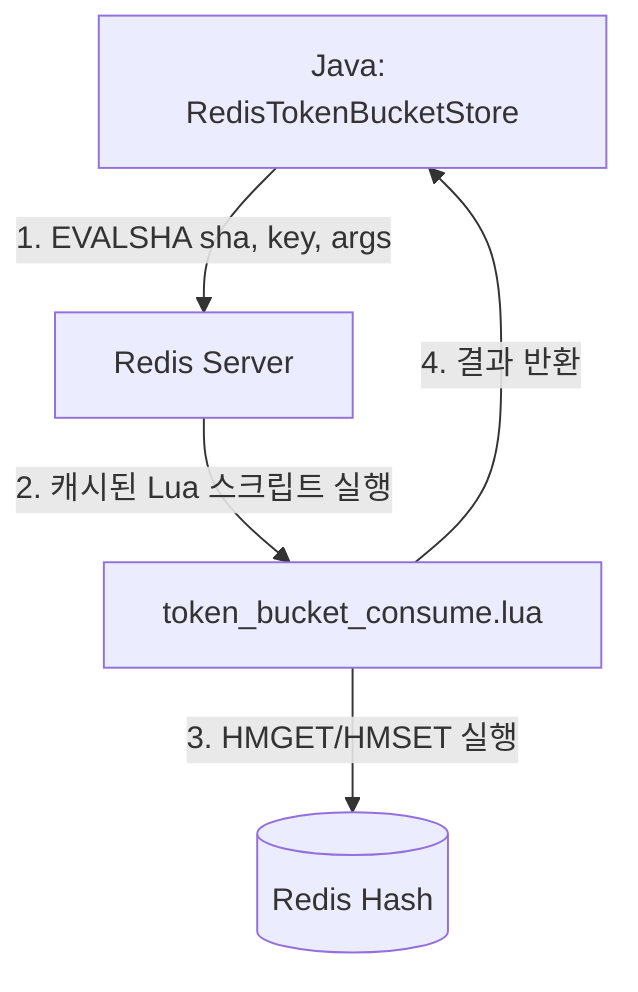

# RateLimiter Layer Deep Dive

이 문서는 FluxGate의 RateLimiter Layer를 **실제 소스코드**와 함께 상세히 설명합니다.

[< 아키텍처 개요로 돌아가기](../README.ko.md)

---

## 목차

1. [Rate Limiting 알고리즘 비교](#1-rate-limiting-알고리즘-비교)
2. [RateLimiter 인터페이스](#2-ratelimiter-인터페이스)
3. [Bucket4jRateLimiter](#3-bucket4jratelimiter)
4. [Redis Lua 스크립트 (분산 환경)](#4-redis-lua-스크립트-분산-환경)

---

## 1. Rate Limiting 알고리즘 비교

Rate Limiting을 구현하는 대표적인 알고리즘들을 비교합니다.

### 1.1 Fixed Window (고정 윈도우)

```
┌─────────────────┐ ┌─────────────────┐ ┌─────────────────┐
│   Window 1      │ │   Window 2      │ │   Window 3      │
│   00:00-01:00   │ │   01:00-02:00   │ │   02:00-03:00   │
│                 │ │                 │ │                 │
│   Count: 100    │ │   Count: 0      │ │   Count: 50     │
│   Limit: 100    │ │   Limit: 100    │ │   Limit: 100    │
└─────────────────┘ └─────────────────┘ └─────────────────┘
```

**장점:**
- 구현이 단순함
- 메모리 사용량 최소 (카운터 1개)

**단점:**
- **Boundary 문제**: 윈도우 경계에서 2배의 요청 허용 가능
  - 00:59에 100개 + 01:00에 100개 = 1분 동안 200개

```
          Window 1          |          Window 2
    ────────────────────────┼────────────────────────
                      100개 │ 100개
                     ↑      │      ↑
                   00:59   01:00  01:01

    실제로 00:59~01:01 (2분) 동안 200개 요청 통과!
```

---

### 1.2 Sliding Window Log (슬라이딩 윈도우 로그)

```
현재 시간: 01:30
윈도우 크기: 1시간
────────────────────────────────────────────────────────►
    │                                              │
  00:30                                          01:30
    └──────────── 이 범위의 요청만 카운트 ────────────┘

저장된 로그:
[00:45, 00:50, 01:00, 01:15, 01:20, 01:25]
         ↓ 윈도우 밖 → 제거
[01:00, 01:15, 01:20, 01:25] → Count: 4
```

**장점:**
- 정확한 Rate Limiting (Boundary 문제 없음)

**단점:**
- **메모리 사용량 높음**: 모든 요청 타임스탬프 저장 필요
- 시간 복잡도: O(N) where N = 윈도우 내 요청 수

---

### 1.3 Sliding Window Counter (슬라이딩 윈도우 카운터)

```
현재 시간: 01:15 (현재 윈도우의 25% 지점)
이전 윈도우: 80개 요청
현재 윈도우: 20개 요청

가중치 계산:
이전 윈도우 기여 = 80 × 0.75 = 60 (75% 남음)
현재 윈도우 기여 = 20 × 1.00 = 20 (100%)
────────────────────────────────
예상 카운트     = 80개

┌─────────────────┬─────────────────┐
│   이전 윈도우    │   현재 윈도우    │
│   00:00-01:00   │   01:00-02:00   │
│                 │                 │
│   80개 × 75%    │   20개 × 100%   │
│   = 60개        │   = 20개        │
└─────────────────┴─────────────────┘
                  ▲
               01:15 (현재)
```

**장점:**
- Fixed Window보다 정확 (Boundary 문제 완화)
- 메모리 효율적 (카운터 2개만 필요)

**단점:**
- 완벽히 정확하지는 않음 (근사치)

---

### 1.4 Token Bucket (토큰 버킷) ⭐ FluxGate 채택

```
┌─────────────────────────────────────────────────────────┐
│                    Token Bucket                         │
│                                                         │
│   용량 (Capacity): 100 토큰                              │
│   리필 속도: 10 토큰/초                                   │
│                                                         │
│   ┌───────────────────────────────────────────────┐    │
│   │ ○ ○ ○ ○ ○ ○ ○ ○ ○ ○  (현재 토큰: 70개)        │    │
│   └───────────────────────────────────────────────┘    │
│                                                         │
│   요청 도착 → 토큰 1개 소비                              │
│   - 토큰 > 0: 허용 ✓                                    │
│   - 토큰 = 0: 거부 ✗ (429 Too Many Requests)           │
│                                                         │
│   시간이 지나면 토큰 자동 리필 (최대 용량까지)             │
└─────────────────────────────────────────────────────────┘
```

**장점:**
- **버스트 허용**: 짧은 시간에 용량만큼 요청 가능
- **평균 속도 제한**: 장기적으로 리필 속도로 제한
- **유연한 설정**: 용량과 리필 속도 독립적 설정
- **메모리 효율적**: 토큰 수와 마지막 리필 시간만 저장

**단점:**
- Fixed Window보다 구현 복잡

---

### 1.5 Leaky Bucket (누수 버킷)

```
┌─────────────────────────────────────────────────────────┐
│                    Leaky Bucket                         │
│                                                         │
│        요청 들어옴                                       │
│            ↓                                            │
│   ┌───────────────────────────────────────────────┐    │
│   │ ■ ■ ■ ■ ■ ■ ■ ■ ■ ■  (큐에 대기 중인 요청)     │    │
│   └───────────────────────────────────────────────┘    │
│            │                                            │
│            ↓ 일정한 속도로 처리 (leak)                   │
│         ───────                                         │
│         처리됨                                          │
│                                                         │
│   큐가 가득 차면 → 새 요청 거부                          │
└─────────────────────────────────────────────────────────┘
```

**장점:**
- 출력 속도가 일정 (트래픽 성형)
- 버스트 흡수

**단점:**
- 버스트 요청 시 지연 발생 (큐 대기)
- Token Bucket보다 덜 유연

---

#### 📋 상황별 알고리즘 선택 가이드

| 상황 | 추천 알고리즘 | 이유 |
|------|-------------|------|
| API 과금 (정확한 카운트 필요) | Sliding Window Log | 정확도가 가장 중요 |
| 일반적인 API Rate Limit | Token Bucket | 버스트 허용 + 간단함 |
| DB 보호, 트래픽 평탄화 | Leaky Bucket | 일정한 처리량 보장 |
| 단순한 구현, 리소스 제한 | Fixed Window | 구현 쉬움 |

---

#### 🎯 Token Bucket vs Leaky Bucket 실제 동작 비교

```
시나리오: 결제 API (10 req/sec 제한)
사용자가 0초에 10개 요청을 동시에 보냄

┌─────────────────────────────────────────────────────────────┐
│ Token Bucket                                                │
├─────────────────────────────────────────────────────────────┤
│ 0.0초: 10개 요청 → 10개 모두 즉시 통과 ✅                      │
│ 0.1초: 1개 요청 → 토큰 없음, 거부 ❌                          │
│ 1.0초: 토큰 리필 → 다시 10개 가능                             │
│                                                             │
│ 결과: 서버가 순간적으로 10개 동시 처리해야 함 💥               │
│ 장점: 사용자 응답 빠름                                        │
│ 단점: 서버 부하 스파이크 발생 가능                             │
└─────────────────────────────────────────────────────────────┘

┌─────────────────────────────────────────────────────────────┐
│ Leaky Bucket                                                │
├─────────────────────────────────────────────────────────────┤
│ 0.0초: 10개 요청 → 1개 통과, 9개 큐 대기                      │
│ 0.1초: 큐에서 1개 처리 → 8개 대기                             │
│ 0.2초: 큐에서 1개 처리 → 7개 대기                             │
│ ...                                                         │
│ 0.9초: 큐에서 1개 처리 → 0개 대기                             │
│                                                             │
│ 결과: 서버는 항상 1개씩만 처리 ✅                              │
│ 장점: 서버 부하 일정                                          │
│ 단점: 사용자 응답 지연 (최대 0.9초 대기)                       │
└─────────────────────────────────────────────────────────────┘
```

---

#### 🎯 FluxGate가 Token Bucket을 선택한 이유

```
1. API Gateway 용도
   → 버스트 허용이 사용자 경험에 좋음
   → 즉각적인 응답이 중요

2. 성능
   → O(1) 시간복잡도
   → Redis Lua 스크립트로 원자적 처리 가능

3. 유연성
   → Multi-Band 지원 (10/초 + 100/분 + 1000/시간)
   → 다양한 Rate Limit 정책 적용 가능
```

> **참고:** DB 보호나 트래픽 평탄화가 목적이라면 Leaky Bucket이 더 적합할 수 있습니다.

```java
// 다중 대역폭 예시
RateLimitRule.builder()
    .addBand(100, Duration.ofMinutes(1))   // 분당 100개
    .addBand(1000, Duration.ofHours(1))    // 시간당 1000개
    .build();
```

---

## 2. RateLimiter 인터페이스

```
📁 fluxgate-core/src/main/java/org/fluxgate/core/ratelimiter/
└── RateLimiter.java
```

```java
// RateLimiter.java
public interface RateLimiter {

  /**
   * 토큰 소비를 시도합니다.
   *
   * @param context 요청 컨텍스트
   * @param ruleSet 적용할 규칙 세트
   * @param permits 소비할 토큰 수
   * @return Rate Limit 결과
   */
  RateLimitResult tryConsume(RequestContext context, RateLimitRuleSet ruleSet, long permits);

  // 기본 1토큰 소비
  default RateLimitResult tryConsume(RequestContext context, RateLimitRuleSet ruleSet) {
    return tryConsume(context, ruleSet, 1);
  }
}
```

---

## 3. Bucket4jRateLimiter

Bucket4j를 사용하는 Rate Limiter 구현입니다.

```
📁 fluxgate-core/src/main/java/org/fluxgate/core/ratelimiter/impl/bucket4j/
└── Bucket4jRateLimiter.java
```

```java
// Bucket4jRateLimiter.java
public class Bucket4jRateLimiter implements RateLimiter {

  private final TokenBucketStore bucketStore;  // ← TBS
  private final KeyResolver keyResolver;

  @Override
  public RateLimitResult tryConsume(
      RequestContext context,
      RateLimitRuleSet ruleSet,
      long permits) {

    // 매칭된 규칙 찾기
    RateLimitRule rule = findMatchingRule(ruleSet, context);
    if (rule == null) {
      return RateLimitResult.allowed(permits);
    }

    // 키 생성
    RateLimitKey key = keyResolver.resolve(rule, context);

    // 📌 TokenBucketStore로 토큰 소비 ← TBS로 향하는 화살표
    BucketState state = bucketStore.consume(
        key.toKeyString(),
        rule.getBands(),
        permits
    );

    if (state.isAllowed()) {
      return RateLimitResult.builder()
          .allowed(true)
          .remainingTokens(state.getRemainingTokens())
          .matchedRule(rule)
          .build();
    } else {
      return RateLimitResult.builder()
          .allowed(false)
          .remainingTokens(state.getRemainingTokens())
          .nanosToWaitForRefill(state.getNanosToWaitForRefill())
          .matchedRule(rule)
          .build();
    }
  }
}
```

---

## 4. Redis Lua 스크립트 (분산 환경)

분산 환경에서 Rate Limiting을 구현할 때 가장 큰 문제는 **Race Condition**입니다. FluxGate는 Redis Lua 스크립트를 사용해 이 문제를 해결합니다.

### 4.1 왜 Lua 스크립트인가?

```
문제: Race Condition (경쟁 상태)
────────────────────────────────

서버 A                     서버 B
   │                          │
   ├─ GET tokens → 5          │
   │                          ├─ GET tokens → 5
   ├─ tokens - 1 = 4          │
   │                          ├─ tokens - 1 = 4
   ├─ SET tokens 4            │
   │                          ├─ SET tokens 4  ← 문제!
   ▼                          ▼

결과: 2번 소비했는데 1개만 감소 (버그!)
```

```
해결: Lua 스크립트 = 원자적(Atomic) 실행
─────────────────────────────────────────

서버 A                     Redis (싱글 스레드)
   │                          │
   ├─ EVALSHA lua_script ────▶│ 스크립트 전체 실행
   │                          │ (중간에 끊기지 않음)
   │◀──── 결과 반환 ──────────┤
   │                          │
서버 B                         │
   ├─ EVALSHA lua_script ────▶│ 다음 스크립트 실행
   │                          │
```

Redis는 싱글 스레드로 동작하기 때문에, Lua 스크립트는 **중간에 다른 명령이 끼어들 수 없이** 완전히 실행됩니다.

---

### 4.2 아키텍처 흐름



---

### 4.3 코드 구조

```
📁 fluxgate-redis-ratelimiter/src/main/
├── java/org/fluxgate/redis/
│   ├── script/
│   │   ├── LuaScripts.java       # SHA 해시 및 스크립트 캐시
│   │   └── LuaScriptLoader.java  # 스크립트 로딩 및 Redis 업로드
│   └── store/
│       └── RedisTokenBucketStore.java  # Lua 스크립트 호출
└── resources/lua/
    └── token_bucket_consume.lua  # 실제 Lua 스크립트
```

---

### 4.4 스크립트 로딩 흐름

```
┌─────────────────────────────────────────────────────────────────┐
│ 1. 앱 시작 시 (LuaScriptLoader.loadScripts)                      │
├─────────────────────────────────────────────────────────────────┤
│                                                                 │
│   .lua 파일 읽기 → Redis에 업로드 → SHA 해시 받기                  │
│                                                                 │
│   String script = loadScriptFromClasspath("/lua/...")           │
│       ↓                                                         │
│   String sha = connectionProvider.scriptLoad(script)            │
│       ↓                                                         │
│   LuaScripts.setTokenBucketConsumeSha(sha)  ← 캐시 저장          │
│                                                                 │
└─────────────────────────────────────────────────────────────────┘
                              ↓
┌─────────────────────────────────────────────────────────────────┐
│ 2. 요청 시마다 (RedisTokenBucketStore.tryConsume)                │
├─────────────────────────────────────────────────────────────────┤
│                                                                 │
│   tryConsume("bucket:user:123", band, 1)                        │
│       ↓                                                         │
│   String sha = LuaScripts.getTokenBucketConsumeSha()            │
│       ↓                                                         │
│   connectionProvider.evalsha(sha, keys, args)  ← 스크립트 실행   │
│       ↓                                                         │
│   결과: [consumed, remaining, wait_nanos, reset_time]           │
│                                                                 │
└─────────────────────────────────────────────────────────────────┘
```

---

### 4.5 EVAL vs EVALSHA

```
EVAL (느림)
─────────────
Client: EVAL "긴 스크립트 전체..." 1 key arg1 arg2
        ↑ 매번 스크립트 전송 (네트워크 낭비)

EVALSHA (빠름) ← FluxGate가 사용하는 방식
──────────────
1회차: SCRIPT LOAD "긴 스크립트..." → SHA: "abc123..."
이후:  EVALSHA "abc123..." 1 key arg1 arg2
       ↑ 40바이트 SHA만 전송
```

---

### 4.6 Lua 스크립트 완전 분석 (한 줄씩 설명)

```
📁 fluxgate-redis-ratelimiter/src/main/resources/lua/
└── token_bucket_consume.lua
```

이 섹션에서는 Lua 스크립트의 **모든 줄**을 상세히 설명합니다.

**목차:**
- [📌 실제 시나리오로 이해하기](#-실제-시나리오로-이해하기)
- [📖 변수 정의 사전](#-변수-정의-사전) ← **먼저 읽어주세요!**
- [STEP 1~10: 상세 코드 분석](#step-1-입력-파라미터-받기)

---

#### 📌 실제 시나리오로 이해하기

```
상황 설정:
─────────────────────────────────────────────────────────────
• API: /api/users (사용자 목록 조회)
• 제한: 분당 100개 요청
• 현재 사용자: IP 192.168.1.100
• 현재 상태: 이미 70번 요청함 (30개 남음)
• 요청: 1개 토큰 소비하고 싶음
```

---

#### 📖 변수 정의 사전

스크립트에서 사용되는 모든 변수들을 미리 정리합니다:

##### 입력 변수 (Java에서 전달)

| 변수명 | 타입 | 설명 | 예시 값 |
|--------|------|------|---------|
| `bucket_key` | string | 버킷을 식별하는 Redis 키 | `"fluxgate:api-limits:per-ip:192.168.1.100:per-minute"` |
| `capacity` | number | 버킷의 최대 토큰 용량 | `100` |
| `window_nanos` | number | 윈도우 크기 (나노초) | `60000000000` (60초) |
| `permits` | number | 소비하려는 토큰 수 | `1` |

##### 시간 관련 변수

| 변수명 | 타입 | 설명 | 예시 값 |
|--------|------|------|---------|
| `time_info` | table | Redis TIME 명령 결과 [초, 마이크로초] | `{"1703001234", "567890"}` |
| `current_time_micros` | number | 현재 시간 (마이크로초) | `1703001234567890` |
| `current_time_nanos` | number | 현재 시간 (나노초) | `1703001234567890000` |
| `last_refill_nanos` | number | **마지막으로 토큰을 리필한 시간** (나노초) | `1703001204567890000` |
| `elapsed_nanos` | number | **마지막 리필 이후 경과한 시간** (나노초) | `30000000000` (30초) |

##### 토큰 관련 변수

| 변수명 | 타입 | 설명 | 예시 값 |
|--------|------|------|---------|
| `bucket_data` | table | Redis Hash에서 읽어온 데이터 | `{"30", "1703001204567890000"}` |
| `current_tokens` | number | **현재 버킷에 남아있는 토큰 수** | `30` |
| `tokens_to_add` | number | **리필할 토큰 수** (경과 시간 기반 계산) | `50` |
| `new_tokens` | number | **리필 후 토큰 수** (용량 초과 방지) | `80` |
| `tokens_needed` | number | 부족한 토큰 수 (거부 시) | `1` |
| `tokens_until_full` | number | 가득 찰 때까지 필요한 토큰 수 | `20` |

##### 출력/결과 변수

| 변수명 | 타입 | 설명 | 예시 값 |
|--------|------|------|---------|
| `nanos_to_wait` | number | **다음 토큰까지 대기해야 할 시간** (거부 시) | `600000000` (0.6초) |
| `nanos_until_full` | number | 버킷이 가득 찰 때까지 걸리는 시간 | `12000000000` (12초) |
| `reset_time_millis` | number | 버킷 리셋 예상 시간 (Unix timestamp ms) | `1703001306567` |

##### TTL 관련 변수

| 변수명 | 타입 | 설명 | 예시 값 |
|--------|------|------|---------|
| `desired_ttl_seconds` | number | 원하는 TTL (윈도우 × 1.1) | `66` |
| `actual_ttl_seconds` | number | 실제 TTL (최대 24시간 제한) | `66` |

---

##### 🔑 핵심 변수 3개 깊게 이해하기

```
┌─────────────────────────────────────────────────────────────────────────┐
│ 1. last_refill_nanos (마지막 리필 시간)                                  │
├─────────────────────────────────────────────────────────────────────────┤
│                                                                         │
│   "마지막으로 토큰이 추가된 시점"                                         │
│                                                                         │
│   ──────────────────────────────────────────────────────────────► 시간  │
│        │                              │                                 │
│   last_refill_nanos              current_time_nanos                     │
│   (과거)                          (현재)                                │
│                                                                         │
│   이 값을 기준으로 "얼마나 시간이 지났는지" 계산해서                       │
│   그만큼 토큰을 리필합니다.                                              │
│                                                                         │
└─────────────────────────────────────────────────────────────────────────┘

┌─────────────────────────────────────────────────────────────────────────┐
│ 2. elapsed_nanos (경과 시간)                                            │
├─────────────────────────────────────────────────────────────────────────┤
│                                                                         │
│   elapsed_nanos = current_time_nanos - last_refill_nanos                │
│                                                                         │
│   예시: 마지막 리필이 30초 전이었다면                                     │
│   elapsed_nanos = 30,000,000,000 나노초 (30초)                          │
│                                                                         │
│   이 경과 시간에 비례해서 토큰이 리필됩니다:                              │
│   - 30초 경과, 윈도우 60초, 용량 100 → 50개 리필                         │
│   - 60초 경과, 윈도우 60초, 용량 100 → 100개 리필 (가득!)                │
│                                                                         │
└─────────────────────────────────────────────────────────────────────────┘

┌─────────────────────────────────────────────────────────────────────────┐
│ 3. nanos_to_wait (대기 시간) - 거부된 경우에만 사용                       │
├─────────────────────────────────────────────────────────────────────────┤
│                                                                         │
│   "다음 토큰이 생길 때까지 얼마나 기다려야 하는가?"                        │
│                                                                         │
│   계산: (필요한 토큰 수 × 윈도우) / 용량                                  │
│                                                                         │
│   예시: 1개 토큰 필요, 윈도우 60초, 용량 100                              │
│   nanos_to_wait = (1 × 60,000,000,000) / 100                            │
│                 = 600,000,000 나노초                                    │
│                 = 0.6초                                                 │
│                                                                         │
│   → HTTP 응답에서 Retry-After: 1 로 변환                                 │
│                                                                         │
└─────────────────────────────────────────────────────────────────────────┘
```

---

#### STEP 1: 입력 파라미터 받기

```lua
-- ══════════════════════════════════════════════════════════════
-- STEP 1: 입력 파라미터 파싱
-- ══════════════════════════════════════════════════════════════

-- KEYS[1] = Redis 키 (어떤 버킷인지 식별)
local bucket_key = KEYS[1]
-- 예시: "fluxgate:api-limits:per-ip:192.168.1.100:per-minute"
--        └─────────────────────────────────────────────────────┘
--        이 키로 Redis Hash에 토큰 정보 저장

-- ARGV[1] = 버킷 용량 (최대 토큰 수)
local capacity = tonumber(ARGV[1])
-- 예시: 100 (분당 100개 요청 허용)
--       └── tonumber(): 문자열 "100" → 숫자 100으로 변환

-- ARGV[2] = 윈도우 크기 (나노초 단위)
local window_nanos = tonumber(ARGV[2])
-- 예시: 60000000000 (60초 = 1분)
--       │
--       └── 계산: 60초 × 1,000,000,000 나노초/초 = 60,000,000,000
--
-- Q: 왜 나노초?
-- A: 밀리초(ms)보다 정밀해서 초당 수만 개 요청도 정확히 계산 가능

-- ARGV[3] = 소비할 토큰 수
local permits = tonumber(ARGV[3])
-- 예시: 1 (일반적으로 요청당 1개)
--       단, 무거운 API는 permits=10처럼 더 많이 소비 가능
```

**시각화:**
```
Java에서 호출:
connectionProvider.evalsha(sha,
    new String[]{"fluxgate:api-limits:per-ip:192.168.1.100:per-minute"},  // KEYS
    new String[]{"100", "60000000000", "1"}  // ARGV
);

Lua에서 받음:
KEYS[1] = "fluxgate:api-limits:per-ip:192.168.1.100:per-minute"
ARGV[1] = "100"           → capacity = 100
ARGV[2] = "60000000000"   → window_nanos = 60,000,000,000
ARGV[3] = "1"             → permits = 1
```

---

#### STEP 2: 입력 검증

```lua
-- ══════════════════════════════════════════════════════════════
-- STEP 2: 입력값 검증 (잘못된 값 방지)
-- ══════════════════════════════════════════════════════════════

if capacity <= 0 or window_nanos <= 0 or permits <= 0 then
    return redis.error_reply("Invalid arguments: capacity, window, and permits must be positive")
end

-- 예시:
-- capacity = -1   → 에러! (용량이 음수일 수 없음)
-- window_nanos = 0 → 에러! (윈도우가 0이면 나누기 에러)
-- permits = 0     → 에러! (0개 소비는 의미 없음)
```

---

#### STEP 3: 현재 시간 가져오기 (Redis 서버 시간)

```lua
-- ══════════════════════════════════════════════════════════════
-- STEP 3: Redis 서버 시간 가져오기
-- ══════════════════════════════════════════════════════════════
--
-- Q: 왜 Java의 System.nanoTime()을 안 쓰고 Redis TIME을 쓰나요?
-- A: 클럭 드리프트 문제!
--
--    서버 A 시계: 10:00:00.000
--    서버 B 시계: 10:00:00.500  ← 0.5초 차이!
--    서버 C 시계: 09:59:59.800  ← 0.2초 느림!
--
--    → 각 서버가 다른 시간으로 계산하면 Rate Limit이 정확하지 않음
--    → Redis 서버 시간을 쓰면 모든 서버가 동일한 시간 사용!

local time_info = redis.call('TIME')
-- redis.call('TIME') 결과:
-- time_info[1] = "1703001234"   ← Unix 초 (epoch seconds)
-- time_info[2] = "567890"       ← 마이크로초 (0~999999)

-- 마이크로초로 변환
local current_time_micros = tonumber(time_info[1]) * 1000000 + tonumber(time_info[2])
-- 계산: 1703001234 × 1,000,000 + 567890 = 1,703,001,234,567,890 마이크로초

-- 나노초로 변환 (더 정밀하게)
local current_time_nanos = current_time_micros * 1000
-- 계산: 1,703,001,234,567,890 × 1,000 = 1,703,001,234,567,890,000 나노초
```

**시간 단위 비교:**
```
1초      = 1,000 밀리초 (ms)
1밀리초  = 1,000 마이크로초 (μs)
1마이크로초 = 1,000 나노초 (ns)

따라서:
1초 = 1,000,000,000 나노초 (10억)

예시 변환:
Unix timestamp 1703001234.567890
= 1,703,001,234초 + 567,890마이크로초
= 1,703,001,234,567,890마이크로초
= 1,703,001,234,567,890,000나노초
```

---

#### STEP 4: 현재 버킷 상태 읽기

```lua
-- ══════════════════════════════════════════════════════════════
-- STEP 4: Redis에서 현재 버킷 상태 읽기
-- ══════════════════════════════════════════════════════════════

local bucket_data = redis.call('HMGET', bucket_key, 'tokens', 'last_refill_nanos')
-- HMGET = Hash Multi GET (Hash에서 여러 필드 동시에 가져오기)
--
-- Redis Hash 구조:
-- ┌──────────────────────────────────────────────────────────────┐
-- │ Key: "fluxgate:api-limits:per-ip:192.168.1.100:per-minute"  │
-- ├──────────────────────────────────────────────────────────────┤
-- │ Field              │ Value                                  │
-- ├────────────────────┼─────────────────────────────────────────┤
-- │ tokens             │ "30"       ← 현재 남은 토큰             │
-- │ last_refill_nanos  │ "1703001234000000000" ← 마지막 리필 시간 │
-- └────────────────────┴─────────────────────────────────────────┘

local current_tokens = tonumber(bucket_data[1])      -- "30" → 30
local last_refill_nanos = tonumber(bucket_data[2])   -- "1703001234000000000"

-- 버킷이 처음 생성되는 경우 (nil 처리)
if current_tokens == nil or last_refill_nanos == nil then
    current_tokens = capacity  -- 100 (가득 찬 상태로 시작)
    last_refill_nanos = current_time_nanos
    -- → 처음 요청하는 사용자는 버스트 허용 (100개 한번에 가능)
end
```

**시각화:**
```
첫 번째 요청 시:
┌─────────────────────┐
│ 버킷 없음 (nil)     │  →  ┌─────────────────────┐
│                     │      │ tokens = 100 (가득!) │
└─────────────────────┘      │ last_refill = now   │
                             └─────────────────────┘

이미 사용 중인 경우:
┌─────────────────────┐      ┌─────────────────────┐
│ tokens = 30         │  →   │ current_tokens = 30 │
│ last_refill = ...   │      │ last_refill = ...   │
└─────────────────────┘      └─────────────────────┘
```

---

#### STEP 5: 경과 시간 계산

```lua
-- ══════════════════════════════════════════════════════════════
-- STEP 5: 마지막 리필 이후 경과 시간 계산
-- ══════════════════════════════════════════════════════════════

local elapsed_nanos = math.max(0, current_time_nanos - last_refill_nanos)
-- math.max(0, ...)를 사용하는 이유:
-- → 만약 시간이 음수가 되면 (Redis 재시작 등) 0으로 처리
-- → 음수 시간은 토큰이 사라지는 버그 유발!

-- 예시:
-- current_time_nanos  = 1,703,001,294,567,890,000 (지금)
-- last_refill_nanos   = 1,703,001,234,567,890,000 (60초 전)
-- elapsed_nanos       = 60,000,000,000 (60초 = 600억 나노초)
```

**시각화:**
```
시간 흐름:
─────────────────────────────────────────────────────────────►
     │                                                  │
last_refill                                          now
(마지막 리필)                                       (현재)
     └──────────────── elapsed_nanos ──────────────────┘
                      (경과 시간)
```

---

#### STEP 6: 리필할 토큰 계산 (핵심!)

```lua
-- ══════════════════════════════════════════════════════════════
-- STEP 6: 리필할 토큰 수 계산 (정수 연산만 사용!)
-- ══════════════════════════════════════════════════════════════
--
-- Token Bucket 공식:
-- 리필할 토큰 = 경과시간 × (용량 / 윈도우)
--
-- 하지만! 부동소수점 문제가 있음:
--
-- ❌ 나쁜 방법 (부동소수점):
--    refill_rate = 100 / 60000000000 = 0.0000000016666...
--    tokens_to_add = elapsed × refill_rate
--    → 정밀도 손실!
--
-- ✅ 좋은 방법 (정수 연산):
--    tokens_to_add = (elapsed × capacity) / window
--    → 나누기를 마지막에 해서 정밀도 유지!

local tokens_to_add = 0
if elapsed_nanos > 0 and window_nanos > 0 then
    tokens_to_add = math.floor((elapsed_nanos * capacity) / window_nanos)
    -- math.floor = 내림 (소수점 버림)
end

-- 예시 계산:
-- elapsed_nanos = 30,000,000,000 (30초)
-- capacity      = 100
-- window_nanos  = 60,000,000,000 (60초)
--
-- tokens_to_add = floor((30,000,000,000 × 100) / 60,000,000,000)
--               = floor(3,000,000,000,000,000,000 / 60,000,000,000)
--               = floor(50)
--               = 50개 토큰 리필!
```

**왜 정수 연산이 중요한가?**
```
부동소수점 문제 예시:
─────────────────────────────────────────────────────────────

방법 A (나쁨 - 부동소수점):
refill_rate = 100 / 60000000000
            = 0.0000000016666666666666667  ← 무한소수!

tokens_to_add = 30000000000 * 0.0000000016666666666666667
              = 49.99999999999999...  ← 정밀도 손실!
              → 반올림하면 50, 버림하면 49 (불안정)

방법 B (좋음 - 정수 연산):
tokens_to_add = (30000000000 * 100) / 60000000000
              = 3000000000000000000 / 60000000000
              = 50  ← 정확!
```

---

#### STEP 7: 토큰 리필 (최대 용량까지만)

```lua
-- ══════════════════════════════════════════════════════════════
-- STEP 7: 토큰 리필 (용량 초과 방지)
-- ══════════════════════════════════════════════════════════════

local new_tokens = math.min(capacity, current_tokens + tokens_to_add)
-- math.min = 둘 중 작은 값 선택

-- 예시 1: 정상 리필
-- current_tokens = 30
-- tokens_to_add  = 50
-- new_tokens     = min(100, 30 + 50) = min(100, 80) = 80 ✓

-- 예시 2: 오버플로우 방지
-- current_tokens = 80
-- tokens_to_add  = 50
-- new_tokens     = min(100, 80 + 50) = min(100, 130) = 100 ✓
--                  └─ 130개가 되어야 하지만 100개로 제한!
```

**시각화:**
```
버킷 상태 변화:

Before (리필 전):                After (리필 후):
┌────────────────────┐           ┌────────────────────┐
│ ●●●●●●●●●●●●●●●○○○○○│           │ ●●●●●●●●●●●●●●●●●●●●│
│ 30/100 토큰        │   +50     │ 80/100 토큰        │
└────────────────────┘  ────►    └────────────────────┘

오버플로우 방지:
┌────────────────────┐           ┌────────────────────┐
│ ●●●●●●●●●●●●●●●●○○○○│           │ ●●●●●●●●●●●●●●●●●●●●│
│ 80/100 토큰        │   +50     │ 100/100 토큰 (MAX) │
└────────────────────┘  ────►    └────────────────────┘
                                  130이 아닌 100!
```

---

#### STEP 8: 리셋 시간 계산

```lua
-- ══════════════════════════════════════════════════════════════
-- STEP 8: 버킷이 가득 찰 때까지 걸리는 시간 계산
-- ══════════════════════════════════════════════════════════════
-- (HTTP 헤더 X-RateLimit-Reset에 사용)

local tokens_until_full = capacity - new_tokens
-- 예시: 100 - 80 = 20개 더 필요

local nanos_until_full = 0
if tokens_until_full > 0 and capacity > 0 then
    nanos_until_full = math.ceil((tokens_until_full * window_nanos) / capacity)
    -- math.ceil = 올림 (소수점 올림)
end

-- 예시:
-- tokens_until_full = 20
-- window_nanos      = 60,000,000,000 (60초)
-- capacity          = 100
--
-- nanos_until_full = ceil((20 × 60,000,000,000) / 100)
--                  = ceil(12,000,000,000)
--                  = 12,000,000,000 나노초 = 12초

local reset_time_millis = math.floor((current_time_nanos + nanos_until_full) / 1000000)
-- 현재 시간 + 남은 시간 → Unix timestamp (밀리초)
-- 예시: (1703001294567890000 + 12000000000) / 1000000
--     = 1703001306567 (밀리초)
```

---

#### STEP 9: 토큰 소비 시도 (성공 케이스)

```lua
-- ══════════════════════════════════════════════════════════════
-- STEP 9: 토큰 소비 시도
-- ══════════════════════════════════════════════════════════════

if new_tokens >= permits then
    -- ═══════════════════════════════════════════════════════
    -- 성공! 토큰이 충분함
    -- ═══════════════════════════════════════════════════════

    new_tokens = new_tokens - permits
    -- 예시: 80 - 1 = 79개 남음

    -- Redis에 상태 저장
    redis.call('HMSET', bucket_key,
        'tokens', new_tokens,              -- 79
        'last_refill_nanos', current_time_nanos  -- 현재 시간
    )
    -- HMSET = Hash Multi SET (여러 필드 동시에 저장)

    -- TTL 설정 (메모리 누수 방지)
    local desired_ttl_seconds = math.ceil(window_nanos / 1000000000 * 1.1)
    -- 예시: ceil(60 × 1.1) = ceil(66) = 66초
    --       10% 여유를 두는 이유: 시간 오차 대비

    local actual_ttl_seconds = math.min(desired_ttl_seconds, 86400)
    -- 최대 24시간(86400초)으로 제한 (너무 긴 TTL 방지)

    redis.call('EXPIRE', bucket_key, actual_ttl_seconds)
    -- 66초 후 자동 삭제 (사용 안 하면)

    -- 결과 반환: [허용, 남은토큰, 대기시간, 리셋시간]
    return {1, new_tokens, 0, reset_time_millis}
    --      │  │           │  │
    --      │  │           │  └─ 버킷이 가득 찰 때 (Unix ms)
    --      │  │           └─ 대기 필요 없음 (성공했으니까)
    --      │  └─ 남은 토큰 (79개)
    --      └─ 1 = 허용됨
```

**성공 시 Redis 상태:**
```
BEFORE:                              AFTER:
┌─────────────────────────────────┐  ┌─────────────────────────────────┐
│ tokens = 30                     │  │ tokens = 79                     │
│ last_refill_nanos = ...         │  │ last_refill_nanos = (now)       │
│ TTL = 40초                      │  │ TTL = 66초 (갱신됨)             │
└─────────────────────────────────┘  └─────────────────────────────────┘
                   │
                   ▼
           +50 리필 - 1 소비 = 79
```

---

#### STEP 10: 토큰 소비 실패 (거부 케이스)

```lua
else
    -- ═══════════════════════════════════════════════════════
    -- 실패! 토큰이 부족함
    -- ═══════════════════════════════════════════════════════

    local tokens_needed = permits - new_tokens
    -- 예시: permits=1, new_tokens=0 → tokens_needed=1

    local nanos_to_wait = 0
    if capacity > 0 then
        nanos_to_wait = math.ceil((tokens_needed * window_nanos) / capacity)
    end
    -- 예시: ceil((1 × 60,000,000,000) / 100) = 600,000,000 나노초 = 0.6초

    -- ╔═════════════════════════════════════════════════════════╗
    -- ║ 중요: 실패 시 상태를 업데이트하지 않음!                  ║
    -- ╠═════════════════════════════════════════════════════════╣
    -- ║ 이유: 공정성 보장                                       ║
    -- ║                                                         ║
    -- ║ 만약 실패해도 시간을 업데이트하면:                       ║
    -- ║ → 거부된 요청이 시간을 앞당김                            ║
    -- ║ → 다음 요청이 "아, 방금 리필했네" 착각                   ║
    -- ║ → 실제로는 리필 안 됨 → 불공정!                          ║
    -- ╚═════════════════════════════════════════════════════════╝

    -- 결과 반환: [거부, 남은토큰, 대기시간, 리셋시간]
    return {0, new_tokens, nanos_to_wait, reset_time_millis}
    --      │  │           │              │
    --      │  │           │              └─ 버킷이 가득 찰 때
    --      │  │           └─ 0.6초 후에 다시 시도하세요
    --      │  └─ 현재 토큰 (0개)
    --      └─ 0 = 거부됨
end
```

**거부 시 중요한 점:**
```
❌ 잘못된 구현 (상태 업데이트):
─────────────────────────────────────────────────────────────
요청 A (거부) → last_refill = now   ← 이걸 하면 안 됨!
요청 B (1초 후) → "1초 지났으니 리필!" → 실제론 리필 안 됨

✅ 올바른 구현 (읽기만):
─────────────────────────────────────────────────────────────
요청 A (거부) → 상태 안 건드림
요청 B (1초 후) → "이전 리필 기준으로 1초 지남" → 정확한 리필
```

---

#### 전체 흐름 시각화

```
┌─────────────────────────────────────────────────────────────────────┐
│                    Lua 스크립트 실행 흐름                            │
├─────────────────────────────────────────────────────────────────────┤
│                                                                     │
│  입력: bucket_key="user:123", capacity=100, window=60초, permits=1  │
│                                                                     │
│  ┌─────────────────────────────────────────────────────────────┐   │
│  │ 1. Redis TIME 가져오기                                      │   │
│  │    now = 1703001294567890000 나노초                         │   │
│  └─────────────────────────────────────────────────────────────┘   │
│                            ↓                                        │
│  ┌─────────────────────────────────────────────────────────────┐   │
│  │ 2. 현재 상태 읽기 (HMGET)                                   │   │
│  │    tokens = 30, last_refill = 30초 전                       │   │
│  └─────────────────────────────────────────────────────────────┘   │
│                            ↓                                        │
│  ┌─────────────────────────────────────────────────────────────┐   │
│  │ 3. 리필 계산                                                │   │
│  │    elapsed = 30초                                           │   │
│  │    tokens_to_add = (30초 × 100) / 60초 = 50개               │   │
│  │    new_tokens = min(100, 30+50) = 80개                      │   │
│  └─────────────────────────────────────────────────────────────┘   │
│                            ↓                                        │
│  ┌─────────────────────────────────────────────────────────────┐   │
│  │ 4. 소비 가능? (80 >= 1)                                     │   │
│  │    → 예! 성공                                               │   │
│  │    → new_tokens = 80 - 1 = 79                               │   │
│  │    → HMSET으로 저장                                         │   │
│  │    → EXPIRE로 TTL 설정                                      │   │
│  └─────────────────────────────────────────────────────────────┘   │
│                            ↓                                        │
│  ┌─────────────────────────────────────────────────────────────┐   │
│  │ 5. 결과 반환                                                │   │
│  │    {1, 79, 0, 1703001306567}                                │   │
│  │     │   │  │  └─ 12초 후 가득 참                            │   │
│  │     │   │  └─ 대기 불필요                                   │   │
│  │     │   └─ 79개 남음                                        │   │
│  │     └─ 허용!                                                │   │
│  └─────────────────────────────────────────────────────────────┘   │
│                                                                     │
└─────────────────────────────────────────────────────────────────────┘
```

---

#### Java에서 결과 처리

```java
// RedisTokenBucketStore.java

List<Long> result = connectionProvider.evalsha(sha, keys, args);
// result = [1, 79, 0, 1703001306567]

long consumed = result.get(0);          // 1 (허용)
long remainingTokens = result.get(1);   // 79
long nanosToWait = result.get(2);       // 0
long resetTimeMillis = result.get(3);   // 1703001306567

if (consumed == 1) {
    return BucketState.allowed(remainingTokens, resetTimeMillis);
    // → HTTP 200 OK + 헤더 추가
} else {
    return BucketState.rejected(remainingTokens, nanosToWait, resetTimeMillis);
    // → HTTP 429 Too Many Requests
}
```

**HTTP 응답 헤더:**
```http
HTTP/1.1 200 OK
X-RateLimit-Limit: 100
X-RateLimit-Remaining: 79
X-RateLimit-Reset: 1703001306
```

또는 거부 시:
```http
HTTP/1.1 429 Too Many Requests
X-RateLimit-Limit: 100
X-RateLimit-Remaining: 0
X-RateLimit-Reset: 1703001306
Retry-After: 1
```

---

### 4.7 설계 결정 및 이유

| 설계 결정 | 이유 |
|----------|------|
| **Redis TIME 사용** | 서버마다 `System.nanoTime()` 다름 → Redis 시간으로 통일 |
| **정수 연산만** | 부동소수점은 정밀도 손실 발생 |
| **거부 시 상태 안 건드림** | 공정한 rate limiting (선착순 보장) |
| **SHA 해시 캐싱** | 매번 스크립트 전송 안 해도 됨 (네트워크 절약) |
| **TTL 설정** | 메모리 누수 방지 (사용 안 하는 버킷 자동 삭제) |

---

### 4.8 반환 값

```lua
return {consumed, remaining_tokens, nanos_to_wait, reset_time_millis}
```

| 필드 | 설명 | 예시 |
|------|------|------|
| `consumed` | 1=허용, 0=거부 | `1` |
| `remaining_tokens` | 남은 토큰 수 | `85` |
| `nanos_to_wait` | 다음 토큰까지 대기 시간 | `0` (허용 시) |
| `reset_time_millis` | 버킷 리셋 시간 (Unix timestamp) | `1703001234567` |

이 값들은 HTTP 응답 헤더로 변환됩니다:

```http
X-RateLimit-Remaining: 85
X-RateLimit-Reset: 1703001234
Retry-After: 0
```

---

### 4.9 Cluster 모드 지원

```java
// LuaScriptLoader.java:53-55
if (connectionProvider.getMode() == RedisConnectionProvider.RedisMode.CLUSTER) {
  log.info("Script automatically distributed to all cluster master nodes");
}
```

- Lettuce가 자동으로 모든 마스터 노드에 스크립트 배포
- `EVALSHA` 호출 시 키의 해시 슬롯에 따라 올바른 노드로 라우팅

---

## 관련 문서

- [Engine Layer Deep Dive](engine-layer.ko.md)
- [Storage Layer Deep Dive](storage-layer.ko.md)
- [아키텍처 개요](../README.ko.md)
