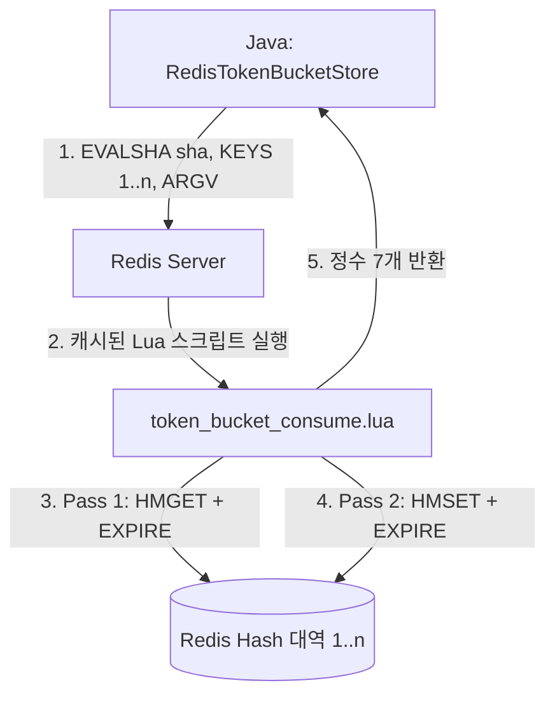

# RateLimiter Layer Deep Dive

> 이 문서는 FluxGate **0.4**의 코드를 기준으로 합니다. 0.3.x에서 무엇이 바뀌었는지는
> [0.4 마이그레이션](../../operations/migration-0.4.ko.md)에, 전체 계층을 한 문서로 훑는 서술은
> [아키텍처 Deep Dive](../../../ARCHITECTURE_DEEP_DIVE.ko.md)에 있습니다.

이 문서는 FluxGate의 RateLimiter Layer를 **실제 소스코드**와 함께 상세히 설명합니다.

[< 아키텍처 개요로 돌아가기](../README.ko.md)

---

## 목차

1. [Rate Limiting 알고리즘 비교](#1-rate-limiting-알고리즘-비교)
2. [RateLimiter 인터페이스](#2-ratelimiter-인터페이스)
3. [Bucket4jRateLimiter (인메모리)](#3-bucket4jratelimiter-인메모리)
4. [Redis Lua 스크립트 (분산 환경)](#4-redis-lua-스크립트-분산-환경)

---

## 1. Rate Limiting 알고리즘 비교

Rate Limiting을 구현하는 대표적인 알고리즘들을 비교합니다.

### 1.1 Fixed Window (고정 윈도우)

```
┌─────────────────┐ ┌─────────────────┐ ┌─────────────────┐
│   Window 1      │ │   Window 2      │ │   Window 3      │
│   00:00-01:00   │ │   01:00-02:00   │ │   02:00-03:00   │
│                 │ │                 │ │                 │
│   Count: 100    │ │   Count: 0      │ │   Count: 50     │
│   Limit: 100    │ │   Limit: 100    │ │   Limit: 100    │
└─────────────────┘ └─────────────────┘ └─────────────────┘
```

**장점:**
- 구현이 단순함
- 메모리 사용량 최소 (카운터 1개)

**단점:**
- **Boundary 문제**: 윈도우 경계에서 2배의 요청 허용 가능
  - 00:59에 100개 + 01:00에 100개 = 1분 동안 200개

```
          Window 1          |          Window 2
    ────────────────────────┼────────────────────────
                      100개 │ 100개
                     ↑      │      ↑
                   00:59   01:00  01:01

    실제로 00:59~01:01 (2분) 동안 200개 요청 통과!
```

---

### 1.2 Sliding Window Log (슬라이딩 윈도우 로그)

```
현재 시간: 01:30
윈도우 크기: 1시간
────────────────────────────────────────────────────────►
    │                                              │
  00:30                                          01:30
    └──────────── 이 범위의 요청만 카운트 ────────────┘

저장된 로그:
[00:45, 00:50, 01:00, 01:15, 01:20, 01:25]
         ↓ 윈도우 밖 → 제거
[01:00, 01:15, 01:20, 01:25] → Count: 4
```

**장점:**
- 정확한 Rate Limiting (Boundary 문제 없음)

**단점:**
- **메모리 사용량 높음**: 모든 요청 타임스탬프 저장 필요
- 시간 복잡도: O(N) where N = 윈도우 내 요청 수

---

### 1.3 Sliding Window Counter (슬라이딩 윈도우 카운터)

```
현재 시간: 01:15 (현재 윈도우의 25% 지점)
이전 윈도우: 80개 요청
현재 윈도우: 20개 요청

가중치 계산:
이전 윈도우 기여 = 80 × 0.75 = 60 (75% 남음)
현재 윈도우 기여 = 20 × 1.00 = 20 (100%)
────────────────────────────────
예상 카운트     = 80개

┌─────────────────┬─────────────────┐
│   이전 윈도우    │   현재 윈도우    │
│   00:00-01:00   │   01:00-02:00   │
│                 │                 │
│   80개 × 75%    │   20개 × 100%   │
│   = 60개        │   = 20개        │
└─────────────────┴─────────────────┘
                  ▲
               01:15 (현재)
```

**장점:**
- Fixed Window보다 정확 (Boundary 문제 완화)
- 메모리 효율적 (카운터 2개만 필요)

**단점:**
- 완벽히 정확하지는 않음 (근사치)

---

### 1.4 Token Bucket (토큰 버킷) ⭐ FluxGate 채택

```
┌─────────────────────────────────────────────────────────┐
│                    Token Bucket                         │
│                                                         │
│   용량 (Capacity): 100 토큰                              │
│   리필 속도: 10 토큰/초                                   │
│                                                         │
│   ┌───────────────────────────────────────────────┐    │
│   │ ○ ○ ○ ○ ○ ○ ○ ○ ○ ○  (현재 토큰: 70개)        │    │
│   └───────────────────────────────────────────────┘    │
│                                                         │
│   요청 도착 → 토큰 1개 소비                              │
│   - 토큰 > 0: 허용 ✓                                    │
│   - 토큰 = 0: 거부 ✗ (429 Too Many Requests)           │
│                                                         │
│   시간이 지나면 토큰 자동 리필 (최대 용량까지)             │
└─────────────────────────────────────────────────────────┘
```

**장점:**
- **버스트 허용**: 짧은 시간에 용량만큼 요청 가능
- **평균 속도 제한**: 장기적으로 리필 속도로 제한
- **유연한 설정**: 용량과 리필 속도 독립적 설정
- **메모리 효율적**: 토큰 수와 마지막 리필 시간만 저장

**단점:**
- Fixed Window보다 구현 복잡

---

### 1.5 Leaky Bucket (누수 버킷)

```
┌─────────────────────────────────────────────────────────┐
│                    Leaky Bucket                         │
│                                                         │
│        요청 들어옴                                       │
│            ↓                                            │
│   ┌───────────────────────────────────────────────┐    │
│   │ ■ ■ ■ ■ ■ ■ ■ ■ ■ ■  (큐에 대기 중인 요청)     │    │
│   └───────────────────────────────────────────────┘    │
│            │                                            │
│            ↓ 일정한 속도로 처리 (leak)                   │
│         ───────                                         │
│         처리됨                                          │
│                                                         │
│   큐가 가득 차면 → 새 요청 거부                          │
└─────────────────────────────────────────────────────────┘
```

**장점:**
- 출력 속도가 일정 (트래픽 성형)
- 버스트 흡수

**단점:**
- 버스트 요청 시 지연 발생 (큐 대기)
- Token Bucket보다 덜 유연

---

#### 📋 상황별 알고리즘 선택 가이드

| 상황 | 추천 알고리즘 | 이유 |
|------|-------------|------|
| API 과금 (정확한 카운트 필요) | Sliding Window Log | 정확도가 가장 중요 |
| 일반적인 API Rate Limit | Token Bucket | 버스트 허용 + 간단함 |
| DB 보호, 트래픽 평탄화 | Leaky Bucket | 일정한 처리량 보장 |
| 단순한 구현, 리소스 제한 | Fixed Window | 구현 쉬움 |

---

#### 🎯 Token Bucket vs Leaky Bucket 실제 동작 비교

```
시나리오: 결제 API (10 req/sec 제한)
사용자가 0초에 10개 요청을 동시에 보냄

┌─────────────────────────────────────────────────────────────┐
│ Token Bucket                                                │
├─────────────────────────────────────────────────────────────┤
│ 0.0초: 10개 요청 → 10개 모두 즉시 통과 ✅                      │
│ 0.1초: 1개 요청 → 토큰 없음, 거부 ❌                          │
│ 1.0초: 토큰 리필 → 다시 10개 가능                             │
│                                                             │
│ 결과: 서버가 순간적으로 10개 동시 처리해야 함 💥               │
│ 장점: 사용자 응답 빠름                                        │
│ 단점: 서버 부하 스파이크 발생 가능                             │
└─────────────────────────────────────────────────────────────┘

┌─────────────────────────────────────────────────────────────┐
│ Leaky Bucket                                                │
├─────────────────────────────────────────────────────────────┤
│ 0.0초: 10개 요청 → 1개 통과, 9개 큐 대기                      │
│ 0.1초: 큐에서 1개 처리 → 8개 대기                             │
│ 0.2초: 큐에서 1개 처리 → 7개 대기                             │
│ ...                                                         │
│ 0.9초: 큐에서 1개 처리 → 0개 대기                             │
│                                                             │
│ 결과: 서버는 항상 1개씩만 처리 ✅                              │
│ 장점: 서버 부하 일정                                          │
│ 단점: 사용자 응답 지연 (최대 0.9초 대기)                       │
└─────────────────────────────────────────────────────────────┘
```

---

#### 🎯 FluxGate가 Token Bucket을 선택한 이유

```
1. API Gateway 용도
   → 버스트 허용이 사용자 경험에 좋음
   → 즉각적인 응답이 중요

2. 성능
   → O(1) 시간복잡도
   → Redis Lua 스크립트로 원자적 처리 가능

3. 유연성
   → Multi-Band 지원 (10/초 + 100/분 + 1000/시간)
   → 다양한 Rate Limit 정책 적용 가능
```

> **참고:** DB 보호나 트래픽 평탄화가 목적이라면 Leaky Bucket이 더 적합할 수 있습니다.


```java
// 다중 대역 예시 - RateLimitBand.builder(window, capacity)
RateLimitRule.builder("tiered-rule")
    .scope(LimitScope.PER_API_KEY)
    .addBand(RateLimitBand.builder(Duration.ofMinutes(1), 100).build())   // 분당 100개
    .addBand(RateLimitBand.builder(Duration.ofHours(1), 1000).build())    // 시간당 1000개
    .build();
```

한 규칙의 대역들은 **AND 조건**입니다. 분당 100개 **그리고** 시간당 1000개를 모두 만족해야 통과합니다.
0.4에서는 이 규칙의 모든 대역이 한 번의 원자적 연산으로 평가되므로, 시간당 대역이 거부할 때 분당
대역의 토큰이 낭비되지 않습니다.

라벨을 주지 않으면 `getKeyLabel()`이 설정에서 파생합니다(`100-per-60s`, `1000-per-3600s`).
버킷 키의 마지막 세그먼트가 되는 값이며, 같은 규칙의 두 대역이 서로 다른 버킷을 갖는 근거입니다.

---

## 2. RateLimiter 인터페이스

```
📁 fluxgate-core/src/main/java/org/fluxgate/core/ratelimiter/
└── RateLimiter.java
```

```java
// RateLimiter.java
public interface RateLimiter {

  /**
   * 토큰 소비를 시도합니다.
   *
   * @param context 요청 컨텍스트
   * @param ruleSet 적용할 규칙 세트
   * @param permits 소비할 토큰 수
   * @return Rate Limit 결과
   */
  RateLimitResult tryConsume(RequestContext context, RateLimitRuleSet ruleSet, long permits);

  // 기본 1토큰 소비
  default RateLimitResult tryConsume(RequestContext context, RateLimitRuleSet ruleSet) {
    return tryConsume(context, ruleSet, 1);
  }
}
```

### 구현체와 데코레이터

| 클래스 | 모듈 | 역할 |
|-------|------|------|
| `RedisRateLimiter` | `fluxgate-redis-ratelimiter` | 분산 토큰 버킷. Lua로 규칙 단위 원자 처리 |
| `Bucket4jRateLimiter` | `fluxgate-core` | 인메모리 토큰 버킷. 인스턴스 로컬 |
| `LazyRedisRateLimiter` | 스타터 | Redis 연결을 지연 생성하고 백그라운드 재연결 |
| `ResilientRateLimiter` | 스타터 | 재시도 + 서킷 브레이커 + 강등 (`@Primary`) |

스타터에서 `RateLimiter`를 주입받으면 보통 다음 체인의 맨 앞(`ResilientRateLimiter`)이 옵니다.

```
ResilientRateLimiter  →  LazyRedisRateLimiter  →  RedisRateLimiter  →  Lua
       │
       └─ 실패 시 강등: Bucket4jRateLimiter 또는 failure-behavior
```

`RateLimiter` 인터페이스 하나로 데코레이터를 쌓을 수 있는 것이 이 설계의 요점입니다. 각 계층은
자기 관심사만 처리하고 나머지를 다음 계층에 넘깁니다.

---

## 3. Bucket4jRateLimiter (인메모리)

```
📁 fluxgate-core/src/main/java/org/fluxgate/core/ratelimiter/impl/bucket4j/
└── Bucket4jRateLimiter.java
```

Bucket4j 기반의 **인스턴스 로컬** Rate Limiter입니다. `fluxgate.ratelimit.mode=IN_MEMORY`와
`fluxgate.ratelimit.fallback.mode=IN_MEMORY`가 이것을 사용합니다.

```java
// Bucket4jRateLimiter.java - 실제 코드
/**
 * In-memory Bucket4j-based implementation of {@link RateLimiter}.
 *
 * <p>One {@link Bucket} is kept per (rule set, rule, resolved key, band), mirroring the bucket
 * layout of the distributed implementations. Buckets live in a bounded Caffeine cache: at most
 * {@code maximumSize} entries, each evicted after {@code expireAfterAccess} of inactivity. A fixed
 * expiry is used rather than one derived from each rule's window because the cache is shared by all
 * rule sets; pick a value comfortably above your longest window if you rate limit over long
 * windows, since evicting a bucket resets its tokens.
 *
 * <p><strong>Eviction resets a limit.</strong> An evicted bucket is recreated full on its next
 * request, so a caller able to mint identities (see the {@code SECURITY.md} note on identity
 * headers) can push a victim's bucket out of the cache and start over. {@link #getEvictionCount()}
 * counts every eviction so an operator can alert on an eviction rate that has no business being
 * there; wire it as the {@code fluxgate.limiter.bucket_evictions} meter. This limiter is for a
 * single instance: do not combine it with a forgeable identity scope.
 *
 * <p>Consumption across rules and bands is two-phase: every band is first checked without
 * consuming, and tokens are only taken when all of them can serve the request. A rejected request
 * therefore does not drain the buckets that would have allowed it. The phases are not one atomic
 * operation, so under concurrency a bucket can still be drained between the two phases; that case
 * is detected and the tokens taken so far are handed back.
 */
public class Bucket4jRateLimiter implements RateLimiter {

  /** Default upper bound on the number of cached buckets. */
  public static final long DEFAULT_MAXIMUM_SIZE = 100_000L;

  /** Default idle time after which a bucket is evicted. */
  public static final Duration DEFAULT_EXPIRE_AFTER_ACCESS = Duration.ofHours(1);

  /** Bounded bucket cache keyed by (ruleSetId, ruleId, logical key, band). */
  private final Cache<BucketKey, Bucket> buckets;

  /** Number of buckets the cache has dropped, whether by size pressure or by expiry. */
  private final AtomicLong evictionCount = new AtomicLong();

  public Bucket4jRateLimiter(long maximumSize, Duration expireAfterAccess) {
    if (maximumSize <= 0) {
      throw new IllegalArgumentException("maximumSize must be > 0");
    }
    Objects.requireNonNull(expireAfterAccess, "expireAfterAccess must not be null");
    if (expireAfterAccess.isZero() || expireAfterAccess.isNegative()) {
      throw new IllegalArgumentException("expireAfterAccess must be > 0");
    }

    this.maximumSize = maximumSize;
    this.buckets =
        Caffeine.newBuilder()
            .maximumSize(maximumSize)
            .expireAfterAccess(expireAfterAccess)
            // Every eviction hands the affected key a full bucket again, so the eviction rate is a
            // security signal and not just a cache statistic. An explicit removal (a rule change
            // resetting the buckets) is not an eviction and must not show up in the count.
            .removalListener(
                (key, value, cause) -> {
                  if (cause.wasEvicted()) {
                    evictionCount.incrementAndGet();
                  }
                })
            .build();
  }
}
```

### tryConsume: 후보 수집 후 2단계 소비

```java
// Bucket4jRateLimiter.java - 실제 코드
@Override
public RateLimitResult tryConsume(
    RequestContext context, RateLimitRuleSet ruleSet, long permits) {

  Objects.requireNonNull(context, "context must not be null");
  Objects.requireNonNull(ruleSet, "ruleSet must not be null");

  if (permits <= 0) {
    throw new IllegalArgumentException("permits must be > 0");
  }

  List<RateLimitRule> rules = ruleSet.getRules();
  if (rules == null || rules.isEmpty()) {
    throw new IllegalArgumentException("ruleSet must contain at least one RateLimitRule");
  }

  // ========================================================================
  // Multi-Rule Rate Limiting with Per-Rule Key Resolution
  // ========================================================================
  // Each rule can have a different LimitScope (PER_IP, PER_USER, PER_API_KEY, etc.)
  // The KeyResolver resolves the appropriate key based on the rule's scope.
  // ========================================================================

  List<Candidate> candidates;
  try {
    candidates = collectCandidates(context, ruleSet, rules, permits);
  } catch (MissingRateLimitKeyException e) {
    RateLimitRule missingRule =
        rules.stream()
            .filter(r -> r.getId() != null && r.getId().equals(e.getRuleId()))
            .findFirst()
            .orElse(null);
    return record(context, ruleSet, missingKeyResult(e, missingRule));
  }

  if (candidates.isEmpty()) {
    // Every rule is disabled: nothing to enforce.
    return record(context, ruleSet, RateLimitResult.allowedWithoutRule());
  }

  return record(context, ruleSet, consumeTwoPhase(candidates, permits));
}
```

`collectCandidates`는 **토큰을 건드리지 않고** 규칙마다 키를 해석하고 버킷을 확보합니다.

```java
// Bucket4jRateLimiter.java - 실제 코드
/**
 * Resolves keys and buckets for all enabled rules without touching any tokens.
 *
 * @throws MissingRateLimitKeyException if the key resolver refuses to resolve a key
 * @throws InvalidRuleConfigException if a band can never serve the requested permits
 */
private List<Candidate> collectCandidates(
    RequestContext context, RateLimitRuleSet ruleSet, List<RateLimitRule> rules, long permits) {

  List<Candidate> candidates = new ArrayList<>();

  for (RateLimitRule rule : rules) {
    if (!rule.isEnabled()) {
      continue;
    }

    // Resolve the rate limit key for THIS rule based on its LimitScope
    RateLimitKey logicalKey = ruleSet.getKeyResolver().resolve(context, rule);
    Objects.requireNonNull(
        logicalKey, "resolved RateLimitKey must not be null for rule: " + rule.getId());

    List<RateLimitBand> bands = rule.getBands();
    if (bands == null || bands.isEmpty()) {
      throw new InvalidRuleConfigException(
          "rule must contain at least one RateLimitBand", rule.getId());
    }
    ...
  }

  return candidates;
}
```

### 2단계 소비 (two-phase)

```java
// Bucket4jRateLimiter.java - 실제 코드
/**
 * Checks every band first and only then consumes, so that a request rejected by one band leaves
 * the other buckets untouched.
 */
private RateLimitResult consumeTwoPhase(List<Candidate> candidates, long permits) {
  // Phase 1: can every band serve this request?
  for (Candidate candidate : candidates) {
    EstimationProbe probe = candidate.bucket.estimateAbilityToConsume(permits);
    if (!probe.canBeConsumed()) {
      return rejectedResult(
          candidate, probe.getRemainingTokens(), probe.getNanosToWaitForRefill());
    }
  }

  // Phase 2: take the tokens. Nothing is expected to fail here; a concurrent consumer that
  // drained a bucket in between is compensated by refunding what this request already took.
  List<Candidate> consumed = new ArrayList<>(candidates.size());
  for (Candidate candidate : candidates) {
    ConsumptionProbe probe = candidate.bucket.tryConsumeAndReturnRemaining(permits);
    if (!probe.isConsumed()) {
      refund(consumed, permits);
      log.debug(
          "Band '{}' of rule '{}' was drained concurrently; refunded {} permits to {} band(s)",
          candidate.band.getKeyLabel(),
          candidate.rule.getId(),
          permits,
          consumed.size());
      return rejectedResult(
          candidate, probe.getRemainingTokens(), probe.getNanosToWaitForRefill());
    }
    candidate.remainingTokens = probe.getRemainingTokens();
    consumed.add(candidate);
  }

  return allowedResult(mostRestrictive(consumed));
}

private void refund(List<Candidate> consumed, long permits) {
  for (Candidate candidate : consumed) {
    candidate.bucket.addTokens(permits);
  }
}

/** Returns the candidate with the fewest tokens left, which is the one worth reporting. */
private Candidate mostRestrictive(List<Candidate> consumed) {
  Candidate binding = consumed.get(0);
  for (Candidate candidate : consumed) {
    if (candidate.remainingTokens < binding.remainingTokens) {
      binding = candidate;
    }
  }
  return binding;
}
```

Redis 경로와 같은 2패스 구조입니다. `estimateAbilityToConsume`은 **읽기 전용 프로브**이고,
`tryConsumeAndReturnRemaining`이 실제 차감입니다.

### Lua와의 차이: 두 단계가 원자적이지 않습니다

클래스 Javadoc이 정직하게 말합니다.

> The phases are not one atomic operation, so under concurrency a bucket can still be drained
> between the two phases; that case is detected and the tokens taken so far are handed back.

Redis Lua는 스크립트 전체가 원자적이므로 이런 틈이 없습니다. 인메모리 구현은 `Bucket` 단위로만
스레드 안전하므로, Phase 1과 Phase 2 사이에 다른 스레드가 버킷을 소진할 수 있습니다.

그때의 대응이 **환불(refund)** 입니다. 이미 차감한 대역들에 `addTokens(permits)`로 되돌려주고
거부합니다. 환불이 없으면 거부된 요청이 앞선 대역의 토큰을 먹은 상태로 남아, 그것이 바로 0.3.x
Redis 경로의 문제였습니다.

### 버킷 캐시 축출은 한도 리셋입니다

```java
/**
 * Returns how many buckets have been evicted from the cache.
 *
 * <p>Monotonically increasing, counting both size-based eviction and idle expiry. An eviction
 * resets the affected key's tokens, so a rate far above the normal churn of your keyspace means
 * either that {@code maximum-size} is too small for the traffic or that someone is cycling
 * identities to get their limit reset.
 */
public long getEvictionCount() {
  return evictionCount.get();
}
```

축출된 버킷은 다음 요청에서 **가득 찬 상태로 재생성**됩니다. 즉 축출은 그 키의 Rate Limit을
리셋합니다.

```
공격: 신원을 계속 바꿔 캐시를 밀어냄
 ┌─────────────────────────────────────────────────────┐
 │ maximumSize = 100,000                               │
 │                                                     │
 │ 공격자가 100,001개의 서로 다른 X-User-Id로 요청      │
 │   → 피해자의 버킷이 LRU로 축출됨                      │
 │   → 공격자가 다시 자기 버킷을 만들면 가득 찬 상태      │
 │   → Rate Limit이 사실상 무력화                        │
 └─────────────────────────────────────────────────────┘
```

Javadoc의 결론이 분명합니다. **"This limiter is for a single instance: do not combine it with a
forgeable identity scope."** 위조 가능한 신원 스코프(헤더 기반 `PER_USER` 등)와 인메모리 limiter를
함께 쓰지 마세요.

`removalListener`가 `cause.wasEvicted()`만 세는 것도 정밀한 선택입니다. 룰 변경으로 버킷을
명시적으로 지우는 것은 축출이 아니므로, 정상적인 리로드가 보안 메트릭을 오염시키지 않습니다.
메트릭 이름은 `fluxgate.limiter.bucket_evictions`입니다.

### 결과 조립: Redis 경로와 같은 의미

```java
// Bucket4jRateLimiter.java - 실제 코드
private RateLimitResult allowedResult(Candidate binding) {
  return RateLimitResult.builder(binding.key)
      .allowed(true)
      .matchedRule(binding.rule)
      .remainingTokens(binding.remainingTokens)
      .nanosToWaitForRefill(0L)
      .limit(binding.band.getCapacity())
      .resetTimeMillis(System.currentTimeMillis() + millisUntilFull(binding))
      .policy(binding.rule.getOnLimitExceedPolicy())
      .bandLabel(binding.band.getKeyLabel())
      .build();
}

private RateLimitResult rejectedResult(
    Candidate binding, long remainingTokens, long nanosToWaitForRefill) {
  return RateLimitResult.builder(binding.key)
      .allowed(false)
      .matchedRule(binding.rule)
      .remainingTokens(remainingTokens)
      .nanosToWaitForRefill(nanosToWaitForRefill)
      .limit(binding.band.getCapacity())
      // resetTimeMillis = epoch millis when the bucket is FULL again, not just when it has
      // enough tokens to serve this request. Mirrors the allow-path semantics and the Lua script.
      .resetTimeMillis(
          System.currentTimeMillis() + millisUntilFull(binding.band, remainingTokens))
      .policy(binding.rule.getOnLimitExceedPolicy())
      .bandLabel(binding.band.getKeyLabel())
      .build();
}
```

주석이 명시하듯 `resetTimeMillis`는 "요청을 처리할 만큼 리필될 때"가 아니라 **"가득 찰 때"** 입니다.
Lua 스크립트와 의미를 일치시켰으므로, 두 구현 사이를 오가도 클라이언트가 보는 헤더의 뜻이 바뀌지
않습니다.

### 설정

```yaml
fluxgate:
  ratelimit:
    mode: IN_MEMORY        # 또는 REDIS
    fallback:
      mode: IN_MEMORY      # Redis 실패 시 인메모리로 강등
      max-buckets: 100000
      expire-after-access: 1h
```

```java
// FluxgateRateLimiterAutoConfiguration.java - 실제 코드
@Bean(name = {DELEGATE_RATE_LIMITER_BEAN_NAME, "fluxgateInMemoryRateLimiter"})
@ConditionalOnMissingBean(RateLimiter.class)
public Bucket4jRateLimiter fluxgateInMemoryRateLimiter() {
  RateLimitProperties rateLimitProps = properties.getRatelimit();
  if (rateLimitProps.getMode() == RateLimiterMode.REDIS) {
    log.warn(
        "fluxgate.ratelimit.mode=REDIS but no Redis rate limiter is available "
            + "(fluxgate.redis.enabled={}). Falling back to the in-memory limiter.",
        properties.getRedis().isEnabled());
  }

  log.info(
      "Creating in-memory Bucket4jRateLimiter (mode={}). Rate limits are enforced PER INSTANCE "
          + "and are NOT distributed; enable fluxgate.redis for a shared limit.",
      rateLimitProps.getMode());
  return new Bucket4jRateLimiter(
      rateLimitProps.getFallback().getMaxBuckets(),
      rateLimitProps.getFallback().getExpireAfterAccess());
}
```

부팅 로그가 **대문자로** `PER INSTANCE`와 `NOT distributed`를 말합니다. 인메모리 limiter를 분산
환경에서 쓰면 실효 한도가 `설정값 × 인스턴스 수`가 되기 때문에, 조용히 지나가면 안 되는 사실입니다.

---

## 4. Redis Lua 스크립트 (분산 환경)

분산 환경에서 Rate Limiting을 구현할 때 가장 큰 문제는 **Race Condition**입니다. FluxGate는
Redis Lua 스크립트를 사용해 이 문제를 해결합니다.

### 4.1 왜 Lua 스크립트인가?

```
문제: Race Condition (경쟁 상태)
────────────────────────────────

서버 A                     서버 B
   │                          │
   ├─ GET tokens → 5          │
   │                          ├─ GET tokens → 5
   ├─ tokens - 1 = 4          │
   │                          ├─ tokens - 1 = 4
   ├─ SET tokens 4            │
   │                          ├─ SET tokens 4  ← 문제!
   ▼                          ▼

결과: 2번 소비했는데 1개만 감소 (버그!)
```

```
해결: Lua 스크립트 = 원자적(Atomic) 실행
─────────────────────────────────────────

서버 A                     Redis (싱글 스레드)
   │                          │
   ├─ EVALSHA lua_script ────▶│ 스크립트 전체 실행
   │                          │ (중간에 끊기지 않음)
   │◀──── 결과 반환 ──────────┤
   │                          │
서버 B                         │
   ├─ EVALSHA lua_script ────▶│ 다음 스크립트 실행
   │                          │
```

Redis는 싱글 스레드로 동작하기 때문에, Lua 스크립트는 **중간에 다른 명령이 끼어들 수 없이**
완전히 실행됩니다.

0.4에서는 여기에 하나가 더 붙습니다. 한 규칙의 **모든 대역**이 그 원자적 실행 안에 들어갑니다.
0.3.x는 대역마다 별도의 `EVALSHA`였으므로, 스크립트 하나하나는 원자적이었지만 **규칙 전체의 결정은
원자적이 아니었습니다.**

---

### 4.2 아키텍처 흐름


```mermaid
graph TD
    A[Java: RedisTokenBucketStore] -->|1. EVALSHA sha, KEYS 1..n, ARGV| B[Redis Server]
    B -->|2. 캐시된 Lua 스크립트 실행| C[token_bucket_consume.lua]
    C -->|3. Pass 1: HMGET + EXPIRE| D[(Redis Hash 대역 1..n)]
    C -->|4. Pass 2: HMSET + EXPIRE| D
    C -->|5. 정수 7개 반환| A
```

`KEYS`가 여러 개라는 점이 0.3.x와의 결정적 차이입니다. 대역 수만큼의 버킷 키가 한 호출에 들어갑니다.

---

### 4.3 코드 구조

```
📁 fluxgate-redis-ratelimiter/src/main/
├── java/org/fluxgate/redis/
│   ├── script/
│   │   ├── LuaScriptRegistry.java  # 스토어별 스크립트 본문 + SHA (0.4의 정식 구현)
│   │   ├── LuaScripts.java         # @Deprecated 0.4.0 — 프로세스 전역 static 슬롯
│   │   └── LuaScriptLoader.java    # @Deprecated 0.4.0 — 위 슬롯에만 씀
│   └── store/
│       └── RedisTokenBucketStore.java  # Lua 스크립트 호출
└── resources/lua/
    └── token_bucket_consume.lua  # 실제 Lua 스크립트
```

`LuaScripts`와 `LuaScriptLoader`의 static 슬롯은 한 JVM에서 서로 다른 Redis를 쓰는 스토어가 둘 있을 때
**서로의 SHA를 덮어썼습니다.** 0.4는 인스턴스 상태를 갖는 `LuaScriptRegistry`로 대체했고,
두 클래스는 컴파일 호환을 위해서만 남아 있습니다.

---

### 4.4 스크립트 로딩 흐름

```
┌─────────────────────────────────────────────────────────────────┐
│ 1. 스토어 생성 시 (RedisTokenBucketStore 생성자)                  │
├─────────────────────────────────────────────────────────────────┤
│                                                                 │
│   new LuaScriptRegistry()                                       │
│       ↓  classpath "/lua/token_bucket_consume.lua" 읽기          │
│       ↓  (읽기 실패 → ScriptExecutionException, 생성 시점에 발견) │
│   if (!scripts.isLoaded())                                      │
│       ↓                                                         │
│   scripts.loadInto(connectionProvider)                          │
│       ↓  SCRIPT LOAD → SHA1 수신                                 │
│   this.tokenBucketConsumeSha = sha   ← volatile 필드에 저장       │
│                                                                 │
└─────────────────────────────────────────────────────────────────┘
                              ↓
┌─────────────────────────────────────────────────────────────────┐
│ 2. 요청 시마다 (RedisTokenBucketStore.tryConsume)                │
├─────────────────────────────────────────────────────────────────┤
│                                                                 │
│   tryConsume(bucketKeys, bands, permits)   ← 규칙 단위로 1회      │
│       ↓                                                         │
│   String sha = scripts.getTokenBucketConsumeSha()  ← 인스턴스 필드│
│       ↓                                                         │
│   connectionProvider.evalsha(sha, keys, args)                   │
│       ↓  keys = 대역마다 하나                                    │
│       ↓  args = permits + (capacity, window_micros, 0) × n       │
│       ↓         + max_bucket_ttl_seconds (마지막)                │
│   결과: [allowed, rejecting_band, min_remaining, micros_to_wait, │
│          reset_time_millis, limit, binding_band]  ← 정수 7개     │
│                                                                 │
└─────────────────────────────────────────────────────────────────┘
```

0.3.x는 `LuaScriptLoader.loadScripts()`를 호출자가 **직접 먼저** 불러야 했고, 스토어 생성자는
그것을 검사해 `IllegalStateException`을 던졌습니다. 0.4의 스토어는 스스로 챙깁니다.

---

### 4.5 EVAL vs EVALSHA

```
EVAL (느림)
─────────────
Client: EVAL "긴 스크립트 전체..." 3 key1 key2 key3 arg1 arg2 ...
        ↑ 매번 스크립트 전송 (네트워크 낭비)

EVALSHA (빠름) ← FluxGate가 사용하는 방식
──────────────
1회차: SCRIPT LOAD "긴 스크립트..." → SHA: "abc123..."
이후:  EVALSHA "abc123..." 3 key1 key2 key3 arg1 arg2 ...
       ↑ 40바이트 SHA만 전송
```

Redis가 재시작되면 스크립트 캐시가 사라져 `NOSCRIPT` 오류가 옵니다. FluxGate는 그때 EVAL로
즉시 처리하고 백그라운드에서 스크립트를 재적재합니다. 자세한 흐름은
[Storage Layer](storage-layer.ko.md#2-noscript-에러-처리-및-스크립트-리로드)에 있습니다.

---

### 4.6 Lua 스크립트 완전 분석 (한 줄씩 설명)

```
📁 fluxgate-redis-ratelimiter/src/main/resources/lua/
└── token_bucket_consume.lua
```

이 섹션에서는 Lua 스크립트의 **모든 단계**를 상세히 설명합니다.

**목차:**
- [📌 실제 시나리오로 이해하기](#-실제-시나리오로-이해하기)
- [📖 변수 정의 사전](#-변수-정의-사전) ← **먼저 읽어주세요!**
- [STEP 1~10: 상세 코드 분석](#step-1-인자-파싱과-검증)

---

#### 📌 실제 시나리오로 이해하기

```
상황 설정:
─────────────────────────────────────────────────────────────
• API: /api/users (사용자 목록 조회)
• 규칙: per-ip-rule, 대역 2개
    대역 1: 분당 100개  (100-per-60s)
    대역 2: 시간당 1000개 (1000-per-3600s)
• 현재 사용자: IP 192.168.1.100
• 현재 상태: 분당 대역에 30개 남음 (마지막 리필 30초 전)
• 요청: 1개 토큰 소비하고 싶음

Java가 넘기는 것:
  KEYS[1] = "fluxgate:bucket:{api-limits:per-ip-rule:ip:192.168.1.100}:100-per-60s"
  KEYS[2] = "fluxgate:bucket:{api-limits:per-ip-rule:ip:192.168.1.100}:1000-per-3600s"
  ARGV    = {"1",                      -- permits
             "100", "60000000", "0",   -- 대역 1: capacity, window_micros, reserved
             "1000", "3600000000", "0",-- 대역 2
             "604800"}                 -- max_bucket_ttl_seconds (7일)
```

두 키가 같은 `{...}` 해시 태그를 공유하므로 클러스터에서도 같은 슬롯에 있습니다. 다중 키
스크립트의 전제 조건입니다.

---

#### 📖 변수 정의 사전

스크립트에서 사용되는 모든 변수들을 미리 정리합니다.

##### 입력 변수 (Java에서 전달)

| 변수명 | 타입 | 설명 | 예시 값 |
|--------|------|------|---------|
| `KEYS[i]` | string | 대역 i의 버킷 키 | `"fluxgate:bucket:{api-limits:per-ip-rule:ip:192.168.1.100}:100-per-60s"` |
| `band_count` | number | `#KEYS` — 이 규칙의 대역 수 | `2` |
| `permits` | number | 소비하려는 토큰 수 (`ARGV[1]`) | `1` |
| `capacities[i]` | number | 대역 i의 최대 토큰 용량 | `100` |
| `windows[i]` | number | 대역 i의 윈도 크기 (**마이크로초**) | `60000000` (60초) |
| `max_ttl_seconds` | number | 모든 버킷 TTL의 상한 (`ARGV[#ARGV]`) | `604800` (7일) |

##### 시간 관련 변수

| 변수명 | 타입 | 설명 | 예시 값 |
|--------|------|------|---------|
| `time_info` | table | Redis TIME 결과 `[초, 마이크로초]` | `{"1703001234", "567890"}` |
| `now_micros` | number | 현재 시간 (**마이크로초**) | `1703001234567890` |
| `last_refill_micros` | number | 해시에서 읽은 마지막 리필 시각 (마이크로초) | `1703001204567890` |
| `elapsed_micros` | number | 경과 시간. **한 윈도로 클램프됨** | `30000000` (30초) |
| `next_refill_micros` | number | 이번 호출 후 기록할 리필 시각 | `1703001222567890` |

##### 토큰 관련 변수

| 변수명 | 타입 | 설명 | 예시 값 |
|--------|------|------|---------|
| `bucket_data` | table | `HMGET` 결과 `{tokens, last_refill_micros}` | `{"30", "1703001204567890"}` |
| `current_tokens` | number | 리필 전 토큰 수 | `30` |
| `tokens_to_add` | number | 리필할 **온전한** 토큰 수 | `50` |
| `refilled` | number | 리필 후 토큰 수 (용량 초과 방지) | `80` |
| `tokens[i]` | table | 대역별 토큰. Pass 2 이후에는 차감된 값 | `{79, 979}` |
| `refill_micros[i]` | table | 대역별로 기록할 리필 시각 | - |
| `tokens_needed` | number | 부족한 토큰 수 (거부 시) | `1` |
| `deficit` | number | 가득 찰 때까지 필요한 토큰 수 | `21` |

##### 출력/결과 변수

| 변수명 | 타입 | 설명 | 예시 값 |
|--------|------|------|---------|
| `micros_to_wait` | number | **요청 1개**를 처리할 만큼 리필될 때까지 (거부 시) | `600000` (0.6초) |
| `micros_until_full` | number | 버킷이 **가득 찰** 때까지 | `12600000` (12.6초) |
| `reset_time_millis` | number | 가득 찰 시각 (Unix timestamp ms) | `1703001247167` |
| `binding` | number | binding 대역의 **1-based** 인덱스 | `1` |

##### TTL

| 함수 | 설명 | 예시 값 |
|-----|------|---------|
| `ttl_seconds(window_micros)` | `min(max_ttl_seconds, max(1, ceil(window_sec * 1.1)))` | 윈도 60초 → `66` |

---

##### 🔑 핵심 개념 3개 깊게 이해하기

```
┌─────────────────────────────────────────────────────────────────────────┐
│ 1. last_refill_micros (마지막 리필 시각, 마이크로초)                      │
├─────────────────────────────────────────────────────────────────────────┤
│                                                                         │
│   "마지막으로 토큰이 추가된 시점"                                         │
│                                                                         │
│   ──────────────────────────────────────────────────────────────► 시간  │
│        │                              │                                 │
│   last_refill_micros              now_micros                            │
│   (과거)                          (현재)                                │
│                                                                         │
│   0.3.x는 이 필드를 'last_refill_nanos'로, 나노초로 저장했습니다.         │
│   나노초(약 1.76e18)는 Lua double의 정확한 정수 범위(2^53 ≈ 9.0e15)를    │
│   넘어, "1.76e+18" 문자열로 저장되며 정밀도를 잃었습니다.                 │
│   0.4는 마이크로초(약 1.76e15)를 쓰고 필드 이름도 바꿨습니다.             │
│                                                                         │
│   구 필드는 읽지 않으므로, 0.3.x 버킷은 업그레이드 후 한 번               │
│   가득 찬 상태로 재초기화됩니다 (일회성 quota 리셋).                      │
│                                                                         │
└─────────────────────────────────────────────────────────────────────────┘

┌─────────────────────────────────────────────────────────────────────────┐
│ 2. elapsed_micros (경과 시간) - 한 윈도로 클램프됨                        │
├─────────────────────────────────────────────────────────────────────────┤
│                                                                         │
│   elapsed_micros =                                                      │
│       math.min(math.max(0, now_micros - last_refill_micros),            │
│                window_micros)                                           │
│                                                                         │
│   math.max(0, ...) : 시계가 뒤로 간 경우 (Redis 재시작 등) 0으로          │
│   math.min(..., window_micros) : 한 윈도를 넘으면 어차피 가득 차므로      │
│                                  더 셀 필요가 없고,                      │
│                                  elapsed * capacity 곱의 크기도 제한됨   │
│                                                                         │
│   예시: 마지막 리필이 30초 전, 윈도 60초                                 │
│   elapsed_micros = 30,000,000 μs (30초)                                 │
│   - 30초 경과, 윈도 60초, 용량 100 → 50개 리필                           │
│   - 90초 경과 → 60초로 클램프 → 100개 리필 (가득)                        │
│                                                                         │
└─────────────────────────────────────────────────────────────────────────┘

┌─────────────────────────────────────────────────────────────────────────┐
│ 3. micros_to_wait vs micros_until_full — 다른 질문에 답합니다             │
├─────────────────────────────────────────────────────────────────────────┤
│                                                                         │
│   micros_to_wait  : "이 요청 1개를 처리할 만큼 리필되려면?"               │
│       = ceil(tokens_needed * window_micros / capacity)                  │
│       → HTTP Retry-After 가 됩니다                                       │
│                                                                         │
│   micros_until_full : "버킷이 가득 차려면?"                              │
│       = ceil(deficit * window_micros / capacity)                        │
│       → reset_time_millis, 즉 RateLimit-Reset 이 됩니다                  │
│                                                                         │
│   예시: 용량 100, 윈도 60초, 현재 토큰 0, permits 1                      │
│   micros_to_wait    = ceil(1 * 60,000,000 / 100)   =    600,000 μs=0.6초│
│   micros_until_full = ceil(100 * 60,000,000 / 100) = 60,000,000 μs= 60초│
│                                                                         │
│   0.3.x는 두 값을 구분하지 않아 reset 헤더가 실제보다 훨씬 이른           │
│   시각을 가리켰습니다.                                                   │
│                                                                         │
└─────────────────────────────────────────────────────────────────────────┘
```

---

#### STEP 1: 인자 파싱과 검증

```lua
-- ══════════════════════════════════════════════════════════════
-- STEP 1: 인자 파싱과 검증
-- ══════════════════════════════════════════════════════════════

local band_count = #KEYS
if band_count < 1 then
    return redis.error_reply("at least one bucket key is required")
end
-- KEYS의 개수가 곧 대역의 개수입니다.
-- 0.3.x는 KEYS[1] 하나만 받았고, 대역마다 별도 호출이었습니다.

if #ARGV ~= 2 + 3 * band_count then
    return redis.error_reply("expected " .. (2 + 3 * band_count) .. " arguments for " .. band_count .. " band(s)")
end
-- 왜 2 + 3n 인가:
--   1개  permits
--   3n개 대역마다 (capacity, window_micros, reserved)
--   1개  max_bucket_ttl_seconds  ← 맨 마지막
--
-- 개수를 먼저 검증하는 이유: 어긋난 인덱스로 엉뚱한 값을 capacity로
-- 읽으면 조용히 잘못된 한도를 강제합니다. 그 전에 거부합니다.

local permits = tonumber(ARGV[1])
if permits == nil or permits <= 0 then
    return redis.error_reply("permits must be positive")
end
-- tonumber()가 nil을 돌려주는 경우(숫자가 아닌 문자열)도 함께 막습니다.
```

**시각화:**
```
Java에서 호출 (대역 2개 규칙):
connectionProvider.evalsha(sha,
    new String[]{
        "fluxgate:bucket:{api-limits:per-ip-rule:ip:192.168.1.100}:100-per-60s",
        "fluxgate:bucket:{api-limits:per-ip-rule:ip:192.168.1.100}:1000-per-3600s"
    },
    new String[]{"1",                          // ARGV[1] permits
                 "100", "60000000", "0",       // ARGV[2..4]  대역 1
                 "1000", "3600000000", "0",    // ARGV[5..7]  대역 2
                 "604800"}                     // ARGV[8] max_bucket_ttl_seconds
);

Lua에서 받음:
band_count = #KEYS = 2
#ARGV = 8 = 2 + 3 * 2  ✓
permits = 1
```

---

#### STEP 2: 대역별 용량과 윈도 수집

```lua
-- ══════════════════════════════════════════════════════════════
-- STEP 2: 대역별 capacity / window_micros 파싱 및 검증
-- ══════════════════════════════════════════════════════════════

local capacities = {}
local windows = {}
for i = 1, band_count do
    local capacity = tonumber(ARGV[2 + 3 * (i - 1)])
    local window_micros = tonumber(ARGV[3 + 3 * (i - 1)])

    if capacity == nil or capacity <= 0 then
        return redis.error_reply("capacity must be positive")
    end
    if window_micros == nil or window_micros <= 0 then
        return redis.error_reply("window must be positive")
    end
    if permits > capacity then
        return redis.error_reply("permits exceed capacity")
    end

    capacities[i] = capacity
    windows[i] = window_micros
end
```

인덱스 산식을 보세요.

```
i = 1 → ARGV[2], ARGV[3]   (ARGV[4]는 예약)
i = 2 → ARGV[5], ARGV[6]   (ARGV[7]은 예약)
i = 3 → ARGV[8], ARGV[9]   (ARGV[10]은 예약)
```

`max_bucket_ttl_seconds`가 **맨 뒤**에 있어야 하는 이유가 여기서 드러납니다. 앞이나 중간에 있으면
이 3개 묶음 산식이 전부 바뀝니다. 스크립트는 그 값을 `ARGV[#ARGV]`로 읽습니다.

`permits > capacity` 검사는 Java 쪽 `RedisTokenBucketStore`에도 있습니다(중복이 아니라
이중 방어입니다). 용량 10인 대역에 permits 20은 **얼마를 기다려도** 통과할 수 없으므로,
대기 시간을 돌려주면 클라이언트가 무한 재시도에 빠집니다.

---

#### STEP 3: 현재 시간 가져오기 (Redis 서버 시간, 마이크로초)

```lua
-- ══════════════════════════════════════════════════════════════
-- STEP 3: Redis 서버 시간 가져오기
-- ══════════════════════════════════════════════════════════════
--
-- Q: 왜 Java의 System.nanoTime()을 안 쓰고 Redis TIME을 쓰나요?
-- A: 클럭 드리프트 문제!
--
--    서버 A 시계: 10:00:00.000
--    서버 B 시계: 10:00:00.500  ← 0.5초 차이!
--    서버 C 시계: 09:59:59.800  ← 0.2초 느림!
--
--    → 각 서버가 다른 시간으로 계산하면 Rate Limit이 정확하지 않음
--    → Redis 서버 시간을 쓰면 모든 서버가 동일한 시간 사용!

local time_info = redis.call('TIME')
-- time_info[1] = seconds since epoch, time_info[2] = microseconds within the second
local now_micros = tonumber(time_info[1]) * 1000000 + tonumber(time_info[2])
-- 계산: 1703001234 × 1,000,000 + 567890 = 1,703,001,234,567,890 마이크로초
```

**나노초로 변환하지 않는 것이 0.4의 핵심 수정입니다.**

```
Lua 5.1에는 정수 타입이 없습니다. 모든 수가 IEEE-754 double이고,
정확한 정수 범위는 2^53 ≈ 9.0e15 입니다.

epoch 마이크로초 ≈ 1.76e15  →  범위 안 ✓
epoch 나노초     ≈ 1.76e18  →  범위 밖 ✗

0.3.x는 나노초를 썼고, redis.call이 Lua 기본 %.14g 포맷으로
"1.76e+18"이라는 문자열로 저장했습니다. 다시 읽으면 정밀도가
날아간 값입니다.
```

그래서 해시에 쓰는 **모든** 값이 `string.format('%.0f', v)`를 통과합니다. 기본 포맷에 맡기지 않는
명시적 선택입니다.

0.3.x 주석의 **"integer arithmetic only(정수 연산만 사용)"** 는 사실이 아니었습니다. 정확한 표현은
"double의 정확한 정수 범위 안에 머무르는 산술"입니다.

**시간 단위 비교:**
```
1초        = 1,000 밀리초 (ms)
1밀리초    = 1,000 마이크로초 (μs)
1마이크로초 = 1,000 나노초 (ns)

Unix timestamp 1703001234.567890
= 1,703,001,234초 + 567,890마이크로초
= 1,703,001,234,567,890 마이크로초   ← FluxGate 0.4가 쓰는 단위
= 1,703,001,234,567,890,000 나노초  ← 0.3.x. 2^53을 넘습니다
```

Java 쪽 API는 여전히 나노초를 노출합니다(`BucketState.nanosToWaitForRefill()`). 스크립트가 돌려준
마이크로초에 1000을 곱해 되돌립니다.

```java
// RedisTokenBucketStore.java - 실제 코드
private static final long NANOS_PER_MICRO = 1_000L;
...
long nanosToWait = result.get(3) * NANOS_PER_MICRO;
```

---

#### STEP 4: TTL 상한 읽기와 TTL 함수

```lua
-- ══════════════════════════════════════════════════════════════
-- STEP 4: 버킷 TTL 계산
-- ══════════════════════════════════════════════════════════════

-- TTL in whole seconds: the window plus a 10% margin for clock skew, never below 1s
-- and never above the cap the caller passed. An uncapped TTL meets a forgeable
-- identity scope badly: each forged key then occupies memory for a whole window.
local max_ttl_seconds = tonumber(ARGV[#ARGV])
if max_ttl_seconds == nil or max_ttl_seconds < 1 then
    return redis.error_reply("max bucket ttl must be >= 1 second")
end

local function ttl_seconds(window_micros)
    return math.min(max_ttl_seconds, math.max(1, math.ceil(window_micros / 1000000 * 1.1)))
end
```

TTL 공식:

```
TTL = min(max_bucket_ttl, max(1, ceil(window_seconds * 1.1)))
```

| 요소 | 이유 |
|-----|------|
| `window * 1.1` | 시계 오차를 감당할 10% 여유 |
| `max(1, ...)` | 서브초 윈도가 TTL 0(= 즉시 만료)이 되는 것을 방지 |
| `min(max_ttl, ...)` | 호출자가 준 상한. 위조 가능한 키가 Redis를 몇 주씩 점유하는 것을 방지 |

상한은 **24시간 하드코딩이 아닙니다.** 0.3.x 스크립트에는 `math.min(desired_ttl, 86400)`이
박혀 있었고, 그 때문에 하루보다 긴 윈도를 가진 규칙이 조용히 짧아졌습니다. 0.4는 호출자가
`ARGV[#ARGV]`로 상한을 넘기며 기본값은 `fluxgate.redis.max-bucket-ttl`의 **7일**입니다.

```java
// RedisTokenBucketStore.java - 실제 코드
/**
 * <p>A bucket normally lives one window plus 10%. Without a cap, a rule with a 30 day window
 * keeps one Redis hash per distinct key alive for 33 days - and identity keys are cheap to forge,
 * so the keyspace an attacker can pin down is bounded only by the window. Seven days keeps long
 * windows working while bounding that; raise it deliberately if you rate limit over longer
 * periods with a scope whose cardinality you control.
 */
public static final Duration DEFAULT_MAX_BUCKET_TTL = Duration.ofDays(7);
```

상한이 윈도보다 짧으면 규칙이 실제로 강제하는 한도가 달라집니다. 그래서 `RedisRateLimiter`가
규칙마다 한 번 WARN을 남깁니다.

```
윈도 30일 + 상한 7일
 → 버킷이 7일마다 만료
 → 만료된 버킷은 다음 요청에서 가득 찬 상태로 재생성
 → 실제로는 "30일 한도"가 아닙니다
```

---

#### STEP 5: Pass 1 — 버킷 상태 읽기

```lua
-- ══════════════════════════════════════════════════════════════
-- Pass 1: 모든 대역을 리필하고 전부 서비스 가능한지 확인
-- ══════════════════════════════════════════════════════════════
local tokens = {}
local refill_micros = {}

for i = 1, band_count do
    local capacity = capacities[i]
    local window_micros = windows[i]

    local bucket_data = redis.call('HMGET', KEYS[i], 'tokens', 'last_refill_micros')
    local current_tokens = tonumber(bucket_data[1])
    local last_refill_micros = tonumber(bucket_data[2])

    -- Missing bucket (or a 0.3.x bucket, whose 'last_refill_micros' is absent):
    -- start full, which allows the initial burst.
    if current_tokens == nil or last_refill_micros == nil then
        current_tokens = capacity
        last_refill_micros = now_micros
    end
```

Redis Hash 구조:

```
┌────────────────────────────────────────────────────────────────────────────┐
│ Key: "fluxgate:bucket:{api-limits:per-ip-rule:ip:192.168.1.100}:100-per-60s"│
├────────────────────────┬───────────────────────────────────────────────────┤
│ Field                  │ Value                                             │
├────────────────────────┼───────────────────────────────────────────────────┤
│ tokens                 │ "30"                ← 현재 남은 토큰               │
│ last_refill_micros     │ "1703001204567890"  ← 마지막 리필 (마이크로초)     │
└────────────────────────┴───────────────────────────────────────────────────┘

0.3.x가 쓴 버킷:
│ tokens                 │ "30"                                              │
│ last_refill_nanos      │ "1.7030012e+18"     ← 스크립트가 읽지 않습니다      │
```

**시각화:**
```
첫 번째 요청 시 (또는 0.3.x 버킷):
┌───────────────────────────┐      ┌─────────────────────────────┐
│ 버킷 없음 (nil)            │  →   │ tokens = 100 (가득!)         │
│ 또는 last_refill_micros    │      │ last_refill_micros = now     │
│      필드가 없음           │      └─────────────────────────────┘
└───────────────────────────┘      → 처음 요청하는 키는 버스트 허용

이미 사용 중인 경우:
┌───────────────────────────┐      ┌─────────────────────────────┐
│ tokens = 30               │  →   │ current_tokens = 30         │
│ last_refill_micros = ...  │      │ last_refill_micros = ...    │
└───────────────────────────┘      └─────────────────────────────┘
```

0.3.x 버킷이 재초기화되는 것은 **의도된 마이그레이션 동작**입니다. 잘못된 단위의 타임스탬프를
해석하려 시도하면 훨씬 이상한 결과가 나옵니다.

---

#### STEP 6: 경과 시간 계산 (클램프 포함)

```lua
    -- math.max handles a clock that moved backwards (e.g. after a Redis restart);
    -- math.min caps the elapsed time at one window, beyond which the bucket is full
    -- anyway, and bounds the elapsed * capacity product (see the PRECISION note in
    -- the header for the limits).
    local elapsed_micros = math.min(math.max(0, now_micros - last_refill_micros), window_micros)
```

한 줄에 두 개의 방어가 겹쳐 있습니다.

| 함수 | 막는 것 |
|-----|--------|
| `math.max(0, ...)` | 시계가 뒤로 감 (Redis 재시작, NTP 조정). 음수 경과 시간은 토큰이 사라지는 버그를 만듭니다 |
| `math.min(..., window_micros)` | 한 윈도를 넘는 경과. 어차피 가득 차므로 더 셀 필요가 없고, `elapsed * capacity` 곱의 크기도 함께 제한됩니다 |

곱의 크기 제한은 정밀도와 직결됩니다. 헤더의 PRECISION 주석이 한계를 명시합니다.

```
capacity × window_micros ≤ 2^53 ≈ 9.0e15

예: capacity=10^6 → 윈도 약 104일까지 안전
    capacity=10^9 → 윈도 약 2.5시간까지
```

**시각화:**
```
시간 흐름:
─────────────────────────────────────────────────────────────►
     │                                                  │
last_refill_micros                                  now_micros
(마지막 리필)                                        (현재)
     └──────────── elapsed_micros ────────────────────┘
                   (최대 window_micros로 클램프)
```

---

#### STEP 7: 리필할 토큰 계산 + 잔여분 이월 (0.4의 정확성 수정)

```lua
    -- Only whole tokens are credited, and the timestamp advances only by the time
    -- those tokens cost, so the sub-token remainder is carried into the next call
    -- instead of being dropped (which would systematically under-allow).
    local tokens_to_add = math.floor(elapsed_micros * capacity / window_micros)
    local next_refill_micros = last_refill_micros
    if tokens_to_add > 0 then
        next_refill_micros = last_refill_micros + math.floor(tokens_to_add * window_micros / capacity)
    end

    local refilled = math.min(capacity, current_tokens + tokens_to_add)
    if refilled >= capacity then
        -- Bucket is full: there is no deficit left to carry.
        next_refill_micros = now_micros
    end

    tokens[i] = refilled
    refill_micros[i] = next_refill_micros
```

리필 계산 자체는 Token Bucket 표준 공식입니다.

```
리필할 토큰 = floor(경과시간 × 용량 / 윈도)

나눗셈을 마지막에 하는 것이 중요합니다:

❌ refill_rate = 100 / 60000000 = 0.00000166666...  ← 무한소수
   tokens_to_add = elapsed × refill_rate = 49.9999...  ← 불안정

✅ tokens_to_add = (30000000 × 100) / 60000000 = 50  ← 정확
```

**0.4에서 새로 들어간 것은 `next_refill_micros` 계산입니다.**

0.3.x는 성공 시 `last_refill`을 **현재 시각으로** 갱신했습니다. `math.floor`로 버려진 1토큰 미만의
잔여 시간이 매 호출마다 사라집니다.

```
용량 100, 윈도 60초 → 토큰 1개의 비용 = 600ms

0.3.x: 500ms마다 요청이 들어오는 경우
  호출 1: elapsed=500ms → tokens_to_add = floor(500/600) = 0
          last_refill = now         ← 500ms가 버려짐
  호출 2: elapsed=500ms → tokens_to_add = 0
          last_refill = now         ← 또 500ms 버려짐
  → 영원히 리필되지 않습니다

0.4: 같은 상황
  호출 1: elapsed=500ms → tokens_to_add = 0
          next_refill = last_refill (그대로)   ← 시간이 보존됨
  호출 2: elapsed=1000ms → tokens_to_add = floor(1000/600) = 1
          next_refill = last_refill + floor(1 × 600ms) = +600ms
          → 남은 400ms는 다음 호출로 이월
  → 정확히 600ms당 1개씩 리필됩니다
```

0.3.x는 **상시 과소 허용(systematically under-allow)** 이었습니다. 설정한 한도보다 적게 통과시켰고,
요청 간격이 토큰 비용보다 짧을수록 심해졌습니다. 초당 100개 같은 빡빡한 대역에서 특히 눈에 띕니다.

버킷이 가득 차면 이월할 부족분이 없으므로 `now_micros`로 맞춥니다. 그러지 않으면 `last_refill`이
과거에 고정되어 다음 호출이 이미 반영된 시간을 다시 셉니다.

**시각화:**
```
버킷 상태 변화:

Before (리필 전):                After (리필 후):
┌────────────────────┐           ┌────────────────────┐
│ ●●●●●●●●●●●●●●●○○○○○│           │ ●●●●●●●●●●●●●●●●●●●●│
│ 30/100 토큰        │   +50     │ 80/100 토큰        │
└────────────────────┘  ────►    └────────────────────┘

오버플로우 방지 (math.min):
┌────────────────────┐           ┌────────────────────┐
│ ●●●●●●●●●●●●●●●●○○○○│           │ ●●●●●●●●●●●●●●●●●●●●│
│ 80/100 토큰        │   +50     │ 100/100 토큰 (MAX) │
└────────────────────┘  ────►    └────────────────────┘
                                  130이 아닌 100!
```

---

#### STEP 8: Pass 1 거부 경로

```lua
    if refilled < permits then
        -- ================================================================
        -- REJECTED: no band is written, so the bands that would have allowed
        -- the request keep their tokens. Only the TTLs are refreshed, so a
        -- bucket that sees nothing but rejections still expires on schedule
        -- instead of living on with the TTL of its last allowed request.
        -- EXPIRE is a no-op on a bucket that does not exist yet.
        -- ================================================================
        for j = 1, band_count do
            redis.call('EXPIRE', KEYS[j], ttl_seconds(windows[j]))
        end

        local tokens_needed = permits - refilled
        local micros_to_wait = math.ceil(tokens_needed * window_micros / capacity)

        -- reset_time_millis = epoch millis when the bucket is FULL again, matching the allow-path
        -- semantics. micros_to_wait is only the retry delay; the bucket is full only after the
        -- entire deficit (capacity - refilled) has been refilled.
        local deficit = capacity - refilled
        local micros_until_full = 0
        if deficit > 0 then
            micros_until_full = math.ceil(deficit * window_micros / capacity)
        end
        local reset_time_millis = math.floor((now_micros + micros_until_full) / 1000)

        return {0, i, refilled, micros_to_wait, reset_time_millis, capacity, i}
    end
end
```

여기가 **다중 대역의 정확성이 만들어지는 지점**입니다.

```
╔═════════════════════════════════════════════════════════════════╗
║ 중요: 거부 시 어떤 대역도 토큰을 쓰지 않습니다                     ║
╠═════════════════════════════════════════════════════════════════╣
║                                                                 ║
║ "초당 10개 AND 분당 100개" 규칙, 분당 대역이 소진된 상태          ║
║                                                                 ║
║ 0.3.x (대역마다 개별 EVALSHA):                                   ║
║   초당 대역 호출 → 허용, 토큰 차감됨                              ║
║   분당 대역 호출 → 거부                                          ║
║   → 요청은 429인데 초당 대역의 토큰은 사라졌습니다                 ║
║   → 초당 한도가 실효적으로 10개보다 낮아집니다                     ║
║                                                                 ║
║ 0.4 (한 번의 호출, 2패스):                                       ║
║   Pass 1: 초당 대역 확인(OK) → 분당 대역 확인(부족)               ║
║           → 즉시 반환, HMSET 없음                                ║
║   → 초당 대역의 토큰이 그대로 남습니다                            ║
║                                                                 ║
╚═════════════════════════════════════════════════════════════════╝
```

#### 거부 시에도 TTL은 갱신합니다

"상태를 전혀 쓰지 않는다"가 아니라 "**토큰은** 쓰지 않는다"입니다. TTL은 갱신합니다.

주석이 이유를 말합니다.

> a bucket that sees nothing but rejections still expires on schedule instead of living on with the
> TTL of its last allowed request.

거부만 계속 받는 버킷의 TTL을 갱신하지 않으면, 마지막으로 **허용된** 요청 시점의 TTL로 만료됩니다.
공격 트래픽이 계속 들어오는 버킷이 만료 직전 상태로 방치되는 셈입니다.

`for j = 1, band_count`로 **모든 대역**을 도는 것도 의도입니다. 거부한 대역 `i`뿐 아니라 앞서
확인을 통과한 대역들의 버킷도 실재하며, 그들의 TTL도 함께 연장되어야 대역 간 만료 시점이
어긋나지 않습니다.

`EXPIRE`는 존재하지 않는 키에 no-op이므로, 아직 만들어지지 않은 버킷에 대해서도 안전합니다.

#### 반환값의 두 시간

```
용량 100, 윈도 60초, 현재 토큰 0, permits 1

micros_to_wait     = ceil(1 * 60,000,000 / 100)   =    600,000 μs = 0.6초
micros_until_full  = ceil(100 * 60,000,000 / 100) = 60,000,000 μs = 60초
reset_time_millis  = floor((now_micros + 60,000,000) / 1000)
```

전자가 `Retry-After`, 후자가 `RateLimit-Reset`이 됩니다. 0.3.x는 두 값을 구분하지 않아 reset
헤더가 실제보다 훨씬 이른 시각을 가리켰습니다.

거부 시 `rejecting_band_index`와 `binding_band_index`가 **같은 값 `i`** 입니다. 거부한 대역이
곧 결정을 만든 대역이기 때문입니다.

---

#### STEP 9: Pass 2 — 모든 대역에서 차감

```lua
-- ══════════════════════════════════════════════════════════════
-- Pass 2: every band can serve the request, so consume from all of them
-- ══════════════════════════════════════════════════════════════
local binding = 1

for i = 1, band_count do
    local remaining = tokens[i] - permits

    redis.call('HMSET', KEYS[i],
        'tokens', string.format('%.0f', remaining),
        'last_refill_micros', string.format('%.0f', refill_micros[i])
    )
    redis.call('EXPIRE', KEYS[i], ttl_seconds(windows[i]))

    tokens[i] = remaining
    if remaining < tokens[binding] then
        binding = i
    end
end
```

Pass 1에서 모든 대역이 통과했으므로, 여기서는 **조건 없이 전부 차감**합니다. 원자적 스크립트
안이라 중간에 상태가 바뀔 수 없으니 재확인이 필요 없습니다.

`string.format('%.0f', v)`가 두 필드 모두에 붙어 있는 것에 주의하세요. Lua 기본 숫자 직렬화(`%.14g`)는
큰 값을 지수 표기로 바꿉니다. 마이크로초 타임스탬프는 2^53 안에 있지만, 포맷을 명시하는 것이
저장 표현을 확실하게 만듭니다.

`binding`은 차감 **후** 토큰이 가장 적게 남은 대역입니다.

---

#### STEP 10: 리셋 시각 계산과 반환

```lua
-- Reset time is computed AFTER consumption, so the caller is told when the bucket
-- is really full again rather than when it would have been without this request.
local binding_capacity = capacities[binding]
local deficit = binding_capacity - tokens[binding]
local micros_until_full = 0
if deficit > 0 then
    micros_until_full = math.ceil(deficit * windows[binding] / binding_capacity)
end
local reset_time_millis = math.floor((now_micros + micros_until_full) / 1000)

return {1, 0, tokens[binding], 0, reset_time_millis, binding_capacity, binding}
```

주석이 강조하는 **AFTER consumption**이 요점입니다.

```
용량 100, 차감 후 토큰 79 → deficit = 21
micros_until_full = ceil(21 × 60,000,000 / 100) = 12,600,000 μs = 12.6초

차감 전(토큰 80)으로 계산하면 deficit = 20 → 12초.
0.6초의 차이는 작지만, 그것은 "이 요청이 없었다면 가득 찰 시각"입니다.
클라이언트에게 사실과 다른 시각을 알려줄 이유가 없습니다.
```

반환값 7개:

```lua
return {1, 0, tokens[binding], 0, reset_time_millis, binding_capacity, binding}
--      │  │  │                │  │                 │                  │
--      │  │  │                │  │                 │                  └─ [7] binding_band_index (1-based)
--      │  │  │                │  │                 └─ [6] limit = binding 대역의 용량
--      │  │  │                │  └─ [5] reset_time_millis (가득 찰 시각, epoch ms)
--      │  │  │                └─ [4] micros_to_wait = 0 (허용이므로 대기 불필요)
--      │  │  └─ [3] min_remaining = binding 대역의 차감 후 토큰
--      │  └─ [2] rejecting_band_index = 0 (거부한 대역 없음)
--      └─ [1] allowed = 1
```

---

#### 전체 흐름 시각화

```
┌─────────────────────────────────────────────────────────────────────┐
│              Lua 스크립트 실행 흐름 (대역 2개 규칙)                    │
├─────────────────────────────────────────────────────────────────────┤
│                                                                     │
│  입력: KEYS = [100-per-60s 버킷, 1000-per-3600s 버킷]                │
│        permits=1, TTL 상한=604800초                                  │
│                                                                     │
│  ┌─────────────────────────────────────────────────────────────┐   │
│  │ STEP 1-2. 인자 검증                                          │   │
│  │    #ARGV == 2 + 3*2 == 8  ✓                                 │   │
│  │    capacity/window 양수, permits <= capacity  ✓              │   │
│  └─────────────────────────────────────────────────────────────┘   │
│                            ↓                                        │
│  ┌─────────────────────────────────────────────────────────────┐   │
│  │ STEP 3-4. Redis TIME → now_micros, ttl_seconds() 준비        │   │
│  │    now_micros = 1,703,001,234,567,890                       │   │
│  └─────────────────────────────────────────────────────────────┘   │
│                            ↓                                        │
│  ┌─────────────────────────────────────────────────────────────┐   │
│  │ Pass 1 (STEP 5-8): 대역마다 HMGET → 리필 → 확인               │   │
│  │    대역 1: tokens=30, elapsed=30초 → +50 → 80 >= 1  ✓        │   │
│  │    대역 2: tokens=980, elapsed=30초 → +8 → 988 >= 1 ✓        │   │
│  │    (하나라도 부족하면 여기서 EXPIRE만 하고 반환)               │   │
│  └─────────────────────────────────────────────────────────────┘   │
│                            ↓                                        │
│  ┌─────────────────────────────────────────────────────────────┐   │
│  │ Pass 2 (STEP 9): 전부 차감 + HMSET + EXPIRE                  │   │
│  │    대역 1: 80 - 1 = 79                                       │   │
│  │    대역 2: 988 - 1 = 987                                     │   │
│  │    binding = 1 (79 < 987)                                    │   │
│  └─────────────────────────────────────────────────────────────┘   │
│                            ↓                                        │
│  ┌─────────────────────────────────────────────────────────────┐   │
│  │ STEP 10. 차감 후 리셋 시각 계산 → 정수 7개 반환                │   │
│  │    {1, 0, 79, 0, 1703001247167, 100, 1}                     │   │
│  │     │  │  │   │  │              │    └─ binding = 대역 1     │   │
│  │     │  │  │   │  │              └─ limit = 100              │   │
│  │     │  │  │   │  └─ 12.6초 후 가득 참                        │   │
│  │     │  │  │   └─ 대기 불필요                                 │   │
│  │     │  │  └─ 79개 남음 (binding 대역)                        │   │
│  │     │  └─ 거부한 대역 없음                                    │   │
│  │     └─ 허용!                                                 │   │
│  └─────────────────────────────────────────────────────────────┘   │
│                                                                     │
└─────────────────────────────────────────────────────────────────────┘
```

---

#### Java에서 결과 처리

```java
// RedisTokenBucketStore.java - 실제 코드
List<Long> result = executeScriptWithFallback(keys, args);

// [allowed, rejecting_band_index, min_remaining, micros_to_wait,
//  reset_time_millis, limit, binding_band_index]
if (result == null || result.size() != RESULT_SIZE) {
  throw new ScriptExecutionException(
      "Lua script returned invalid result: " + result, SCRIPT_NAME, null);
}

boolean allowed = result.get(0) == 1L;
long remainingTokens = result.get(2);
long nanosToWait = result.get(3) * NANOS_PER_MICRO;   // 마이크로초 → 나노초
long resetTimeMillis = result.get(4);
long limit = result.get(5);
int bandIndex = (int) (result.get(6) - 1L);           // 1-based → 0-based

if (allowed) {
  return BucketState.allowed(remainingTokens, resetTimeMillis, limit, bandIndex);
}

return BucketState.rejected(remainingTokens, nanosToWait, resetTimeMillis, limit, bandIndex);
```

`RESULT_SIZE = 7`입니다. 크기가 맞지 않으면 `ScriptExecutionException`으로 즉시 실패합니다.
값 하나가 빠졌는데 남은 값을 밀려 읽으면 조용히 잘못된 한도를 강제하기 때문입니다.

인덱스 `2`, `3`, `4`, `5`, `6`만 읽는 것에 주의하세요. `result.get(1)`
(`rejecting_band_index`)은 `binding_band_index`와 같거나 0이므로 별도로 쓰지 않습니다.

호출자는 `bandIndex`로 결과를 원래 `RateLimitBand`에 되돌려 매핑합니다.

```java
// RedisRateLimiter.java - 실제 코드
BucketState state = tokenBucketStore.tryConsume(bucketKeys, bands, permits);
RateLimitBand bindingBand = bandAt(bands, state.bandIndex());
```

**HTTP 응답 헤더 (legacy + IETF 두 계열):**
```http
HTTP/1.1 200 OK
X-RateLimit-Limit: 100
X-RateLimit-Remaining: 79
X-RateLimit-Reset: 1703001247
RateLimit-Limit: 100
RateLimit-Remaining: 79
RateLimit-Reset: 13
RateLimit-Policy: 100;w=60
```

또는 거부 시:
```http
HTTP/1.1 429 Too Many Requests
X-RateLimit-Limit: 100
X-RateLimit-Remaining: 0
X-RateLimit-Reset: 1703001294
RateLimit-Limit: 100
RateLimit-Remaining: 0
RateLimit-Reset: 60
RateLimit-Policy: 100;w=60
Retry-After: 1
```

`X-RateLimit-Reset`은 epoch 초, `RateLimit-Reset`은 지금부터의 delta 초입니다. 둘 다 "버킷이
가득 차는 시점"을 가리킵니다. `Retry-After`는 다른 값(요청 1개를 처리할 만큼의 대기)이므로
훨씬 짧고, 올림 처리로 최소 1초입니다.

```java
// RateLimitHeaderWriter.java - 실제 코드
/**
 * Converts the retry delay into whole seconds, rounding up and never returning {@code 0}.
 *
 * <p>A sub-second delay truncated to {@code Retry-After: 0} sends clients into a busy loop, which
 * is exactly the traffic the rate limiter is meant to shed.
 */
public static long retryAfterSeconds(RateLimitResponse result) {
  long millis = result.getRetryAfterMillis();
  if (millis <= 0) {
    return 1L;
  }
  return Math.max(1L, ceilDiv(millis, 1000L));
}
```

---

### 4.7 설계 결정 및 이유

| 설계 결정 | 이유 |
|----------|------|
| **Redis TIME 사용** | 서버마다 `System.nanoTime()` 다름 → Redis 시간으로 통일 |
| **마이크로초 시간 기반** | 나노초는 Lua double의 정확한 정수 범위(2^53)를 넘어 `"1.76e+18"`로 저장됨 |
| **`string.format('%.0f', v)`** | 해시에 쓰는 모든 값. Lua 기본 `%.14g` 직렬화를 우회 |
| **나눗셈을 마지막에** | `(elapsed × capacity) / window`. 리필 속도를 먼저 계산하면 정밀도 손실 |
| **한 규칙 = 한 호출, 2패스** | 다중 대역 규칙이 명목 한도를 강제. 거부가 다른 대역을 고갈시키지 않음 |
| **잔여분 이월** | 타임스탬프를 소요 시간만큼만 전진. 0.3.x의 상시 과소 허용을 수정 |
| **거부 시 TTL만 갱신** | 공정한 rate limiting + 거부만 받는 버킷도 예정대로 만료 |
| **리셋 시각은 차감 후 계산** | "이 요청이 없었다면"이 아닌 실제 시각 |
| **TTL 상한을 호출자가 결정** | 24시간 하드코딩 제거. 위조 가능한 키가 Redis를 몇 주씩 점유하는 것을 방지 |
| **해시 태그로 슬롯 고정** | 다중 키 스크립트가 Redis Cluster에서 원자적으로 동작하기 위한 전제 |
| **SHA 해시 캐싱 (인스턴스 단위)** | 네트워크 절약 + 서로 다른 Redis를 쓰는 스토어가 SHA를 덮어쓰지 않음 |

---

### 4.8 반환 값

```lua
return {allowed, rejecting_band_index, min_remaining, micros_to_wait,
        reset_time_millis, limit, binding_band_index}
```

| # | 필드 | 설명 | 허용 예시 | 거부 예시 |
|---|------|------|----------|----------|
| 1 | `allowed` | 모든 대역이 허용하면 1, 아니면 0 | `1` | `0` |
| 2 | `rejecting_band_index` | 거부한 첫 대역의 **1-based** 인덱스. 허용 시 0 | `0` | `2` |
| 3 | `min_remaining` | 허용: binding 대역의 차감 후 토큰 / 거부: 거부 대역의 토큰 | `79` | `0` |
| 4 | `micros_to_wait` | 거부 대역이 요청을 서비스할 수 있을 때까지 (μs). 허용 시 0 | `0` | `600000` |
| 5 | `reset_time_millis` | binding 대역 버킷이 **가득 찰** epoch ms | `1703001247167` | `1703001294567` |
| 6 | `limit` | binding 대역의 **용량** | `100` | `1000` |
| 7 | `binding_band_index` | binding 대역의 **1-based** 인덱스. 거부 시 `rejecting_band_index`와 동일 | `1` | `2` |

**오류 반환** (`redis.error_reply`, Lettuce `RedisCommandExecutionException` → FluxGate
`ScriptExecutionException`):

```
'at least one bucket key is required'
'expected N arguments for M band(s)'
'permits must be positive'
'capacity must be positive'
'window must be positive'
'permits exceed capacity'
'max bucket ttl must be >= 1 second'
```

0.3.x는 정수 4개(`{consumed, remaining_tokens, nanos_to_wait, reset_time_millis}`)를 돌려줬습니다.
0.4가 3개를 더한 이유:

| 추가된 값 | 없으면 불가능했던 것 |
|----------|-------------------|
| `rejecting_band_index` | 어느 대역이 거부했는지 로그/메트릭에 남기기 |
| `limit` | `X-RateLimit-Limit` 헤더 — 다중 대역에서 어느 용량인지 알 수 없었음 |
| `binding_band_index` | `RateLimit-Policy: <limit>;w=<window>` — 대역의 윈도를 찾아내기 |

---

### 4.9 Cluster 모드 지원

```java
// LuaScriptRegistry.java - 실제 코드
/**
 * Uploads every script to the given Redis and remembers the SHAs it returns.
 *
 * <p>In cluster mode Lettuce broadcasts {@code SCRIPT LOAD} to all master nodes.
 */
public String loadInto(RedisConnectionProvider connectionProvider) {
  Objects.requireNonNull(connectionProvider, "connectionProvider must not be null");

  String sha = connectionProvider.scriptLoad(tokenBucketConsumeScript);
  this.tokenBucketConsumeSha = sha;

  log.info(
      "Loaded token_bucket_consume.lua into Redis ({} mode) with SHA: {}",
      connectionProvider.getMode(),
      sha);
  return sha;
}
```

- Lettuce가 자동으로 모든 마스터 노드에 스크립트 배포
- `EVALSHA` 호출 시 키의 해시 슬롯에 따라 올바른 노드로 라우팅
- **다중 키 호출은 모든 키가 같은 슬롯이어야 합니다** — `RedisRateLimiter`의 해시 태그가 보장

```
fluxgate:bucket:{api-limits:per-ip-rule:ip:192.168.1.100}:100-per-60s
fluxgate:bucket:{api-limits:per-ip-rule:ip:192.168.1.100}:1000-per-3600s
                └────────────── 같은 해시 태그 ──────────────┘
                → 같은 슬롯 → 같은 노드 → 한 번의 원자적 EVALSHA
```

해시 태그가 없다면 두 키가 다른 노드에 흩어져 `CROSSSLOT` 오류가 나고, 다중 대역 원자성은
애초에 불가능합니다.

규칙 **간에는** 키가 다르므로 태그도 다르고, 따라서 다른 슬롯일 수 있습니다. 그것이 규칙 간
원자성이 없는 구조적 이유입니다.

---

## 관련 문서

- [Engine Layer Deep Dive](engine-layer.ko.md) - 룰셋 해석, 키 해석
- [Storage Layer Deep Dive](storage-layer.ko.md) - NOSCRIPT 복구, 버킷 삭제, BucketState
- [Redis RateLimiter Module Deep Dive](redis-ratelimiter.ko.md) - 키 레이아웃, 연결 계층
- [알고리즘 분석](../algorithm-analysis.ko.md)
- [아키텍처 개요](../README.ko.md)
