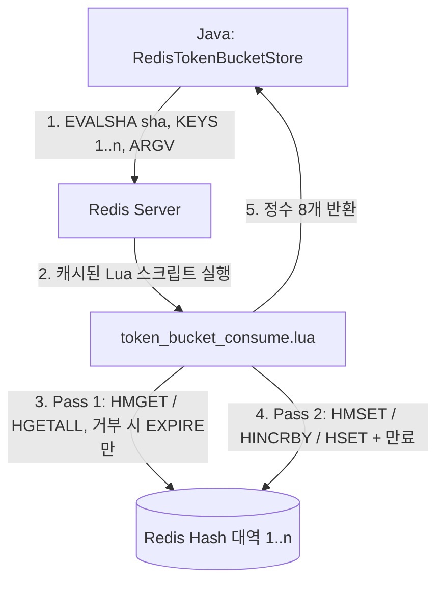

# RateLimiter Layer Deep Dive

> 이 문서는 FluxGate **0.4**의 코드를 기준으로 합니다. 0.3.x에서 무엇이 바뀌었는지는
> [0.4 마이그레이션](../../operations/migration-0.4.ko.md)에, 전체 계층을 한 문서로 훑는 서술은
> [아키텍처 Deep Dive](../../../ARCHITECTURE_DEEP_DIVE.ko.md)에 있습니다.

이 문서는 FluxGate의 RateLimiter Layer를 **실제 소스코드**와 함께 상세히 설명합니다.

[< 아키텍처 개요로 돌아가기](../README.ko.md)

---

## 목차

1. [Rate Limiting 알고리즘 비교](#1-rate-limiting-알고리즘-비교)
2. [RateLimiter 인터페이스](#2-ratelimiter-인터페이스)
3. [Bucket4jRateLimiter (인메모리)](#3-bucket4jratelimiter-인메모리)
4. [Redis Lua 스크립트 (분산 환경)](#4-redis-lua-스크립트-분산-환경)

---

## 1. Rate Limiting 알고리즘 비교

Rate Limiting을 구현하는 대표적인 알고리즘들을 비교합니다.

### 1.1 Fixed Window (고정 윈도우)

```
┌─────────────────┐ ┌─────────────────┐ ┌─────────────────┐
│   Window 1      │ │   Window 2      │ │   Window 3      │
│   00:00-01:00   │ │   01:00-02:00   │ │   02:00-03:00   │
│                 │ │                 │ │                 │
│   Count: 100    │ │   Count: 0      │ │   Count: 50     │
│   Limit: 100    │ │   Limit: 100    │ │   Limit: 100    │
└─────────────────┘ └─────────────────┘ └─────────────────┘
```

**장점:**
- 구현이 단순함
- 메모리 사용량 최소 (카운터 1개)

**단점:**
- **Boundary 문제**: 윈도우 경계에서 2배의 요청 허용 가능
  - 00:59에 100개 + 01:00에 100개 = 1분 동안 200개

```
          Window 1          |          Window 2
    ────────────────────────┼────────────────────────
                      100개 │ 100개
                     ↑      │      ↑
                   00:59   01:00  01:01

    실제로 00:59~01:01 (2분) 동안 200개 요청 통과!
```

---

### 1.2 Sliding Window Log (슬라이딩 윈도우 로그)

```
현재 시간: 01:30
윈도우 크기: 1시간
────────────────────────────────────────────────────────►
    │                                              │
  00:30                                          01:30
    └──────────── 이 범위의 요청만 카운트 ────────────┘

저장된 로그:
[00:45, 00:50, 01:00, 01:15, 01:20, 01:25]
         ↓ 윈도우 밖 → 제거
[01:00, 01:15, 01:20, 01:25] → Count: 4
```

**장점:**
- 정확한 Rate Limiting (Boundary 문제 없음)

**단점:**
- **메모리 사용량 높음**: 모든 요청 타임스탬프 저장 필요
- 시간 복잡도: O(N) where N = 윈도우 내 요청 수

---

### 1.3 Sliding Window Counter (슬라이딩 윈도우 카운터)

```
현재 시간: 01:15 (현재 윈도우의 25% 지점)
이전 윈도우: 80개 요청
현재 윈도우: 20개 요청

가중치 계산:
이전 윈도우 기여 = 80 × 0.75 = 60 (75% 남음)
현재 윈도우 기여 = 20 × 1.00 = 20 (100%)
────────────────────────────────
예상 카운트     = 80개

┌─────────────────┬─────────────────┐
│   이전 윈도우    │   현재 윈도우    │
│   00:00-01:00   │   01:00-02:00   │
│                 │                 │
│   80개 × 75%    │   20개 × 100%   │
│   = 60개        │   = 20개        │
└─────────────────┴─────────────────┘
                  ▲
               01:15 (현재)
```

**장점:**
- Fixed Window보다 정확 (Boundary 문제 완화)
- 메모리 효율적 (카운터 2개만 필요)

**단점:**
- 완벽히 정확하지는 않음 (근사치)

---

### 1.4 Token Bucket (토큰 버킷) ⭐ FluxGate 채택

```
┌─────────────────────────────────────────────────────────┐
│                    Token Bucket                         │
│                                                         │
│   용량 (Capacity): 100 토큰                              │
│   리필 속도: 10 토큰/초                                   │
│                                                         │
│   ┌───────────────────────────────────────────────┐    │
│   │ ○ ○ ○ ○ ○ ○ ○ ○ ○ ○  (현재 토큰: 70개)        │    │
│   └───────────────────────────────────────────────┘    │
│                                                         │
│   요청 도착 → 토큰 1개 소비                              │
│   - 토큰 > 0: 허용 ✓                                    │
│   - 토큰 = 0: 거부 ✗ (429 Too Many Requests)           │
│                                                         │
│   시간이 지나면 토큰 자동 리필 (최대 용량까지)             │
└─────────────────────────────────────────────────────────┘
```

**장점:**
- **버스트 허용**: 짧은 시간에 용량만큼 요청 가능
- **평균 속도 제한**: 장기적으로 리필 속도로 제한
- **유연한 설정**: 용량과 리필 속도 독립적 설정
- **메모리 효율적**: 토큰 수와 마지막 리필 시간만 저장

**단점:**
- Fixed Window보다 구현 복잡

---

### 1.5 Leaky Bucket (누수 버킷)

```
┌─────────────────────────────────────────────────────────┐
│                    Leaky Bucket                         │
│                                                         │
│        요청 들어옴                                       │
│            ↓                                            │
│   ┌───────────────────────────────────────────────┐    │
│   │ ■ ■ ■ ■ ■ ■ ■ ■ ■ ■  (큐에 대기 중인 요청)     │    │
│   └───────────────────────────────────────────────┘    │
│            │                                            │
│            ↓ 일정한 속도로 처리 (leak)                   │
│         ───────                                         │
│         처리됨                                          │
│                                                         │
│   큐가 가득 차면 → 새 요청 거부                          │
└─────────────────────────────────────────────────────────┘
```

**장점:**
- 출력 속도가 일정 (트래픽 성형)
- 버스트 흡수

**단점:**
- 버스트 요청 시 지연 발생 (큐 대기)
- Token Bucket보다 덜 유연

---

#### 📋 상황별 알고리즘 선택 가이드

| 상황 | 추천 알고리즘 | 이유 |
|------|-------------|------|
| API 과금 (정확한 카운트 필요) | Sliding Window Log | 정확도가 가장 중요 |
| 일반적인 API Rate Limit | Token Bucket | 버스트 허용 + 간단함 |
| DB 보호, 트래픽 평탄화 | Leaky Bucket | 일정한 처리량 보장 |
| 단순한 구현, 리소스 제한 | Fixed Window | 구현 쉬움 |

---

#### 🎯 Token Bucket vs Leaky Bucket 실제 동작 비교

```
시나리오: 결제 API (10 req/sec 제한)
사용자가 0초에 10개 요청을 동시에 보냄

┌─────────────────────────────────────────────────────────────┐
│ Token Bucket                                                │
├─────────────────────────────────────────────────────────────┤
│ 0.0초: 10개 요청 → 10개 모두 즉시 통과 ✅                      │
│ 0.1초: 1개 요청 → 토큰 없음, 거부 ❌                          │
│ 1.0초: 토큰 리필 → 다시 10개 가능                             │
│                                                             │
│ 결과: 서버가 순간적으로 10개 동시 처리해야 함 💥               │
│ 장점: 사용자 응답 빠름                                        │
│ 단점: 서버 부하 스파이크 발생 가능                             │
└─────────────────────────────────────────────────────────────┘

┌─────────────────────────────────────────────────────────────┐
│ Leaky Bucket                                                │
├─────────────────────────────────────────────────────────────┤
│ 0.0초: 10개 요청 → 1개 통과, 9개 큐 대기                      │
│ 0.1초: 큐에서 1개 처리 → 8개 대기                             │
│ 0.2초: 큐에서 1개 처리 → 7개 대기                             │
│ ...                                                         │
│ 0.9초: 큐에서 1개 처리 → 0개 대기                             │
│                                                             │
│ 결과: 서버는 항상 1개씩만 처리 ✅                              │
│ 장점: 서버 부하 일정                                          │
│ 단점: 사용자 응답 지연 (최대 0.9초 대기)                       │
└─────────────────────────────────────────────────────────────┘
```

---

#### 🎯 FluxGate가 Token Bucket을 선택한 이유

```
1. API Gateway 용도
   → 버스트 허용이 사용자 경험에 좋음
   → 즉각적인 응답이 중요

2. 성능
   → O(1) 시간복잡도
   → Redis Lua 스크립트로 원자적 처리 가능

3. 유연성
   → Multi-Band 지원 (10/초 + 100/분 + 1000/시간)
   → 다양한 Rate Limit 정책 적용 가능
```

> **참고:** DB 보호나 트래픽 평탄화가 목적이라면 Leaky Bucket이 더 적합할 수 있습니다.


```java
// 다중 대역 예시 - RateLimitBand.builder(window, capacity)
RateLimitRule.builder("tiered-rule")
    .scope(LimitScope.PER_API_KEY)
    .addBand(RateLimitBand.builder(Duration.ofMinutes(1), 100).build())   // 분당 100개
    .addBand(RateLimitBand.builder(Duration.ofHours(1), 1000).build())    // 시간당 1000개
    .build();
```

한 규칙의 대역들은 **AND 조건**입니다. 분당 100개 **그리고** 시간당 1000개를 모두 만족해야 통과합니다.
0.4에서는 이 규칙의 모든 대역이 한 번의 원자적 연산으로 평가되므로, 시간당 대역이 거부할 때 분당
대역의 토큰이 낭비되지 않습니다.

라벨을 주지 않으면 `getKeyLabel()`이 설정에서 파생합니다(`100-per-60s`, `1000-per-3600s`).
버킷 키의 마지막 세그먼트가 되는 값이며, 같은 규칙의 두 대역이 서로 다른 버킷을 갖는 근거입니다.

---

## 2. RateLimiter 인터페이스

```
📁 fluxgate-core/src/main/java/org/fluxgate/core/ratelimiter/
└── RateLimiter.java
```

```java
// RateLimiter.java
public interface RateLimiter {

  // 기본 1토큰 소비
  default RateLimitResult tryConsume(RequestContext context, RateLimitRuleSet ruleSet) {
    return tryConsume(context, ruleSet, 1L);
  }

  /**
   * 토큰 소비를 시도합니다.
   *
   * @param context 요청 컨텍스트
   * @param ruleSet 적용할 규칙 세트
   * @param permits 소비할 토큰 수
   * @return Rate Limit 결과
   */
  RateLimitResult tryConsume(RequestContext context, RateLimitRuleSet ruleSet, long permits);

  // 0.4.0: 엔진의 PathPatternMatcher로 적용 규칙(getMatchingRules)을 거르는 오버로드.
  // 기본 구현은 매처를 무시하고 3인자 형태로 위임합니다. RedisRateLimiter·Bucket4jRateLimiter와
  // 스타터의 데코레이터는 이 메서드를 재정의해 매처를 그대로 씁니다.
  default RateLimitResult tryConsume(
      RequestContext context,
      RateLimitRuleSet ruleSet,
      long permits,
      PathPatternMatcher pathMatcher) {
    return tryConsume(context, ruleSet, permits);
  }
}
```

### 구현체와 데코레이터

| 클래스 | 모듈 | 역할 |
|-------|------|------|
| `RedisRateLimiter` | `fluxgate-redis-ratelimiter` | 분산 레이트 리미터(TOKEN_BUCKET·SLIDING_WINDOW·FIXED_WINDOW). Lua로 요청 단위 원자 처리, 슬롯이 갈리는 클러스터에선 규칙 단위 + 환불 |
| `Bucket4jRateLimiter` | `fluxgate-core` | 인메모리 토큰 버킷. 인스턴스 로컬 |
| `LazyRedisRateLimiter` | 스타터 | Redis 연결을 지연 생성하고 백그라운드 재연결 |
| `ResilientRateLimiter` | 스타터 | 재시도 + 서킷 브레이커 + 강등 (`@Primary`) |

스타터에서 `RateLimiter`를 주입받으면 보통 다음 체인의 맨 앞(`ResilientRateLimiter`)이 옵니다.

```
ResilientRateLimiter  →  LazyRedisRateLimiter  →  RedisRateLimiter  →  Lua
       │
       └─ 실패 시 강등: Bucket4jRateLimiter 또는 failure-behavior
```

`RateLimiter` 인터페이스 하나로 데코레이터를 쌓을 수 있는 것이 이 설계의 요점입니다. 각 계층은
자기 관심사만 처리하고 나머지를 다음 계층에 넘깁니다.

---

## 3. Bucket4jRateLimiter (인메모리)

```
📁 fluxgate-core/src/main/java/org/fluxgate/core/ratelimiter/impl/bucket4j/
└── Bucket4jRateLimiter.java
```

Bucket4j 기반의 **인스턴스 로컬** Rate Limiter입니다. `fluxgate.ratelimit.mode=IN_MEMORY`와
`fluxgate.ratelimit.fallback.mode=IN_MEMORY`가 이것을 사용합니다.

```java
// Bucket4jRateLimiter.java - 실제 코드 (발췌)
/**
 * <p>One {@link Bucket} is kept per (rule set, rule, resolved key), built with Bucket4j's native
 * multi-bandwidth support so that all bands of a rule are evaluated atomically inside a single
 * {@code tryConsumeAndReturnRemaining} call.
 *
 * <p>Buckets live in a bounded Caffeine cache: at most {@code maximumSize} entries. Each bucket is
 * evicted after it has been idle for the longer of {@code expireAfterAccess} and the longest window
 * among its bands. A bucket idle for a whole window has refilled completely anyway, so expiry never
 * resets a partially consumed daily or monthly quota; {@code expireAfterAccess} is only a floor for
 * short windows.
 */
public class Bucket4jRateLimiter implements RateLimiter {

  /**
   * Default minimum idle time after which a bucket is evicted; buckets whose longest band window is
   * longer stay for that window instead.
   */
  public static final Duration DEFAULT_EXPIRE_AFTER_ACCESS = Duration.ofHours(1);

  /**
   * Bounded bucket cache keyed by (ruleSetId, ruleId, band definitions, logical key).
   *
   * <p>Each entry holds the multi-bandwidth {@link Bucket} for all bands of one rule and the band
   * list used to map the probe result back to a {@code bandLabel} and {@code limit}.
   */
  private final Cache<BucketKey, BucketEntry> buckets;

  public Bucket4jRateLimiter(
      long maximumSize, Duration expireAfterAccess, PathPatternMatcher pathMatcher) {
    // ... 인자 검증 ...
    this.minIdleNanos = saturatedNanos(expireAfterAccess);
    this.buckets =
        Caffeine.newBuilder()
            .maximumSize(maximumSize)
            // Idle expiry per bucket: max(expireAfterAccess, longest band window).
            .expireAfter(/* expireAfterCreate/Update/Read 모두 entry.idleNanos 반환 */)
            .removalListener(
                (key, value, cause) -> {
                  if (cause.wasEvicted()) {
                    evictionCount.incrementAndGet();
                  }
                })
            .build();
  }
}
```

세 가지가 핵심입니다.

- **버킷은 (룰셋, 규칙, 해석된 키)마다 하나**이고, 규칙의 모든 대역이 그 버킷의 Bucket4j
  bandwidth로 들어갑니다. 한 규칙의 대역들은 Bucket4j 호출 하나 안에서 원자적으로 평가됩니다.
- **만료 시간은 버킷마다 다릅니다.** `max(expireAfterAccess, 가장 긴 대역 윈도우)` 동안 유휴여야
  축출됩니다. 일·월 단위 쿼터가 `expireAfterAccess`(기본 1시간) 유휴만으로 리셋되지 않습니다.
  `expireAfterAccess`는 짧은 윈도우의 **최소** 유휴 시간입니다.
- **캐시 키에 대역 정의가 들어갑니다.** 리로드 직후 이전 룰셋을 들고 있는 요청이 새 대역의
  버킷을 옛 정의로 만들거나 재사용할 수 없습니다.

### tryConsume: 규칙 전체에 걸친 all-or-nothing

```java
// Bucket4jRateLimiter.java - 실제 코드 (발췌)
RateLimitResult result = null;
for (int attempt = 1; result == null; attempt++) {
  List<BucketEntry> locked = new ArrayList<>(calls.size());
  for (RuleCall call : calls) {
    call.entry = buckets.get(call.bucketKey, k -> createBucketEntry(call.bands));
    if (!locked.contains(call.entry)) {
      locked.add(call.entry);
    }
  }
  locked.sort(Comparator.comparingLong(entry -> entry.order));

  for (BucketEntry entry : locked) {
    entry.lock.lock();
  }
  try {
    // An entry evicted or reset between the lookup and the lock is no longer the bucket other
    // requests charge; look the buckets up again instead of charging a detached one.
    if (attempt >= MAX_LOOKUP_ATTEMPTS || allEntriesCurrent(calls)) {
      result = consumeAll(calls, permits);
    }
  } finally {
    for (int i = locked.size() - 1; i >= 0; i--) {
      locked.get(i).lock.unlock();
    }
  }
}
// The user-supplied recorder may be slow; never run it while holding bucket locks.
return record(context, ruleSet, result);
```

1. **키를 먼저 전부 해석합니다.** 매칭된 규칙마다 키를 해석하고 `permits`가 대역 용량을 넘지
   않는지 검증한 뒤에야 버킷을 건드립니다. `MissingRateLimitKeyException`은 거부 결과가 됩니다.
2. **관련 버킷을 전역 순서로 잠급니다.** 순서는 버킷 생성 일련번호이므로 버킷을 공유하는 두
   요청이 교착하지 않습니다. 잠금은 버킷 단위이고 몇 번의 인메모리 호출 동안만 유지됩니다.
3. **잠근 뒤 캐시를 다시 확인합니다.** 조회와 잠금 사이에 버킷이 축출되거나 `reset`됐다면, 다른
   요청이 더 이상 보지 않는 버킷에 차감하지 않도록 조회부터 다시 합니다(`allEntriesCurrent`).
   이 재확인은 `Bucket4jRateLimiterInternalsTest`가 조회와 잠금 사이에 `reset`을 끼워 넣어 지킵니다.
4. **`consumeAll`**: 모든 버킷에 `estimateAbilityToConsume`(읽기 전용 프로브)으로 처리 가능 여부를
   묻고, 하나라도 안 되면 아무것도 차감하지 않고 거부합니다. 여러 규칙이 거부하면 가장 긴 대기
   시간을 보고하므로 `Retry-After`가 너무 이르지 않습니다. 모두 가능할 때만 각각
   `tryConsumeAndReturnRemaining`으로 차감합니다.

### Lua와 같은 계약: 잠금 아래의 2단계

모든 소비가 이 잠금을 거치므로 확인과 차감 사이에 다른 요청이 버킷을 비울 수 없습니다. 리필은
토큰을 더하기만 합니다. 그래서 뒤 규칙이 거부한 요청은 앞 규칙의 토큰을 먹지 않습니다 — Redis
경로와 같은 계약입니다. 그래도 확인 뒤 차감이 실패한다면, 이미 차감한 규칙에
`addTokens(permits)`(용량 상한 적용)로 되돌려준 뒤 거부합니다.

### 버킷 캐시 축출은 한도 리셋입니다

```java
/**
 * Returns how many buckets have been evicted from the cache.
 *
 * <p>Monotonically increasing, counting both size-based eviction and idle expiry. An eviction
 * resets the affected key's tokens, so a rate far above the normal churn of your keyspace means
 * either that {@code maximum-size} is too small for the traffic or that someone is cycling
 * identities to get their limit reset.
 */
public long getEvictionCount() {
  return evictionCount.get();
}
```

축출된 버킷은 다음 요청에서 **가득 찬 상태로 재생성**됩니다. 즉 축출은 그 키의 Rate Limit을
리셋합니다.

```
공격: 신원을 계속 바꿔 캐시를 밀어냄
 ┌─────────────────────────────────────────────────────┐
 │ maximumSize = 100,000                               │
 │                                                     │
 │ 공격자가 100,001개의 서로 다른 X-User-Id로 요청      │
 │   → 피해자의 버킷이 LRU로 축출됨                      │
 │   → 공격자가 다시 자기 버킷을 만들면 가득 찬 상태      │
 │   → Rate Limit이 사실상 무력화                        │
 └─────────────────────────────────────────────────────┘
```

Javadoc의 결론이 분명합니다. **"This limiter is for a single instance: do not combine it with a
forgeable identity scope."** 위조 가능한 신원 스코프(헤더 기반 `PER_USER` 등)와 인메모리 limiter를
함께 쓰지 마세요.

`removalListener`가 `cause.wasEvicted()`만 세는 것도 정밀한 선택입니다. 룰 변경으로 버킷을
명시적으로 지우는 것은 축출이 아니므로, 정상적인 리로드가 보안 메트릭을 오염시키지 않습니다.
메트릭 이름은 `fluxgate.limiter.bucket_evictions`입니다.

### 결과 조립: Redis 경로와 같은 의미

```java
// Bucket4jRateLimiter.java - 실제 코드
private RateLimitResult rejectedResult(
    RateLimitKey key,
    RateLimitRule rule,
    RateLimitBand band,
    long remainingTokens,
    long nanosToWaitForRefill) {

  long resetMs = System.currentTimeMillis() + millisUntilFull(band, remainingTokens);
  return RateLimitResult.builder(key)
      .allowed(false)
      .matchedRule(rule)
      .remainingTokens(remainingTokens)
      .nanosToWaitForRefill(nanosToWaitForRefill)
      .limit(band != null ? band.getCapacity() : -1L)
      .resetTimeMillis(resetMs)
      .policy(rule.getOnLimitExceedPolicy())
      .bandLabel(band != null ? band.getKeyLabel() : null)
      .build();
}

private static long millisUntilFull(RateLimitBand band, long currentTokens) {
  // ...
  long windowNanos = saturatedNanos(band.getWindow());
  // the double product saturates at Long.MAX_VALUE when cast back
  long nanos = (long) ((double) deficit / (double) capacity * (double) windowNanos);
  return toMillisRoundedUp(nanos);
}
```

허용 결과(`allowedResult`)도 같은 방식으로 남은 토큰이 가장 적은 규칙(binding)을 보고합니다.
나노초 환산은 포화 연산과 오버플로 없는 올림 나눗셈을 쓰므로 `Duration.ofMillis(Long.MAX_VALUE)`
같은 대역도 예외 없이 처리됩니다.

`resetTimeMillis`는 "요청을 처리할 만큼 리필될 때"가 아니라 **"가득 찰 때"** 입니다.
TOKEN_BUCKET 대역에서는 Lua 스크립트와 같은 의미입니다. Redis 경로의 SLIDING_WINDOW는 세어진 요청이
모두 윈도를 떠나는 시각, FIXED_WINDOW는 윈도 끝을 보고하는데, 인메모리 limiter는 이 두 알고리즘을
interval refill로 근사하므로 여기서도 선형 리필 기준으로 가득 찰 때까지를 추정합니다.

### 설정

```yaml
fluxgate:
  ratelimit:
    mode: IN_MEMORY        # 또는 REDIS
    fallback:
      mode: IN_MEMORY      # Redis 실패 시 인메모리로 강등
      max-buckets: 100000
      expire-after-access: 1h  # 최소 유휴 만료. 더 긴 윈도우의 버킷은 그 윈도우만큼 유지
```

```java
// FluxgateRateLimiterAutoConfiguration.java - 실제 코드
@Bean(name = {DELEGATE_RATE_LIMITER_BEAN_NAME, "fluxgateInMemoryRateLimiter"})
@ConditionalOnMissingBean(RateLimiter.class)
public Bucket4jRateLimiter fluxgateInMemoryRateLimiter() {
  RateLimitProperties rateLimitProps = properties.getRatelimit();
  if (rateLimitProps.getMode() == RateLimiterMode.REDIS) {
    log.warn(
        "fluxgate.ratelimit.mode=REDIS but no Redis rate limiter is available "
            + "(fluxgate.redis.enabled={}). Falling back to the in-memory limiter.",
        properties.getRedis().isEnabled());
  }

  log.info(
      "Creating in-memory Bucket4jRateLimiter (mode={}). Rate limits are enforced PER INSTANCE "
          + "and are NOT distributed; enable fluxgate.redis for a shared limit.",
      rateLimitProps.getMode());
  return new Bucket4jRateLimiter(
      rateLimitProps.getFallback().getMaxBuckets(),
      rateLimitProps.getFallback().getExpireAfterAccess());
}
```

부팅 로그가 **대문자로** `PER INSTANCE`와 `NOT distributed`를 말합니다. 인메모리 limiter를 분산
환경에서 쓰면 실효 한도가 `설정값 × 인스턴스 수`가 되기 때문에, 조용히 지나가면 안 되는 사실입니다.

---

## 4. Redis Lua 스크립트 (분산 환경)

분산 환경에서 Rate Limiting을 구현할 때 가장 큰 문제는 **Race Condition**입니다. FluxGate는
Redis Lua 스크립트를 사용해 이 문제를 해결합니다.

### 4.1 왜 Lua 스크립트인가?

```
문제: Race Condition (경쟁 상태)
────────────────────────────────

서버 A                     서버 B
   │                          │
   ├─ GET tokens → 5          │
   │                          ├─ GET tokens → 5
   ├─ tokens - 1 = 4          │
   │                          ├─ tokens - 1 = 4
   ├─ SET tokens 4            │
   │                          ├─ SET tokens 4  ← 문제!
   ▼                          ▼

결과: 2번 소비했는데 1개만 감소 (버그!)
```

```
해결: Lua 스크립트 = 원자적(Atomic) 실행
─────────────────────────────────────────

서버 A                     Redis (싱글 스레드)
   │                          │
   ├─ EVALSHA lua_script ────▶│ 스크립트 전체 실행
   │                          │ (중간에 끊기지 않음)
   │◀──── 결과 반환 ──────────┤
   │                          │
서버 B                         │
   ├─ EVALSHA lua_script ────▶│ 다음 스크립트 실행
   │                          │
```

Redis는 싱글 스레드로 동작하기 때문에, Lua 스크립트는 **중간에 다른 명령이 끼어들 수 없이**
완전히 실행됩니다.

0.4에서는 여기에 하나가 더 붙습니다. 한 규칙의 **모든 대역**이 그 원자적 실행 안에 들어가고, 단독
Redis이거나 매칭된 규칙들의 키가 한 클러스터 슬롯에 모이면 **모든 규칙**이 한 번의 호출에 들어갑니다.
0.3.x는 대역마다 별도의 `EVALSHA`였으므로, 스크립트 하나하나는 원자적이었지만 **규칙 전체의 결정은
원자적이 아니었습니다.** 슬롯이 갈리는 클러스터에서는 규칙마다 호출하고, 뒤 규칙이 거부하면 앞서
차감한 규칙을 `token_bucket_refund.lua`로 환불합니다(원자적이지 않은 보상).

---

### 4.2 아키텍처 흐름


```mermaid
graph TD
    A[Java: RedisTokenBucketStore] -->|1. EVALSHA sha, KEYS 1..n, ARGV| B[Redis Server]
    B -->|2. 캐시된 Lua 스크립트 실행| C[token_bucket_consume.lua]
    C -->|3. Pass 1: HMGET / HGETALL, 거부 시 EXPIRE만| D[(Redis Hash 대역 1..n)]
    C -->|4. Pass 2: HMSET / HINCRBY / HSET + 만료| D
    C -->|5. 정수 8개 반환| A
```

`KEYS`가 여러 개라는 점이 0.3.x와의 결정적 차이입니다. 대역 수만큼의 버킷 키가 한 호출에 들어갑니다.

---

### 4.3 코드 구조

```
📁 fluxgate-redis-ratelimiter/src/main/
├── java/org/fluxgate/redis/
│   ├── script/
│   │   ├── LuaScriptRegistry.java  # 스토어별 스크립트 본문 + SHA (0.4의 정식 구현)
│   │   ├── LuaScripts.java         # @Deprecated 0.4.0 — 프로세스 전역 static 슬롯
│   │   └── LuaScriptLoader.java    # @Deprecated 0.4.0 — 위 슬롯에만 씀
│   └── store/
│       └── RedisTokenBucketStore.java  # Lua 스크립트 호출
└── resources/lua/
    ├── token_bucket_consume.lua  # 소비(또는 check-only) 스크립트
    └── token_bucket_refund.lua   # 규칙 간 보상용 환불 스크립트
```

`LuaScripts`와 `LuaScriptLoader`의 static 슬롯은 한 JVM에서 서로 다른 Redis를 쓰는 스토어가 둘 있을 때
**서로의 SHA를 덮어썼습니다.** 0.4는 인스턴스 상태를 갖는 `LuaScriptRegistry`로 대체했고,
두 클래스는 컴파일 호환을 위해서만 남아 있습니다.

---

### 4.4 스크립트 로딩 흐름

```
┌─────────────────────────────────────────────────────────────────┐
│ 1. 스토어 생성 시 (RedisTokenBucketStore 생성자)                  │
├─────────────────────────────────────────────────────────────────┤
│                                                                 │
│   new LuaScriptRegistry()                                       │
│       ↓  classpath의 consume·refund 스크립트 두 개 읽기          │
│       ↓  (읽기 실패 → ScriptExecutionException, 생성 시점에 발견) │
│   if (!scripts.isLoaded())                                      │
│       ↓                                                         │
│   scripts.loadInto(connectionProvider)                          │
│       ↓  SCRIPT LOAD × 2 → SHA1 두 개 수신                       │
│   tokenBucketConsumeSha / tokenBucketRefundSha ← volatile 필드    │
│                                                                 │
└─────────────────────────────────────────────────────────────────┘
                              ↓
┌─────────────────────────────────────────────────────────────────┐
│ 2. 요청 시마다 (RedisTokenBucketStore.tryConsume)                │
├─────────────────────────────────────────────────────────────────┤
│                                                                 │
│   tryConsume(bucketKeys, bands, permits)                        │
│       ← 요청당 1회 (규칙들이 클러스터 슬롯을 나누면 규칙마다 1회)   │
│       ↓                                                         │
│   String sha = scripts.getTokenBucketConsumeSha()  ← 인스턴스 필드│
│       ↓                                                         │
│   connectionProvider.evalsha(sha, keys, args)                   │
│       ↓  keys = 대역마다 하나                                    │
│       ↓  args = permits, max_bucket_ttl_seconds                  │
│       ↓         + (capacity, window_micros, algorithm_code,      │
│       ↓            buckets, window_end) × n  [+ "1" check-only]  │
│   결과: [allowed, rejecting_band, min_remaining, micros_to_wait, │
│          reset_time_millis, limit, binding_band, now_micros]     │
│                                                  ← 정수 8개      │
│                                                                 │
└─────────────────────────────────────────────────────────────────┘
```

0.3.x는 `LuaScriptLoader.loadScripts()`를 호출자가 **직접 먼저** 불러야 했고, 스토어 생성자는
그것을 검사해 `IllegalStateException`을 던졌습니다. 0.4의 스토어는 스스로 챙깁니다.

---

### 4.5 EVAL vs EVALSHA

```
EVAL (느림)
─────────────
Client: EVAL "긴 스크립트 전체..." 3 key1 key2 key3 arg1 arg2 ...
        ↑ 매번 스크립트 전송 (네트워크 낭비)

EVALSHA (빠름) ← FluxGate가 사용하는 방식
──────────────
1회차: SCRIPT LOAD "긴 스크립트..." → SHA: "abc123..."
이후:  EVALSHA "abc123..." 3 key1 key2 key3 arg1 arg2 ...
       ↑ 40바이트 SHA만 전송
```

Redis가 재시작되면 스크립트 캐시가 사라져 `NOSCRIPT` 오류가 옵니다. FluxGate는 그때 EVAL로
즉시 처리하고 백그라운드에서 스크립트를 재적재합니다. 자세한 흐름은
[Storage Layer](storage-layer.ko.md#2-noscript-에러-처리-및-스크립트-리로드)에 있습니다.

---

### 4.6 Lua 스크립트 완전 분석 (한 줄씩 설명)

```
📁 fluxgate-redis-ratelimiter/src/main/resources/lua/
└── token_bucket_consume.lua
```

이 섹션에서는 Lua 스크립트의 **모든 단계**를 상세히 설명합니다.

**목차:**
- [📌 실제 시나리오로 이해하기](#-실제-시나리오로-이해하기)
- [📖 변수 정의 사전](#-변수-정의-사전) ← **먼저 읽어주세요!**
- [STEP 1~10: 상세 코드 분석](#step-1-인자-파싱과-검증)

---

#### 📌 실제 시나리오로 이해하기

```
상황 설정:
─────────────────────────────────────────────────────────────
• API: /api/users (사용자 목록 조회)
• 규칙: per-ip-rule, 대역 2개
    대역 1: 분당 100개  (100-per-60s)
    대역 2: 시간당 1000개 (1000-per-3600s)
• 현재 사용자: IP 192.168.1.100
• 현재 상태: 분당 대역에 30개 남음 (마지막 리필 30초 전)
• 요청: 1개 토큰 소비하고 싶음

Java가 넘기는 것:
  KEYS[1] = "fluxgate:bucket:{api-limits:per-ip-rule:ip:192.168.1.100}:100-per-60s"
  KEYS[2] = "fluxgate:bucket:{api-limits:per-ip-rule:ip:192.168.1.100}:1000-per-3600s"
  ARGV    = {"1",                                  -- permits
             "604800",                             -- max_bucket_ttl_seconds (7일)
             "100", "60000000", "1", "0", "0",     -- 대역 1: capacity, window_micros,
                                                   --   algorithm(1=TOKEN_BUCKET), buckets, window_end
             "1000", "3600000000", "1", "0", "0"}  -- 대역 2
```

두 키가 같은 `{...}` 해시 태그를 공유하므로 클러스터에서도 같은 슬롯에 있습니다. 다중 키
스크립트의 전제 조건입니다.

---

#### 📖 변수 정의 사전

스크립트에서 사용되는 모든 변수들을 미리 정리합니다.

##### 입력 변수 (Java에서 전달)

| 변수명 | 타입 | 설명 | 예시 값 |
|--------|------|------|---------|
| `KEYS[i]` | string | 대역 i의 버킷 키 | `"fluxgate:bucket:{api-limits:per-ip-rule:ip:192.168.1.100}:100-per-60s"` |
| `band_count` | number | `#KEYS` — 이 규칙의 대역 수 | `2` |
| `permits` | number | 소비하려는 토큰 수 (`ARGV[1]`) | `1` |
| `capacities[i]` | number | 대역 i의 최대 토큰 용량 | `100` |
| `windows[i]` | number | 대역 i의 윈도 크기 (**마이크로초**) | `60000000` (60초) |
| `max_ttl_seconds` | number | TOKEN_BUCKET·SLIDING_WINDOW 버킷 TTL의 상한 (`ARGV[2]`) | `604800` (7일) |
| `algorithms[i]` | number | 대역 i의 알고리즘 코드 (1 TOKEN_BUCKET, 2 SLIDING_WINDOW, 3 FIXED_WINDOW) | `1` |
| `check_only` | boolean | 마지막 대역 뒤의 `"1"`: 결정만 하고 쓰지 않음 | `false` |

##### 시간 관련 변수

| 변수명 | 타입 | 설명 | 예시 값 |
|--------|------|------|---------|
| `time_info` | table | Redis TIME 결과 `[초, 마이크로초]` | `{"1703001234", "567890"}` |
| `now_micros` | number | 현재 시간 (**마이크로초**) | `1703001234567890` |
| `last_refill` | number | 해시 필드 `last_refill_micros`에서 읽은 마지막 리필 시각 (마이크로초) | `1703001204567890` |
| `elapsed` | number | 경과 시간. **한 윈도로 클램프됨** | `30000000` (30초) |
| `next_refill` | number | 이번 호출 후 기록할 리필 시각 | `1703001222567890` |

##### 토큰 관련 변수

| 변수명 | 타입 | 설명 | 예시 값 |
|--------|------|------|---------|
| `data` | table | `HMGET` 결과 `{tokens, last_refill_micros}` | `{"30", "1703001204567890"}` |
| `cur_tokens` | number | 리필 전 토큰 수 | `30` |
| `to_add` | number | 리필할 **온전한** 토큰 수 | `50` |
| `refilled` | number | 리필 후 토큰 수 (용량 초과 방지) | `80` |
| `tb_tokens[i]` | table | TOKEN_BUCKET 대역별 토큰. Pass 2 이후에는 차감된 값 | `{79, 979}` |
| `tb_refills[i]` | table | TOKEN_BUCKET 대역별로 기록할 리필 시각 | - |
| `tokens_needed` | number | 부족한 토큰 수 (거부 시) | `1` |
| `deficit` | number | 가득 찰 때까지 필요한 토큰 수 | `21` |

##### 출력/결과 변수

| 변수명 | 타입 | 설명 | 예시 값 |
|--------|------|------|---------|
| `wait` | number | 반환값 `micros_to_wait`. TOKEN_BUCKET은 **요청 1개**를 처리할 만큼 리필될 때까지 (거부 시) | `600000` (0.6초) |
| `full_micros` | number | TOKEN_BUCKET 버킷이 **가득 찰** 때까지 | `12600000` (12.6초) |
| `reset_millis` | number | 반환값 `reset_time_millis` (Unix timestamp ms) | `1703001247167` |
| `rejection` | table | 지금까지 대기가 가장 긴 거부의 반환 배열. 없으면 `nil` | - |
| `binding` | number | binding 대역의 **1-based** 인덱스 | `1` |

##### TTL

| 함수 | 설명 | 예시 값 |
|-----|------|---------|
| `ttl_for_window(window_micros)` | `min(max_ttl_seconds, max(1, ceil(window_sec * 1.1)))` | 윈도 60초 → `66` |

---

##### 🔑 핵심 개념 3개 깊게 이해하기

```
┌─────────────────────────────────────────────────────────────────────────┐
│ 1. last_refill_micros (마지막 리필 시각, 마이크로초)                      │
├─────────────────────────────────────────────────────────────────────────┤
│                                                                         │
│   "마지막으로 토큰이 추가된 시점"                                         │
│                                                                         │
│   ──────────────────────────────────────────────────────────────► 시간  │
│        │                              │                                 │
│   last_refill_micros              now_micros                            │
│   (과거)                          (현재)                                │
│                                                                         │
│   0.3.x는 이 필드를 'last_refill_nanos'로, 나노초로 저장했습니다.         │
│   나노초(약 1.76e18)는 Lua double의 정확한 정수 범위(2^53 ≈ 9.0e15)를    │
│   넘어, "1.76e+18" 문자열로 저장되며 정밀도를 잃었습니다.                 │
│   0.4는 마이크로초(약 1.76e15)를 쓰고 필드 이름도 바꿨습니다.             │
│                                                                         │
│   구 필드는 읽지 않으므로, 0.3.x 버킷은 업그레이드 후 한 번               │
│   가득 찬 상태로 재초기화됩니다 (일회성 quota 리셋).                      │
│                                                                         │
└─────────────────────────────────────────────────────────────────────────┘

┌─────────────────────────────────────────────────────────────────────────┐
│ 2. elapsed (경과 시간) - 한 윈도로 클램프됨                               │
├─────────────────────────────────────────────────────────────────────────┤
│                                                                         │
│   elapsed =                                                             │
│       math.min(math.max(0, now_micros - last_refill),                   │
│                win_micros)                                              │
│                                                                         │
│   math.max(0, ...) : 시계가 뒤로 간 경우 (Redis 재시작 등) 0으로          │
│   math.min(..., win_micros) : 한 윈도를 넘으면 어차피 가득 차므로         │
│                                  더 셀 필요가 없고,                      │
│                                  elapsed * capacity 곱의 크기도 제한됨   │
│                                                                         │
│   예시: 마지막 리필이 30초 전, 윈도 60초                                 │
│   elapsed = 30,000,000 μs (30초)                                        │
│   - 30초 경과, 윈도 60초, 용량 100 → 50개 리필                           │
│   - 90초 경과 → 60초로 클램프 → 100개 리필 (가득)                        │
│                                                                         │
└─────────────────────────────────────────────────────────────────────────┘

┌─────────────────────────────────────────────────────────────────────────┐
│ 3. wait vs full_micros (TOKEN_BUCKET) — 다른 질문에 답합니다              │
├─────────────────────────────────────────────────────────────────────────┤
│                                                                         │
│   wait (micros_to_wait) : "이 요청 1개를 처리할 만큼 리필되려면?"         │
│       = ceil(tokens_needed * window_micros / capacity)                  │
│       → HTTP Retry-After 가 됩니다                                       │
│                                                                         │
│   full_micros : "버킷이 가득 차려면?"                                    │
│       = ceil(deficit * window_micros / capacity)                        │
│       → reset_time_millis, 즉 RateLimit-Reset 이 됩니다                  │
│                                                                         │
│   예시: 용량 100, 윈도 60초, 현재 토큰 0, permits 1                      │
│   wait        = ceil(1 * 60,000,000 / 100)   =    600,000 μs = 0.6초   │
│   full_micros = ceil(100 * 60,000,000 / 100) = 60,000,000 μs = 60초    │
│                                                                         │
│   0.3.x는 두 값을 구분하지 않아 reset 헤더가 실제보다 훨씬 이른           │
│   시각을 가리켰습니다.                                                   │
│                                                                         │
└─────────────────────────────────────────────────────────────────────────┘
```

---

#### STEP 1: 인자 파싱과 검증

```lua
-- ══════════════════════════════════════════════════════════════
-- STEP 1: 인자 파싱과 검증
-- ══════════════════════════════════════════════════════════════

local band_count = #KEYS
if band_count < 1 then
    return redis.error_reply("at least one bucket key is required")
end
-- KEYS의 개수가 곧 대역의 개수입니다.
-- 0.3.x는 KEYS[1] 하나만 받았고, 대역마다 별도 호출이었습니다.

if #ARGV ~= 2 + 5 * band_count and #ARGV ~= 3 + 5 * band_count then
    return redis.error_reply(
        "expected " .. (2 + 5 * band_count) .. " arguments for " .. band_count .. " band(s)")
end
local check_only = #ARGV == 3 + 5 * band_count and ARGV[#ARGV] == '1'
-- 왜 2 + 5n 인가:
--   1개  permits                 (ARGV[1])
--   1개  max_bucket_ttl_seconds  (ARGV[2])
--   5n개 대역마다 (capacity, window_micros, algorithm_code, buckets_or_zero,
--                  window_end_micros_or_zero)
--   +1개 check-only 플래그 "1"   (선택, 맨 마지막)
--
-- 개수를 먼저 검증하는 이유: 어긋난 인덱스로 엉뚱한 값을 capacity로
-- 읽으면 조용히 잘못된 한도를 강제합니다. 그 전에 거부합니다.

local permits = tonumber(ARGV[1])
if permits == nil or permits <= 0 then
    return redis.error_reply("permits must be positive")
end
-- tonumber()가 nil을 돌려주는 경우(숫자가 아닌 문자열)도 함께 막습니다.

local max_ttl_seconds = tonumber(ARGV[2])
if max_ttl_seconds == nil or max_ttl_seconds < 1 then
    return redis.error_reply("max bucket ttl must be >= 1 second")
end
```

**시각화:**
```
Java에서 호출 (대역 2개 규칙):
connectionProvider.evalsha(sha,
    new String[]{
        "fluxgate:bucket:{api-limits:per-ip-rule:ip:192.168.1.100}:100-per-60s",
        "fluxgate:bucket:{api-limits:per-ip-rule:ip:192.168.1.100}:1000-per-3600s"
    },
    new String[]{"1",                                  // ARGV[1] permits
                 "604800",                             // ARGV[2] max_bucket_ttl_seconds
                 "100", "60000000", "1", "0", "0",     // ARGV[3..7]   대역 1
                 "1000", "3600000000", "1", "0", "0"}  // ARGV[8..12]  대역 2
);

Lua에서 받음:
band_count = #KEYS = 2
#ARGV = 12 = 2 + 5 * 2  ✓   (check-only면 13, 마지막이 "1")
permits = 1
```

---

#### STEP 2: 대역별 용량과 윈도 수집

```lua
-- ══════════════════════════════════════════════════════════════
-- STEP 2: 대역별 capacity / window_micros 파싱 및 검증
-- ══════════════════════════════════════════════════════════════

for i = 1, band_count do
    local base       = 2 + 5 * (i - 1)
    local capacity   = tonumber(ARGV[base + 1])
    local win_micros = tonumber(ARGV[base + 2])
    local alg        = tonumber(ARGV[base + 3]) or ALG_TOKEN_BUCKET
    local buckets    = tonumber(ARGV[base + 4]) or 0
    local win_end    = tonumber(ARGV[base + 5]) or 0

    if capacity == nil or capacity <= 0 then
        return redis.error_reply("capacity must be positive")
    end
    if win_micros == nil or win_micros <= 0 then
        return redis.error_reply("window must be positive")
    end
    if win_micros < 1000 then
        return redis.error_reply("window must be at least 1 ms")
    end
    if permits > capacity then
        return redis.error_reply("permits exceed capacity")
    end
    if alg == ALG_SLIDING_WINDOW and buckets < 2 then
        return redis.error_reply("buckets must be >= 2 for SLIDING_WINDOW")
    end
    if alg == ALG_SLIDING_WINDOW and math.floor(win_micros / buckets) < 1000 then
        return redis.error_reply("sliding window sub-bucket must be at least 1 ms")
    end

    capacities[i]    = capacity
    windows[i]       = win_micros
    algorithms[i]    = alg
    bucket_counts[i] = buckets
    win_ends_in[i]   = win_end
end
```

인덱스 산식을 보세요.

```
i = 1 → ARGV[3..7]
i = 2 → ARGV[8..12]
i = 3 → ARGV[13..17]
```

앞의 두 값(permits, TTL 상한)은 대역 수와 무관하게 자리가 고정되어 있으므로 대역 i는 언제나
`2 + 5 * (i - 1)`부터 다섯 칸입니다. 선택적인 check-only 플래그만 맨 뒤에 붙습니다. 환불 스크립트도
같은 배열 모양을 쓰고 `ARGV[2]`에 TTL 상한 대신 소비 때 받은 `now_micros`를 넣으며, 1 ms 미만 윈도와
서브 버킷을 같은 메시지로 거부합니다.

`permits > capacity` 검사는 Java 쪽 `RedisTokenBucketStore`에도 있습니다(중복이 아니라
이중 방어입니다). 용량 10인 대역에 permits 20은 **얼마를 기다려도** 통과할 수 없으므로,
대기 시간을 돌려주면 클라이언트가 무한 재시도에 빠집니다.

---

#### STEP 3: 현재 시간 가져오기 (Redis 서버 시간, 마이크로초)

```lua
-- ══════════════════════════════════════════════════════════════
-- STEP 3: Redis 서버 시간 가져오기
-- ══════════════════════════════════════════════════════════════
--
-- Q: 왜 Java의 System.nanoTime()을 안 쓰고 Redis TIME을 쓰나요?
-- A: 클럭 드리프트 문제!
--
--    서버 A 시계: 10:00:00.000
--    서버 B 시계: 10:00:00.500  ← 0.5초 차이!
--    서버 C 시계: 09:59:59.800  ← 0.2초 느림!
--
--    → 각 서버가 다른 시간으로 계산하면 Rate Limit이 정확하지 않음
--    → Redis 서버 시간을 쓰면 모든 서버가 동일한 시간 사용!

local time_info = redis.call('TIME')
-- time_info[1] = seconds since epoch, time_info[2] = microseconds within the second
local now_micros = tonumber(time_info[1]) * 1000000 + tonumber(time_info[2])
-- 계산: 1703001234 × 1,000,000 + 567890 = 1,703,001,234,567,890 마이크로초
```

**나노초로 변환하지 않는 것이 0.4의 핵심 수정입니다.**

```
Lua 5.1에는 정수 타입이 없습니다. 모든 수가 IEEE-754 double이고,
정확한 정수 범위는 2^53 ≈ 9.0e15 입니다.

epoch 마이크로초 ≈ 1.76e15  →  범위 안 ✓
epoch 나노초     ≈ 1.76e18  →  범위 밖 ✗

0.3.x는 나노초를 썼고, redis.call이 Lua 기본 %.14g 포맷으로
"1.76e+18"이라는 문자열로 저장했습니다. 다시 읽으면 정밀도가
날아간 값입니다.
```

그래서 해시에 쓰는 **모든** 값이 `string.format('%.0f', v)`를 통과합니다. 기본 포맷에 맡기지 않는
명시적 선택입니다.

0.3.x 주석의 **"integer arithmetic only(정수 연산만 사용)"** 는 사실이 아니었습니다. 정확한 표현은
"double의 정확한 정수 범위 안에 머무르는 산술"입니다.

**시간 단위 비교:**
```
1초        = 1,000 밀리초 (ms)
1밀리초    = 1,000 마이크로초 (μs)
1마이크로초 = 1,000 나노초 (ns)

Unix timestamp 1703001234.567890
= 1,703,001,234초 + 567,890마이크로초
= 1,703,001,234,567,890 마이크로초   ← FluxGate 0.4가 쓰는 단위
= 1,703,001,234,567,890,000 나노초  ← 0.3.x. 2^53을 넘습니다
```

Java 쪽 API는 여전히 나노초를 노출합니다(`BucketState.nanosToWaitForRefill()`). 스크립트가 돌려준
마이크로초에 1000을 곱해 되돌립니다.

```java
// RedisTokenBucketStore.java - 실제 코드
private static final long NANOS_PER_MICRO = 1_000L;
...
long nanosToWait = result.get(3) * NANOS_PER_MICRO;
```

---

#### STEP 4: TTL 상한 읽기와 TTL 함수

```lua
-- ══════════════════════════════════════════════════════════════
-- STEP 4: 버킷 TTL 계산
-- ══════════════════════════════════════════════════════════════

-- TTL in whole seconds, capped at max_ttl_seconds (for TOKEN_BUCKET and SLIDING_WINDOW).
-- min=1s so a sub-second window still gets a bucket that expires.
local function ttl_for_window(win_micros)
    return math.min(max_ttl_seconds, math.max(1, math.ceil(win_micros / 1000000 * 1.1)))
end
```

`max_ttl_seconds`는 STEP 1에서 검증한 `ARGV[2]`입니다. FIXED_WINDOW 카운터는 이 TTL을 쓰지 않고
윈도 끝에서 `PEXPIREAT`으로 만료됩니다(`fixed_window_expire_millis`, 윈도 끝을 ms로 올림).

TTL 공식:

```
TTL = min(max_bucket_ttl, max(1, ceil(window_seconds * 1.1)))
```

| 요소 | 이유 |
|-----|------|
| `window * 1.1` | 시계 오차를 감당할 10% 여유 |
| `max(1, ...)` | 서브초 윈도가 TTL 0(= 즉시 만료)이 되는 것을 방지 |
| `min(max_ttl, ...)` | 호출자가 준 상한. 위조 가능한 키가 Redis를 몇 주씩 점유하는 것을 방지 |

상한은 **24시간 하드코딩이 아닙니다.** 0.3.x 스크립트에는 `math.min(desired_ttl, 86400)`이
박혀 있었고, 그 때문에 하루보다 긴 윈도를 가진 규칙이 조용히 짧아졌습니다. 0.4는 호출자가
`ARGV[2]`로 상한을 넘기며 기본값은 `fluxgate.redis.max-bucket-ttl`의 **7일**입니다. 상한은
TOKEN_BUCKET과 SLIDING_WINDOW에만 걸리고, FIXED_WINDOW 카운터는 윈도 끝에 정확히 만료됩니다.

```java
// RedisTokenBucketStore.java - 실제 코드
/**
 * Default upper bound on a bucket TTL.
 *
 * <p>A bucket normally lives one window plus 10%. Without a cap, a rule with a 30 day window
 * keeps one Redis hash per distinct key alive for 33 days - and identity keys are cheap to forge,
 * so the keyspace an attacker can pin down is bounded only by the window. Seven days keeps long
 * windows working while bounding that; raise it deliberately if you rate limit over longer
 * periods with a scope whose cardinality you control.
 */
public static final Duration DEFAULT_MAX_BUCKET_TTL = Duration.ofDays(7);
```

상한이 윈도보다 짧으면 규칙이 실제로 강제하는 한도가 달라집니다. 그래서 `RedisRateLimiter`가
규칙마다 한 번 WARN을 남깁니다.

```
윈도 30일 + 상한 7일
 → 버킷이 7일마다 만료
 → 만료된 버킷은 다음 요청에서 가득 찬 상태로 재생성
 → 실제로는 "30일 한도"가 아닙니다
```

---

#### STEP 5: Pass 1 — 버킷 상태 읽기 (TOKEN_BUCKET)

아래 STEP 5~7은 TOKEN_BUCKET 분기입니다. SLIDING_WINDOW와 FIXED_WINDOW 분기도 같은 Pass 1 루프 안에서
자기 상태를 읽고 확인만 하며, 쓰기는 Pass 2로 미룹니다.

```lua
-- Pass-1 state tables (populated during the check pass; reused in pass 2)
-- TOKEN_BUCKET
local tb_tokens  = {}   -- token count after refill
local tb_refills = {}   -- next refill timestamp (micros)
...
for i = 1, band_count do
    local capacity   = capacities[i]
    local win_micros = windows[i]
    local alg        = algorithms[i]

    -- ---- TOKEN_BUCKET ----
    if alg == ALG_TOKEN_BUCKET then
        local data       = redis.call('HMGET', KEYS[i], 'tokens', 'last_refill_micros')
        local cur_tokens = tonumber(data[1])
        local last_refill = tonumber(data[2])

        -- Missing bucket (or a 0.3.x bucket whose 'last_refill_micros' is absent):
        -- start full, which allows the initial burst.
        if cur_tokens == nil or last_refill == nil then
            cur_tokens  = capacity
            last_refill = now_micros
        end
```

Redis Hash 구조:

```
┌────────────────────────────────────────────────────────────────────────────┐
│ Key: "fluxgate:bucket:{api-limits:per-ip-rule:ip:192.168.1.100}:100-per-60s"│
├────────────────────────┬───────────────────────────────────────────────────┤
│ Field                  │ Value                                             │
├────────────────────────┼───────────────────────────────────────────────────┤
│ tokens                 │ "30"                ← 현재 남은 토큰               │
│ last_refill_micros     │ "1703001204567890"  ← 마지막 리필 (마이크로초)     │
└────────────────────────┴───────────────────────────────────────────────────┘

0.3.x가 쓴 버킷:
│ tokens                 │ "30"                                              │
│ last_refill_nanos      │ "1.7030012e+18"     ← 스크립트가 읽지 않습니다      │
```

**시각화:**
```
첫 번째 요청 시 (또는 0.3.x 버킷):
┌───────────────────────────┐      ┌─────────────────────────────┐
│ 버킷 없음 (nil)            │  →   │ cur_tokens = 100 (가득!)     │
│ 또는 last_refill_micros    │      │ last_refill = now_micros     │
│      필드가 없음           │      └─────────────────────────────┘
└───────────────────────────┘      → 처음 요청하는 키는 버스트 허용

이미 사용 중인 경우:
┌───────────────────────────┐      ┌─────────────────────────────┐
│ tokens = 30               │  →   │ cur_tokens = 30             │
│ last_refill_micros = ...  │      │ last_refill = ...           │
└───────────────────────────┘      └─────────────────────────────┘
```

0.3.x 버킷이 재초기화되는 것은 **의도된 마이그레이션 동작**입니다. 잘못된 단위의 타임스탬프를
해석하려 시도하면 훨씬 이상한 결과가 나옵니다.

---

#### STEP 6: 경과 시간 계산 (클램프 포함)

```lua
        -- math.max handles a clock that moved backwards; math.min caps at one window so
        -- elapsed * capacity stays inside the 2^53 safe range (the Java caller validates this).
        local elapsed = math.min(math.max(0, now_micros - last_refill), win_micros)
```

한 줄에 두 개의 방어가 겹쳐 있습니다.

| 함수 | 막는 것 |
|-----|--------|
| `math.max(0, ...)` | 시계가 뒤로 감 (Redis 재시작, NTP 조정). 음수 경과 시간은 토큰이 사라지는 버그를 만듭니다 |
| `math.min(..., win_micros)` | 한 윈도를 넘는 경과. 어차피 가득 차므로 더 셀 필요가 없고, `elapsed * capacity` 곱의 크기도 함께 제한됩니다 |

곱의 크기 제한은 정밀도와 직결됩니다. 헤더의 PRECISION 주석이 한계를 명시하고, Java 쪽
`RedisTokenBucketStore`가 TOKEN_BUCKET 대역에 대해 `IEEE_754_MAX_PRODUCT`(2^53)로 미리 검사합니다.

```
capacity × window_micros ≤ 2^53 ≈ 9.0e15

예: capacity=10^6 → 윈도 약 104일까지 안전
    capacity=10^9 → 윈도 약 2.5시간까지
```

**시각화:**
```
시간 흐름:
─────────────────────────────────────────────────────────────►
     │                                                  │
last_refill                                         now_micros
(마지막 리필)                                        (현재)
     └──────────────── elapsed ───────────────────────┘
                   (최대 win_micros로 클램프)
```

---

#### STEP 7: 리필할 토큰 계산 + 잔여분 이월 (0.4의 정확성 수정)

```lua
        -- Only whole tokens are credited, and the timestamp advances only by the time those
        -- tokens cost, so the sub-token remainder is carried into the next call.
        local to_add      = math.floor(elapsed * capacity / win_micros)
        local next_refill = last_refill
        if to_add > 0 then
            next_refill = last_refill + math.floor(to_add * win_micros / capacity)
        end
        local refilled = math.min(capacity, cur_tokens + to_add)
        if refilled >= capacity then
            -- Bucket is full; no deficit to carry.
            next_refill = now_micros
        end

        tb_tokens[i]  = refilled
        tb_refills[i] = next_refill
```

리필 계산 자체는 Token Bucket 표준 공식입니다.

```
리필할 토큰 = floor(경과시간 × 용량 / 윈도)

나눗셈을 마지막에 하는 것이 중요합니다:

❌ refill_rate = 100 / 60000000 = 0.00000166666...  ← 무한소수
   to_add = elapsed × refill_rate = 49.9999...       ← 불안정

✅ to_add = (30000000 × 100) / 60000000 = 50         ← 정확
```

**0.4에서 새로 들어간 것은 `next_refill` 계산입니다.**

0.3.x는 성공 시 `last_refill`을 **현재 시각으로** 갱신했습니다. `math.floor`로 버려진 1토큰 미만의
잔여 시간이 매 호출마다 사라집니다.

```
용량 100, 윈도 60초 → 토큰 1개의 비용 = 600ms

0.3.x: 500ms마다 요청이 들어오는 경우
  호출 1: elapsed=500ms → to_add = floor(500/600) = 0
          last_refill = now         ← 500ms가 버려짐
  호출 2: elapsed=500ms → to_add = 0
          last_refill = now         ← 또 500ms 버려짐
  → 영원히 리필되지 않습니다

0.4: 같은 상황
  호출 1: elapsed=500ms → to_add = 0
          next_refill = last_refill (그대로)   ← 시간이 보존됨
  호출 2: elapsed=1000ms → to_add = floor(1000/600) = 1
          next_refill = last_refill + floor(1 × 600ms) = +600ms
          → 남은 400ms는 다음 호출로 이월
  → 정확히 600ms당 1개씩 리필됩니다
```

0.3.x는 **상시 과소 허용(systematically under-allow)** 이었습니다. 설정한 한도보다 적게 통과시켰고,
요청 간격이 토큰 비용보다 짧을수록 심해졌습니다. 초당 100개 같은 빡빡한 대역에서 특히 눈에 띕니다.

버킷이 가득 차면 이월할 부족분이 없으므로 `now_micros`로 맞춥니다. 그러지 않으면 `last_refill`이
과거에 고정되어 다음 호출이 이미 반영된 시간을 다시 셉니다.

**시각화:**
```
버킷 상태 변화:

Before (리필 전):                After (리필 후):
┌────────────────────┐           ┌────────────────────┐
│ ●●●●●●●●●●●●●●●○○○○○│           │ ●●●●●●●●●●●●●●●●●●●●│
│ 30/100 토큰        │   +50     │ 80/100 토큰        │
└────────────────────┘  ────►    └────────────────────┘

오버플로우 방지 (math.min):
┌────────────────────┐           ┌────────────────────┐
│ ●●●●●●●●●●●●●●●●○○○○│           │ ●●●●●●●●●●●●●●●●●●●●│
│ 80/100 토큰        │   +50     │ 100/100 토큰 (MAX) │
└────────────────────┘  ────►    └────────────────────┘
                                  130이 아닌 100!
```

---

#### STEP 8: Pass 1 거부 경로 — `reject()`와 `refresh_ttls()`

부족한 대역을 만나도 **즉시 반환하지 않습니다.** `reject()`로 기록만 하고 나머지 대역을 계속
확인합니다(헤더 note 10). 모든 대역을 본 뒤에 거부가 하나라도 있으면 TTL만 갱신하고 반환합니다.

```lua
-- The rejecting band with the longest wait so far (note 10): its result array, or nil.
local rejection = nil
local function reject(i, remaining, wait, reset_millis)
    if rejection == nil or wait > rejection[4] then
        rejection = {0, i, remaining, wait, reset_millis, capacities[i], i, now_micros}
    end
end
```

TOKEN_BUCKET 분기에서 토큰이 모자라면:

```lua
        if refilled < permits then
            local tokens_needed = permits - refilled
            local wait          = math.ceil(tokens_needed * win_micros / capacity)
            local deficit       = capacity - refilled
            local full_micros   = deficit > 0 and math.ceil(deficit * win_micros / capacity) or 0
            local reset_millis  = math.floor((now_micros + full_micros) / 1000)
            reject(i, refilled, wait, reset_millis)
        end
```

다른 두 알고리즘도 같은 `reject()`를 부릅니다.

| 알고리즘 | `wait` (micros_to_wait) | `reset_millis` |
|---------|------------------------|----------------|
| TOKEN_BUCKET | `ceil(tokens_needed × window / capacity)` — 요청 하나만큼 리필될 때까지 | 버킷이 **가득 찰** 시각 |
| SLIDING_WINDOW | 가장 오래된 서브 버킷부터 카운트를 더해 `total - freed + permits <= capacity`가 되는 첫 서브 버킷 k가 윈도를 떠나는 시각: `(k + buckets) × sub_dur - now` (note 11) | 지금 세어진 요청이 모두 윈도를 떠나는 시각, ms로 **올림**(`math.ceil`) |
| FIXED_WINDOW | `window_end - now` | 윈도 끝. TTL이 없는 카운터(`PTTL == -1`)는 여기서 `PEXPIREAT`을 받습니다 |

Pass 1 루프가 끝난 뒤:

```lua
if rejection ~= nil then
    refresh_ttls()
    return rejection
end
```

```lua
-- Refresh TTLs for TOKEN_BUCKET and SLIDING_WINDOW keys on the reject path.
-- EXPIRE is a no-op on keys that do not exist yet; FIXED_WINDOW keys are not touched
-- because PEXPIREAT (an absolute timestamp) must not be overridden with a relative one.
local function refresh_ttls()
    for j = 1, band_count do
        if algorithms[j] == ALG_TOKEN_BUCKET or algorithms[j] == ALG_SLIDING_WINDOW then
            redis.call('EXPIRE', KEYS[j], ttl_for_window(windows[j]))
        end
    end
end
```

여기가 **다중 대역의 정확성이 만들어지는 지점**입니다.

```
╔═════════════════════════════════════════════════════════════════╗
║ 중요: 거부 시 어떤 대역도 토큰·카운터를 쓰지 않습니다              ║
╠═════════════════════════════════════════════════════════════════╣
║                                                                 ║
║ "초당 10개 AND 분당 100개" 규칙, 분당 대역이 소진된 상태          ║
║                                                                 ║
║ 0.3.x (대역마다 개별 EVALSHA):                                   ║
║   초당 대역 호출 → 허용, 토큰 차감됨                              ║
║   분당 대역 호출 → 거부                                          ║
║   → 요청은 429인데 초당 대역의 토큰은 사라졌습니다                 ║
║   → 초당 한도가 실효적으로 10개보다 낮아집니다                     ║
║                                                                 ║
║ 0.4 (한 번의 호출, 2패스):                                       ║
║   Pass 1: 초당 대역 확인(OK) → 분당 대역 확인(부족, reject 기록)  ║
║           → 남은 대역도 끝까지 확인, 그동안 HMSET 없음            ║
║           → refresh_ttls() 후 대기가 가장 긴 거부를 반환          ║
║   → 초당 대역의 토큰이 그대로 남습니다                            ║
║                                                                 ║
╚═════════════════════════════════════════════════════════════════╝
```

#### 왜 첫 거부에서 멈추지 않나

첫 번째로 거부한 대역만 보고하면, 그 `Retry-After` 뒤에 재시도해도 **다른 대역이 여전히 거부**할 수
있습니다. 예를 들어 TOKEN_BUCKET 대역이 10분, 같은 규칙의 SLIDING_WINDOW 대역이 54분을 기다려야 한다면
10분을 알려주는 것은 거짓말입니다. 그래서 Pass 1은 모든 대역을 쓰지 않고 확인하고, 가장 긴 대기를
가진 거부(동률이면 먼저 나온 대역)를 돌려줍니다.

#### 거부 시에도 TTL은 갱신합니다

"상태를 전혀 쓰지 않는다"가 아니라 "**토큰·카운터·서브 버킷은** 쓰지 않는다"입니다. 만료 시각은
갱신합니다.

헤더 note 4가 이유를 말합니다.

> only the TTLs of TB/SW buckets are refreshed so buckets that see nothing but rejections still
> expire on schedule.

거부만 계속 받는 버킷의 TTL을 갱신하지 않으면, 마지막으로 **허용된** 요청 시점의 TTL로 만료됩니다.
공격 트래픽이 계속 들어오는 버킷이 만료 직전 상태로 방치되는 셈입니다.

`refresh_ttls()`가 거부한 대역 `i`뿐 아니라 **모든** TOKEN_BUCKET·SLIDING_WINDOW 대역을 도는 것도
의도입니다. 앞서 확인을 통과한 대역들의 버킷도 실재하며, 그들의 TTL도 함께 연장되어야 대역 간 만료
시점이 어긋나지 않습니다. FIXED_WINDOW 카운터는 건너뜁니다. 윈도 끝의 절대 시각(`PEXPIREAT`)을
상대 TTL로 덮으면 카운터가 윈도보다 오래 살거나 일찍 사라집니다.

`EXPIRE`는 존재하지 않는 키에 no-op이므로, 아직 만들어지지 않은 버킷에 대해서도 안전합니다.

#### 반환값의 두 시간

```
용량 100, 윈도 60초, 현재 토큰 0, permits 1 (TOKEN_BUCKET)

wait          = ceil(1 * 60,000,000 / 100)   =    600,000 μs = 0.6초
full_micros   = ceil(100 * 60,000,000 / 100) = 60,000,000 μs = 60초
reset_millis  = floor((now_micros + 60,000,000) / 1000)
```

전자가 `Retry-After`, 후자가 `RateLimit-Reset`이 됩니다. 0.3.x는 두 값을 구분하지 않아 reset
헤더가 실제보다 훨씬 이른 시각을 가리켰습니다.

거부 시 `rejecting_band_index`와 `binding_band_index`가 **같은 값 `i`** 입니다. 대기가 가장 긴 거부
대역이 곧 결정을 만든 대역이기 때문입니다.

---

#### STEP 9: check-only 모드와 Pass 2 — 모든 대역에서 차감

check-only 모드(`ARGV`의 마지막이 `"1"`)는 Pass 1만 하고 끝납니다. 모든 대역이 허용하면 남은 양이
가장 적은 대역을 binding으로 보고하고, **아무것도 쓰지 않습니다**(note 9).

```lua
if check_only then
    -- Note 9: every band would serve the request; report the most restrictive one, unconsumed.
    ...
    return {1, 0, binding_remaining, 0, 0, capacities[binding], binding, now_micros}
end
```

check-only의 허용 결과는 `reset_time_millis`가 `0`입니다. 아무것도 차감하지 않았으므로 의미 있는
리셋 시각이 없습니다.

Pass 2의 TOKEN_BUCKET 분기:

```lua
local binding           = 1
local binding_remaining = nil

for i = 1, band_count do
    ...
    -- ---- TOKEN_BUCKET ----
    if alg == ALG_TOKEN_BUCKET then
        local remaining = tb_tokens[i] - permits
        redis.call('HMSET', KEYS[i],
            'tokens',             string.format('%.0f', remaining),
            'last_refill_micros', string.format('%.0f', tb_refills[i]))
        redis.call('EXPIRE', KEYS[i], ttl_for_window(win_micros))
        tb_tokens[i] = remaining   -- updated for reset_time_millis calculation below

        if binding_remaining == nil or remaining < binding_remaining then
            binding           = i
            binding_remaining = remaining
        end
```

Pass 1에서 모든 대역이 통과했으므로, 여기서는 **조건 없이 전부 차감**합니다. 원자적 스크립트
안이라 중간에 상태가 바뀔 수 없으니 재확인이 필요 없습니다. SLIDING_WINDOW 분기는 현재 서브 버킷에
`HINCRBY`하고 세지 않은 필드를 `HDEL`로 지우며, FIXED_WINDOW 분기는 `{count, window_end_micros}`를
`HSET`하고 `PEXPIREAT`을 겁니다.

`string.format('%.0f', v)`가 두 필드 모두에 붙어 있는 것에 주의하세요. Lua 기본 숫자 직렬화(`%.14g`)는
큰 값을 지수 표기로 바꿉니다. 마이크로초 타임스탬프는 2^53 안에 있지만, 포맷을 명시하는 것이
저장 표현을 확실하게 만듭니다.

`binding`은 차감 **후** 남은 양이 가장 적은 대역입니다(동률이면 앞선 대역).

---

#### STEP 10: 리셋 시각 계산과 반환

```lua
local binding_capacity = capacities[binding]
local binding_alg      = algorithms[binding]
local reset_millis

if binding_alg == ALG_TOKEN_BUCKET then
    -- Time until the binding bucket is completely full again (computed AFTER consumption).
    local remaining   = tb_tokens[binding]   -- already updated in pass 2
    local deficit     = binding_capacity - remaining
    local full_micros = deficit > 0 and math.ceil(deficit * windows[binding] / binding_capacity) or 0
    reset_millis = math.floor((now_micros + full_micros) / 1000)

elseif binding_alg == ALG_SLIDING_WINDOW then
    -- End of the current sub-bucket cycle (when all requests in current sub expire), rounded UP
    -- to the millisecond like the reject path.
    ...
    reset_millis = math.ceil((cur_sub + buckets) * sub_dur / 1000)

elseif binding_alg == ALG_FIXED_WINDOW then
    reset_millis = math.floor(fw_ends[binding] / 1000)
end

return {1, 0, binding_remaining, 0, reset_millis, binding_capacity, binding, now_micros}
```

TOKEN_BUCKET에서 주석이 강조하는 **AFTER consumption**이 요점입니다.

```
용량 100, 차감 후 토큰 79 → deficit = 21
full_micros = ceil(21 × 60,000,000 / 100) = 12,600,000 μs = 12.6초

차감 전(토큰 80)으로 계산하면 deficit = 20 → 12초.
0.6초의 차이는 작지만, 그것은 "이 요청이 없었다면 가득 찰 시각"입니다.
클라이언트에게 사실과 다른 시각을 알려줄 이유가 없습니다.
```

SLIDING_WINDOW는 서브 버킷 길이(`floor(window / buckets)`)가 밀리초의 정수배가 아닐 수 있으므로
올림합니다. 내림하면 리셋 시각이 거부된 요청이 재시도할 수 있는 시각보다 최대 1 ms 앞설 수 있습니다.

반환값 8개:

```lua
return {1, 0, binding_remaining, 0, reset_millis, binding_capacity, binding, now_micros}
--      │  │  │                  │  │             │                 │        │
--      │  │  │                  │  │             │                 │        └─ [8] now_micros (Redis TIME,
--      │  │  │                  │  │             │                 │              환불 스크립트가 사용)
--      │  │  │                  │  │             │                 └─ [7] binding_band_index (1-based)
--      │  │  │                  │  │             └─ [6] limit = binding 대역의 용량
--      │  │  │                  │  └─ [5] reset_time_millis (epoch ms, 알고리즘별 정의는 4.8)
--      │  │  │                  └─ [4] micros_to_wait = 0 (허용이므로 대기 불필요)
--      │  │  └─ [3] min_remaining = binding 대역의 차감 후 남은 양
--      │  └─ [2] rejecting_band_index = 0 (거부한 대역 없음)
--      └─ [1] allowed = 1
```

거부일 때는 STEP 8의 `rejection` 배열이 같은 모양으로 반환됩니다. 대기 시간이 가장 긴 거부 대역이
`[2]`와 `[7]`에, 그 대기 시간이 `[4]`에 들어갑니다.

---

#### 전체 흐름 시각화

```
┌─────────────────────────────────────────────────────────────────────┐
│              Lua 스크립트 실행 흐름 (대역 2개 규칙)                    │
├─────────────────────────────────────────────────────────────────────┤
│                                                                     │
│  입력: KEYS = [100-per-60s 버킷, 1000-per-3600s 버킷]                │
│        permits=1, TTL 상한=604800초                                  │
│                                                                     │
│  ┌─────────────────────────────────────────────────────────────┐   │
│  │ STEP 1-2. 인자 검증                                          │   │
│  │    #ARGV == 2 + 5*2 == 12  ✓                                │   │
│  │    capacity/window 양수, permits <= capacity  ✓              │   │
│  └─────────────────────────────────────────────────────────────┘   │
│                            ↓                                        │
│  ┌─────────────────────────────────────────────────────────────┐   │
│  │ STEP 3-4. Redis TIME → now_micros, ttl_for_window() 준비     │   │
│  │    now_micros = 1,703,001,234,567,890                       │   │
│  └─────────────────────────────────────────────────────────────┘   │
│                            ↓                                        │
│  ┌─────────────────────────────────────────────────────────────┐   │
│  │ Pass 1 (STEP 5-8): 대역마다 HMGET → 리필 → 확인               │   │
│  │    대역 1: tokens=30, elapsed=30초 → +50 → 80 >= 1  ✓        │   │
│  │    대역 2: tokens=980, elapsed=30초 → +8 → 988 >= 1 ✓        │   │
│  │    (부족해도 끝까지 확인 → TTL만 갱신, 가장 긴 대기를 반환)    │   │
│  └─────────────────────────────────────────────────────────────┘   │
│                            ↓                                        │
│  ┌─────────────────────────────────────────────────────────────┐   │
│  │ Pass 2 (STEP 9): 전부 차감 + HMSET + EXPIRE                  │   │
│  │    대역 1: 80 - 1 = 79                                       │   │
│  │    대역 2: 988 - 1 = 987                                     │   │
│  │    binding = 1 (79 < 987)                                    │   │
│  └─────────────────────────────────────────────────────────────┘   │
│                            ↓                                        │
│  ┌─────────────────────────────────────────────────────────────┐   │
│  │ STEP 10. 차감 후 리셋 시각 계산 → 정수 8개 반환                │   │
│  │    {1, 0, 79, 0, 1703001247167, 100, 1, now_micros}         │   │
│  │     │  │  │   │  │              │    └─ binding = 대역 1     │   │
│  │     │  │  │   │  │              └─ limit = 100              │   │
│  │     │  │  │   │  └─ 12.6초 후 가득 참                        │   │
│  │     │  │  │   └─ 대기 불필요                                 │   │
│  │     │  │  └─ 79개 남음 (binding 대역)                        │   │
│  │     │  └─ 거부한 대역 없음                                    │   │
│  │     └─ 허용!                                                 │   │
│  └─────────────────────────────────────────────────────────────┘   │
│                                                                     │
└─────────────────────────────────────────────────────────────────────┘
```

---

#### Java에서 결과 처리

```java
// RedisTokenBucketStore.java - 실제 코드
List<Long> result =
    executeScriptWithFallback(
        scripts.getTokenBucketConsumeSha(),
        scripts.getTokenBucketConsumeScript(),
        SCRIPT_NAME,
        keys,
        args);

// [allowed, rejecting_band_index, min_remaining, micros_to_wait,
//  reset_time_millis, limit, binding_band_index, redis_time_micros]
if (result == null || result.size() != RESULT_SIZE) {
  throw new ScriptExecutionException(
      "Lua script returned invalid result: " + result, SCRIPT_NAME, null);
}

boolean allowed = result.get(0) == 1L;
long remainingTokens = result.get(2);
long nanosToWait = result.get(3) * NANOS_PER_MICRO;   // 마이크로초 → 나노초
long resetTimeMillis = result.get(4);
long limit = result.get(5);
int bandIndex = (int) (result.get(6) - 1L);           // 1-based → 0-based
long redisTimeMicros = result.get(7);                 // 환불 스크립트에 넘길 Redis TIME

if (allowed) {
  return new BucketState(
      true, remainingTokens, 0L, resetTimeMillis, limit, bandIndex, redisTimeMicros);
}
return new BucketState(
    false, remainingTokens, nanosToWait, resetTimeMillis, limit, bandIndex, redisTimeMicros);
```

`RESULT_SIZE = 8`입니다. 크기가 맞지 않으면 `ScriptExecutionException`으로 즉시 실패합니다.
값 하나가 빠졌는데 남은 값을 밀려 읽으면 조용히 잘못된 한도를 강제하기 때문입니다.

인덱스 `2`~`7`만 읽는 것에 주의하세요. `result.get(1)`
(`rejecting_band_index`)은 `binding_band_index`와 같거나 0이므로 별도로 쓰지 않습니다.

호출자는 `bandIndex`로 결과를 원래 `RateLimitBand`에 되돌려 매핑합니다.

```java
// RedisRateLimiter.java - 실제 코드 (규칙별 호출 경로)
state = tokenBucketStore.tryConsume(call.bucketKeys, call.bands, permits);
...
RateLimitBand bindingBand = bandAt(call.bands, state.bandIndex());
```

**HTTP 응답 헤더 (legacy + IETF 두 계열):**
```http
HTTP/1.1 200 OK
X-RateLimit-Limit: 100
X-RateLimit-Remaining: 79
X-RateLimit-Reset: 1703001247
RateLimit-Limit: 100
RateLimit-Remaining: 79
RateLimit-Reset: 13
RateLimit-Policy: 100;w=60
```

또는 거부 시:
```http
HTTP/1.1 429 Too Many Requests
X-RateLimit-Limit: 100
X-RateLimit-Remaining: 0
X-RateLimit-Reset: 1703001294
RateLimit-Limit: 100
RateLimit-Remaining: 0
RateLimit-Reset: 60
RateLimit-Policy: 100;w=60
Retry-After: 1
```

`X-RateLimit-Reset`은 epoch 초, `RateLimit-Reset`은 지금부터의 delta 초입니다. 둘 다 binding
대역의 리셋 시점(TOKEN_BUCKET은 다시 가득 찰 때, SLIDING_WINDOW는 세어진 요청이 모두 윈도를 떠날 때,
FIXED_WINDOW는 윈도 끝)을 가리킵니다. `Retry-After`는 다른 값(요청 1개를 처리할 만큼의 대기)이므로
훨씬 짧고, 올림 처리로 최소 1초입니다.

```java
// RateLimitHeaderWriter.java - 실제 코드
/**
 * Converts the retry delay into whole seconds, rounding up and never returning {@code 0}.
 *
 * <p>A sub-second delay truncated to {@code Retry-After: 0} sends clients into a busy loop, which
 * is exactly the traffic the rate limiter is meant to shed.
 */
public static long retryAfterSeconds(RateLimitResponse result) {
  long millis = result.getRetryAfterMillis();
  if (millis <= 0) {
    return 1L;
  }
  return Math.max(1L, ceilDiv(millis, 1000L));
}
```

---

### 4.7 설계 결정 및 이유

| 설계 결정 | 이유 |
|----------|------|
| **Redis TIME 사용** | 서버마다 `System.nanoTime()` 다름 → Redis 시간으로 통일 |
| **마이크로초 시간 기반** | 나노초는 Lua double의 정확한 정수 범위(2^53)를 넘어 `"1.76e+18"`로 저장됨 |
| **`string.format('%.0f', v)`** | 해시에 쓰는 모든 값. Lua 기본 `%.14g` 직렬화를 우회 |
| **나눗셈을 마지막에** | `(elapsed × capacity) / window`. 리필 속도를 먼저 계산하면 정밀도 손실 |
| **한 요청 = 한 호출, 2패스** (슬롯이 갈리는 클러스터에선 규칙마다 + 환불) | 다중 대역 규칙이 명목 한도를 강제. 거부가 다른 대역을 고갈시키지 않음 |
| **잔여분 이월** | 타임스탬프를 소요 시간만큼만 전진. 0.3.x의 상시 과소 허용을 수정 |
| **거부 시 TTL만 갱신** | 공정한 rate limiting + 거부만 받는 버킷도 예정대로 만료 |
| **리셋 시각은 차감 후 계산** | "이 요청이 없었다면"이 아닌 실제 시각 |
| **거부 대역을 모두 확인, 가장 긴 대기 보고** | 첫 거부만 보고하면 그 `Retry-After` 뒤에도 다른 대역이 거부 |
| **TTL 상한을 호출자가 결정** | 24시간 하드코딩 제거. 위조 가능한 키가 Redis를 몇 주씩 점유하는 것을 방지 |
| **해시 태그로 슬롯 고정** | 다중 키 스크립트가 Redis Cluster에서 원자적으로 동작하기 위한 전제 |
| **SHA 해시 캐싱 (인스턴스 단위)** | 네트워크 절약 + 서로 다른 Redis를 쓰는 스토어가 SHA를 덮어쓰지 않음 |

---

### 4.8 반환 값

```lua
return {allowed, rejecting_band_index, min_remaining, micros_to_wait,
        reset_time_millis, limit, binding_band_index, now_micros}
```

| # | 필드 | 설명 | 허용 예시 | 거부 예시 |
|---|------|------|----------|----------|
| 1 | `allowed` | 모든 대역이 허용하면 1, 아니면 0 | `1` | `0` |
| 2 | `rejecting_band_index` | 거부한 대역 중 대기가 **가장 긴** 대역의 **1-based** 인덱스(동률이면 앞선 대역). 허용 시 0 | `0` | `2` |
| 3 | `min_remaining` | 허용: binding 대역의 차감 후 남은 양(check-only는 차감 전) / 거부: 거부 대역의 남은 양 | `79` | `0` |
| 4 | `micros_to_wait` | 거부한 모든 대역 중 가장 긴 대기 (μs). 그 뒤 재시도하면 다른 대역도 통과. 허용 시 0 | `0` | `600000` |
| 5 | `reset_time_millis` | binding 대역의 epoch ms. TOKEN_BUCKET: 다시 **가득 찰** 시각 / SLIDING_WINDOW: 지금 세어진 요청이 모두 윈도를 떠나는 시각(ms 올림) / FIXED_WINDOW: 윈도 끝. check-only 허용은 0 | `1703001247167` | `1703001294567` |
| 6 | `limit` | binding 대역의 **용량** | `100` | `1000` |
| 7 | `binding_band_index` | binding 대역의 **1-based** 인덱스. 거부 시 `rejecting_band_index`와 동일 | `1` | `2` |
| 8 | `now_micros` | 결정 시점의 Redis `TIME`(μs). 환불 스크립트가 차감한 서브 버킷·윈도를 찾는 데 사용 | `1703001234567890` | `1703001234567890` |

**오류 반환** (`redis.error_reply`, Lettuce `RedisCommandExecutionException` → FluxGate
`ScriptExecutionException`):

```
'at least one bucket key is required'
'expected N arguments for M band(s)'
'permits must be positive'
'max bucket ttl must be >= 1 second'
'capacity must be positive'
'window must be positive'
'window must be at least 1 ms'
'sliding window sub-bucket must be at least 1 ms'
'permits exceed capacity'
'buckets must be >= 2 for SLIDING_WINDOW'
'unknown algorithm code: N'
```

환불 스크립트는 `'max bucket ttl ...'`와 `'permits exceed capacity'` 대신
`'consumed_at_micros must be positive'`를 쓰고, 나머지는 같은 인자에 같은 메시지를 냅니다. 환불
스크립트는 모든 대역을 먼저 검증한 뒤에야 환불하므로, 잘못된 대역이 있으면 아무것도 쓰지 않습니다.

0.3.x는 정수 4개(`{consumed, remaining_tokens, nanos_to_wait, reset_time_millis}`)를 돌려줬습니다.
0.4가 4개를 더한 이유:

| 추가된 값 | 없으면 불가능했던 것 |
|----------|-------------------|
| `rejecting_band_index` | 어느 대역이 거부했는지 로그/메트릭에 남기기 |
| `limit` | `X-RateLimit-Limit` 헤더 — 다중 대역에서 어느 용량인지 알 수 없었음 |
| `binding_band_index` | `RateLimit-Policy: <limit>;w=<window>` — 대역의 윈도를 찾아내기 |
| `now_micros` | 규칙 간 보상 — 환불 스크립트가 차감된 서브 버킷·고정 윈도를 정확히 찾기 |

---

### 4.9 Cluster 모드 지원

```java
// LuaScriptRegistry.java - 실제 코드
/**
 * Uploads every script to the given Redis and remembers the SHAs it returns.
 *
 * <p>In cluster mode Lettuce broadcasts {@code SCRIPT LOAD} to all master nodes.
 */
public String loadInto(RedisConnectionProvider connectionProvider) {
  Objects.requireNonNull(connectionProvider, "connectionProvider must not be null");

  String sha = connectionProvider.scriptLoad(tokenBucketConsumeScript);
  String refundSha = connectionProvider.scriptLoad(tokenBucketRefundScript);
  this.tokenBucketConsumeSha = sha;
  this.tokenBucketRefundSha = refundSha;

  log.info(
      "Loaded token_bucket_consume.lua ({}) and token_bucket_refund.lua ({}) into Redis ({} mode)",
      sha,
      refundSha,
      connectionProvider.getMode());
  return sha;
}
```

- Lettuce가 자동으로 모든 마스터 노드에 스크립트 배포
- `EVALSHA` 호출 시 키의 해시 슬롯에 따라 올바른 노드로 라우팅
- **다중 키 호출은 모든 키가 같은 슬롯이어야 합니다** — `RedisRateLimiter`의 해시 태그가 보장

```
fluxgate:bucket:{api-limits:per-ip-rule:ip:192.168.1.100}:100-per-60s
fluxgate:bucket:{api-limits:per-ip-rule:ip:192.168.1.100}:1000-per-3600s
                └────────────── 같은 해시 태그 ──────────────┘
                → 같은 슬롯 → 같은 노드 → 한 번의 원자적 EVALSHA
```

해시 태그가 없다면 두 키가 다른 노드에 흩어져 `CROSSSLOT` 오류가 나고, 다중 대역 원자성은
애초에 불가능합니다.

규칙 **간에는** 키가 다르므로 태그도 다르고, 따라서 다른 슬롯일 수 있습니다. 그래서 규칙 간에는
모든 키가 한 슬롯에 모일 때(단독 Redis는 항상)만 한 번의 호출로 원자적이고, 슬롯이 갈리면 규칙을
하나씩 차감한 뒤 거부 시 앞선 규칙을 환불하는 보상 방식을 씁니다.

---

## 관련 문서

- [Engine Layer Deep Dive](engine-layer.ko.md) - 룰셋 해석, 키 해석
- [Storage Layer Deep Dive](storage-layer.ko.md) - NOSCRIPT 복구, 버킷 삭제, BucketState
- [Redis RateLimiter Module Deep Dive](redis-ratelimiter.ko.md) - 키 레이아웃, 연결 계층
- [알고리즘 분석](../algorithm-analysis.ko.md)
- [아키텍처 개요](../README.ko.md)
