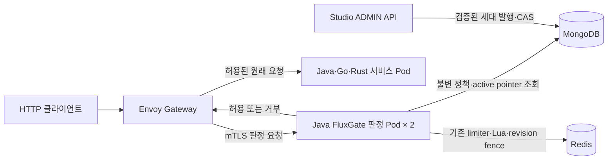

# FluxGate 정책 발행·Envoy 통합 최종 리뷰

2026-10-10. 사용자 요청에 따라 Rust 비교 구현을 제외하고, 기존 Java FluxGate를 재사용하는 Envoy 통합과 정책 변경 안전성을 구현했다. 전용 core 브랜치는 `feature/envoy-gateway-authz`, Studio 브랜치는 `feature/envoy-policy-lifecycle`이다. 기존 main·Claude 작업 worktree와 Studio의 별도 CI/IDE 변경은 수정하지 않았다.

**독립 리뷰를 포함한 내부 평가: 96/100.** 검토한 구현 범위에서 재현 근거가 있는 미해결 출시 차단 결함을 찾지 못했다. 이 점수는 아래 로컬 통합의 정확성·신뢰 경계·회귀 증거를 평가한다. 운영 인증이나 운영 배포 완료를 뜻하지 않는다. 모든 성공 판정은 전체 실행의 exit 0과 실제 응답을 확인한 결과다.

## 구현된 요청 경로



Envoy는 MongoDB·Redis에 직접 연결하지 않는다. 기존 FluxGate core의 규칙·matcher·ACL·key·다중 규칙 엔진과 Redis limiter를 Java 판정 서비스에서 실행하고, 허용되면 Envoy가 서비스로 요청을 보낸다. 판정 서비스가 원래 요청을 프록시하지 않는다.

Studio의 기존 UI/API 편집은 초안이다. 새 발행 API가 완전한 세대를 저장하고 active pointer를 전환한다. 이 작업에서 초안 편집을 자동 발행으로 바꾸거나 새 발행 UI를 구현하지 않았다. Gateway에서 지원하지 않는 `WAIT_FOR_REFILL`은 발행·readiness·판정 전에 거부한다. HTTP extAuth의 허용 응답 헤더 전파는 현재 지원 범위가 아니며, 429의 `Retry-After`는 검증했다.

## 평가 기준

| 항목 | 배점 / 평가 | 검증과 감점 이유 |
| --- | ---: | --- |
| 정책·카운터 정확성 | 30 / 29 | immutable publication, CAS, idempotency, rollback, debt·fence 보존 확인. 매 요청 Mongo 조회 비용은 부하별 미측정. |
| 인증·신뢰 경계 | 25 / 24 | 실제 JWT·ADMIN 권한·actor, API-key identity·헤더 위조 거부, 내부 mTLS 확인. 자격증명 회전 미검증. |
| Envoy 정책 반영 | 15 / 15 | lifecycle 59개 기록, 알림 없이 서로 다른 두 Pod의 ACL 변경 반영 확인. |
| 장애·네트워크 통제 | 15 / 14 | Calico 31개 항목과 실제 저장소·판정 장애 차단 확인. authz endpoint 부재는 일관된 503 대신 EG 1.9.2의 500. |
| 검증 재현성 | 15 / 14 | 전체 테스트·커버리지·포맷·실행 증거 및 재현 스크립트 보존. 운영 영속 배포와 지속적인 환경 재현은 남아 있음. |
| 합계 | **100 / 96** | 구현자 검토 후 별도 읽기 전용 리뷰가 최종 코드·증거를 확인. |

## 리뷰에서 발견하고 수정한 내용

| 문제 | 최종 수정·증거 |
| --- | --- |
| Studio의 오래된 DTO 편집이 고급 BSON 필드를 지움 | 원본 BSON 병합·전체 문서 CAS·insert-only 생성·unique ID, 실제 Mongo 보존 회귀. |
| 초안 여러 문서 조회 중 정책 세대가 섞임 | 발행 요청이 하나의 완전한 rules·ACL snapshot을 공급. immutable snapshot majority 쓰기 후 active pointer CAS. |
| 알림 유실·TTL cache로 오래된 published 정책을 사용 | 매 요청 authoritative 조회, `requiresFreshRead` SPI, mutable draft/cache fallback 제거. |
| ACL의 CIDR 내용만 바뀌었을 때 reload가 놓침 | ACL equality 및 empty ACL 제거 처리, publication과 runtime에 같은 엄격한 CIDR parser 적용. |
| capacity 감소→증가·rollback이 무료 quota를 만듦 | revision과 counter epoch 분리, signed token debt·raw count 유지, stale Lua writes 이전 fence. |
| 삭제·재사용·구조 변경이 예전 버킷을 잘못 공유 | 명시적 reset·사유 요구, 안전한 rule ID·band label·Redis 수치 범위 검증. |
| Redis Cluster CROSSSLOT 및 삭제 count 회귀 | Lua 모든 키 선언, untagged 공개 키의 hash slot 보존, 별도 policy namespace. 실제 6-node Cluster 검사. |
| polling/PubSub reload가 카운터를 reset | Boot 2/3 대칭 수정: 최초 poll·삭제·ACL·재연결에서 refresh만 수행. |
| metrics 예외와 stale 오류 재시도가 판정을 왜곡 | 항상 composite recorder로 격리, stale 오류 nonretryable, gateway 소비 retry 비활성화. |
| 요청 헤더로 user/rule-set/permit를 조작 | 서버 route·host·method binding·permit 및 검증된 credential identity 사용. 실제 forged-header 거부. |
| 단순 DNS·TCP 오류를 네트워크 차단으로 오인 | 정확한 connect-timeout marker, 허용 source 전후 대조군, actual authz egress, 전체 31개 완료 요구. |
| 다른 규칙의 거부가 counter 보존 오류를 가림 | shared quota를 충분히 남기고 앞선 route quota를 단독 검증하는 lifecycle 검사. |
| Mongo 내부 PID 1 SIGSTOP이 실제 정지를 만들지 않음 | 실패 검사로 중단. exact kind containerd task를 PAUSED로 확인한 뒤 장애 요청, RUNNING 복원 확인. |
| authz endpoint 부재를 무조건 503으로 예상 | 실측 500을 보존하고 이 경우에만 500/503을 인정. 저장소 장애는 여전히 503 필수. |

초기 실패 로그를 성공으로 계산하지 않았다. 마지막 장애 스크립트만 전체 성공했고, 스크립트는 finally에서 Mongo 재개와 replica 복원을 독립적으로 시도한다. 손상 snapshot 실험도 원본 BSON을 정확히 복원하고 readback을 확인한다.

## 자동화 검증

Java 21, 별도 Maven repository `/tmp/fluxgate-enterprise-m2/repository`를 사용했다. 사용자 공용 Maven cache에 새 `0.3.7` artifact를 덮어 설치하지 않았다.

| 범위 | 테스트 | 실패·오류·스킵 |
| --- | ---: | ---: |
| core | 540 | 0 |
| mongo-adapter | 155 | 0 |
| redis-ratelimiter | 323 | 0 |
| Spring Boot 2 starter | 524 | 0 |
| Spring Boot 3 starter | 530 | 0 |
| control-support | 52 | 0 |
| testkit | 47 | 0 |
| envoy-extauth | 42 | 0 |
| Studio admin API | 197 | 0 |
| 합계 | **2,410** | **0** |

Core 전체 16-module `clean install -Predis-cluster-it`가 성공했다. Redis 323개에는 일반 테스트 248개와 실제 저장소 integration test 75개가 포함되며 Cluster 6개도 실행했다. Mongo에는 policy repository integration 14개가 포함된다. core·Studio의 기존 JaCoCo gate와 Spotless 모두 통과했다. Envoy의 branch coverage는 198/256, 약 77.34%로 설정된 70% gate를 통과했다. 커버리지 숫자를 기능 완전성의 증명으로 사용하지 않는다.

최종 전체 검증 이후 Java 변경은 포맷뿐이다. 이후 수정된 배포·장애 스크립트는 실제 환경에서 전체 성공을 확인했고 shell syntax·Python parse·diff 검사를 다시 수행했다.

```bash
# Docker cluster fixture를 먼저 실행한다. 기존 동일 이름·포트의 환경은 덮어쓰지 않는다.
cat > /tmp/fluxgate-enterprise-cluster-override.yml <<'YAML'
services:
  redis-cluster:
    container_name: fluxgate-enterprise-cluster-it
YAML
docker compose -p fluxgate-enterprise-it -f docker/redis-cluster.yml -f /tmp/fluxgate-enterprise-cluster-override.yml up -d
./mvnw -B -o -Dmaven.repo.local=/tmp/fluxgate-enterprise-m2/repository -Predis-cluster-it clean install
./mvnw -B -o -Dmaven.repo.local=/tmp/fluxgate-enterprise-m2/repository spotless:check
# 이후 paired Studio admin API 디렉터리에서 Java 21로 실행한다.
./mvnw -B -Dmaven.repo.local=/tmp/fluxgate-enterprise-m2/repository clean verify spotless:check
```

공개 0.3.7에는 새 policy repository API가 없다. 버전 좌표가 아직 0.3.7인 개발 브랜치이므로 **paired source의 isolated install이 필요**하며, 이를 공개 artifact와 혼용해 배포하면 안 된다. 패키지 릴리스·버전 변경·push·merge는 이 작업의 완료 범위에 포함하지 않는다. 새 환경의 첫 build는 의존성 확보를 위해 `-o`를 빼야 한다.

## 실제 Docker·Kubernetes 검증

기존 `kind-fluxgate-eg`를 유지하고 별도 `kind-fluxgate-enterprise`에 Calico 3.33.0·Kubernetes 1.35.0·Envoy Gateway 1.9.2를 설치했다. 별도 kubeconfig를 사용해 기본 current-context를 변경하지 않았다. GatewayClass와 현재 generation의 listener·HTTPRoute·SecurityPolicy·BackendTLSPolicy 적용 상태를 확인했다. kind의 외부 LoadBalancer 주소 부재와 실제 listener 가용성을 구분했다.

| 검사 | 관측 결과 | 영구 보존한 증거 |
| --- | --- | --- |
| 최초 Envoy quota | 200, 200, 429·Retry-After | [smoke.json](evidence/2026-10-10-envoy/smoke.json) |
| 내부 mTLS | 정상 인증서 전후 200, 누락 시 명시적 certificate-required, plaintext authz 404 | smoke 및 script의 TLS 오류 검사 |
| Calico ingress·egress | 허용 대조군 전후 확인, Service·Pod IP 우회·actual authz egress 31/31 | [network-policy.json](evidence/2026-10-10-envoy/network-policy.json) |
| 정책 변경·rollback·counter | 서로 다른 두 Pod·Envoy 모두 기대 응답, 59개 기록 | [policy-lifecycle.json](evidence/2026-10-10-envoy/policy-lifecycle.json) |
| Mongo·Redis 장애 | 실제 PAUSED 또는 CLIENT PAUSE, GET·OPTIONS 503, 복구 후 429 유지 | [failure-modes.json](evidence/2026-10-10-envoy/failure-modes.json) |
| 판정 서비스 장애 | 0 replica 후 GET·OPTIONS 500으로 차단, 2 replica 복구 후 429 | failure-modes |
| 실제 Studio JWT·발행 | 17개 응답 검사, 알림 비활성화, 두 Pod 403→원본 ACL 복원 후 429 | [studio-policy-live.json](evidence/2026-10-10-envoy/studio-policy-live.json) |
| 배포 artifact·실제 Pod | 두 Pod imageID 및 jar SHA256, Pod→port mapping | [runtime.json](evidence/2026-10-10-envoy/runtime.json) |
| 전체 테스트 집계 | XML report 직접 합산 2,410, 실패·오류·스킵 0 | [tests.json](evidence/2026-10-10-envoy/tests.json) |

Mongo 장애 첫 GET은 약 4초, 이후 OPTIONS는 약 2초, Redis 장애는 약 2초에 503이었다. Mongo socket timeout 2초가 모든 요청의 총시간을 2초로 보장하지는 않는다. 실제 요청은 extAuth 5초 내에 차단됐지만 운영 부하에서는 별도 latency 검증이 필요하다.

Studio는 fresh executable jar, 실제 RS256 서명·JWKS·audience 검증·role converter를 사용했다. anonymous/unsigned/wrong audience는 401, USER publish는 403, caller actor는 400, ADMIN은 200이었다. operation replay는 동일 snapshot, stale revision은 409, invalid ACL은 400이고 pointer가 유지됐다. 검증된 actor, epoch 유지, 새 revision rollback·원본 ACL 최종 복원을 script가 확인했다. JWT·private key는 증거에 포함하지 않았고 script가 자기 프로세스와 임시 signing material을 정리했다.

복수 Pod 증거는 URL 두 개만으로 주장하지 않는다. lifecycle은 `s48ks`/`zb7f6`, 장애 후 Studio는 `jtr54`/`m5gfm` 두 실제 Pod를 18443/18444에 각각 포트포워드한 mapping을 보존했다. 부트스트랩 operation 재전송은 재기동 후 정책을 초기화하지 않았다. 현재 검증된 fixture는 사용자/API-key scope이며 공개 개발용 key가 필요하고, 소비된 사용량이 유지되어 429가 정상이다.

재현 경로는 [core 배포 안내](../../deploy/envoy-gateway-local/README.md)와 paired Studio의 `deploy/README.md`다. `/tmp` 원본 로그는 로컬 임시 파일이므로 여기에 sanitized JSON만 복사했다. TLS private key와 kubeconfig는 Git에 포함하지 않는다.

## 운영 이전의 경계

- 로컬 Mongo·Redis는 무인증·single instance·emptyDir다. 운영 replica set·Redis HA/영속화·TLS·백업·failover·durability는 별도 검증이 필요하다.
- 매 요청 Mongo pointer·snapshot 조회와 변환의 QPS·p95/p99·queue 압력을 측정하지 않았다. SLO 또는 처리량 보장은 없다.
- TLS/API-key 회전, 외부 ingress TLS, 실제 JWT 신원 공급원 확장과 운영 secret 관리가 남아 있다.
- debt·revision fence는 최대 bucket TTL 범위에 보존된다. 구버전 Lua·직접 Redis 소비자는 최초 발행 전에 upgrade 또는 quiesce해야 한다. 서로 다른 epoch의 in-flight 요청을 전역 동시 cutover로 설명하지 않는다.
- 기존 다중 규칙은 fail-fast이며 앞선 규칙이 소비된 뒤 뒤쪽 규칙에서 거부될 수 있다. 원 서비스의 5xx에도 quota를 자동 환급하지 않는다.
- NetworkPolicy 검증은 Pod 네트워크 경계다. 관리자 port-forward·host-network·Gateway labels를 조작할 RBAC 권한까지 차단했다고 주장하지 않는다.
- draft UI에 발행 버튼은 추가하지 않았다. 발행은 ADMIN API이며 최종 패키지 버전·운영 배포·릴리스 파이프라인은 별도 단계다.

이 경계는 알려진 구현 결함을 숨기는 승인 항목이 아니다. 요청된 별도 브랜치 개발과 Docker Desktop 로컬 검증은 완료했으며, 운영 환경·규모가 필요한 항목을 분리해 기록한 것이다.
