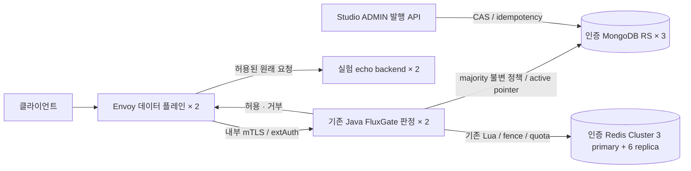

# FluxGate HA·부하·자격증명 검증

2026-10-10. 기존 Java FluxGate를 Envoy Gateway 뒤의 판정 서비스로 실행하고 Docker Desktop의 전용 Kubernetes에서 실제 장애·부하·자격증명 교체를 검증했다. **독립 최종 평가: 96/100. 요청된 로컬 HA·부하·자격증명 검증을 완료했다.** 초기 통합의 96점은 이 확대 범위의 합격 근거로 사용하지 않는다. 점수는 정확성 25·HA 25·부하 20·자격증명 20·재현성 10의 사전 rubric에 따른 로컬 engineering 평가이며 운영 인증이 아니다.

## 독립 평가

| 항목 | 배점 / 점수 | 감점 근거 |
| --- | --- | --- |
| 정확성 | 25 / 25 | fail-closed admission·동일 snapshot·majority CAS/idempotency와 회귀 근거를 확인했다. |
| HA | 25 / 24 | Redis home 역할 복원은 operator-assisted다. 연속 무인 장애 복원을 증명하지 않는다. |
| 부하 | 20 / 19 | 사전 기준은 통과했으나 짧은 합성 workload로 장기·업무 다양성을 검증하지 않았다. |
| 자격증명 | 20 / 19 | 100ms 샘플 사이의 순간적 gap은 관측하지 못한다. |
| 재현성 | 10 / 9 | 실행한 JAR·image·source/tool 해시는 기록했으나 floating 기반 이미지·개발 artifact가 남는다. |
| 합계 | **100 / 96** | 독립 읽기 전용 리뷰가 실제 원본·종료 witness·공개 증거를 검토했다. 운영 release 승인은 별도다. |

## 실제 요청 경로

Envoy는 MongoDB·Redis에 직접 연결하지 않는다. 판정 서비스가 기존 정책·ACL·키·다중 규칙·limiter·event 경로를 실행하고 동일 요청의 authoritative immutable snapshot을 엔진에 전달한다. 실제 원래 요청은 허용 결과를 받은 Envoy가 서비스 Pod로 전달한다. HTTP 서비스의 구현 언어와 분리되는 구조지만, 이번 실험의 backend는 `hashicorp/http-echo:1.0.0` 두 Pod다. Java·Go·Rust의 각각의 업무 서비스를 모두 실행했다고 주장하지 않는다. Rust 비교 구현은 요청대로 제외했다.

전용 `kind-fluxgate-resilience`는 Kubernetes 1.35.0·Calico 3.33.0·Envoy Gateway 1.9.2의 세 kind 노드다. Mongo는 인증된 세 data voter와 majority 읽기·쓰기, Redis는 인증된 아홉 멤버와 shard당 세 노드 배치를 사용한다. Redis primary마다 직접 replica 두 개, `min-replicas-to-write=1`, AOF `everysec`를 적용했다. 판정·Envoy·실험 backend·controller는 각각 두 replica다. Docker는 한 물리 호스트와 하나의 control plane을 공유한다.

## 변경하지 않은 기준과 최신 실행

| 검사 | 사전 기준 | 실제 결과 |
| --- | --- | --- |
| 회귀 | 실패·오류·스킵 0, 실제 저장소 IT·기존 품질 gate | Java 2,244개 + Studio 200개 = **2,444개 통과**. 실제 Redis Cluster IT 6개는 별도 실행으로 확인했다. |
| 전체 HA | 원래 fault 시작부터 Redis·Mongo ≤30초. 멈춘 primary를 유지한 채 정확한 backend 응답 ≥10회가 ≥2초 이어지고 배경 요청도 정상 | Redis 최종 quota **13.594초**, Mongo 발행·traffic **23.657초**. 새 primary·replay·epoch·소진 quota 유지 확인. 전체 실행 exit 0·complete true. |
| Pod·worker | 서비스 ≤90초, 전체 복원 ≤180초 | Mongo·Redis·authz·echo·Envoy의 실제 UID 교체 통과. worker 정지 중 서비스 **56.307초**, 전체 복원 최대 **69.549초**. 새 controller Lease holder·route 반영도 확인. |
| 정상 부하 | 100 RPS ×60초·6,000건, p95≤100ms·p99≤250ms·≥99 RPS·≥99.9% 정상·누락 0 | **6,000건 모두 200**, 99.947 RPS, **p95 8.980ms·p99 19.076ms**, 누락 0. |
| 혼합·quota | 허용·OPTIONS·거부 분포와 동시 5-permit 소비 | 혼합 800건 200·200건 403. quota 5건 200·95건 429. |
| Mongo 장애 중 부하 | 100 RPS ×120초·12,000건. 원래 장애 구간 밖 오류·누락·잘못된 body 0, 마지막 60초 정상 기준 | 11,346건 200·654건 503, 모든 503은 원래 장애 구간 안. 누락 0. 복구·발행 **22.211초 UTC**, 마지막 6,000건 모두 200·p95 9.373ms·p99 25.821ms. |
| Redis 장애 중 부하 | 동일한 원래 기준, quota·script cache·프로세스 유지 | 10,977건 200·1,023건 503, 모든 503은 장애 구간 안. 누락 0. 최종 quota **21.812초**, 마지막 6,000건 모두 200·p95 5.244ms·p99 8.857ms. |
| 교체 중 가용성 | 독립 100ms 예정 도착·누락/오류/잘못된 body/pending 0·drain·cleanup 완료 | 보강 후 전체 실행 exit 0·complete true. 인증서 **1,997**·API 키 **1,143**·저장소 **661**건, 합계 **3,801건 모두 200**. 누락·오류·pending·worker 실패 0, drain·cleanup 완료. 두 Pod의 세 API 키 단계도 직접 확인. |
| 최종 상태 | 장애·교체 후 실제 healthy state·정리 | 19개 검사 통과. 세 노드·20개 Ready Pod·동일 판정 JAR·Mongo majority revision 18·Redis home primary 세 노드/각 direct replica 두 개·12개 PVC/PV·probe 부재·기본 context 보존. |
| 네트워크 | 허용 대조군을 유지한 실제 격리·정책 identity·정리 | 차단 48건·허용 대조군 232건·DNS·Gateway 통과. runtime NetworkPolicy 버전 유지·정리 확인. 실제 source assertion과 별도 관측을 구분한 공개 증거의 독립 리뷰 통과. |

각 최신 runtime 검증 실행은 실제 종료 코드, loaded tool hash, source commit, 실행 전후 Pod UID·image·JAR를 연결한 독립 witness를 가진다. 최신 판정 JAR SHA는 `0d156e080d774577b81e3dc7ded31d42f53f77bab849576b19ddd74d064deeed`, Studio JAR SHA는 `d566a0bcd715a3d53ad4b8e8567a95d9b0466352b483498e24c43bad23824895`다. 서로 다른 시점의 script revision은 각각의 실제 loaded hash로 구분한다. 모든 Java 테스트를 한 번의 2,444개 실행으로 묶어 주장하지 않는다.

300 RPS는 9,000건 중 46건 503, 600 RPS는 18,000건 중 224건 503이었다. 누락은 0이지만 정상 SLO 통과가 아닌 **포화 특성 측정**이다. 같은 두 Pod의 숫자 계측은 admission 503 합계 270과 일치했으며 다른 다섯 이유는 0이었다. 시계가 정렬된 요청별 인과 대응이나 운영 용량 보장은 증명하지 않는다.

최신 승인 증거는 [회귀](evidence/2026-10-10-resilience/tests-async-final.json), [전체 HA](evidence/2026-10-10-resilience/ha-async-final.json), [전체 부하](evidence/2026-10-10-resilience/load-async-final.json), [Mongo 장애 중 부하](evidence/2026-10-10-resilience/combined-mongo-async-final.json), [Redis 장애 중 부하](evidence/2026-10-10-resilience/combined-redis-async-final.json), [네트워크](evidence/2026-10-10-resilience/network-async-final.json), [의존성·지원 경계](evidence/2026-10-10-resilience/dependency-security-final.json), [전체 자격증명](evidence/2026-10-10-resilience/credentials-perpod-final.json), [최종 상태](evidence/2026-10-10-resilience/final-state-async-final.json)에 보존했다. Combined의 `complete: false`는 해당 단일 장애의 partial proof이며 전체 HA 완료로 계산하지 않는다.

## 보강한 구현과 리뷰 결과

- ACL·limiter·event가 동일 snapshot을 사용한다. 발행은 majority CAS·idempotency·replay를 유지하며 기존 세 인덱스를 하나의 실제 `createIndexes` 명령으로 초기화한다.
- Pod당 판정 32개를 queue 없이 수용한다. 초과 요청은 정책 I/O·quota·event 전에 503으로 거부하고 모든 종료 경로에서 permit을 반환한다.
- 실제 요청 스레드가 Mongo 통계 `insertOne` socket 응답을 기다린다는 증거를 확인한 뒤 내장 Mongo recorder의 요청 통계를 bounded dispatcher로 옮겼다. worker 4·queue 1,024·rejection·immutable copy·bounded drain을 사용하며 caller-runs fallback은 없다. custom recorder의 기존 계약은 유지한다. 통계는 유실·재정렬 가능한 **best effort**이며 정책의 durable audit와 다르다. [계약](../../fluxgate-envoy-extauth/TELEMETRY.md).
- 실제 embedded Tomcat의 accepted request를 보존하는 회귀로 graceful shutdown을 잠갔다. Spring phase 20초·native preStop 10초·Pod grace 45초가 모든 종료 phase의 합계 시간을 보장한다고 주장하지 않는다.
- 인증서는 각 실제 Envoy Pod의 active application cluster와 정확히 연결된 SDS CA/client DER fingerprint를 확인한다. overlap old-client→overlap new-client→new-only의 barrier마다 각 Pod를 통한 실제 backend 200도 확인한다. Secret 변경·Ready만으로 완료로 간주하지 않으며 별도 wire ACK나 매번 새 upstream handshake를 증명했다고 주장하지 않는다.
- TLS negative는 명시적 인증서 alert와 정상 대조군을 요구한다. EOF·timeout은 인증 거부 증거로 인정하지 않는다. 실제 TLS 1.3 가능한 Python/OpenSSL runtime과 엄격한 X.509 purpose도 확인한다.
- API 키는 각 두 Ready·nonterminating 판정 Pod의 UID를 pin하고 old-only·overlap·retirement마다 verified fresh mTLS로 old/new/missing/wrong의 정확한 결과를 확인한다. Gateway quota의 기존 5회 소비·다음 429와 counter epoch도 따로 유지한다.
- 최신 Studio Security 6.5.11 / Nimbus 9.37.4의 문서상 JWK TTL은 300초이며 refresh-ahead는 비활성화다. 15초는 refresh-lock wait timeout이고 refresh 주기·HTTP retrieval deadline·폐기 지연 상한이 아니다. 이전 900초 lifespan 표기는 현재 builder 구현에 맞지 않아 최종 증거에서 수정했다.
- JWT에서 warm decoder는 JWKS에서 제거된 키의 unexpired token을 200으로 받았다. 실제 unknown-kid refresh 뒤와 fresh decoder에서 이전 키 401·새 키 200을 각각 확인한다. 즉시 revocation이나 주기적 refresh를 보장하지 않는다.
- 독립 리뷰의 encoded unreserved path 우려를 실제 exhausted-key 요청으로 확인했다. `/api/quota` 대조군과 네 개 인코딩 변형 모두 429였으며 서비스 성공 body는 없었다. EG 1.9.2의 [pinned translator](https://raw.githubusercontent.com/envoyproxy/gateway/v1.9.2/internal/xds/translator/listener.go)는 HTTP filter와 routing 전에 normalization을 활성화한다. 이 configuration의 검증이며 모든 backend decoding·custom xDS override로 일반화하지 않는다.
- Envoy 모듈과 Studio의 기존 의존성만 국소 패치했다. Boot 3.5.16, Spring 6.2.19, Tomcat 10.1.60, Netty 4.1.137 등이 실제 패키지에 들어 있으며 Studio Springdoc 2.9.1의 MVC·security 회귀 세 개도 추가했다. core 전체나 frontend의 dependency를 변경하지 않았다.

## 실패 이력과 공개 증거

실패 실행은 성공으로 덮어쓰지 않는다. 이전 Mongo dense recovery deadline 초과, 정상 부하 28건 503·p95 576ms, 초기 교체 가용성 실패 및 sequential credential generator의 실제 omission을 별도 보존한다. 동기 Mongo 통계 대기 진단과 수정 전후의 실제 회귀도 보존한다. 구현 수정 없는 반복 성공을 위해 원래 기준·장애 구간·warmup·counter를 완화하지 않았다.

최신 공개 증거 파일은 허용한 상태·수치·UID·해시만 포함한다. payload·bucket key·API key·비밀번호·URI·JWT·PEM·임의 오류 메시지와 원본 로그는 Git 밖 private 디렉터리에 둔다. 실제 current/retired 비밀값·인코딩 변형의 정확 일치 검사에서 공개 파일 노출 0건을 확인했다. 이 검사는 알려진 보존 비밀값에 대한 검사이며 포괄적인 비밀 탐지나 CVE 검사와 다르다. dropped schema 항목 중 합격에 중요한 정보는 실제 원본으로 검토하고 안전한 supplement를 붙인다. 존재하지 않는 PVC 후속 map이나 아홉 Redis 멤버의 별도 canonical dump를 수집했다고 주장하지 않는다. source assertion과 별도 captured observation을 구분한다.

## 운영 배포의 남은 조건

[재현 안내](../../deploy/resilience-local/README.md)에 따라 private kubeconfig와 별도 브랜치를 사용했다. 사용자 기본 context·다른 cluster·Claude 작업을 보존했다. 장애·부하·교체는 순차 실행하고 fault restoration·owned probe 정리를 확인한다.

로컬 통과는 다음 운영 release gate를 대체하지 않는다. 물리 호스트/AZ/control-plane 장애, Redis 비동기 복제·AOF의 nonzero RPO, 외부 IdP/secret authority, 저장소 TLS·최소 권한 ACL, off-host backup restore, 장기 soak·실제 업무 부하, 전체 OS/JRE/transitive CVE 검사가 남는다. operator의 normal home FAILOVER·guarded REPLICATE는 실험 복원이며 자동 primary 균형 보장은 아니다. floating 기반 이미지와 개발 artifact도 release 재현성의 제한이다.

Boot 3.5.16은 [2026-06-25 최종 OSS 3.5 release](https://spring.io/blog/2026/06/25/spring-boot-3-5-16-available-now/)다. 패치 적용을 현재의 지속 OSS 지원으로 표현하지 않는다. 운영에서는 지원 경로 또는 다음 major migration을 결정해야 한다. 이 문서의 점수는 production 승인·무중단 무한 보장·zero-loss 인증이 아니다.
