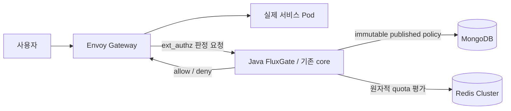

# LTS 기준 Envoy / Studio 통합 리뷰

코드 통합과 필수 빌드·테스트 검증은 완료했지만 **전체 승인과 enterprise 95/100은 HOLD**다. 이 보고서는 검토한 계약과 보존된 증거를 기록한다. 최신 로컬 자격증명 교체 검증은 통과했으며 별도 프로덕션 자격 검증은 남아 있다.

격리 브랜치는 코어 `feature/lts-envoy-integration`, Studio `feature/lts-policy-lifecycle`이다. 이 보고서의 판정은 **충돌 해결·빌드/테스트 PASS, 현재 상태 PASS, 선언한 host-relay 구성의 자격증명 교체 가용성 PASS**다. 대상 LTS에 실제 병합하거나 원격으로 push하지 않았다.

Envoy가 허용 판정을 받은 뒤 실제 요청을 서비스 Pod로 전달한다. MongoDB·Redis를 직접 조회하는 주체는 Java FluxGate다. 로컬 런타임의 실제 backend는 echo이며 Java·Go·Rust 3개 앱을 실행한 증거는 아니다.

## 최신 로컬 자격증명 검증

고정된 verifier `3d1363e`의 instrumentation 없는 전체 실행은 **예정 요청 3,829건 모두 정확한 body의 HTTP 200, 누락 0건**으로 통과했다. mTLS 2,022건, API key 1,141건, MongoDB/Redis store 666건이며 모든 단계의 pending·worker/writer 실패는 0, drain·UID 소유권 기반 Pod/NetworkPolicy 정리는 완료했다. protocol·전체 실행·rotation availability는 모두 true, credential child와 독립 최종 상태 19개 검사는 실제 exit 0·유효 witness·wrapper error 0이다. [worker-sampler.json](evidence/2026-10-10-lts-integration/worker-sampler.json)에 단계별 결과와 원본 digest를 통합했다.

같은 sampler의 100 ms 절대 예정 시각·최대 24개·fresh connection 2초·누락 0·정확한 body 기준은 그대로다. 요청 생성기만 호스트 Python에서 실행하고 `127.0.0.1` API port-forward → 소유 TCP relay Pod → 실제 Gateway Service를 통한다. relay는 교체되는 Envoy Pod를 직접 고정하지 않고 매 연결마다 Service로 연결한다. relay Pod의 25m/32Mi requests·250m/128Mi limits와 노드 weight 100은 유지했으나 호스트 sampler는 그 Pod 자원 한계 밖이다. 이 특권 관찰 경로를 일반 외부 ingress와 동일시하지 않으며 기존 독립 network-policy 증거를 유지한다. 제품 모듈·의존성은 추가하지 않았다.

앞선 paired-wait 진단은 같은 parent의 sleep/select timer가 교체 후 모두 약 262 ms 지연되는 상황을 기록했다. main condition-lock 최대 대기는 0.149 ms였고 wait 방식만 교체하는 수정은 근거가 부족했다. 이 진단은 mTLS 예정 2,010건 중 1건을 놓쳤다. 진단 parent가 `--credential-rollout`을 빠뜨려 예상 authz Pod 교체가 witness를 무효화한 사실도 원본 그대로 보존한다. 따라서 이는 수치 진단이며 승인 증거가 아니다. 정확한 GIL/VM 원인은 확정하지 않는다.

현재 브랜치의 fresh Python 테스트 **70개와 TLS self-test**가 통과했고 소스·실행기·identity는 독립 리뷰를 받았다. Java 3,365개와 UI 13개의 이전 빌드/JAR 정체성은 유지한다. **요청 누락 게이트는 이 로컬 구성에서 해결됐으며, 프로덕션 자격 검증과 전체 95점 승인은 별도 HOLD다.**

fresh 원격 LTS는 여전히 `7ee6a86101afe5ed5a9d6efb992e470430af046a`이며 고정된 host verifier와의 merge-tree는 충돌 0이다. 실제 merge나 push는 하지 않았다.

## 소스와 artifact 경계

격리 통합은 LTS `7ee6a86101afe5ed5a9d6efb992e470430af046a`와 원본 Envoy `d67821b89ac49929f06a3e798c5f53a9bcb90c7e`의 ancestry를 merge `c90ea6e0e8df2109aeb6965735eaf11e260f8f3a`로 보존한다. 겹치는 구현은 SOURCE 파일 전체를 채택하지 않고 LTS 기준으로 통합했다. 원격 LTS와 원본 worktree의 무관한 변경 및 다른 브랜치를 보존했다. fresh `ls-remote`의 LTS는 여전히 `7ee6a86101afe5ed5a9d6efb992e470430af046a`이고 verifier 실행 tree `09573bddec4669789b68f59591f942b603669499`의 merge-tree 검사는 conflict 0을 기록했다. LTS merge/push는 하지 않았다.

Java 빌드 소스는 `d4c4d88367343498df949cc8e07fbb2443fd20d0`, 배포 authz JAR SHA-256은 `b01926fbf1a8a66acd573b3d7f2bac07f89660e5c4e84903c79ed207950d36ce`다. Studio 소스는 `0966efbcbef5c9f2f680146450ae3bc3daef91cf`, JAR은 `de3ed6b1e0a7046a18464b0d3e8102aacf7c463dbb1b39bcc0d820bd7895bb77`다.

앞선 worker·CPU 배분 검증에 사용한 verifier commit은 `f90a4ee1ef1520edfda5dc9291bbdaa82f9b7c4c`, 실행 tree는 `09573bddec4669789b68f59591f942b603669499`이다. Java 빌드 소스 D4와 누적 Python/test 파일 5개 및 과거 리뷰 파일 17개가 다르며 Java 재빌드를 의미하지 않는다. 앞선 HA/load/combined 증거는 실제 당시 verifier provenance를 유지한다. retained ledger는 terminal 검토 후 raw/witness/log digest를 고정했으며 실행 당시 기록한 digest로 소급 표현하지 않는다.

## 통합 계약

- LTS의 충돌 방지 identity 인코딩과 ACL 단일 인코딩을 유지한다. 특수·예약·긴 identity의 counter key 전환에는 자동 이전 기능이 없다. fixture 검증을 모든 identity의 무손실 이전으로 일반화하지 않는다.
- LTS Redis 8개 반환값, 동일 slot 다중 규칙 평가, check-only와 cross-slot 보상에 reset epoch를 가로지르는 published revision fence를 통합했다. cross-slot 보상은 여전히 비원자적이며 refund 실패 시 소비량이 남을 수 있다. capacity 변경은 사용량을 보존하되 debt가 설정 TTL보다 오래 남는 축소는 `POLICY_RESET_REQUIRED`로 fail-closed하며 명시적 reset 또는 안전한 재게시가 필요하다. 타입·상태·이전 수명은 mutation 전에 검증한다.
- published policy는 immutable snapshot, majority CAS/idempotency, 안정적 counter epoch, authoritative fresh read와 검증한 동일 snapshot 실행을 사용한다. draft 편집은 active policy를 직접 바꾸지 않는다.
- Mongo owned/borrowed holder 격리와 BSON-safe 비동기 metrics를 유지한다. 외부 4-worker/1024 queue는 내부 10,000-event/500-batch recorder로 전달한다. forwarded와 stored는 다르며 별도 writer counters와 제한된 drain으로 overflow·실패·종료 시 손실 가능성을 명시한다.
- Studio는 `(ruleSetId,id)`를 일관되게 사용한다. scoped CRUD·simulation·UI 선택에 pair를 전달한다. legacy id-only 요청은 유일할 때만 허용하고 모호하면 쓰기 전에 409를 반환한다. CREATE/import null은 lookup/dedupe/persist/response 전에 `default`로 정규화하고 UPDATE 생략/null은 기존 pair를 보존한다. replacement는 unknown BSON·ACL·matcher와 snapshot CAS를 유지한다. nullable generic SPI 쓰기는 full reload 알림을 사용한다.

- 기존 LTS `fluxgate-benchmarks` 모듈로 옮겨진 JMH 소스 6개를 legacy `testkit` 위치에 중복 추가하지 않았다. benchmark 모듈과 소스는 보존·빌드했고, 테스트 skip이나 compiler exclusion으로 병합을 통과시키지 않았다. JMH 측정 실행은 이 검증의 범위가 아니다.

## 명시적 유지보수 이전

기존 global unique `id_1`은 startup 오류 무시나 이름만 바꾼 전역 제약으로 해결하지 않았다. 구버전 authz를 Pod 0개로 quiesce한 뒤 packaged adapter가 compound unique `(ruleSetId,id)`를 검증하고 알려진 legacy 인덱스만 nonunique `id_1`으로 바꿨다. 재실행은 idempotent였으며 무관한 인덱스와 policy/counter 상태를 보존했다.

실제 fixture에는 **mutable rule 문서 0개**, active pointer 1개, published revision 문서 22개와 ACL 문서 22개가 있었다. 따라서 populated mutable 프로덕션 컬렉션 이전의 증거는 아니다. populated identity/migration은 실제 Mongo 회귀 19개로 검증했다. 배포 후 정확한 backend 200과 소진 quota 429를 기록했다. **무중단 이전이 아니다.** 구버전 JAR 복귀는 schema rollback이 아니며 ruleset 간 동일 ID가 작성된 뒤에는 전역 unique 복원을 보장할 수 없다. 유지보수 실행 terminal은 root가 관측했고, 배포 후 checker는 별도 유효한 terminal witness를 가진다.

## 증거와 pending 게이트

[tests.json](evidence/2026-10-10-lts-integration/tests.json)은 core reactor 3,148개와 Studio backend 217개, 합계 **Java 3,365개**의 failure/error/skip 0을 기록한다. 실제 Redis Cluster 24개는 core 집계에 포함한다. Studio UI 13개와 lint/typecheck/format/build도 통과했다. 변경 없는 Java artifact는 실제 빌드 commit을 유지한다. root가 f90에서 별도로 실행한 **verifier 테스트 60개**는 17.677초에 통과했으며 self-test도 통과했다. 과거 56개·51개 증거는 별도로 표시한다.

immutable retained ledger는 다음 증거를 통합 authz artifact에 연결한다.

| 게이트 | 보존된 결과와 경계 |
| --- | --- |
| 전체 HA | 원래 검증기의 27개 check PASS, `complete:true`. 추가 복구창 검사 거절은 별도 기록하며 전체 승인에 전이하지 않는다. |
| 정상 부하 | 100 scheduled RPS × 60초, 정확한 body의 200 6,000개, omission/error 0, 실제 99.977 RPS, p95 6.5953 ms, p99 12.3227 ms. |
| Combined Mongo | 선택 fault phase 승인, 마지막 6,000개 모두 200, p99 7.7462 ms, RTO 23.641초. `complete:false`는 선택 phase이며 전체 suite 완료 주장이 아니다. |
| Combined Redis | 선택 fault phase 승인, 마지막 6,000개 모두 200, p99 9.0988 ms, RTO 18.735초. 같은 선택 phase 경계. |
| Historical credentials | 기본 f90: 예정 3,833개, 정확한 body의 200 3,827개, 누락 6개. CPU 배분 실험: 예정 3,832개, 정확한 body의 200 3,826개, 누락 6개. 두 실행 모두 protocol은 완료·통과했지만 교체 가용성에 실패했다. **HOLD**. |
| Fresh network | verifier 4cbb의 독립 실제 exit 0·유효 witness: negative control 48개, positive control 232개, identity/policy 안정 및 cleanup 검증. |
| Historical final state | CPU 배분 실험 뒤 노드 3개의 weight를 100으로 복구했고 Docker CpuShares metadata는 계속 0이었다. fresh f90 읽기 전용 checker는 actual exit 0·유효 witness로 19개 check를 모두 통과했다. 현재 상태 통과는 교체 가용성 승인이 아니다. |

추가 HA 복구창 검사는 창 시작 913 ms 전에 시작해 1,433 ms 뒤에 끝난 장애 중 503 요청을 `completed >= start` 조건으로 포함하여 거절됐다. 이는 새로 시작한 복구 후 요청의 실패를 입증하지 않는다. [ha-window-diagnostic.json](evidence/2026-10-10-lts-integration/ha-window-diagnostic.json)에 원래 27-check terminal PASS와 추가 검사 거절을 구분해 보존했으며, 조건을 완화하지 않았다.

앞선 거절된 credential 시도 세 건을 보존한다. (1) cold Studio startup의 전역 ID 인덱스 충돌, (2) Redis Pod 삭제 전 sentinel 읽기 실패, (3) protocol 통과·`complete:true`지만 rotation availability 실패다. 세 번째 시도의 lateness omission은 mTLS 23/2,181, API key 12/1,220, store 3/719로 총 38개다. 실제 실행된 4,082개 요청은 모두 정확한 body의 200이며 error·pending·capacity omission은 0이고 cleanup을 검증했다. protocol 성공으로 누락된 예정 요청을 상쇄하지 않는다.

sentinel 진단은 stdin zero-byte write를 120회 중 4회 재현했다. Pod-local 생성은 cleanup을 포함해 120/120 일치했고 focused 회귀 6개를 추가했다. 이후 4cbb healthy control에도 lateness omission 1개가 남았다. CPU request만 올린 예약 실험은 omission 8개와 실제 `NOREPLICAS` 503 응답 10개를 기록해 채택하지 않았다. host compression/resource pressure 관측은 상관관계이며 원인 확정이 아니다.

인과 진단에서는 omission 7개를 기록했다. 1개는 동기 progress 작업 235 ms(snapshot 4.718 ms, JSON 129.441 ms, write 100.976 ms)의 직접 영향이었다. 나머지 6개는 약 204/435 ms sleep overrun 뒤 발생했고 condition-lock 대기는 미미했으며 원인은 미확정이다. 검토한 progress 수정은 제한된 요약, 용량 1 mailbox, 단일 writer, atomic rename과 final-write fencing을 사용한다. 최종 sample을 모두 유지하고 writer 실패·미완료 drain은 거절한다. 독립 소스 리뷰는 CLEAR/APPROVE지만 입증한 progress 경로만 해결한다. 이후 instrumentation 없는 b574 healthy control은 180.4046초에 scheduled arrival 1,803개, 정확한 body의 200 1,802개, sequence 552의 lateness omission 1개를 기록했다. writer failure 0, reporter/request drain 완료, pending 0, 모든 cleanup 검증 통과였지만 기존 100 ms arrival/omission 0 조건에는 실패했다. 별도로 private harness는 raw 증거 보존과 cleanup 후 `KeyError: pod_deleted`를 발생시켰다(실제 필드는 `pod_absent`). 따라서 유효 witness·wrapper error 0을 가진 child exit 1은 승인 성공이 아니다. harness 오류로 앞서 기록한 omission을 설명하거나 지우지 않는다. private raw digest를 포함한 정제된 요약은 [healthy-control.json](evidence/2026-10-10-lts-integration/healthy-control.json)이다.

f90 worker 수정은 idle queue의 100 ms polling을 blocking 대기와 제한된 종료 wakeup으로 바꿨다. 초당 idle wakeup 240개를 제거했으며 예정 요청·용량·HTTP 검증·실패 기준은 동일하다. 회귀 테스트 4개는 idle wakeup·queued shutdown·정상 drain·정체 요청을 검증한다. instrumentation 없는 기본 healthy control은 1,803/1,803개의 정확한 body의 200, 누락 0으로 통과했다. 이후 네 번째 전체 credential 실행은 예정 요청 6개(mTLS 2·API key 2·store 2)를 놓쳤다. 실제 실행된 3,827개는 모두 정확한 body의 200이었다. [worker-sampler.json](evidence/2026-10-10-lts-integration/worker-sampler.json)에 두 결과를 보존한다.

사전 정의한 CPU 배분 실험은 소유 kind node 3개의 cgroup root weight만 100→313→100으로 변경·복구했다. Docker CpuShares metadata는 계속 0이었고 Pod resource·Redis guard·artifact는 동일했다. instrumentation 없는 healthy control은 다시 1,803/1,803으로 통과했지만 다섯 번째 전체 credential 실행은 예정 요청 6개(mTLS 4·API key 0·store 2)를 놓쳤다. 실제 3,826개는 모두 정확한 body의 200이며 drain·cleanup도 확인했다. credential 실패 뒤 network는 실행하지 않았다. [node-allocation.json](evidence/2026-10-10-lts-integration/node-allocation.json)에 실패 및 복구·최종 상태 통과를 보존한다. 세 노드는 vCPU 6개인 하나의 Docker VM을 공유하며 독립 CPU 18개가 아니다. 이 실험은 가용성을 해결하지 못했으며 CPU 경합이 원인임을 입증하지도 않는다.

제한된 180초 instrumentation 진단은 기존 sampler를 유지하고 같은 Pod/cgroup에 메모리 timestamp·별도 timer process·2 Hz observer를 추가했다. 현재 자격증명을 유지한 채 45초에 authz를 한 번 교체했다. 정확한 body의 200 1,803/1,803개·누락 0, 별도 timer 1,804개·누락 0, main trace 23,446개, observer 361개·오류/overflow 0(최대 읽기 wall time 1.189625 ms)을 기록했다. 현상이 **재현되지 않았으므로** 원인은 미확정이다. instrumentation은 스케줄링에 영향을 줄 수 있고 host/guest 교체 시각의 정확한 대응은 모른다. 진단 및 최종 상태 child는 actual exit 0·유효 witness였으며 fresh 최종 상태 19개 check도 통과했다. [scheduling-diagnostic.json](evidence/2026-10-10-lts-integration/scheduling-diagnostic.json)은 전체 credential·최종 승인으로 표현하지 않고 이 진단을 기록한다. 진단 한 번 뒤 종료한다는 사전 조건을 지켰다.

최근 정제 Redis 로그는 해당 control 중 새 promotion을 입증하지 않는다. 앞선 healthy 0/1/8 role 상태의 시작 시점은 미상이다. root는 guard를 적용한 명시적 operator role restoration으로 home 0/1/2를 복원했고 authz UID 변경 없이 정확한 policy pointer·counter·storage identity를 보존했다. 유효 witness와 baseline-only PASS는 수동 복원의 증거이며 자동 balancing, 새 전체 HA PASS, 이 수동 복원 자체는 final-state 승인이 아니다. 이후 별도 읽기 전용 상태 검사는 통과했다.

### 최신 작업공간 정리와 거절된 후속 실험

GitHub 배포 단위는 core와 Studio 두 저장소다. 두 저장소의 영문·한글 README에 책임 범위를 명시했다. 작업용 worktree 12개는 일반 `git worktree remove`로 정리했으며 브랜치 이력을 유지했다. 무시된 로컬 자료 7,846개는 두 제품 저장소 밖의 비공개 archive에 원본 해시·목록을 검증해 보존했다. Boot 2·3 대상, 언어별 문서, 서로 다른 fixture와 실패 증거는 유지한다. 바이트가 동일한 과거 HA alias 하나는 설명적인 기존 파일로 통합했다. 모듈은 추가하지 않았고 Python 캐시는 Git에서 제외했다.

추가 instrumentation 전체 진단은 verifier `c3f7fd`에서 예정 요청 3,851건, 정확한 backend body의 200 응답 3,850건과 API-key 단계 lateness omission 1건을 기록했다. credential child는 exit 1이며 수집·후속 상태 확인의 성공과 구분한다. sleep overrun과 인접 구간 runnable 대기 관측은 GIL이나 VM 원인을 확정하지 않는다. 기존 [scheduling-diagnostic.json](evidence/2026-10-10-lts-integration/scheduling-diagnostic.json)에 기존 진단과 함께 보존했다.

한 번의 instrumentation 없는 HTTP 프로세스 분리 실험은 verifier `87df806`에서 모든 credential protocol을 완료했지만 예정 요청 3,861건 중 mTLS 단계 1건을 놓쳤다. 실제 3,860건은 모두 정확한 body의 200이었다. API key 1,164건과 store 669건은 누락 0이며 pending·worker/writer 실패 0, drain·owned cleanup도 완료했다. 기존 100 ms·최대 24개·누락 0·fresh connection/2초·정확한 body 기준을 변경하지 않았다. credential child는 유효 witness와 exit 1이며 [worker-sampler.json](evidence/2026-10-10-lts-integration/worker-sampler.json)에 기록했다. 프로세스 분리는 가용성 해결이나 GIL 원인을 입증하지 못했다.

해당 실험의 최초 상태 검사는 Redis topology 조건에서 exit 1로 종료됐고 14개 check까지만 완료했다. 별도의 guarded baseline은 역할 변경 명령 없이 정상 배치를 확인하고 정책·HA counter 보존을 검사했다(`complete:false`). 이후 독립 읽기 전용 상태 검사 19개는 exit 0·유효 witness로 통과했다. 최초 실패와 이후 상태 통과를 [final-state.json](evidence/2026-10-10-lts-integration/final-state.json)에 함께 남겼으며 최초 실패의 정확한 원인을 확정하지 않는다.

입증되지 않은 sampler 복잡성은 되돌렸다. 당시 복원 검증 source `7c43f23`의 sampler·기존 테스트와 실행 mode는 `c3f7fd`와 동일하며 실험용 test helper 2개도 제거했다. 후보 source와 80개 통과 테스트는 실험 이력으로 남긴다. 당시 복원 코드의 fresh verifier 테스트 60개와 self-test는 다시 통과했다. Java 3,365개·Studio UI 13개의 기존 빌드 증거를 새 빌드로 바꾸지 않는다. **당시 저장소 정리는 완료했지만 credential 가용성과 전체 95점 승인은 HOLD였다. 최신 host-relay 결과는 위에 구분한다.**

### 보존한 증거

각 증거의 실제 실행 commit, JAR, terminal exit와 SHA-256을 [acceptance.json](evidence/2026-10-10-lts-integration/acceptance.json)에 기록했다. 오래된 성공 실행을 새 verifier의 실행으로 바꾸지 않았다. 앞선 실패 credential 다섯 건과 이후 거절된 진단·비교 실행, 과거 정상 경로의 누락, 실제 `NOREPLICAS` 503 및 private harness 오류도 보존했다. 95점 이상은 승인하지 않았으며 필수 게이트 실패를 다른 항목의 점수로 상쇄하지 않는다.

[Mongo 이전 절차](../architecture/lts-mongo-identity-migration.ko.md)는 쓰기 주체를 중지한 명시적 유지보수에 사용한다. 데이터 삭제, counter reset, 다른 worktree 변경으로 상태를 맞추지 않았다.

## 범위와 남은 한계

검증 범위는 하나의 Docker Desktop VM에 있는 kind node 3개와 echo backend를 사용하는 소유 fixture다. 독립 host/AZ 장애·off-host 복구·프로덕션 storage/network·장기 soak·전체 dependency/CVE·지원 runtime 운영은 증명하지 않는다. store TLS/ACL hardening과 프로덕션 backup/restore는 별도 게이트다. 과거 점수는 전이하지 않는다. 기본·CPU 배분 healthy control은 통과했지만 이후 전체 credential 실행은 omission 0 가용성 조건에 실패했다. 앞선 제한된 healthy 진단은 누락을 재현하지 못했다. 이후 instrumentation 전체 진단과 instrumentation 없는 프로세스 분리 실험은 각각 누락 1건을 기록했으며 스케줄링의 정확한 원인을 확정하지 못했다. 입증되지 않은 프로세스 분리는 되돌렸다. 이후 검토한 host-relay 구성은 단 한 번의 instrumentation 없는 전체 검증에서 기존 누락 0 기준을 통과했다. 로컬 credential 게이트는 PASS이며 전체 release·프로덕션 자격 검증과 별도 점수는 HOLD다.
