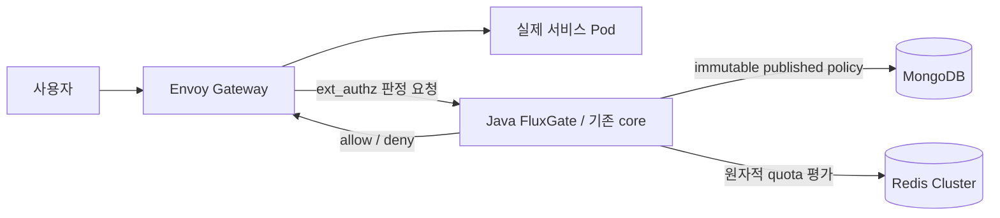

# LTS 기준 Envoy / Studio 통합 리뷰

코드 통합과 필수 빌드·테스트 검증은 완료했지만 **전체 승인과 enterprise 95/100은 HOLD**다. 이 보고서는 검토한 계약과 보존된 증거를 기록한다. 남은 런타임 게이트는 완료하지 않았으며 프로덕션 인증이 아니다.

격리 브랜치는 코어 `feature/lts-envoy-integration`, Studio `feature/lts-policy-lifecycle`이다. 이 보고서의 판정은 **충돌 해결·빌드/테스트 PASS, 현재 상태 PASS, 자격증명 교체 가용성 HOLD**다. 대상 LTS에 실제 병합하거나 원격으로 push하지 않았다.

Envoy가 허용 판정을 받은 뒤 실제 요청을 서비스 Pod로 전달한다. MongoDB·Redis를 직접 조회하는 주체는 Java FluxGate다. 로컬 런타임의 실제 backend는 echo이며 Java·Go·Rust 3개 앱을 실행한 증거는 아니다.

## 소스와 artifact 경계

격리 통합은 LTS `7ee6a86101afe5ed5a9d6efb992e470430af046a`와 원본 Envoy `d67821b89ac49929f06a3e798c5f53a9bcb90c7e`의 ancestry를 merge `c90ea6e0e8df2109aeb6965735eaf11e260f8f3a`로 보존한다. 겹치는 구현은 SOURCE 파일 전체를 채택하지 않고 LTS 기준으로 통합했다. 원격 LTS와 원본 worktree의 무관한 변경 및 다른 브랜치를 보존했다. fresh `ls-remote`의 LTS는 여전히 `7ee6a86101afe5ed5a9d6efb992e470430af046a`이고 current `1b0a6b7fb5df143d7b7d05449083935c580c1b91`의 merge-tree 검사는 conflict 0을 기록했다. LTS merge/push는 하지 않았다.

Java 빌드 소스는 `d4c4d88367343498df949cc8e07fbb2443fd20d0`, 배포 authz JAR SHA-256은 `b01926fbf1a8a66acd573b3d7f2bac07f89660e5c4e84903c79ed207950d36ce`다. Studio 소스는 `0966efbcbef5c9f2f680146450ae3bc3daef91cf`, JAR은 `de3ed6b1e0a7046a18464b0d3e8102aacf7c463dbb1b39bcc0d820bd7895bb77`다.

현재 verifier commit은 `b57418fb3612f71203cab6ccd62b5eea94b98091`, current tree는 `1b0a6b7fb5df143d7b7d05449083935c580c1b91`이다. Java 빌드 소스 D4와 누적 Python 파일 정확히 4개만 다르며 Java 재빌드를 의미하지 않는다. 앞선 HA/load/combined 증거는 실제 당시 verifier provenance를 유지한다. retained ledger는 terminal 검토 후 raw/witness/log digest를 고정했으며 실행 당시 기록한 digest로 소급 표현하지 않는다.

## 통합 계약

- LTS의 충돌 방지 identity 인코딩과 ACL 단일 인코딩을 유지한다. 특수·예약·긴 identity의 counter key 전환에는 자동 이전 기능이 없다. fixture 검증을 모든 identity의 무손실 이전으로 일반화하지 않는다.
- LTS Redis 8개 반환값, 동일 slot 다중 규칙 평가, check-only와 cross-slot 보상에 reset epoch를 가로지르는 published revision fence를 통합했다. cross-slot 보상은 여전히 비원자적이며 refund 실패 시 소비량이 남을 수 있다. capacity 변경은 사용량을 보존하되 debt가 설정 TTL보다 오래 남는 축소는 `POLICY_RESET_REQUIRED`로 fail-closed하며 명시적 reset 또는 안전한 재게시가 필요하다. 타입·상태·이전 수명은 mutation 전에 검증한다.
- published policy는 immutable snapshot, majority CAS/idempotency, 안정적 counter epoch, authoritative fresh read와 검증한 동일 snapshot 실행을 사용한다. draft 편집은 active policy를 직접 바꾸지 않는다.
- Mongo owned/borrowed holder 격리와 BSON-safe 비동기 metrics를 유지한다. 외부 4-worker/1024 queue는 내부 10,000-event/500-batch recorder로 전달한다. forwarded와 stored는 다르며 별도 writer counters와 제한된 drain으로 overflow·실패·종료 시 손실 가능성을 명시한다.
- Studio는 `(ruleSetId,id)`를 일관되게 사용한다. scoped CRUD·simulation·UI 선택에 pair를 전달한다. legacy id-only 요청은 유일할 때만 허용하고 모호하면 쓰기 전에 409를 반환한다. CREATE/import null은 lookup/dedupe/persist/response 전에 `default`로 정규화하고 UPDATE 생략/null은 기존 pair를 보존한다. replacement는 unknown BSON·ACL·matcher와 snapshot CAS를 유지한다. nullable generic SPI 쓰기는 full reload 알림을 사용한다.

- 기존 LTS `fluxgate-benchmarks` 모듈로 옮겨진 JMH 소스 6개를 legacy `testkit` 위치에 중복 추가하지 않았다. benchmark 모듈과 소스는 보존·빌드했고, 테스트 skip이나 compiler exclusion으로 병합을 통과시키지 않았다. JMH 측정 실행은 이 검증의 범위가 아니다.

## 명시적 유지보수 이전

기존 global unique `id_1`은 startup 오류 무시나 이름만 바꾼 전역 제약으로 해결하지 않았다. 구버전 authz를 Pod 0개로 quiesce한 뒤 packaged adapter가 compound unique `(ruleSetId,id)`를 검증하고 알려진 legacy 인덱스만 nonunique `id_1`으로 바꿨다. 재실행은 idempotent였으며 무관한 인덱스와 policy/counter 상태를 보존했다.

실제 fixture에는 **mutable rule 문서 0개**, active pointer 1개, published revision 문서 22개와 ACL 문서 22개가 있었다. 따라서 populated mutable 프로덕션 컬렉션 이전의 증거는 아니다. populated identity/migration은 실제 Mongo 회귀 19개로 검증했다. 배포 후 정확한 backend 200과 소진 quota 429를 기록했다. **무중단 이전이 아니다.** 구버전 JAR 복귀는 schema rollback이 아니며 ruleset 간 동일 ID가 작성된 뒤에는 전역 unique 복원을 보장할 수 없다. 유지보수 실행 terminal은 root가 관측했고, 배포 후 checker는 별도 유효한 terminal witness를 가진다.

## 증거와 pending 게이트

[tests.json](evidence/2026-10-10-lts-integration/tests.json)은 core reactor 3,148개와 별도 Studio backend 217개, 합계 **Java 3,365개**의 failure/error/skip 0을 기록한다. 실제 Redis Cluster 24개는 core 집계에 포함되며 다시 더하지 않는다. Studio UI 13개와 lint/typecheck/format/build가 통과했다. 현재 helper 56개와 self-test는 Java 집계와 별도다. fresh root unit 증거는 17.026초에 56개 통과를 기록한다(`tests.json`의 verifier unit log SHA-256 참조). 수정된 현재 private 테스트 기록은 current F4dc helper 56개 증거와 상속한 historical 51개 증거를 구분한다.

immutable retained ledger는 다음 증거를 통합 authz artifact에 연결한다.

| 게이트 | 보존된 결과와 경계 |
| --- | --- |
| 전체 HA | 원래 검증기의 27개 check PASS, `complete:true`. 추가 복구창 검사 거절은 별도 기록하며 전체 승인에 전이하지 않는다. |
| 정상 부하 | 100 scheduled RPS × 60초, 정확한 body의 200 6,000개, omission/error 0, 실제 99.977 RPS, p95 6.5953 ms, p99 12.3227 ms. |
| Combined Mongo | 선택 fault phase 승인, 마지막 6,000개 모두 200, p99 7.7462 ms, RTO 23.641초. `complete:false`는 선택 phase이며 전체 suite 완료 주장이 아니다. |
| Combined Redis | 선택 fault phase 승인, 마지막 6,000개 모두 200, p99 9.0988 ms, RTO 18.735초. 같은 선택 phase 경계. |
| Fresh credentials | 세 번째 시도는 protocol 통과·`complete:true`지만 lateness omission 38개로 availability 실패. 수정 verifier의 healthy control도 omission 0 승인 조건에 실패했다. fresh 전체 credential availability 승인은 **HOLD**. |
| Fresh network | verifier 4cbb의 독립 실제 exit 0·유효 witness: negative control 48개, positive control 232개, identity/policy 안정 및 cleanup 검증. |
| Final state | 앞선 checker exit 1의 home 배치 불일치 뒤 명시적 수동 복원(`complete:false`)을 수행했다. 이후 b574의 읽기 전용 checker exit 0·유효 witness: 19개 check, 노드 3개, Ready Pod 20개, Bound PVC 12개, 임시 probe 0개, home 0/1/2와 정확한 JAR 확인. 현재 상태 검증이며 전체 가용성 승인이 아니다. |

추가 HA 복구창 검사는 창 시작 913 ms 전에 시작해 1,433 ms 뒤에 끝난 장애 중 503 요청을 `completed >= start` 조건으로 포함하여 거절됐다. 이는 새로 시작한 복구 후 요청의 실패를 입증하지 않는다. [ha-window-diagnostic.json](evidence/2026-10-10-lts-integration/ha-window-diagnostic.json)에 원래 27-check terminal PASS와 추가 검사 거절을 구분해 보존했으며, 조건을 완화하지 않았다.

거절된 credential 시도 세 건을 보존한다. (1) cold Studio startup의 전역 ID 인덱스 충돌, (2) Redis Pod 삭제 전 sentinel 읽기 실패, (3) protocol 통과·`complete:true`지만 rotation availability 실패다. 세 번째 시도의 lateness omission은 mTLS 23/2,181, API key 12/1,220, store 3/719로 총 38개다. 실제 실행된 4,082개 요청은 모두 정확한 body의 200이며 error·pending·capacity omission은 0이고 cleanup을 검증했다. protocol 성공으로 누락된 예정 요청을 상쇄하지 않는다.

sentinel 진단은 stdin zero-byte write를 120회 중 4회 재현했다. Pod-local 생성은 cleanup을 포함해 120/120 일치했고 focused 회귀 6개를 추가했다. 이후 4cbb healthy control에도 lateness omission 1개가 남았다. CPU request만 올린 예약 실험은 omission 8개와 실제 `NOREPLICAS` 503 응답 10개를 기록해 채택하지 않았다. host compression/resource pressure 관측은 상관관계이며 원인 확정이 아니다.

인과 진단에서는 omission 7개를 기록했다. 1개는 동기 progress 작업 235 ms(snapshot 4.718 ms, JSON 129.441 ms, write 100.976 ms)의 직접 영향이었다. 나머지 6개는 약 204/435 ms sleep overrun 뒤 발생했고 condition-lock 대기는 미미했으며 원인은 미확정이다. 검토한 progress 수정은 제한된 요약, 용량 1 mailbox, 단일 writer, atomic rename과 final-write fencing을 사용한다. 최종 sample을 모두 유지하고 writer 실패·미완료 drain은 거절한다. 독립 소스 리뷰는 CLEAR/APPROVE지만 입증한 progress 경로만 해결한다. 이후 instrumentation 없는 b574 healthy control은 180.4046초에 scheduled arrival 1,803개, 정확한 body의 200 1,802개, sequence 552의 lateness omission 1개를 기록했다. writer failure 0, reporter/request drain 완료, pending 0, 모든 cleanup 검증 통과였지만 기존 100 ms arrival/omission 0 조건에는 실패했다. 별도로 private harness는 raw 증거 보존과 cleanup 후 `KeyError: pod_deleted`를 발생시켰다(실제 필드는 `pod_absent`). 따라서 유효 witness·wrapper error 0을 가진 child exit 1은 승인 성공이 아니다. harness 오류로 앞서 기록한 omission을 설명하거나 지우지 않는다. private raw digest를 포함한 정제된 요약은 [healthy-control.json](evidence/2026-10-10-lts-integration/healthy-control.json)이다.

최근 정제 Redis 로그는 해당 control 중 새 promotion을 입증하지 않는다. 앞선 healthy 0/1/8 role 상태의 시작 시점은 미상이다. root는 guard를 적용한 명시적 operator role restoration으로 home 0/1/2를 복원했고 authz UID 변경 없이 정확한 policy pointer·counter·storage identity를 보존했다. 유효 witness와 baseline-only PASS는 수동 복원의 증거이며 자동 balancing, 새 전체 HA PASS, 이 수동 복원 자체는 final-state 승인이 아니다. 이후 별도 읽기 전용 상태 검사는 통과했다.

### 보존한 증거

각 증거의 실제 실행 commit, JAR, terminal exit와 SHA-256을 [acceptance.json](evidence/2026-10-10-lts-integration/acceptance.json)에 기록했다. 오래된 성공 실행을 새 verifier의 실행으로 바꾸지 않았다. 실패한 credential 세 건, 정상 경로의 누락, 실제 `NOREPLICAS` 503 및 private harness 오류도 보존했다. 95점 이상은 승인하지 않았으며 필수 게이트 실패를 다른 항목의 점수로 상쇄하지 않는다.

[Mongo 이전 절차](../architecture/lts-mongo-identity-migration.ko.md)는 쓰기 주체를 중지한 명시적 유지보수에 사용한다. 데이터 삭제, counter reset, 다른 worktree 변경으로 상태를 맞추지 않았다.

## 범위와 남은 한계

검증 범위는 한 물리 호스트의 kind node 3개와 echo backend를 사용하는 소유 local fixture다. 독립 host/AZ 장애, off-host 복구, 프로덕션 storage/network, 장기 soak, 전체 dependency/CVE 검토, 지원 runtime 운영을 증명하지 않는다. store TLS/ACL hardening과 프로덕션 backup/restore는 별도 게이트다. 이전 96/100이나 원본 브랜치 PASS를 전이하지 않는다. 필수 healthy omission 0 control이 실패한 동안 전체 credential 재시도를 계속하지 않는다. 기존 credential protocol PASS는 동일 Java artifact의 증거지만 rotation availability 승인이 아니다. 다음 조건은 healthy control의 omission 0을 먼저 충족하고, 기존 100 ms arrival 조건의 fresh 전체 credential protocol/rotation 및 최종 cleanup/state를 검증하는 것이다. 현재 읽기 전용 상태 검사는 통과했지만, 최종 local 승인과 별도 벤치마크 점수는 HOLD다.
