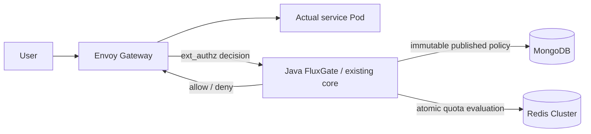

# LTS-first Envoy / Studio integration review

Code integration and required build/test verification are complete; **overall acceptance and enterprise 95/100 remain HOLD**. This report records reviewed contracts and retained evidence. Remaining runtime gates are not complete, and this is not production certification.

Isolated branches are core `feature/lts-envoy-integration` and Studio `feature/lts-policy-lifecycle`. The decision is **conflicts/build/tests PASS, current state PASS, credential-rotation availability HOLD**. The target LTS was not merged or pushed.

Envoy forwards the actual request after an allow decision. Java FluxGate queries MongoDB and Redis. The local runtime backend is echo; it does not prove execution of three separate Java, Go and Rust applications.

## Source and artifact boundaries

The isolated integration preserves LTS `7ee6a86101afe5ed5a9d6efb992e470430af046a` and original Envoy `d67821b89ac49929f06a3e798c5f53a9bcb90c7e` ancestry through merge `c90ea6e0e8df2109aeb6965735eaf11e260f8f3a`. Overlapping implementations were integrated on the LTS baseline rather than resolved by taking whole SOURCE files. Remote LTS and unrelated original working-tree changes and other branches were preserved. Fresh `ls-remote` still identifies LTS `7ee6a86101afe5ed5a9d6efb992e470430af046a`; the current `1b0a6b7fb5df143d7b7d05449083935c580c1b91` merge-tree check records zero conflicts. No LTS merge or push was performed.

Java build source is `d4c4d88367343498df949cc8e07fbb2443fd20d0`; deployed authz JAR SHA-256 is `b01926fbf1a8a66acd573b3d7f2bac07f89660e5c4e84903c79ed207950d36ce`. Studio source is `0966efbcbef5c9f2f680146450ae3bc3daef91cf`, JAR `de3ed6b1e0a7046a18464b0d3e8102aacf7c463dbb1b39bcc0d820bd7895bb77`.

Current verifier commit is `b57418fb3612f71203cab6ccd62b5eea94b98091`, with current tree `1b0a6b7fb5df143d7b7d05449083935c580c1b91`. Exactly four cumulative Python files differ from Java build source D4; no Java rebuild is implied. Earlier HA/load/combined proofs retain their actual earlier verifier provenance. The retained ledger freezes raw/witness/log digests after terminal review, not retroactively at their original execution time.

## Integrated contracts

- LTS collision-resistant identity encoding and single ACL encoding remain authoritative. Special/reserved/long identities that change counter keys have no automatic old-counter migration; the fixture proof is not a universal identity migration guarantee.
- LTS eight-result Redis wire, multi-rule same-slot evaluation, check-only and cross-slot compensation coexist with published revision fencing across reset epochs. Cross-slot compensation remains non-atomic and failed refunds can retain spent quota. Capacity changes preserve usage; a shrink whose debt cannot survive the configured TTL fails closed with `POLICY_RESET_REQUIRED`, requiring an explicit reset or safe republish. Types/state and migration lifetimes are checked before mutation.
- Published policies use immutable snapshots, majority CAS/idempotency, stable counter epochs, authoritative fresh reads and execution of the same validated snapshot. Draft edits do not directly replace the active policy.
- Mongo owned/borrowed client-holder isolation and BSON-safe asynchronous metrics remain intact. The outer 4-worker/1024 queue feeds the inner bounded 10,000-event/500-batch recorder. Forwarded is distinct from stored; independent writer counters and bounded drain document overflow, failures and possible shutdown loss.
- Studio consistently addresses `(ruleSetId,id)`. Scoped CRUD, simulation and UI selection carry the pair. Legacy id-only requests work only when unambiguous; ambiguity returns 409 before writes. CREATE/import null normalizes to `default` before lookup/dedupe/persistence/response; UPDATE omitted/null preserves the existing pair. Replacement retains unknown BSON/ACL/matcher fields and snapshot CAS; null-capable generic SPI writes use full reload notifications.

- The six JMH sources already moved into the LTS `fluxgate-benchmarks` module were not duplicated at the legacy testkit path. Benchmark module/sources were preserved and built; no test skip or compiler exclusion was introduced to pass integration. JMH measurement execution is outside this proof.

## Explicit maintenance transition

The known legacy global unique `id_1` required a maintenance migration, not startup suppression or a renamed global constraint. Old authz was quiesced to zero Pods. The packaged adapter verified compound unique `(ruleSetId,id)` before replacing only the known legacy index with nonunique `id_1`; repeat execution was idempotent, with unrelated indexes and policy/counter state preserved.

The actual fixture had **0 mutable rule documents**, 1 active pointer and 22 published revision documents carrying 22 ACL documents. It therefore does not prove migration of populated mutable production collections. Nineteen real Mongo regressions cover populated identity/migration cases. Post-deployment exact backend 200 and exhausted quota 429 were recorded. This was **not zero downtime**. Old-JAR rollback is not schema rollback and cannot safely restore global uniqueness after cross-ruleset duplicate IDs are introduced. Maintenance execution used root-observed terminal results; the post-deployment checker has a separate valid terminal witness.

## Evidence and pending gates

[tests.json](evidence/2026-10-10-lts-integration/tests.json) records core reactor 3,148 plus separate Studio backend 217 = **3,365 Java tests**, zero failures/errors/skips; actual Redis Cluster 24 cases are included in the core accounting, not added again. Studio UI 13 tests and lint/typecheck/format/build passed. Current helper tests total 56 plus self-test; those are separate from Java counts. Fresh root unit evidence records 56 tests in 17.026 seconds (the verifier unit-log SHA-256 in `tests.json`). The corrected private current test record identifies current 56-test F4dc helper evidence separately from inherited, historical 51-test evidence.

The immutable retained ledger binds these proofs to the integrated authz artifact:

| Gate | Retained result and boundary |
| --- | --- |
| Full HA | Original verifier27 checks PASS; `complete:true`. Rejected supplementary recovery-window validation is retained separately and does not transfer into overall approval. |
| Normal load | 100 scheduled RPS × 60 s; 6,000 exact-body 200, zero omissions/errors; achieved 99.977 RPS; p95 6.5953 ms, p99 12.3227 ms. |
| Combined Mongo | Selected fault phase accepted; final 6,000 all 200, p99 7.7462 ms; recorded RTO 23.641 s. `complete:false` identifies a selected phase, not full-suite completion. |
| Combined Redis | Selected fault phase accepted; final 6,000 all 200, p99 9.0988 ms; recorded RTO 18.735 s. Same selected-phase boundary. |
| Fresh credentials | Third attempt: protocol passed, `complete:true`, availability failed with 38 lateness omissions. The repaired-verifier healthy control also failed zero-omission acceptance; fresh full credential availability acceptance is **HOLD**. |
| Fresh network | Independent actual exit 0 and valid witness under verifier 4cbb: 48 negative controls, 232 positive controls; stable identities/policies and verified cleanup. |
| Final state | After the earlier home-placement mismatch and explicit manual restoration (`complete:false`), a fresh b574 read-only checker exited 0 with a valid witness: 19 checks, three nodes, 20 Ready Pods, 12 Bound PVCs, zero temporary probes, home primaries 0/1/2 and exact deployed JARs. This verifies current state; it is not overall availability acceptance. |

A supplementary HA recovery-window gate rejected a fault503 request that began913ms before the window and completed1433ms after the window start, because it selects `completed >= start`. This does not establish failure of a newly started post-recovery request. [ha-window-diagnostic.json](evidence/2026-10-10-lts-integration/ha-window-diagnostic.json) retains this rejection separately from the original27-check terminal PASS; the supplementary condition was not weakened.

Three credential attempts remain rejected evidence: (1) cold Studio startup attempted the incompatible global-ID index; (2) the pre-restart sentinel read failed before Redis Pod deletion; (3) protocol checks passed with `complete:true`, but rotation availability failed. The third attempt had 23/2,181 mTLS, 12/1,220 API-key and 3/719 store lateness omissions: 38 total. All 4,082 executed requests returned exact-body 200, with no errors, pending requests or capacity omissions and verified cleanup. Protocol success does not override missing scheduled traffic.

The sentinel diagnostic reproduced zero-byte stdin writes in 4/120 trials; Pod-local generation then matched 120/120 with cleanup and six focused regressions. The subsequent 4cbb healthy control still had one lateness omission. A request-only CPU reservation experiment had eight omissions and ten actual `NOREPLICAS` 503 responses; it was not adopted. Host compression/resource pressure observations are correlations, not established causes.

A causal diagnostic recorded seven omissions. One followed a proven 235 ms synchronous progress operation (snapshot 4.718 ms, JSON 129.441 ms, write 100.976 ms). Six followed sleep overruns of approximately 204/435 ms with negligible condition-lock wait; their cause remains unproven. The reviewed progress repair uses bounded summaries, a capacity-one mailbox, one writer, atomic rename and final-write fencing; it retains every final sample and rejects writer failure or incomplete drain. Independent source review is CLEAR/APPROVE, but the repair addresses only the demonstrated progress path. The subsequent uninstrumented b574 healthy control lasted 180.4046 seconds: 1,803 scheduled arrivals, 1,802 exact-body 200 and one lateness omission at sequence 552. Writer failures were zero; reporter/request drain completed, pending was zero and all cleanup checks passed. It still fails the unchanged 100 ms arrival/zero-omission criterion. The private harness separately raised `KeyError: pod_deleted` after retaining raw evidence and cleanup (the actual field is `pod_absent`); child exit 1 with a valid witness and no wrapper errors therefore does not represent acceptance success. The harness error does not explain or erase the already recorded omission. The sanitized summary with its private raw digest is [healthy-control.json](evidence/2026-10-10-lts-integration/healthy-control.json).

No recent sanitized Redis logs establish a new promotion during these controls. The earlier healthy 0/1/8 role state has an unknown beginning time. Root performed guarded, explicit operator role restoration to home 0/1/2, preserving exact policy pointer, counters and storage identity without authz UID changes. Its valid witness and baseline-only PASS are evidence of manual restoration, not automatic balancing, a new full HA PASS or final-state acceptance by itself. A subsequent, separate read-only state check passed.

### Retained evidence

[acceptance.json](evidence/2026-10-10-lts-integration/acceptance.json) records each proof's actual invocation commit, JAR, terminal exit and SHA-256. Historical passing executions are not relabelled as runs of the new verifier. All three rejected credential attempts, healthy-path omissions, actual `NOREPLICAS` 503 responses and the private harness error remain evidence. A score of at least 95 is not approved; points in other categories cannot offset a failed mandatory gate.

The [Mongo migration procedure](../architecture/lts-mongo-identity-migration.md) requires explicit maintenance with writers stopped. No data deletion, counter reset or edits to other worktrees were used to align state.

## Scope and remaining limits

These results cover an owned local fixture with three kind nodes on one physical host and an echo backend. They do not prove independent host/AZ failure, off-host recovery, production storage/network conditions, sustained soak, complete dependency/CVE coverage, or supported-runtime operations. Store TLS/ACL hardening and production backup/restore remain separate gates. Historical 96/100 and original-branch PASS are not transferred to this integration. No further full credential retry is accepted while mandatory healthy zero-omission control fails. Existing credential protocol PASS uses the same Java artifacts but does not approve rotation availability. The next criterion is a healthy control with zero omissions, followed by fresh full credential protocol/rotation proof at unchanged 100 ms arrivals and final cleanup/state verification. The fresh read-only state check passed; final local acceptance and the separate benchmark score remain HOLD.
