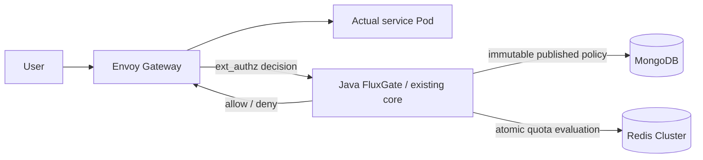

# LTS-first Envoy / Studio integration review

Code integration and required build/test verification are complete; **overall acceptance and enterprise 95/100 remain HOLD**. This report records reviewed contracts and retained evidence. The latest local credential-rotation gate passed; separate production qualification remains incomplete.

Isolated branches are core `feature/lts-envoy-integration` and Studio `feature/lts-policy-lifecycle`. The decision is **conflicts/build/tests PASS, current state PASS, credential-rotation availability PASS under the declared host-relay topology**. The target LTS was not merged or pushed.

Envoy forwards the actual request after an allow decision. Java FluxGate queries MongoDB and Redis. The local runtime backend is echo; it does not prove execution of three separate Java, Go and Rust applications.

## Latest local credential validation

The uninstrumented full run on frozen verifier `3d1363e` passed with **all 3,829 scheduled requests returning exact-body HTTP 200 and zero omissions**: mTLS 2,022, API key 1,141, MongoDB/Redis stores 666. Every phase had zero pending work and worker/writer failures, completed drains and UID-checked owned Pod/NetworkPolicy cleanup. Protocol, full completion and rotation availability are true; the credential child and independent 19-check final state exited 0 with valid witnesses and no wrapper errors. [worker-sampler.json](evidence/2026-10-10-lts-integration/worker-sampler.json) consolidates phase results and original digests.

The same sampler retains absolute 100 ms deadlines, 24 pending requests, fresh connections with a 2-second timeout, zero omissions and exact-body checks. Only the producer runs on host Python through explicit loopback API port-forward -> owned TCP relay Pod -> actual Gateway Service. The relay opens a fresh Service connection rather than pinning a rolling Envoy Pod. Its requests25m/32Mi, limits250m/128Mi and node weights100 remain unchanged; the host sampler is outside those Pod limits. This privileged observation path is not ordinary external ingress; the separate network-policy proof remains. No product module or dependency was added.

The preceding paired-wait diagnostic observed approximately 262 ms delays in both same-parent sleep/select timers after swapping their wait methods. Main condition-lock wait peaked at 0.149 ms, so a wait-only patch was unsupported. It omitted one of 2,010 mTLS arrivals. Its parent also omitted `--credential-rollout`, invalidating the witness on expected authz replacement; that original failure is preserved. Numeric telemetry is diagnostic only, not acceptance. A precise GIL/VM cause remains unproven.

A fresh **70-test Python suite and TLS self-test** passed on the integrated source, with independent source, parent and identity reviews. Existing Java 3,365/UI 13 build and JAR identities remain historical. **The omission gate is resolved under this local topology; production qualification and overall 95-point approval remain separately HOLD.**

A fresh remote LTS check still identifies `7ee6a86101afe5ed5a9d6efb992e470430af046a`; merge-tree with the frozen host verifier reports zero conflicts. No merge or push was performed.

## Source and artifact boundaries

The isolated integration preserves LTS `7ee6a86101afe5ed5a9d6efb992e470430af046a` and original Envoy `d67821b89ac49929f06a3e798c5f53a9bcb90c7e` ancestry through merge `c90ea6e0e8df2109aeb6965735eaf11e260f8f3a`. Overlapping implementations were integrated on the LTS baseline rather than resolved by taking whole SOURCE files. Remote LTS and unrelated original working-tree changes and other branches were preserved. Fresh `ls-remote` still identifies LTS `7ee6a86101afe5ed5a9d6efb992e470430af046a`; the verifier execution-tree `09573bddec4669789b68f59591f942b603669499` merge-tree check records zero conflicts. No LTS merge or push was performed.

Java build source is `d4c4d88367343498df949cc8e07fbb2443fd20d0`; deployed authz JAR SHA-256 is `b01926fbf1a8a66acd573b3d7f2bac07f89660e5c4e84903c79ed207950d36ce`. Studio source is `0966efbcbef5c9f2f680146450ae3bc3daef91cf`, JAR `de3ed6b1e0a7046a18464b0d3e8102aacf7c463dbb1b39bcc0d820bd7895bb77`.

The earlier worker and CPU-allocation runs used verifier commit `f90a4ee1ef1520edfda5dc9291bbdaa82f9b7c4c`, with execution tree `09573bddec4669789b68f59591f942b603669499`. Exactly five cumulative Python/test files and seventeen historical review files differ from Java build source D4; no Java rebuild is implied. Earlier HA/load/combined proofs retain their actual earlier verifier provenance. The retained ledger freezes raw/witness/log digests after terminal review, not retroactively at their original execution time.

## Integrated contracts

- LTS collision-resistant identity encoding and single ACL encoding remain authoritative. Special/reserved/long identities that change counter keys have no automatic old-counter migration; the fixture proof is not a universal identity migration guarantee.
- LTS eight-result Redis wire, multi-rule same-slot evaluation, check-only and cross-slot compensation coexist with published revision fencing across reset epochs. Cross-slot compensation remains non-atomic and failed refunds can retain spent quota. Capacity changes preserve usage; a shrink whose debt cannot survive the configured TTL fails closed with `POLICY_RESET_REQUIRED`, requiring an explicit reset or safe republish. Types/state and migration lifetimes are checked before mutation.
- Published policies use immutable snapshots, majority CAS/idempotency, stable counter epochs, authoritative fresh reads and execution of the same validated snapshot. Draft edits do not directly replace the active policy.
- Mongo owned/borrowed client-holder isolation and BSON-safe asynchronous metrics remain intact. The outer 4-worker/1024 queue feeds the inner bounded 10,000-event/500-batch recorder. Forwarded is distinct from stored; independent writer counters and bounded drain document overflow, failures and possible shutdown loss.
- Studio consistently addresses `(ruleSetId,id)`. Scoped CRUD, simulation and UI selection carry the pair. Legacy id-only requests work only when unambiguous; ambiguity returns 409 before writes. CREATE/import null normalizes to `default` before lookup/dedupe/persistence/response; UPDATE omitted/null preserves the existing pair. Replacement retains unknown BSON/ACL/matcher fields and snapshot CAS; null-capable generic SPI writes use full reload notifications.

- The six JMH sources already moved into the LTS `fluxgate-benchmarks` module were not duplicated at the legacy testkit path. Benchmark module/sources were preserved and built; no test skip or compiler exclusion was introduced to pass integration. JMH measurement execution is outside this proof.

## Explicit maintenance transition

The known legacy global unique `id_1` required a maintenance migration, not startup suppression or a renamed global constraint. Old authz was quiesced to zero Pods. The packaged adapter verified compound unique `(ruleSetId,id)` before replacing only the known legacy index with nonunique `id_1`; repeat execution was idempotent, with unrelated indexes and policy/counter state preserved.

The actual fixture had **0 mutable rule documents**, 1 active pointer and 22 published revision documents carrying 22 ACL documents. It therefore does not prove migration of populated mutable production collections. Nineteen real Mongo regressions cover populated identity/migration cases. Post-deployment exact backend 200 and exhausted quota 429 were recorded. This was **not zero downtime**. Old-JAR rollback is not schema rollback and cannot safely restore global uniqueness after cross-ruleset duplicate IDs are introduced. Maintenance execution used root-observed terminal results; the post-deployment checker has a separate valid terminal witness.

## Evidence and pending gates

[tests.json](evidence/2026-10-10-lts-integration/tests.json) records core reactor 3,148 plus Studio backend 217 = **3,365 Java tests**, zero failures/errors/skips. Actual Redis Cluster 24 cases are included in core accounting. Studio UI 13 tests and lint/typecheck/format/build passed. The unchanged Java artifacts retain their actual build commits. Root separately executed **60 verifier tests** in 17.677 seconds and the self-test on f90; historical 56-test and 51-test evidence remains labelled separately.

The immutable retained ledger binds these proofs to the integrated authz artifact:

| Gate | Retained result and boundary |
| --- | --- |
| Full HA | Original verifier27 checks PASS; `complete:true`. Rejected supplementary recovery-window validation is retained separately and does not transfer into overall approval. |
| Normal load | 100 scheduled RPS × 60 s; 6,000 exact-body 200, zero omissions/errors; achieved 99.977 RPS; p95 6.5953 ms, p99 12.3227 ms. |
| Combined Mongo | Selected fault phase accepted; final 6,000 all 200, p99 7.7462 ms; recorded RTO 23.641 s. `complete:false` identifies a selected phase, not full-suite completion. |
| Combined Redis | Selected fault phase accepted; final 6,000 all 200, p99 9.0988 ms; recorded RTO 18.735 s. Same selected-phase boundary. |
| Historical credentials | Default f90: 3,833 scheduled, 3,827 exact-body 200, six omissions. CPU-allocation experiment: 3,832 scheduled, 3,826 exact-body 200, six omissions. Both completed all protocols but failed rotation availability; **HOLD**. |
| Fresh network | Independent actual exit 0 and valid witness under verifier 4cbb: 48 negative controls, 232 positive controls; stable identities/policies and verified cleanup. |
| Historical final state | After the allocation experiment, all three node weights were restored to 100 with Docker CpuShares metadata still zero. The fresh f90 read-only checker passed all 19 checks with actual exit 0 and a valid witness. Current state success does not approve rotation availability. |

A supplementary HA recovery-window gate rejected a fault503 request that began913ms before the window and completed1433ms after the window start, because it selects `completed >= start`. This does not establish failure of a newly started post-recovery request. [ha-window-diagnostic.json](evidence/2026-10-10-lts-integration/ha-window-diagnostic.json) retains this rejection separately from the original27-check terminal PASS; the supplementary condition was not weakened.

The first three credential attempts remain rejected evidence: (1) cold Studio startup attempted the incompatible global-ID index; (2) the pre-restart sentinel read failed before Redis Pod deletion; (3) protocol checks passed with `complete:true`, but rotation availability failed. The third attempt had 23/2,181 mTLS, 12/1,220 API-key and 3/719 store lateness omissions: 38 total. All 4,082 executed requests returned exact-body 200, with no errors, pending requests or capacity omissions and verified cleanup. Protocol success does not override missing scheduled traffic.

The sentinel diagnostic reproduced zero-byte stdin writes in 4/120 trials; Pod-local generation then matched 120/120 with cleanup and six focused regressions. The subsequent 4cbb healthy control still had one lateness omission. A request-only CPU reservation experiment had eight omissions and ten actual `NOREPLICAS` 503 responses; it was not adopted. Host compression/resource pressure observations are correlations, not established causes.

A causal diagnostic recorded seven omissions. One followed a proven 235 ms synchronous progress operation (snapshot 4.718 ms, JSON 129.441 ms, write 100.976 ms). Six followed sleep overruns of approximately 204/435 ms with negligible condition-lock wait; their cause remains unproven. The reviewed progress repair uses bounded summaries, a capacity-one mailbox, one writer, atomic rename and final-write fencing; it retains every final sample and rejects writer failure or incomplete drain. Independent source review is CLEAR/APPROVE, but the repair addresses only the demonstrated progress path. The subsequent uninstrumented b574 healthy control lasted 180.4046 seconds: 1,803 scheduled arrivals, 1,802 exact-body 200 and one lateness omission at sequence 552. Writer failures were zero; reporter/request drain completed, pending was zero and all cleanup checks passed. It still fails the unchanged 100 ms arrival/zero-omission criterion. The private harness separately raised `KeyError: pod_deleted` after retaining raw evidence and cleanup (the actual field is `pod_absent`); child exit 1 with a valid witness and no wrapper errors therefore does not represent acceptance success. The harness error does not explain or erase the already recorded omission. The sanitized summary with its private raw digest is [healthy-control.json](evidence/2026-10-10-lts-integration/healthy-control.json).

The f90 worker repair replaces idle 100 ms queue polling with blocking waits and bounded shutdown wakeups, removing 240 idle wakeups per second without changing arrivals, capacity, HTTP checks or rejection thresholds. Four regression tests cover idle wakeups, queued shutdown, normal drain and stalled requests. The uninstrumented default healthy control passed 1,803/1,803 exact-body 200 with zero omissions. Its subsequent fourth full credential run still omitted six scheduled arrivals (mTLS two, API key two, stores two); all 3,827 executed requests were exact-body 200. [worker-sampler.json](evidence/2026-10-10-lts-integration/worker-sampler.json) retains both results.

One predeclared CPU-allocation experiment changed only the three owned kind-node cgroup root weights from 100 to 313 and restored all to 100. Docker metadata CpuShares remained zero; Pod resources, Redis guards and artifacts were unchanged. The uninstrumented healthy control again passed 1,803/1,803, but the fifth full credential run omitted six arrivals (mTLS four, API key zero, stores two), with all 3,826 executed requests exact-body 200 and verified drain/cleanup. Network was skipped after credential failure. [node-allocation.json](evidence/2026-10-10-lts-integration/node-allocation.json) retains the rejection and successful restoration/final-state check. The three nodes share one Docker VM with six vCPUs; they do not provide eighteen independent CPUs. This experiment neither resolves availability nor establishes CPU contention as the cause.

One bounded, instrumented 180-second diagnostic preserved the original sampler and added memory timestamps, a separate timer process and a 2 Hz observer in the same Pod/cgroup. Current credentials were retained and authz rolled once at 45 seconds. It recorded 1,803/1,803 exact-body 200 with zero omissions; the independent timer recorded 1,804 ticks with zero omissions, the main trace 23,446 records, and the observer 361 records with no errors/overflow (maximum read wall time 1.189625 ms). The phenomenon was **not reproduced**, so the cause remains unproven. Instrumentation may alter scheduling and host-to-guest rollout alignment is unknown. Actual diagnostic and final-state children exited 0 with valid witnesses; fresh final-state passed all 19 checks. [scheduling-diagnostic.json](evidence/2026-10-10-lts-integration/scheduling-diagnostic.json) records this diagnostic without claiming full credential or overall acceptance. The one-attempt stop condition was followed.

No recent sanitized Redis logs establish a new promotion during these controls. The earlier healthy 0/1/8 role state has an unknown beginning time. Root performed guarded, explicit operator role restoration to home 0/1/2, preserving exact policy pointer, counters and storage identity without authz UID changes. Its valid witness and baseline-only PASS are evidence of manual restoration, not automatic balancing, a new full HA PASS or final-state acceptance by itself. A subsequent, separate read-only state check passed.

### Latest repository cleanup and rejected follow-up experiments

Core and Studio remain separate GitHub repositories; their paired READMEs now explain ownership. Twelve session worktrees were retired with normal `git worktree remove`, retaining their branch references. All 7,846 ignored local files were archived privately outside both product repositories and checked against their member lists and source hashes. Boot 2/3 targets, EN/KO documents, distinct fixtures and rejected evidence remain separate. One byte-identical historical HA alias was consolidated into its descriptive existing file. No Maven module was added, and Python caches are excluded from Git.

An additional instrumented full-protocol diagnostic on verifier `c3f7fd` recorded 3,851 scheduled arrivals, 3,850 exact-body 200 responses and one API-key lateness omission. Its credential child exited 1, separately from successful collection and later state checks. Sleep overrun and adjacent runnable-wait observations do not establish a GIL or VM cause. The existing [scheduling-diagnostic.json](evidence/2026-10-10-lts-integration/scheduling-diagnostic.json) retains both diagnostics.

One uninstrumented HTTP process-isolation experiment on verifier `87df806` completed all credential protocols but missed one of 3,861 scheduled arrivals during mTLS. All 3,860 executed requests returned the exact backend body with HTTP 200. API-key 1,164 and store 669 arrivals had no omissions; pending work and worker/writer failures were zero, with drains and owned cleanup complete. The original 100 ms, 24-pending, zero-omission, fresh-connection/2-second and exact-body predicates were unchanged. Its credential child exited 1 with a valid witness; [worker-sampler.json](evidence/2026-10-10-lts-integration/worker-sampler.json) retains the rejection. Isolation established neither a sufficient availability fix nor a GIL cause.

The original state checker then exited 1 at its Redis topology condition after completing 14 checks. A separate guarded baseline observed normal placement without a role-changing command and checked exact policy and HA-counter preservation (`complete:false`). A later independent read-only checker passed all 19 checks with exit 0 and a valid witness. [final-state.json](evidence/2026-10-10-lts-integration/final-state.json) retains both the original failure and later success; the precise cause of the initial assertion is not established.

The unproven sampler complexity was reverted. The then-restored source `7c43f23` restores the `c3f7fd` sampler, existing tests and executable mode, removing the two experimental test helpers. The candidate source and 80 passing controls remain historical experimental evidence. That restored verifier passed a fresh 60-test run and self-test. Existing Java 3,365 and Studio UI 13 build results were not relabeled as new builds. **At that stage repository cleanup was complete while credential availability and overall 95-point approval remained HOLD; the latest host-relay result is separated above.**

### Retained evidence

[acceptance.json](evidence/2026-10-10-lts-integration/acceptance.json) records each proof's actual invocation commit, JAR, terminal exit and SHA-256. Historical passing executions are not relabelled as runs of the new verifier. The first five rejected credential attempts and subsequent rejected diagnostics/comparison, historical healthy-path omissions, actual `NOREPLICAS` 503 responses and the private harness error remain evidence. A score of at least95 is not approved because production qualification remains incomplete. The current local credential gate passes without erasing earlier failures.

The [Mongo migration procedure](../architecture/lts-mongo-identity-migration.md) requires explicit maintenance with writers stopped. No data deletion, counter reset or edits to other worktrees were used to align state.

## Scope and remaining limits

These results cover an owned fixture with three kind nodes on one Docker Desktop VM and an echo backend. They do not prove independent host/AZ failure, off-host recovery, production storage/network, sustained soak, complete dependency/CVE coverage or supported-runtime operations. Store TLS/ACL hardening and production backup/restore remain separate gates. Historical scores are not transferred. Default and allocated healthy controls passed, but their subsequent full credential runs failed zero-omission availability. The earlier bounded healthy diagnostic did not reproduce omissions. The later instrumented full diagnostic and uninstrumented process-isolation comparison each recorded one omission; neither established the precise scheduling cause. Unproven process isolation was reverted. The subsequently reviewed host-relay topology passed the unchanged zero-omission gate in one uninstrumented full run. The local credential gate is PASS; overall release/production qualification and a separate benchmark score remain HOLD.
